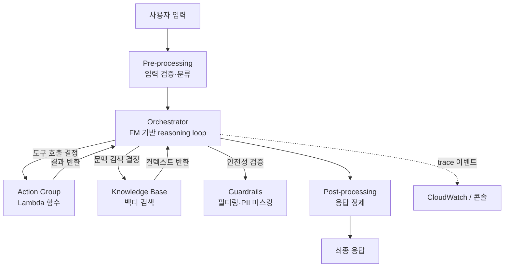
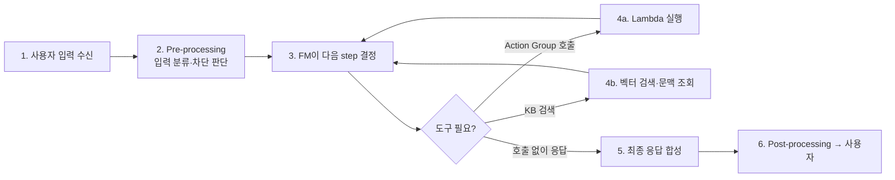

# Amazon Bedrock Agents

## 핵심 요약

Amazon Bedrock Agents는 Foundation Model(FM)을 중심으로 **사용자 입력 해석 → 외부 시스템 호출 → 응답 합성**을 자율적으로 수행하는 매니지드 에이전트 서비스이다. ReAct·Tool-use 패러다임을 AWS Lambda 기반 Action Group, Bedrock Knowledge Base, Guardrails와 결합해 "코드 없이 구성"하는 것이 핵심.

- **자율 오케스트레이션**: FM이 사용자 의도를 단계별로 분해(Chain-of-Thought)하고 어떤 API/KB를 호출할지 스스로 결정
- **Action Group**: OpenAPI 스키마 또는 함수 정의로 Lambda 함수를 호출 가능한 도구로 등록
- **Knowledge Base 연동**: RAG를 호출 가능한 한 단계로 통합(별도 검색 로직 불필요)
- **Advanced Prompts**: pre-processing, orchestration, KB 응답 생성, post-processing 4단계 프롬프트 템플릿 커스터마이즈 지원
- **Trace 기능**: 추론 step·도구 호출·중간 결과를 단계별로 관찰 가능(디버깅·감사 용도)

## 시스템 아키텍처

Bedrock Agent는 FM(Reasoner) + Orchestrator + 외부 리소스(Action Group/KB) 로 구성된 계층형 시스템이다.

## 처리 흐름

사용자 1턴 요청에 대해 Agent는 reasoning → tool call → observation 루프를 N회 반복한 후 최종 응답을 생성한다.

## 핵심 기능 및 서비스

| 기능 | 설명 |
|---|---|
| Action Group | OpenAPI 3.0 스키마 또는 함수 정의로 Lambda 함수를 도구로 등록. 파라미터 슬롯 필링은 FM이 담당 |
| Knowledge Base 연동 | 하나의 Agent에 다수 KB 연결, FM이 질의별로 자동 선택 |
| Memory 기능 | 멀티턴 대화 컨텍스트를 세션 단위로 유지(최대 30일 retention 설정 가능) |
| Advanced Prompt Templates | pre/orch/KB-response/post 4단계 프롬프트를 사용자가 직접 수정 |
| Trace & Observability | reasoning step·tool input/output 전체를 JSON trace로 노출 |
| Code Interpreter | Python 코드를 sandbox에서 실행해 계산·차트·파일 처리 수행 |
| Multi-agent collaboration | Supervisor Agent가 하위 Specialist Agent를 위임 호출(2024년 re:Invent 발표 이후 GA) |

## 유사 기술 비교

| 항목 | Bedrock Agents | LangChain Agents | OpenAI Assistants API | AWS Step Functions |
|---|---|---|---|---|
| 특징 | AWS 매니지드 reasoning loop + Lambda 도구 | 오픈소스 프레임워크, 자유로운 도구 정의 | OpenAI 호스팅, Threads/Runs 모델 | 워크플로우 상태머신 |
| 장점 | IAM·VPC·CloudWatch 통합, 운영 부담 적음 | 풀 커스터마이즈 가능, 멀티 LLM 지원 | OpenAI 모델·File Search·Code Interp 빌트인 | 결정론적·고신뢰 워크플로우 |
| 단점 | AWS 락인, 프롬프트 hidden chain 일부 비공개 | 인프라·관찰성 직접 구축 | OpenAI 락인, AWS 리소스 직접 호출 어려움 | LLM reasoning 불가, 정적 흐름 |
| 적합 케이스 | 사내 API/DB 자동화, AWS 중심 스택 | 멀티벤더·연구·실험 | OpenAI 단일 모델 중심 SaaS | 결정론적 비즈니스 트랜잭션 |

## 실제 사례

### AWS 공식 — Wildfire Analysis Agent
Bedrock Agent에 위성 데이터 API(Action Group) + 기후 보고서 KB를 결합해 실시간 화재 위험도 분석. 사용자가 지역명만 입력하면 Agent가 위성 API 호출·KB 검색·위험도 산출을 자동 chaining 한다([dev.to 레퍼런스](https://dev.to/dipayan_das/designing-a-bedrock-agent-with-action-groups-and-knowledge-bases-for-wildfire-analysis-5ak4)).

### AWS Samples — Hotel Booking Assistant
호텔 예약 시나리오에서 Action Group으로 예약 API(`searchRoom`, `bookRoom`, `cancelBooking`)를 등록, KB에는 호텔 정책 PDF를 인덱싱. Agent는 사용자 발화에서 체크인 날짜·인원 등 슬롯을 추출하고 KB에서 환불 정책 검색 후 예약을 확정한다.

## 활용 시나리오

### 시나리오 1: 사내 IT 헬프데스크 자동화
ServiceNow API를 Action Group으로 등록(`createTicket`, `getTicketStatus`), 사내 IT 정책 PDF를 KB로 인덱싱. 직원이 "노트북 교체 신청"이라고 말하면 Agent가 정책 확인 → 자격 요건 충족 시 자동 티켓 생성.

### 시나리오 2: 금융 계좌 분석 챗봇
거래 내역 조회 API(Lambda)와 상품 약관 KB를 결합. Guardrails로 투자 조언·민감정보를 차단해 컴플라이언스 준수. Trace로 모든 도구 호출을 감사 로그로 보관.

### 시나리오 3: 멀티에이전트 데이터 분석 파이프라인
Supervisor Agent가 사용자 질문을 받아 "SQL 작성 Agent", "차트 생성 Agent", "리포트 Agent"에게 위임. Code Interpreter로 실제 Python 분석 실행 후 결과 종합.

## 장단점 및 트레이드오프

| 항목 | 내용 |
|---|---|
| 장점 | (1) Reasoning loop·도구 호출 인프라가 매니지드 (2) KB/Guardrails/Lambda 네이티브 통합 (3) IAM·VPC·CloudWatch 등 AWS 거버넌스 그대로 적용 |
| 단점 | (1) Orchestration prompt 내부가 일부 블랙박스 (2) AWS 외부 도구 호출 시 Lambda 경유 필요 (3) 비용이 토큰 + Lambda + KB 검색 + 모델 사용료로 누적 |
| 트레이드오프 | 자유도(LangChain) vs 운영 부담(매니지드). 빠른 PoC와 AWS 통합이 우선이면 Bedrock Agents, 멀티벤더 모델 실험·연구가 우선이면 LangChain이 유리 |

## 함정 및 안티패턴

- **결정론적 워크플로우를 Agent로 구현**: 매번 같은 분기·순서가 필요한 트랜잭션을 Agent로 풀면 비용↑·지연↑·재현성↓ → **올바른 대안**: Step Functions 또는 Bedrock Flows
- **Action Group 함수 비대화**: 한 Lambda에 10+ 행위를 몰아넣고 description으로만 분기 → FM의 도구 선택 정확도 저하 → **대안**: 단일 책임(SRP)으로 함수 분리, 명확한 description 작성
- **Guardrails 미적용 상태로 프로덕션 배포**: PII 누출·프롬프트 인젝션 사고 위험 → **대안**: Agent 생성 시 반드시 Guardrails 연결, 특히 외부 사용자 대상 챗봇
- **Trace 미저장**: 사고 발생 시 reasoning 경로 재현 불가 → **대안**: CloudWatch Logs로 trace 영구 저장, 감사 로그로 활용

## 참고 자료

- [How Amazon Bedrock Agents works (AWS Docs)](https://docs.aws.amazon.com/bedrock/latest/userguide/agents-how.html) — Agent 아키텍처·런타임 동작 공식 설명
- [Use action groups to define actions (AWS Docs)](https://docs.aws.amazon.com/bedrock/latest/userguide/agents-action-create.html) — Action Group 정의 방법
- [Amazon Bedrock Agents (AWS Prescriptive Guidance)](https://docs.aws.amazon.com/prescriptive-guidance/latest/agentic-ai-frameworks/bedrock-agents.html) — 에이전틱 AI 프레임워크 비교 관점
- [Hands-On Hotel Booking Assistant (DEV)](https://dev.to/mohsinsheikhani/hands-on-with-amazon-bedrock-agents-hotel-booking-assistant-with-action-groups-and-knowledge-bases-1j) — 실전 구현 사례
- [aws-samples/amazon-bedrock-rag-knowledgebases-agents-cloudformation](https://github.com/aws-samples/amazon-bedrock-rag-knowledgebases-agents-cloudformation) — CloudFormation 템플릿
