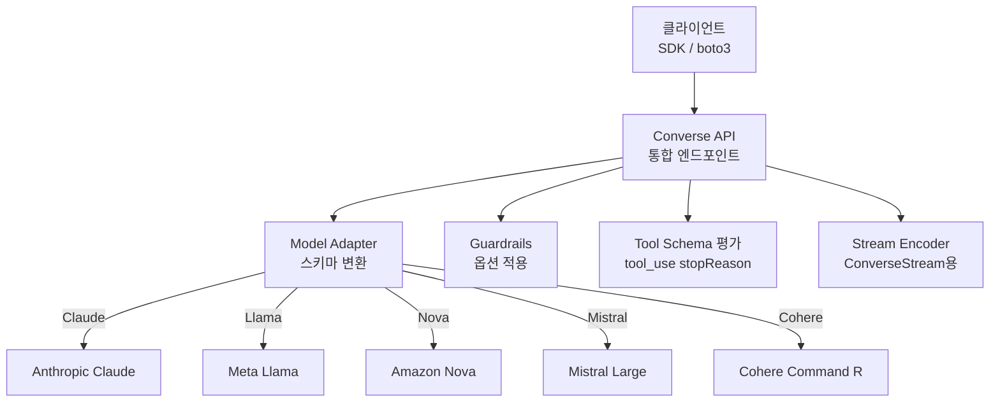
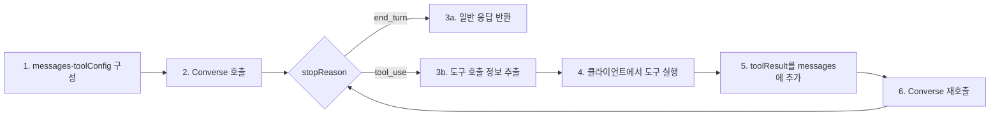

# Amazon Bedrock Converse API

## 핵심 요약

Bedrock Converse API는 Bedrock의 모든 messages-기반 FM(Claude, Llama, Mistral, Nova, Cohere Command 등)에 대해 **하나의 통일된 요청·응답 스키마**를 제공하는 추론 API이다. 기존 `InvokeModel`이 모델별 JSON 스키마를 요구했던 문제를 해결해 "한 번 짠 코드를 모델 교체 시 그대로 사용"할 수 있게 한다.

- **모델 독립 스키마**: `messages[]` + `system[]` + `inferenceConfig{}` 구조로 표준화
- **동기·스트리밍 2개 작업**: `Converse` (동기) / `ConverseStream` (SSE 스트리밍)
- **빌트인 Tool Use**: `toolConfig`로 도구 정의, 응답의 `stopReason: tool_use`로 분기
- **멀티모달 지원**: 이미지·문서를 `content` 블록으로 첨부 가능(모델이 지원하는 경우)
- **Guardrails 직접 연동**: `guardrailConfig` 파라미터로 1-step 안전성 적용

## 시스템 아키텍처

Converse API는 모델별 JSON 차이를 추상화하는 **어댑터 레이어**로 동작한다.

## 처리 흐름

도구 사용을 포함한 1턴 Converse 호출의 전형적인 흐름.

## 핵심 기능 및 서비스

| 기능 | 설명 |
|---|---|
| 통합 messages 스키마 | `[{role:'user', content:[{text:'...'}]}]` 형식, 모든 지원 모델 공통 |
| inferenceConfig | `maxTokens`, `temperature`, `topP`, `stopSequences` 표준화 |
| Tool Use | `toolConfig.tools[]`로 JSON Schema 정의, 응답에 `toolUse` 블록 |
| ConverseStream | 토큰 단위 SSE 스트리밍, `messageStart` → `contentBlockDelta` → `messageStop` |
| Multimodal Content | `content`에 `image`, `document` 블록 추가 가능 |
| Guardrails 통합 | `guardrailConfig{guardrailIdentifier, guardrailVersion, trace}` 1-step 적용 |
| additionalModelRequestFields | 표준 외 파라미터(모델 고유)를 escape hatch로 전달 |
| Cross-region Inference | inference profile ID 사용 시 자동 region failover |

## 유사 기술 비교

| 항목 | Bedrock Converse | OpenAI Chat Completions | Anthropic Messages API | Bedrock InvokeModel |
|---|---|---|---|---|
| 특징 | Bedrock 모든 모델 통합 | OpenAI 모델만 | Anthropic 모델만 | 모델별 raw JSON |
| 장점 | 모델 교체 시 코드 동일 | 가장 폭넓은 에코시스템 | Claude 모든 기능 즉시 사용 | 모델 고유 기능 100% 노출 |
| 단점 | 모델 고유 신기능 지연 노출 | OpenAI 락인 | Anthropic 락인 | 모델별 스키마 N벌 작성 |
| 적합 케이스 | 멀티 모델 A/B, 벤더 분산 | OpenAI 중심 | Claude 전용 앱 | 최신 기능·세밀 튜닝 |

## 실제 사례

### Spring AI — Bedrock Converse 백엔드 채택
Spring AI 프레임워크가 Bedrock 기본 어댑터로 Converse API를 채택. 모델 교체를 application.yaml의 한 줄 변경으로 처리.

### aws-samples — Streaming AI Assistant with Tools
실시간 스트리밍 + 도구 호출을 결합한 reference 구현. ConverseStream의 `contentBlockDelta` 이벤트와 `toolUse` 이벤트를 분리 처리하는 패턴([aws-samples 레포](https://github.com/aws-samples/stream-ai-assistant-using-bedrock-converse-with-tools)).

## 활용 시나리오

### 시나리오 1: 모델 벤더 분산 전략
프로덕션에서 Claude 70%, Nova 20%, Llama 10% 가중치 라우팅. Converse API 덕분에 어댑터 코드를 모델별로 작성하지 않고 `modelId`만 교체. 비용·가용성·품질 리스크 분산.

### 시나리오 2: 스트리밍 챗봇 + 함수 호출
ConverseStream으로 토큰 스트리밍 + `toolUse` 이벤트가 도착하면 일시 정지 → 클라이언트가 함수 실행 → `toolResult`로 재호출하는 패턴. UX(저지연) + 기능성(외부 데이터) 동시 확보.

### 시나리오 3: 모델 평가 파이프라인
같은 프롬프트 셋을 N개 모델에 적용해 품질·비용·지연 측정. Converse 표준 스키마 덕분에 평가 코드 1개로 처리.

## 장단점 및 트레이드오프

| 항목 | 내용 |
|---|---|
| 장점 | (1) 모델 교체·A/B가 코드 변경 없이 가능 (2) Guardrails·Tool Use 통합 (3) ConverseStream의 표준 이벤트 모델 |
| 단점 | (1) 모델 고유 기능(예: Claude prompt caching) 지원이 InvokeModel보다 지연 (2) `additionalModelRequestFields` 사용 시 결국 모델별 분기 발생 (3) 모든 모델 지원이 아님(임베딩·이미지 생성은 별도 API) |
| 트레이드오프 | 이식성(Converse) vs 최신성/세밀 제어(InvokeModel). 신기능 PoC는 InvokeModel, 프로덕션 다중 모델은 Converse |

## 함정 및 안티패턴

- **모든 모델 기능을 Converse로 사용 가능하다고 가정**: 임베딩(`amazon.titan-embed`)·이미지 생성(Titan Image)·일부 신기능은 미지원 → **대안**: messages 기반 텍스트/멀티모달만 Converse, 그 외는 InvokeModel 또는 전용 API
- **Tool Use 응답을 단일 메시지로 처리**: `stopReason: tool_use`를 무시하고 일반 텍스트로 파싱 → **대안**: stopReason 분기 후 도구 실행, 그 결과를 다음 turn의 messages에 `toolResult` 블록으로 추가
- **스트리밍 이벤트 일괄 버퍼링**: ConverseStream의 메리트인 저지연 UX를 잃음 → **대안**: contentBlockDelta 수신 즉시 클라이언트에 push
- **`additionalModelRequestFields`로 모델별 코드 분기 누적**: 결국 멀티모델 추상화의 의미 상실 → **대안**: 모델별 분기는 명시적 어댑터 클래스로 격리, 표준 파라미터로 가능한 한 처리

## 참고 자료

- [Converse API Reference (AWS Docs)](https://docs.aws.amazon.com/bedrock/latest/APIReference/API_runtime_Converse.html) — 동기 API 스키마·파라미터
- [ConverseStream API Reference (AWS Docs)](https://docs.aws.amazon.com/bedrock/latest/APIReference/API_runtime_ConverseStream.html) — 스트리밍 이벤트 구조
- [Inference using Converse API (AWS Userguide)](https://docs.aws.amazon.com/bedrock/latest/userguide/conversation-inference.html) — 사용 가이드와 모범 사례
- [Converse API tool use examples (AWS Docs)](https://docs.aws.amazon.com/bedrock/latest/userguide/tool-use-examples.html) — Tool Use 패턴 코드
- [Bedrock Converse API (Spring AI)](https://docs.spring.io/spring-ai/reference/api/chat/bedrock-converse.html) — 외부 프레임워크 통합 사례
