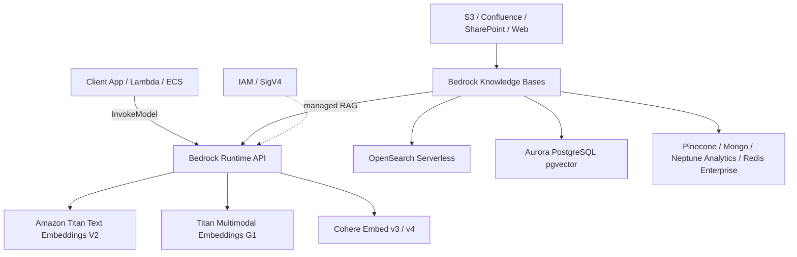
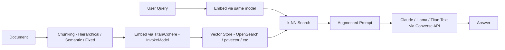

# AWS Bedrock Embedding

## Core summary

AWS Bedrock Embedding은 Amazon Bedrock의 서버리스 API를 통해 호출되는 임베딩 모델군으로, 텍스트(또는 이미지)를 고차원 벡터로 변환해 시맨틱 검색·RAG·클러스터링에 사용한다. Bedrock 자체가 Anthropic·Amazon·Cohere·Mistral의 파운데이션 모델을 단일 API(`InvokeModel`)로 노출하는 관리형 서비스이고, embedding은 그 카테고리 중 하나로 자리 잡고 있다. 대표 모델은 Amazon Titan Text Embeddings V2, Titan Multimodal Embeddings G1, Cohere Embed v3/v4이며, Bedrock Knowledge Bases와 결합하면 청킹→임베딩→벡터 저장 파이프라인을 매니지드로 운용할 수 있다.

- **서버리스 호출**: 모델 ID(예: `amazon.titan-embed-text-v2:0`)와 입력만 넘기면 인프라 관리 없이 IAM 기반으로 호출
- **다중 벤더 제공**: 단일 API 표면에서 Titan(AWS), Cohere(서드파티)를 골라 쓰는 멀티모델 전략 가능
- **RAG 1급 시민**: Knowledge Bases가 임베딩 모델 선택, 청킹, OpenSearch Serverless/Aurora pgvector/Pinecone/MongoDB/Neptune Analytics 등 벡터 스토어 연결을 표준화

## System architecture

Bedrock embedding은 클라이언트 → Bedrock Runtime → embedding 모델 → 벡터 스토어로 이어지는 구조이며, Knowledge Bases는 그 위에 데이터 소스 동기화·청킹·인덱싱을 얹는다.



## Processing flow

호출 흐름은 (1) 인덱싱 시점: 문서를 청킹하고 embedding 모델로 벡터화한 뒤 저장, (2) 질의 시점: 쿼리를 같은 모델로 임베딩하고 top-k 유사 청크를 끌어와 LLM에 컨텍스트로 주입하는 형태다.



## Core features and services

| Feature                                                   | Description                                                                                          |
| --------------------------------------------------------- | ---------------------------------------------------------------------------------------------------- |
| Titan Text Embeddings V2 (`amazon.titan-embed-text-v2:0`) | 입력 최대 8,192 토큰 / 50,000자, 출력 차원 **256·512·1024 선택 가능**, 100+ 언어 + 코드 사전학습, 정규화 옵션 제공                 |
| Titan Multimodal Embeddings G1                            | 텍스트·이미지를 동일 시맨틱 공간으로 매핑, 이미지 검색·교차 모달 검색 용도                                                          |
| Cohere Embed v3 (English / Multilingual)                  | 텍스트 전용, 다국어 강세, 입력 토큰 한도 512로 Titan보다 제약 큼                                                           |
| Cohere Embed v4                                           | Bedrock에서 최신 제공, 다국어·도메인 텍스트 성능 향상                                                                   |
| Configurable dimensions (Titan V2)                        | 1024→512에서 약 99% 검색 정확도, 1024→256에서 약 97% 유지 — 저장·연산 비용 절감 가능                                        |
| Knowledge Bases 통합                                        | S3/Confluence/SharePoint/웹 크롤러를 데이터 소스로 잡고 청킹·임베딩·인덱싱 자동화, `Retrieve` / `RetrieveAndGenerate` API 제공 |
| 호출 인터페이스                                                  | embedding은 `InvokeModel`로 호출. 채팅형은 `Converse`가 권장이나 embedding 모델은 Converse 미지원                       |
| 가격 (참고)                                                   | Titan V2 약 $0.00002 / 1K tokens, Cohere Embed 약 $0.0001 / 1K tokens                                  |

## Practical usage (IAM, auth, invocation)

Bedrock embedding은 **별도의 API key가 없다.** 표준 AWS API 표면(`bedrock-runtime` 엔드포인트)에 SigV4로 서명된 HTTPS 요청을 보내는 형태이며, 인증·인가는 모두 IAM으로 풀린다. 즉 *"IAM 정책 JSON 정의 → 임베딩 호출 가능"* 이라는 직관이 거의 그대로 성립한다. 다만 IAM 외에 **Bedrock 콘솔의 Model Access 활성화**라는 별도 게이트가 하나 더 있다는 점이 가장 자주 걸리는 함정.

### Auth model
- 인증(authentication)은 **AWS SigV4** — Access Key / Session Token / Instance Profile / Task Role 어디서 오든 동일
- 인가(authorization)는 **IAM 정책의 `bedrock:InvokeModel` Action** + 모델 ARN
- 따라서 *"EC2/ECS/Lambda 인스턴스에 IAM Role을 붙이고, 그 Role에 attach된 정책이 Bedrock Action을 허용"* → 별도 키 주입 없이 SDK가 자격증명을 자동으로 가져와 호출 성공
- 호출 자체는 100% API 연동(REST/HTTPS). IAM은 *"누가 그 API를 부를 수 있는지"* 를 결정하는 레이어일 뿐. *"API 연동인가 IAM 기반인가"* 는 양자택일이 아니라 **둘 다 맞는 말**이다

### Minimum IAM policy (Titan V2 호출용)
```json
{
  "Version": "2012-10-17",
  "Statement": [
    {
      "Sid": "AllowTitanEmbedV2Invoke",
      "Effect": "Allow",
      "Action": "bedrock:InvokeModel",
      "Resource": "arn:aws:bedrock:us-east-1::foundation-model/amazon.titan-embed-text-v2:0"
    }
  ]
}
```

- 모델 단위로 Resource를 좁히는 게 best practice (와일드카드 `*` 지양)
- Cohere도 같이 쓰려면 `arn:aws:bedrock:us-east-1::foundation-model/cohere.embed-multilingual-v3` 같이 추가
- Knowledge Bases 경유 호출이면 `bedrock:Retrieve`, `bedrock:RetrieveAndGenerate` 와 KB가 내부적으로 호출하는 embedding/LLM 모델 ARN까지 함께 허용 필요
- 운영용 분리 패턴: *embedding 호출 전용 Role* 과 *Converse(LLM) 호출 전용 Role* 을 나누면 권한 사고 범위가 줄어든다

### IAM Role attachment patterns
| Compute       | 자격증명 전달 방식                                                        |
| ------------- | ----------------------------------------------------------------- |
| EC2           | Instance Profile (Role attach) → IMDSv2로 자동 노출, `boto3`가 픽업       |
| ECS / Fargate | Task Role (`taskRoleArn`) → 컨테이너 안에서 자동 픽업                        |
| Lambda        | Function Execution Role → 런타임 환경변수/메타데이터로 자동 노출                   |
| EKS           | IRSA (IAM Roles for Service Accounts) → ServiceAccount annotation |
| 로컬 개발         | `~/.aws/credentials`, `aws configure sso`, 또는 `AWS_PROFILE`       |

→ 어느 경우든 **코드에 키를 박지 않는다.** Role에 attach된 정책이 `bedrock:InvokeModel` + 대상 모델 ARN을 포함하면 호출 가능. 사용자의 직관 *"인스턴스 IAM 역할의 정책이 Bedrock Action에 걸맞으면 사용 가능"* 이 그대로 정답.

### Invocation example (boto3)
```python
import json, boto3

client = boto3.client("bedrock-runtime", region_name="us-east-1")
resp = client.invoke_model(
    modelId="amazon.titan-embed-text-v2:0",
    contentType="application/json",
    accept="application/json",
    body=json.dumps({
        "inputText": "AWS Bedrock embedding 실무 활용 예",
        "dimensions": 1024,
        "normalize": True,
    }),
)
vector = json.loads(resp["body"].read())["embedding"]
```

- `modelId` 만 바꾸면 동일 클라이언트로 Cohere(`cohere.embed-multilingual-v3`) 호출 가능. 단 페이로드 스키마(`texts`, `input_type`)는 모델별로 다름 → 호출 레이어에서 분기
- embedding 모델은 `Converse` API 미지원 → 항상 `InvokeModel`
- 대용량 인덱싱은 `invoke_model` 동기 호출 대신 **Bedrock Batch Inference** 로 비용·throughput을 한 자릿수 절감 가능

### Pre-flight checklist
1. **리전 선택** — 모델 가용 리전 확인 (Titan V2 / Cohere는 us-east-1·us-west-2가 가장 먼저 풀림)
2. **Model Access 활성화** — Bedrock 콘솔 → *Model access* → 사용할 모델 enable. 이걸 빠뜨리면 IAM이 맞아도 `AccessDeniedException: You don't have access to the model` 이 뜸
3. **IAM 정책 attach** — 위 JSON 예시처럼 모델 ARN 단위로 최소권한 부여
4. **(옵션) VPC Interface Endpoint** — `com.amazonaws.<region>.bedrock-runtime` 로 퍼블릭 인터넷 우회. 컴플라이언스 요구 워크로드의 기본값
5. **(옵션) KMS** — Bedrock 로그·Knowledge Bases 데이터 암호화에 CMK 사용 시 호출 Role에 `kms:Decrypt` (또는 `kms:GenerateDataKey`) 추가
6. **(옵션) CloudTrail / CloudWatch** — `InvokeModel` 호출은 CloudTrail data event로 기록 가능. 감사·비용 추적 시 활성화

### Common access errors
| 에러                                                                | 원인                                              | 해결                                               |
| ----------------------------------------------------------------- | ----------------------------------------------- | ------------------------------------------------ |
| `AccessDeniedException` (IAM 메시지)                                 | 정책에 `bedrock:InvokeModel` 없음 / Resource ARN 불일치 | 정책 추가, 리전·모델 ID 점검                               |
| `AccessDeniedException: You don't have access to the model`       | Bedrock 콘솔에서 모델 미활성화                            | *Model access* 페이지에서 enable                      |
| `ValidationException: Invocation of model ID ... isn't supported` | 잘못된 modelId 또는 Converse로 embedding 호출 시도        | `InvokeModel` 사용, modelId 재확인                    |
| `ThrottlingException`                                             | 계정 quota 초과                                     | Service Quotas에서 한도 상향 신청, 또는 Batch Inference 전환 |
| `ResourceNotFoundException`                                       | 다른 리전의 모델 ARN을 호출                               | 클라이언트 리전과 ARN 리전 일치시키기                           |

## Similar technology comparison

| 항목             | AWS Bedrock Embedding (Titan V2)                             | OpenAI text-embedding-3-large/small | Google Vertex AI text-embedding | Cohere Embed v3 (direct API) |
| -------------- | ------------------------------------------------------------ | ----------------------------------- | ------------------------------- | ---------------------------- |
| 대표 차원          | 256 / 512 / **1024** 선택                                      | 3072 / 1536 (둘 다 축소 가능)             | 768 (gecko 기준)                  | 1024                         |
| 입력 토큰 한도       | 8,192                                                        | 8,191                               | 2,048~3,072 (모델별 상이)            | 512                          |
| 가격 (1K tokens) | ~$0.00002 (V2)                                               | $0.00013 (large) / $0.00002 (small) | Gemini 임베딩 매우 저렴                | ~$0.0001                     |
| 멀티모달           | Titan MM G1로 가능                                              | 별도 모델 필요                            | Gemini 멀티모달 가능                  | 텍스트 전용                       |
| 다국어            | 100+ 언어 (Titan V2)                                           | 다국어 가능                              | 다국어 가능                          | 다국어 모델 별도                    |
| AWS 생태계 통합     | **OpenSearch Serverless / Aurora pgvector / IAM / VPC 네이티브** | 외부 SaaS                             | GCP 네이티브                        | 외부 SaaS                      |
| RAG 매니지드       | **Bedrock Knowledge Bases**                                  | 직접 구축                               | Vertex AI Search                | 직접 구축                        |
| 적합 케이스         | AWS 위 엔터프라이즈 RAG, 컴플라이언스·VPC 요구                              | 빠른 프로토타입, 광범위 SDK                   | GCP 위 RAG, Gemini 결합            | 다국어/도메인 텍스트, RAG 품질 우선       |

## Real-world cases

### aws-samples / rag-with-amazon-bedrock-and-opensearch
AWS가 공식 공개한 레퍼런스 구현. ALB + ECS Fargate 위에 LangChain RAG 앱을 띄우고, Bedrock embedding으로 벡터를 만들어 OpenSearch Serverless에 적재한다. 프로덕션 RAG에서 청킹·임베딩·검색·생성을 분리하는 표준 패턴을 보여준다.

### aws-samples / rag-with-amazon-bedrock-and-pgvector
같은 RAG 워크로드를 Aurora PostgreSQL + pgvector로 구현한 샘플. ~5M 벡터 이하, 관계형 조인이 무거운 경우의 비용 효율 선택지를 보여주는 사례로 자주 인용된다.

### Bedrock Knowledge Bases — S3 → OpenSearch Serverless 매니지드 RAG
S3 버킷에 문서를 올리면 Bedrock이 청킹·임베딩·인덱싱을 자동 처리하고 `RetrieveAndGenerate` 한 번의 API 호출로 답변을 받는 구성이 다수 블로그·AWS 공식 가이드에서 표준으로 제시되고 있다. 인프라 코드 작성을 최소화하면서 PoC를 빠르게 띄우는 패턴.

## Use scenarios

### Scenario 1: 사내 문서 시맨틱 검색 (S3 + Knowledge Bases + OpenSearch Serverless)
S3에 적재된 정책/런북/제품 문서를 Hierarchical 청킹(400–800 토큰)으로 자르고, Titan Text V2 1024차원으로 임베딩해 OpenSearch Serverless에 인덱싱. 검색 UI는 Knowledge Bases의 `Retrieve` API만 호출. VPC·IAM 통합이 필요한 엔터프라이즈에 적합.

### Scenario 2: 다국어 고객 지원 RAG (Cohere Embed Multilingual + Aurora pgvector)
100+ 언어 응대가 필요한 챗봇. 다국어 품질이 더 중요한 도메인이므로 Titan보다 Cohere Embed Multilingual을 선택, 벡터 수가 수백만 수준이고 SQL 조인이 자주 필요해 Aurora pgvector를 스토어로 채택.

### Scenario 3: 이미지 + 텍스트 통합 카탈로그 검색 (Titan Multimodal Embeddings G1)
이커머스에서 텍스트 쿼리로 이미지 검색하거나, 이미지를 업로드해 유사 상품을 찾는 use case. Titan MM G1로 텍스트·이미지를 동일 공간에 임베딩하고 OpenSearch에서 k-NN 검색.

## Pros and Cons & Trade-off

| Item      | Detail                                                                                                                                                                                                                                                            |
| --------- | ----------------------------------------------------------------------------------------------------------------------------------------------------------------------------------------------------------------------------------------------------------------- |
| Pros      | (1) AWS 네이티브 통합: IAM, VPC, CloudWatch, KMS, OpenSearch/Aurora가 한 계정에서 연결 (2) Titan V2 1K 토큰당 $0.00002로 가장 저렴한 축 (3) Knowledge Bases로 청킹·임베딩·인덱싱을 매니지드 처리 (4) 출력 차원 선택(256/512/1024)으로 비용/정확도 트레이드오프 가능                                                            |
| Cons      | (1) Bedrock embedding은 `Converse` 미지원, `InvokeModel`만 사용 — 모델별 페이로드 포맷 분기 필요 (2) embedding API 자체 레이턴시는 벤치마크에서 Cohere/Vertex/Voyage/OpenAI 대비 느린 편 (3) 리전·모델 가용성 편차, 신규 모델은 us-east-1/us-west-2에 먼저 풀림 (4) MTEB 등 일반 벤치마크에서 OpenAI 3-small과 동급, **3-large 대비 약세** |
| Trade-off | AWS 락인을 받아들이는 대신 운영 자동화·컴플라이언스·통합 비용을 줄이는 선택. 임베딩 품질 자체가 절대 기준이면 OpenAI 3-large나 Voyage/Mistral-embed가 유리할 수 있고, 비용·통합·매니지드 RAG가 기준이면 Bedrock이 우위.                                                                                                                |

## Pitfalls / Anti-patterns

- **모델 간 임베딩 호환 가정**: Titan과 Cohere(또는 OpenAI) 임베딩은 **서로 다른 벡터 공간**이라 모델을 바꾸면 코퍼스를 전부 재임베딩해야 함 → 인덱싱·질의 시점에 동일 모델·동일 정규화 옵션을 잠가두기.
- **"NONE 청킹"으로 큰 문서 그대로 투입**: Titan V2가 8,192 토큰을 받지만 처리 오버헤드로 ~550 단어 넘는 파일에서 실패 사례 보고. NONE 청킹은 이미 사전 청킹된 코퍼스에만 사용.
- **Cohere를 큰 청크와 함께 사용**: Cohere Embed v3는 입력 한도가 **512 토큰**이라 큰 청크가 잘림 → Titan과 동일 청크 사이즈로 쓰면 손실 발생. 모델 교체 시 청킹 전략도 같이 재설계.
- **차원 1024 무지성 사용**: 비용·스토리지·검색 지연을 모두 키움. Titan V2는 512로도 ~99%, 256으로도 ~97% 정확도 유지 → 작은 차원부터 평가하고 필요할 때만 키우기.
- **메타데이터 한도 무시**: Bedrock KB에서 청킹 토큰이 8,000을 넘기거나 S3 Vectors 사용 시 2,048 byte 필터러블 메타데이터 한도에 걸려 동기화 실패. 메타데이터는 짧고 평탄하게 유지.
- **embedding을 Converse API로 호출하려는 시도**: Converse는 채팅형 모델 전용. embedding은 항상 `InvokeModel`. SDK 추상화에 가려져 헷갈리는 경우 잦음.
- **IAM은 맞췄는데 Model Access를 잊는다**: 콘솔 *Model access* 에서 모델을 enable하지 않으면 `AccessDeniedException: You don't have access to the model` 발생. IAM 정책 문제로 오인해 디버깅을 한참 돌리기 쉬움.
- **코드에 Access Key 하드코딩**: EC2/ECS/Lambda 라면 IAM Role/Instance Profile/Task Role로 자격증명을 자동 주입받는 게 표준. 키 하드코딩은 회전 불가·유출 시 폭발 반경 큼.

## References

- [Amazon Titan Text Embeddings models — AWS Docs](https://docs.aws.amazon.com/bedrock/latest/userguide/titan-embedding-models.html) — Titan V1/V2 공식 스펙·파라미터 (High)
- [Titan Text Embeddings V2 model card — AWS Docs](https://docs.aws.amazon.com/bedrock/latest/userguide/model-card-amazon-titan-text-embeddings-v2.html) — V2 공식 모델 카드, 차원·토큰 한도 (High)
- [Get started with Amazon Titan Text Embeddings V2 — AWS ML Blog](https://aws.amazon.com/blogs/machine-learning/get-started-with-amazon-titan-text-embeddings-v2-a-new-state-of-the-art-embeddings-model-on-amazon-bedrock/) — 차원 축소 정확도(99%/97%) 출처 (High)
- [Titan Multimodal Embeddings G1 — AWS Docs](https://docs.aws.amazon.com/bedrock/latest/userguide/titan-multiemb-models.html) — 멀티모달 사양 (High)
- [Cohere Embed v4 on Bedrock — AWS Docs](https://docs.aws.amazon.com/bedrock/latest/userguide/model-parameters-embed-v4.html) — Cohere 파라미터 (High)
- [How Amazon Bedrock Knowledge Bases work — AWS Docs](https://docs.aws.amazon.com/bedrock/latest/userguide/kb-how-it-works.html) — 청킹·임베딩·벡터스토어 아키텍처 (High)
- [Knowledge Bases for Amazon Bedrock — AWS Prescriptive Guidance](https://docs.aws.amazon.com/prescriptive-guidance/latest/retrieval-augmented-generation-options/rag-fully-managed-bedrock.html) — 매니지드 RAG 패턴 (High)
- [Content chunking for knowledge bases — AWS Docs](https://docs.aws.amazon.com/bedrock/latest/userguide/kb-chunking.html) — Hierarchical/Semantic 청킹 전략 (High)
- [aws-samples/rag-with-amazon-bedrock-and-opensearch](https://github.com/aws-samples/rag-with-amazon-bedrock-and-opensearch) — 공식 OpenSearch RAG 샘플 (High)
- [aws-samples/rag-with-amazon-bedrock-and-pgvector](https://github.com/aws-samples/rag-with-amazon-bedrock-and-pgvector) — 공식 pgvector RAG 샘플 (High)
- [RAG Evaluation: Titan vs Cohere on Bedrock — Tonic.ai](https://www.tonic.ai/blog/rag-evaluation-series-validating-the-rag-performance-of-amazon-titan-vs-cohere-using-amazon-bedrock) — Titan vs Cohere RAG 품질 비교 (Mid)
- [Benchmarking 20+ Embedding APIs with Milvus](https://milvus.io/blog/we-benchmarked-20-embedding-apis-with-milvus-7-insights-that-will-surprise-you.md) — embedding API 레이턴시 벤치마크 (Mid)
