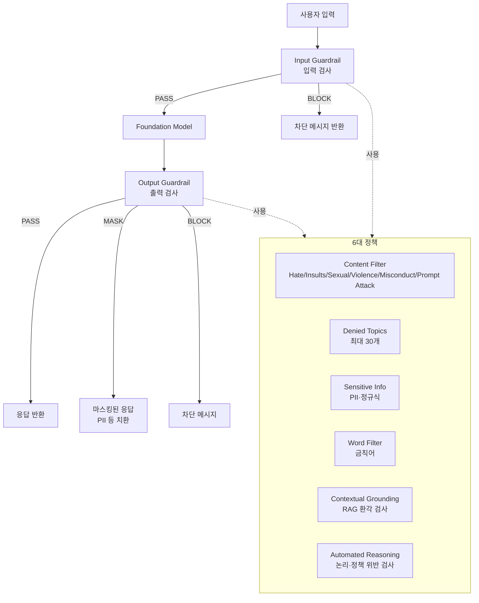
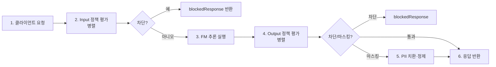

# Amazon Bedrock Guardrails

## 핵심 요약

Amazon Bedrock Guardrails는 LLM 입출력에 **콘텐츠 안전성·민감정보·할루시네이션 필터**를 정책으로 부착하는 매니지드 안전 레이어이다. 사용자 입력과 모델 응답 양방향에서 동시에 작동하며, Bedrock 외부 모델(self-hosted, SageMaker)에도 ApplyGuardrail API로 적용 가능하다.

- **6대 안전 정책**: Content Filter, Prompt Attack, Denied Topics, Sensitive Information(PII), Contextual Grounding, Automated Reasoning Check
- **모델 독립적**: Bedrock의 모든 FM에 attach 가능, ApplyGuardrail API로 비-Bedrock 모델에도 적용
- **양방향 검사**: 입력(prompt) 단계와 출력(response) 단계 각각 별도 정책 설정
- **확률적 ML 기반**: 단순 키워드가 아닌 의미 기반 분류기를 사용해 우회 시도 방지
- **버저닝 지원**: DRAFT → 게시 워크플로우로 안전한 정책 롤아웃

## 시스템 아키텍처

Guardrails는 모델 호출 전/후에 삽입되는 **양방향 필터 파이프라인**이다.

## 처리 흐름

요청 1건이 Guardrails를 통과하는 순서.

## 핵심 기능 및 서비스

| 기능 | 설명 |
|---|---|
| Content Filter | Hate, Insults, Sexual, Violence, Misconduct, Prompt Attack 6개 카테고리, 각 NONE/LOW/MEDIUM/HIGH 강도 조절 |
| Denied Topics | 자연어로 주제 1줄 정의 + 예시 발화, 최대 30개 등록 |
| Sensitive Information | 빌트인 PII(SSN, 이름, 이메일, 주소 등) + 사용자 정규식. 동작: BLOCK 또는 ANONYMIZE(마스킹) |
| Word Filter | 정확 문자열 일치 차단(브랜드·경쟁사·욕설) |
| Contextual Grounding | RAG 응답이 source 문서로 입증 가능한지 점수화. relevance·grounding 두 임계값 |
| Automated Reasoning Check | (2024 re:Invent 발표) 정책 문서 기반 형식 논리 검증, 수학적 증명으로 위반 감지 |
| ApplyGuardrail API | FM 호출 분리. Bedrock 외부 모델·자체 RAG 응답·post-hoc 검증에 사용 |
| Image Content Filter | 이미지 입력의 유해 콘텐츠 분류(2024 GA) |

## 유사 기술 비교

| 항목 | Bedrock Guardrails | Azure AI Content Safety | OpenAI Moderation API | NeMo Guardrails (오픈소스) |
|---|---|---|---|---|
| 특징 | AWS 매니지드, 6대 정책 통합 | Azure 매니지드, Prompt Shields | OpenAI API, 텍스트 분류 | NVIDIA, Colang 기반 DSL |
| 장점 | Contextual Grounding(RAG 환각) 내장, ApplyGuardrail로 모델 독립 | Jailbreak 탐지 강력, Groundedness 별도 | 무료 또는 저렴, 사용 간단 | 풀 커스터마이즈, 온프레미스 가능 |
| 단점 | AWS 락인, 일부 정책은 영어 위주 | Azure 락인 | 정책 커스터마이즈 제한, OpenAI 모델 외 비공식 | 직접 운영 부담, 룰 작성 학습 곡선 |
| 적합 케이스 | Bedrock 중심 GenAI 앱, 컴플라이언스 | Azure OpenAI 사용자 | 가벼운 콘텐츠 분류 | 연구·자체 인프라 |

## 실제 사례

### 금융권 챗봇 — 투자 조언 차단
은행 챗봇에서 Denied Topics에 "투자 조언", "암호화폐 추천" 등을 등록해 약 35종의 토픽을 자연어 정의만으로 차단. 컴플라이언스 검토를 통과한 사례가 AWS 공식 블로그에 다수 게재.

### 헬스케어 — PII 마스킹
환자 상담 봇에서 Sensitive Information 정책으로 SSN/생년월일/주소를 ANONYMIZE 모드로 설정. 모델은 마스킹된 컨텍스트만 보고 답변하므로 HIPAA 컴플라이언스 부담 경감.

## 활용 시나리오

### 시나리오 1: RAG 환각 방지
Bedrock Knowledge Base + Contextual Grounding을 결합. relevance 임계값 0.6, grounding 임계값 0.7로 설정해 source 문서로 입증 불가능한 응답을 자동 차단. 법무·의료 도메인의 RAG에 필수.

### 시나리오 2: Bedrock 외부 모델에 안전성 적용
사내에서 LLaMA를 self-host하지만 Guardrails 인프라는 재사용. ApplyGuardrail API를 호출해 응답 후처리. AWS 매니지드 정책 + 외부 모델 추론의 분리 아키텍처.

### 시나리오 3: 멀티테넌트 SaaS의 테넌트별 정책 분리
테넌트마다 Guardrail 리소스를 별도 생성(versioned), API 게이트웨이에서 테넌트 ID로 적절한 Guardrail을 선택해 호출. 정책 변경이 다른 테넌트에 영향 없음.

## 장단점 및 트레이드오프

| 항목 | 내용 |
|---|---|
| 장점 | (1) 6대 정책 통합 관리 (2) Bedrock 외부 모델에도 적용 가능(ApplyGuardrail) (3) RAG 환각 전용 Contextual Grounding 보유 |
| 단점 | (1) 영어 외 언어(특히 한국어) 정확도 일부 낮음 (2) 모든 요청이 입력+출력 양방향 평가되어 지연 30~200ms 추가 (3) 정책당 별도 추론 비용 발생 |
| 트레이드오프 | 안전성↑(엄격한 임계값) vs 가용성↓(false positive로 정상 응답 차단). 도메인별 점진적 튜닝 필수 |

## 함정 및 안티패턴

- **단일 강도로 일괄 설정**: 모든 정책을 HIGH로 두면 false positive↑·UX↓ → **대안**: 카테고리별 차등(예: 금융 챗봇은 Sexual=HIGH, Insults=MEDIUM)
- **Output에만 Guardrail 적용**: 프롬프트 인젝션은 입력 단계 차단이 핵심 → **대안**: Input·Output 모두 활성화, 특히 Prompt Attack 카테고리
- **Contextual Grounding을 RAG 없이 사용**: source 컨텍스트가 없으면 측정 불가능 → **대안**: KB 응답을 명시적으로 referenceText로 전달
- **정책 변경 즉시 프로덕션 반영**: 정책 한 줄 변경이 사용자 응답률 급변 유발 가능 → **대안**: DRAFT → 게시 → 버전 고정 → A/B로 점진 롤아웃

## 참고 자료

- [Amazon Bedrock Guardrails (AWS 공식)](https://aws.amazon.com/bedrock/guardrails/) — 제품 페이지, 6대 정책 요약
- [Detect and filter harmful content (AWS Docs)](https://docs.aws.amazon.com/bedrock/latest/userguide/guardrails.html) — 정책 컴포넌트 상세
- [Contextual grounding check (AWS Docs)](https://docs.aws.amazon.com/bedrock/latest/userguide/guardrails-contextual-grounding-check.html) — RAG 환각 필터 가이드
- [Denied topics (AWS Docs)](https://docs.aws.amazon.com/bedrock/latest/userguide/guardrails-denied-topics.html) — 토픽 차단 설정
- [Sensitive information filters (AWS Docs)](https://docs.aws.amazon.com/bedrock/latest/userguide/guardrails-sensitive-filters.html) — PII 처리 가이드
