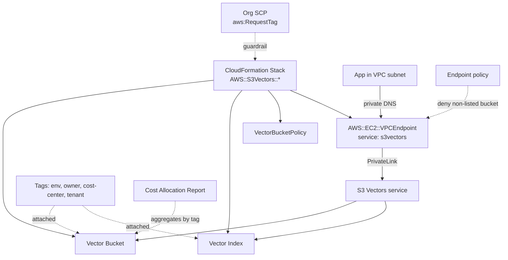
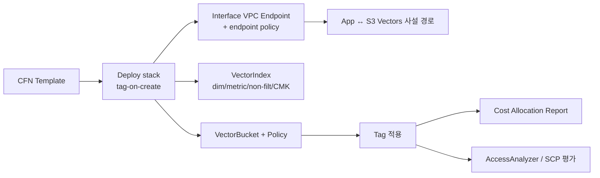

# Amazon S3 Vectors — CloudFormation / PrivateLink / Tagging 운영 통합

## 핵심 요약

GA(2025-12-02)에서 S3 Vectors가 **CloudFormation, AWS PrivateLink(인터페이스 VPC 엔드포인트), 리소스 태깅**을 정식 지원하기 시작했다. 프리뷰 단계에서는 콘솔/CLI만으로 운영 가능했지만 IaC·사설 네트워크·비용 할당이 빠져 있어 엔터프라이즈 도입의 큰 장애물이었다. 세 기능의 결합으로 S3 Vectors는 **표준 엔터프라이즈 워크로드의 거버넌스·격리·비용 가시성**을 갖춘다.

- **CloudFormation 리소스 타입**: `AWS::S3Vectors::VectorBucket`, `AWS::S3Vectors::VectorIndex`, `AWS::S3Vectors::VectorBucketPolicy`.
- **PrivateLink (Interface VPC Endpoint)**: 인터넷 게이트웨이/NAT 없이 VPC에서 S3 Vectors API에 사설 접근. **엔드포인트 정책**으로 vector bucket/index 단위 접근 제어.
- **Resource Tagging**: `tag-on-create` 지원, 비용 할당 보고서·SCP `aws:RequestTag`·AccessAnalyzer 정책 등 표준 거버넌스와 연동.

## 핵심 기능 및 서비스

| 영역 | 기능 | 의의 |
|---|---|---|
| CloudFormation | `AWS::S3Vectors::VectorBucket` | 버킷 IaC 표준화 |
| CloudFormation | `AWS::S3Vectors::VectorIndex` | dim/metric/non-filt key를 코드로 고정 (불변성 가시화) |
| CloudFormation | `AWS::S3Vectors::VectorBucketPolicy` | 리소스 기반 정책 IaC |
| CloudFormation | encryption configuration property | KMS CMK도 IaC로 |
| PrivateLink | Interface VPC Endpoint (`com.amazonaws.<region>.s3vectors`) | 인터넷 경유 없이 사설 호출 |
| PrivateLink | Endpoint policy | bucket/index 단위 추가 가드레일 |
| PrivateLink | Subnet + SG 지정 | 네트워크 격리 |
| Tagging | tag-on-create / tag-on-update | 비용 할당, SCP 조건, 검색 메타 |
| Tagging | Cost Allocation Report 연동 | 인덱스 단위 비용 가시화 |

## 시스템 아키텍처

CFN으로 정의된 리소스가 VPC 안의 PrivateLink endpoint를 통해 S3 Vectors 서비스에 도달, 태그가 비용 할당 보고서와 거버넌스 SCP에 연결.

## 처리 흐름

표준 엔터프라이즈 배포 시퀀스.

## 유사 기술 비교

| 항목 | S3 Vectors GA | 일반 S3 | OpenSearch Service | DynamoDB |
|---|---|---|---|---|
| CFN 리소스 | `AWS::S3Vectors::*` 신규 | `AWS::S3::Bucket` 등 풍부 | `AWS::OpenSearchService::Domain` | `AWS::DynamoDB::Table` |
| PrivateLink | Interface endpoint (`s3vectors`) | Gateway + Interface | VPC 내 도메인 | Gateway endpoint |
| Tagging | tag-on-create, allocation report | 완전 | 완전 | 완전 |
| IaC 성숙도 | **신규** — module/CDK construct 미흡 | 매우 성숙 | 성숙 | 매우 성숙 |
| 거버넌스 (SCP·AccessAnalyzer) | 표준 | 표준 | 표준 | 표준 |

## 실제 사례

### Bedrock AgentCore (2025-09) — VPC/PrivateLink/CFN/Tagging 정식 지원
S3 Vectors와 같은 시기에 Bedrock AgentCore Runtime·Browser·Code Interpreter가 VPC·PrivateLink·CloudFormation·태깅을 추가. AWS의 **GenAI 서비스 엔터프라이즈화 트랙**이 동일하게 진행 중임을 보여줌.

### 멀티 리전 RAG — Stack Set
CFN StackSets로 ap-northeast-2 / us-east-1에 동일 vector bucket·index를 배포, 각 리전의 인덱스를 표준 태그(`env=prod`, `tenant=acme`)로 표시. **리전 간 비용·소유권 추적**이 한 보고서로.

### Private 워크로드 — egress 차단 + endpoint policy
VPC에서 인터넷 egress 전면 차단 + S3 Vectors interface endpoint에 **endpoint policy로 사내 vector bucket만 허용**. 외부 계정의 vector bucket 접근을 네트워크 레이어에서 차단.

## 활용 시나리오

### 시나리오 1: GitOps 기반 vector index 표준화
`AWS::S3Vectors::VectorIndex`를 모듈/CDK construct로 캡슐화. **차원·메트릭·non-filterable key를 코드 리뷰**에서 점검(이들은 불변이므로 변경 = blue/green 재인덱싱). PR 단위 거버넌스.

### 시나리오 2: 사설 VPC에서 Bedrock 호출 없이 RAG
규제 산업의 워크로드. Bedrock KB도 PrivateLink, S3 Vectors도 PrivateLink, KMS도 PrivateLink. **인터넷 egress 0** 구성으로 SOC2/HIPAA 친화적 RAG 파이프라인.

### 시나리오 3: 인덱스 단위 비용 할당
태그 `cost-center`, `tenant`, `env`로 모든 인덱스에 부착. Cost Allocation Report → BI 대시보드로 인덱스 단위 비용 가시화. 테넌트 단위 청구·내부 chargeback의 기반.

## 장단점 및 트레이드오프

| 항목 | 내용 |
|---|---|
| 장점 | (1) CFN으로 **불변 파라미터(dim/metric/non-filt)를 코드 리뷰**에 노출 — 운영 사고 예방 (2) PrivateLink + endpoint policy로 **네트워크 + 정책 다층 가드레일** (3) tag-on-create로 비용·거버넌스 통합 (4) 표준 엔터프라이즈 도구 체인 그대로 사용 |
| 단점 | (1) **CDK L2/Terraform 모듈이 아직 미숙** — L1 wrapping 직접 작성 필요 (2) PrivateLink interface endpoint 시간당 비용·ENI 비용 추가 (3) 신규 리소스 타입이라 일부 거버넌스 도구(Cloud Custodian 등)가 룰 미지원 (4) endpoint policy 작성이 복잡 — bucket ARN과 `s3vectors:*` 액션 정확히 매핑 필요 |
| 트레이드오프 | "도구 체인 표준화" vs "신규 서비스의 미숙함". 표준화는 가능해졌지만 익숙한 라이브러리·룰은 아직 적음. 초기 도입은 직접 작성, 1~2 분기 후 생태계 보강 예상. |

## 함정 및 안티패턴

- **CFN 없이 콘솔로 dim/metric 결정 후 IaC화**: 인덱스 파라미터 불변 → 콘솔 생성된 인덱스를 IaC로 import만 가능, 변경은 불가. **처음부터 CFN으로 생성**.
- **VPC endpoint 없이 사설 워크로드 배포**: NAT/인터넷 경로로 S3 Vectors 호출 시 데이터 egress 비용 + 컴플라이언스 위반. PrivateLink는 사설 워크로드의 사실상 필수.
- **endpoint policy 없는 interface endpoint**: 네트워크 레이어에서 외부 계정 vector bucket 접근 가능. **bucket ARN allowlist를 endpoint policy에 명시**.
- **태그 누락**: tag-on-create를 빠뜨리면 추후 일괄 부착에 대량 API 호출 + SCP 위반 위험. **CFN 템플릿에 표준 태그를 항상 포함**, SCP `aws:RequestTag` 강제.
- **CFN 스택 1개에 너무 많은 인덱스**: 인덱스가 수십~수백 개면 update/rollback이 위험. **인덱스 그룹별 nested stack** 또는 **테넌트별 stack instance**.

## 참고 자료

- [VPC endpoints for S3 Vectors — AWS Docs](https://docs.aws.amazon.com/AmazonS3/latest/userguide/s3-vectors-privatelink.html) — PrivateLink 구성 (High)
- [Amazon S3 Vectors now GA — AWS News Blog](https://aws.amazon.com/blogs/aws/amazon-s3-vectors-now-generally-available-with-increased-scale-and-performance/) — CFN/PrivateLink/Tagging GA 발표 (High)
- [AWS::S3Vectors::VectorBucketPolicy — CloudFormation](https://docs.aws.amazon.com/AWSCloudFormation/latest/TemplateReference/aws-resource-s3vectors-vectorbucketpolicy.html) — CFN 리소스 타입 공식 (High)
- [AWS::EC2::VPCEndpoint — CloudFormation](https://docs.aws.amazon.com/AWSCloudFormation/latest/TemplateReference/aws-resource-ec2-vpcendpoint.html) — VPC endpoint 정의 (High)
- [Working with S3 Vectors — AWS Docs](https://docs.aws.amazon.com/AmazonS3/latest/userguide/s3-vectors.html) — 운영 일반 (High)
- [Amazon Bedrock AgentCore VPC/PrivateLink/CFN/Tagging — AWS What's New](https://aws.amazon.com/about-aws/whats-new/2025/09/amazon-bedrock-agentcore-runtime-browser-code-interpreter-vpc-privatelink-cloudformation-tagging/) — 동시 트랙 사례 (High)
- [AWS PrivateLink and VPC Endpoints Guide — hidekazu-konishi.com](https://hidekazu-konishi.com/entry/aws_privatelink_vpc_endpoints_complete_guide.html) — endpoint 패턴 종합 (Mid)
- [Shielding Your Data — AWS S3 VPC Endpoints — Dev.to](https://dev.to/aws-builders/shielding-your-data-safeguarding-aws-s3-via-vpc-endpoints-2lic) — endpoint policy 패턴 (Mid)
