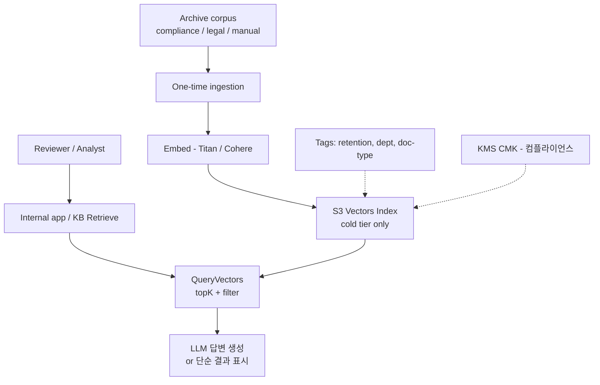
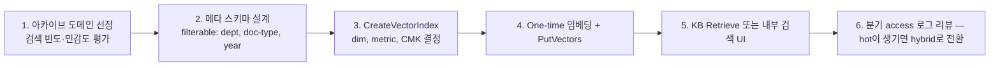

# Cold-tier RAG Archive — S3 Vectors Archive Semantic Search

## 핵심 요약

"한 번 인덱싱하고 분기에 몇 번만 검색"되는 **아카이브 코퍼스에 시맨틱 검색을 부여**하는 단일 티어 패턴. 전통적으로는 ElasticSearch warm/cold 노드 + 키워드 검색이 표준이었으나, S3 Vectors GA로 **운영 인스턴스 0**·**스토리지 단가 ~$0.06/GB**·**인덱스당 20억 벡터**가 가능해지면서 컴플라이언스 문서·과거 운영 매뉴얼·법무·의료 기록 등에 시맨틱 검색을 도입하는 비용 장벽이 사라졌다. Hot/Cold tiering의 반대 — **모든 검색이 cold면 OSS 자체를 없애도 된다**.

- **단일 티어**: S3 Vectors only. OSS / Pinecone 등 hot 레이어 없음.
- **검색 빈도**: 일~분기 단위 N회 (idle 95%+).
- **레이턴시 허용도**: sub-second 또는 수 초도 무방한 워크플로(검토, 리포트, e-discovery).
- **비용 구조**: 거의 100% Storage 단가. PUT은 1회성, Query는 미미.

## 컴포넌트 다이어그램

## 적용 단계

## 핵심 기능 및 서비스

| 기능 | 역할 |
|---|---|
| S3 Vectors index | 검색 단위. 아카이브 코퍼스 1:1 또는 도메인별 분할 |
| Bedrock KB (선택) | Retrieve API를 단일 진입점으로 표준화 |
| KMS CMK (선택) | 컴플라이언스 / 멀티테넌트 격리 |
| Filterable metadata | 부서·문서종류·년도 등 거친 분리 — 의미 기반 정밀 필터는 LLM 후처리 |
| Lifecycle 룰 | retention 만료 자산 DeleteVectors |
| Access log + CloudTrail | 검색 빈도 측정 — hot 발견 시 tiering 전환 트리거 |

## 유사 기술 비교

| 항목 | S3 Vectors cold-only | OSS warm/cold 노드 | Glacier + 키워드 검색 | Pinecone serverless idle |
|---|---|---|---|---|
| 검색 의미론 | 시맨틱 (벡터) | 키워드 + 옵션 벡터 | 키워드만 | 시맨틱 |
| Idle 비용 | **≈ Storage만** | warm/cold 노드 시간당 | 거의 0 (검색 전) | 최소 ~$50/mo |
| 검색 비용 | 호출 + 처리량 | 노드 흡수 | retrieve 비용 + 검색 시간 | unit 단위 |
| 응답 시간 | sub-second~수초 | 수십 ms | 분~시간 (retrieve 포함) | 수십 ms |
| 적합 케이스 | **아카이브 시맨틱** | 일반 검색 | 진정한 콜드 데이터 | 일관된 latency 필요 |

## 실제 사례

### March Networks — 비디오/사진 인텔리전스 아카이브
대규모 미디어 인덱스를 S3V로 저비용 운영. 분기 단위 검색·콜드 SLO 수용. AWS 사례 모음에서 "수십억 벡터를 경제적으로" 인용.

### 법무·컴플라이언스 e-Discovery
조직 내 메일·문서 1억+ 건. 검색은 소송·감사 시점에만 발생. OSS 상시 운영 비용이 비합리적 → S3V 단일 티어 + Bedrock KB Retrieve.

### 사내 운영 매뉴얼·런북
과거 운영 사고·복구 절차 텍스트. 신규 인시던트 시 검색 → 패턴 매칭. 일~월간 검색 회수 한 자리 수. **OSS Serverless $350/mo가 사실상 100% 낭비**되는 시나리오.

## 활용 시나리오

### 시나리오 1: 법무 컴플라이언스 문서 아카이브
계약·소송·규제 문서 5천만 chunk. tenant_id / year / jurisdiction을 filterable. 검색은 변호사가 사건당 수회. KB Retrieve로 단순 통합. cost = Storage 약 $12/mo + 검색 거의 0.

### 시나리오 2: 운영 매뉴얼·런북 시맨틱 검색
사내 위키 / 런북 1M chunk. SRE 인시던트 대응 시 자연어로 유사 사건 검색. 응답 1초도 충분 — alert 대응 5분 SLA 안에서 무시 가능. OSS 인스턴스 없이 운영.

### 시나리오 3: 의료 기록 — 환자별 인덱스 + CMK
환자당 별도 인덱스 (또는 tenant_id로 filter) + CMK 분리. 진료 시점 검색만 발생, idle 99.9%. Storage·KMS만 과금.

## 장단점 및 트레이드오프

| 항목 | 내용 |
|---|---|
| 장점 | (1) **운영 인스턴스 0** — Idle 비용 사실상 Storage뿐 (2) 인덱스당 20억 벡터로 사실상 상한 무한 (3) Bedrock KB와 함께 사용 시 **운영 코드 0**의 매니지드 RAG (4) 검색 자체가 드물어 처리량 한도가 문제되지 않음 |
| 단점 | (1) **사용자 대화형 SLA** 워크로드에는 부적합 (cold sub-second이지만 일관성 약함) (2) 검색이 갑자기 늘면 처리량·비용 압박 — hot/cold 전환 신호 모니터링 필요 (3) 단일 인덱스에 너무 큰 데이터를 몰면 처리량 한도 (4) 검색 빈도 분포를 잘못 가정하면 OSS보다 비싸질 수 있음 |
| 트레이드오프 | "검색 빈도 ↔ 비용". 검색이 드물수록 cold-only가 압도적, 빈도가 늘면 [[fl-2026-06-02-aws-s3-vectors-hot-cold-vector-tiering]] hybrid로 전환. **PoC 단계 cold-only → 운영 중 빈도 측정 → 필요 시 hybrid 승격**이 자연스러운 진화. |

## 함정 및 안티패턴

- **콜드 가정으로 시작했는데 사용자 검색이 늘어남**: 비용·처리량 누적 → hybrid로 전환 필요. **분기 access 로그 리뷰가 모니터링 거버넌스**의 일부.
- **대화형 채팅 UX를 cold-only로**: 100~700ms cold 레이턴시가 사용자 인지에 거슬림. cold는 백오피스·검토 워크플로 중심.
- **메타 스키마를 인덱싱 후 변경**: non-filterable 키 불변 + 인덱스 재생성 비용이 PUT 비용 누적과 맞먹음. **인덱싱 전 스키마 워크숍 필수**.
- **archive 이미지·비디오 chunk를 너무 크게**: 1 chunk 30 KB+ → 40 KB metadata 한도 압박 + Query 처리량 비용 증폭. chunk 크기 1~2 KB 유지.
- **OSS / Pinecone과 절대 비교**: idle 비용만 보면 S3V 압승이지만, **QPS 1+로 늘어나면 처리량 차원 비용**이 빠르게 따라온다. 비용 비교는 워크로드 분포 기반으로.

## 참고 자료

- [Amazon S3 Vectors product page](https://aws.amazon.com/s3/features/vectors/) — cold-tier 포지셔닝 (High)
- [Building cost-effective RAG with Bedrock KB and S3 Vectors — AWS ML Blog](https://aws.amazon.com/blogs/machine-learning/building-cost-effective-rag-applications-with-amazon-bedrock-knowledge-bases-and-amazon-s3-vectors/) — managed cold-tier RAG (High)
- [AWS Prescriptive — Knowledge bases for Bedrock](https://docs.aws.amazon.com/prescriptive-guidance/latest/retrieval-augmented-generation-options/rag-fully-managed-bedrock.html) — managed RAG 옵션 (High)
- [Using S3 Vectors with Amazon Bedrock Knowledge Bases — AWS Docs](https://docs.aws.amazon.com/AmazonS3/latest/userguide/s3-vectors-bedrock-kb.html) — KB + S3V 통합 (High)
- [Vector database options — AWS Prescriptive Guidance](https://docs.aws.amazon.com/prescriptive-guidance/latest/choosing-an-aws-vector-database-for-rag-use-cases/vector-db-options.html) — 워크로드 분류 가이드 (High)
- [What is Amazon S3 Vectors? Use Cases and Cost — Medium](https://medium.com/awsfullstack/what-is-amazon-s3-vectors-use-cases-when-to-use-it-and-cost-bd1057929332) — 워크로드 분류 (Mid)
- [Progressive Searching for RAG — arXiv](https://arxiv.org/html/2602.07297v1) — cold 워크로드 최적화 (Mid)
