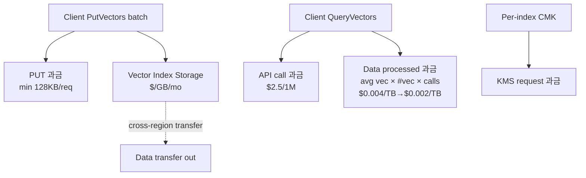
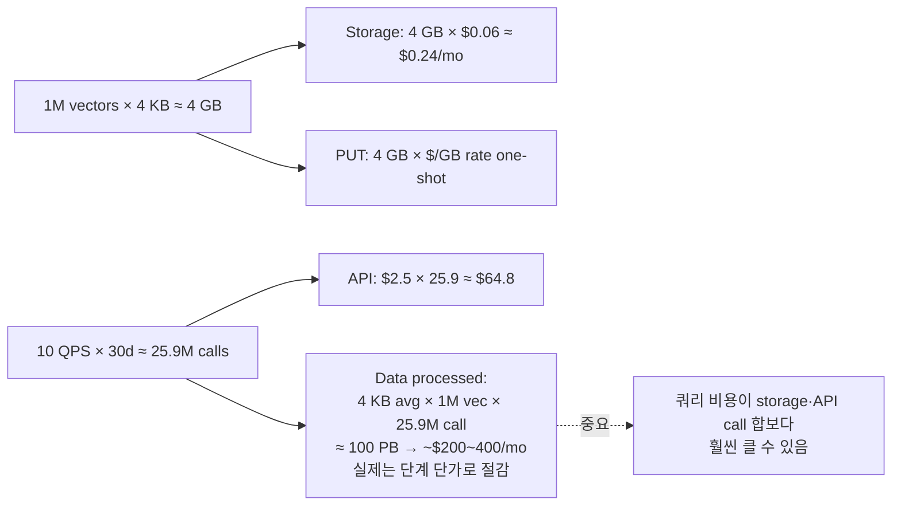

# Amazon S3 Vectors — 비용 모델 (Cost Model)

## 핵심 요약

S3 Vectors 비용은 **세 축**으로 구성된다: (1) PUT (적재 시 logical GB), (2) Storage (저장 logical GB·월), (3) Query (API 호출 + 처리 데이터량 TB). 전용 벡터 DB와 달리 **상시 가동 인스턴스 비용이 0**이라 idle 워크로드에서 강점이 크지만, **QueryVectors의 "데이터 처리량" 차원이 직관과 어긋날 수 있다** — 쿼리당 인덱스 평균 벡터 크기 × 인덱스 총 벡터 수만큼 데이터가 "처리"된 것으로 과금된다.

- **PUT**: logical GB(벡터 데이터 + 키 + 메타데이터) 단위. **PUT 1건당 최소 128 KB 과금** — 작은 PUT을 자주 보내면 손해. **batch가 비용에 직접 영향**.
- **Storage**: 인덱스에 저장된 모든 벡터의 logical GB / month. **약 $0.06/GB/mo** 수준(리전·시점에 따라 다름).
- **Query**: API call $2.5/1M + 처리량 단계 과금 — **첫 100K 벡터 처리분 $0.004/TB**, 그 이후 $0.002/TB. 쿼리 데이터 처리량 = "평균 벡터 크기(데이터+키+filterable 메타) × 인덱스 내 벡터 수".
- **공식 절감 주장**: 전용 벡터 DB 대비 **최대 90% 비용 절감**.

## 핵심 기능 및 서비스

| 비용 축 | 단위 | 핵심 변수 |
|---|---|---|
| PUT | logical GB | 배치 크기(min 128 KB 과금), 벡터 차원, 메타 크기 |
| Storage | GB / month | 벡터 수 × 평균 logical size |
| Query — API calls | $/1M calls | QPS × 운영 시간 |
| Query — data processed | $/TB | 인덱스 평균 벡터 크기 × 인덱스 벡터 수 × 호출 수 |
| 데이터 전송 | 표준 S3 단가 | 외부 리전·인터넷 egress |
| KMS | 표준 KMS 단가 | per-index CMK 사용 시 KMS 요청 비용 추가 |

> "logical size"는 압축 전 원시 크기. 벡터 차원 1024(float32) ≈ 4 KB + 키 + 메타.

## 시스템 아키텍처

비용 발생 경로 — Put / Storage / Query / KMS / Egress.

## 처리 흐름

벡터 1M개·1024차원(≈4KB)·QPS 10의 월간 비용 산출 예 (개략).

## 유사 기술 비교

| 항목 | S3 Vectors | OpenSearch Serverless | Pinecone Serverless | pgvector (Aurora) |
|---|---|---|---|---|
| Idle 비용 | **사실상 0** | OCU 최소 ~$350/mo | 최소 $50/mo | 인스턴스 ~수십 $/mo |
| 적재 비용 | PUT logical GB | OCU 흡수 | $/upsert + storage | INSERT (CPU/IO) |
| 검색 비용 | call + data processed | OCU 시간 흡수 | $/read unit | 인스턴스 CPU 흡수 |
| 스토리지 단가 | ~$0.06/GB/mo | OCU에 포함 | tier별 | RDB 스토리지 |
| 비용 직관성 | 처리 데이터량 차원이 비직관 | OCU 단가는 단순 | unit 모델 단순 | 인스턴스 단순 |
| Best for | **저빈도·대용량 콜드** | **고QPS·hot** | 운영 단순 | 소-중규모 RDB 통합 |

## 실제 사례

### Murray Cole — S3 Vectors vs Pinecone 시뮬레이션
1M 벡터·QPS 10 시나리오 분석: storage·PUT은 S3 Vectors가 Pinecone 대비 압도적으로 저렴하지만, **데이터 처리량 차원의 query 비용이 누적되면 손익분기가 빠르게 변동**. 결론: cold·저QPS 워크로드는 S3V, 상시 고QPS는 Pinecone.

### Caylent — 하이브리드 스토리지 비용 패턴
hot subset만 OpenSearch Serverless에 두고 cold는 S3 Vectors로 두는 패턴이 **순수 OSS 대비 50~80% 절감**. 핵심은 hot/cold 분할 비율 — 검색 빈도 분포가 long-tail이어야 효과 큼.

### AWS 공식 — "최대 90% 절감"
적재·저장·쿼리 합산 기준. 비교 대상은 명시되지 않으나, 동등 규모의 전용 벡터 DB(매니지드 SaaS / OCU 기반) 대비 사례로 제시.

## 활용 시나리오

### 시나리오 1: 저빈도 콜드 RAG (분기 검색 수십 회)
PUT은 1회성, Storage가 주 비용. 10M 벡터(40 GB) × $0.06 ≈ $2.4/mo + 쿼리는 거의 무시. → **OSS Serverless $350/mo 대비 99% 절감**.

### 시나리오 2: 상시 RAG 챗봇 (QPS 50, 1M 벡터)
처리량 차원의 쿼리 비용이 본격화. 한도(인덱스당 ~수백 QPS)·비용 모두 부담. → hot 인덱스를 OSS로 이관, S3V는 archive·long-tail 전용.

### 시나리오 3: 멀티테넌트 SaaS — 인덱스 분리 비용
인덱스당 storage·query는 그대로 합산되지만, **인덱스 수 자체에는 추가 비용 없음**(10K 한도 내). 테넌트별 인덱스 분리가 비용 측면에서는 페널티 없음 — 권한 격리·CMK 분리의 이점만.

## 장단점 및 트레이드오프

| 항목 | 내용 |
|---|---|
| 장점 | (1) Idle / 저빈도 워크로드에서 **압도적 저비용** (2) **인프라 할당 없이 사용량 기반** (3) 인덱스 수 증가에 추가 비용 없음 — 멀티테넌트 친화 (4) Storage 단가가 S3 표준에 가까워 예측 가능 |
| 단점 | (1) **Query 데이터 처리량 차원이 비직관** — 평균 벡터 크기 × 벡터 수 × 호출 수가 빠르게 누적 (2) PUT 128 KB 최소 과금 — 소량 잦은 적재가 손해 (3) hot·고QPS 워크로드에서 누적 비용이 OCU 모델을 추월할 수 있음 (4) FinOps 도구의 S3 Vectors 차원 지원이 아직 부족 |
| 트레이드오프 | "예측 가능한 OCU/instance 비용" vs "사용량 기반 + cold에 강함". 워크로드의 빈도·분포 분석 없이 단순 비용 비교는 잘못된 결정으로 이어진다. |

## 함정 및 안티패턴

- **벡터 1개씩 PutVectors 호출**: 128 KB 최소 과금 × N → 실제 데이터의 수십~수백 배 비용. **batch 100~500 유지**가 비용 모델의 핵심 가드레일.
- **"S3니까 싸겠지"로 hot 워크로드 채택**: 쿼리 데이터 처리량 차원이 누적되며 OSS Serverless를 추월하는 경우 발생. **워크로드 빈도 분포 측정 후 결정**.
- **인덱스를 비대하게 키우기**: query 처리량 = 평균 벡터 크기 × **인덱스 총 벡터 수** × calls. **인덱스 분할(샤딩)이 query 비용에도 영향** — tenant·도메인별 분리가 비용 격리 효과.
- **메타데이터 크기 미관리**: filterable 메타가 쿼리 처리량 계산에 포함됨. 큰 filterable 메타는 storage뿐 아니라 **쿼리마다 비용 증폭**.
- **KMS 비용 무시**: 인덱스별 CMK 사용 시 KMS 요청 비용이 PUT/Query 마다 누적. 고QPS에서는 의미 있는 금액. 분리가 필요한 인덱스만 CMK, 나머지는 SSE-S3.

## 참고 자료

- [Amazon S3 Pricing — Vectors section](https://aws.amazon.com/s3/pricing/) — 공식 단가표 (High)
- [Amazon S3 Vectors product page](https://aws.amazon.com/s3/features/vectors/) — 가격 모델 개요 (High)
- [Amazon S3 Vectors GA — AWS News Blog](https://aws.amazon.com/blogs/aws/amazon-s3-vectors-now-generally-available-with-increased-scale-and-performance/) — PUT 128 KB 최소·90% 절감 (High)
- [AWS S3 Vectors Pricing Deep Dive vs Pinecone — Murray Cole](https://murraycole.com/posts/aws-s3-vectors-pricing-deep-dive) — 워크로드별 비용 시뮬 (Mid)
- [What is Amazon S3 Vectors? Use Cases and Cost — AWS Fullstack / Medium](https://medium.com/awsfullstack/what-is-amazon-s3-vectors-use-cases-when-to-use-it-and-cost-bd1057929332) — 비용 사례 (Mid)
- [How is pricing structured for AWS S3 Vector? — Milvus AI Reference](https://milvus.io/ai-quick-reference/how-is-pricing-structured-for-aws-s3-vector-features-and-operations) — 비용 차원 요약 (Mid)
- [Architecting GenAI at Scale — Caylent](https://caylent.com/blog/architecting-gen-ai-at-scale-lessons-from-aws-s-3-vector-store-and-the-nuances-of-hybrid-vector-storage) — hybrid 비용 패턴 (Mid)
- [AWS S3 Vectors GA — InfoQ](https://www.infoq.com/news/2026/01/aws-s3-vectors-ga/) — 비용 의미 분석 (Mid)
