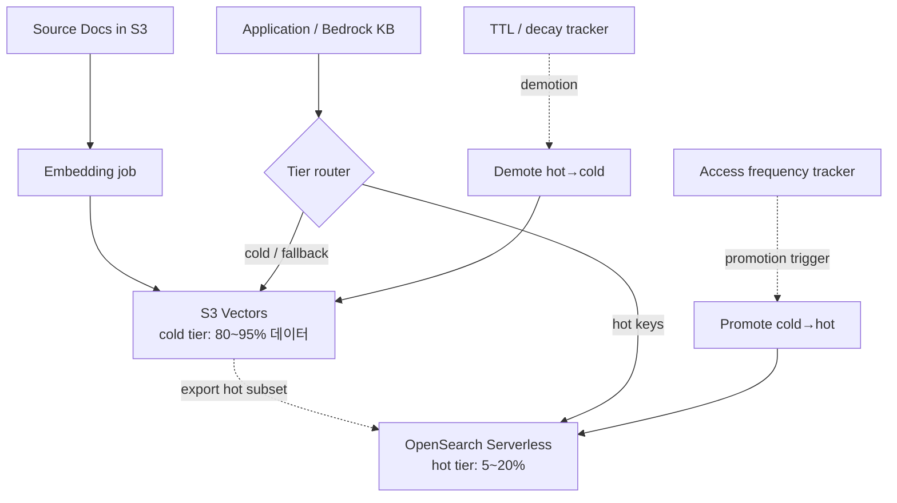
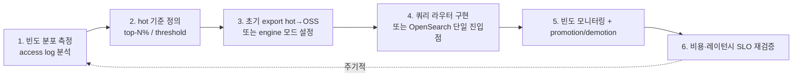

# Hot/Cold Vector Tiering — S3 Vectors + OpenSearch 패턴

## 핵심 요약

벡터 검색 워크로드의 **빈도 분포가 long-tail**이라는 관찰에서 출발하는 아키텍처 패턴. 자주 질의되는 hot subset(전체의 5~20%)만 OpenSearch에 두어 ms 단위 응답을 보장하고, cold 대부분은 S3 Vectors에 저장해 비용을 최대 90% 절감한다. AWS는 두 가지 통합 형태를 공식 지원: (1) **export 방식** — S3 Vectors → OpenSearch Serverless로 핫 부분 복제, (2) **engine 방식** — OpenSearch Managed Cluster가 S3 Vectors를 백엔드 벡터 엔진으로 사용.

- **두 통합 방식**: Export(point-in-time, 수동 재export 필요) / Engine(통합 인덱스, OpenSearch가 라우팅).
- **운영 가정**: 검색 빈도가 long-tail이어야 효과. 균일 분포 워크로드에서는 효과 적음.
- **상승**: cold → hot **promotion**은 사용자 정의 트리거(접근 빈도 임계치 등) 기반.
- **공식 가이드**: AWS Prescriptive Guidance가 hybrid를 표준 RAG 패턴으로 권장.

## 컴포넌트 다이어그램

## 적용 단계

## 핵심 기능 및 서비스

| 통합 방식 | 동작 | 동기화 | 적합 케이스 |
|---|---|---|---|
| Export to OSS Serverless | 시점 복제 (point-in-time) | **수동 재export** | 안정적 hot set, 주간 갱신 |
| OSS as engine on S3 Vectors | OSS가 S3V를 백엔드로 사용 | 자동 (OSS가 관리) | 빠른 통합, 단일 검색 API |
| 라우터 자체 구현 | 앱이 hot/cold 키 라우팅 | 앱 책임 | 최대 유연성, 복잡도 ↑ |
| Bedrock KB + S3V | KB가 S3V를 vector store로 | KB ingestion job | 매니지드 RAG의 cold-only 운영 |

## 유사 기술 비교

| 항목 | S3V + OSS tiering | Pinecone serverless (단일 티어) | DynamoDB hot/cold partition | Elasticsearch warm/cold node |
|---|---|---|---|---|
| 데이터 분리 | tier 명시 (S3 vs OSS) | 내부 추상화 | 파티션 키 | node role |
| 비용 절감 | **최대 80%+ (cold long-tail)** | tier별 자동 | 워크로드 의존 | hot 노드 비용 절감 |
| 사용자 운영 | tier promotion 직접 | 자동 | 파티션 설계 | ILM 정책 |
| 검색 단일 API | engine 모드면 가능 | 가능 | 별도 쿼리 | 가능 (cluster) |
| 정합성 | export는 수동 sync | 자동 | 자동 | ILM 자동 |

## 실제 사례

### Qlik — 데이터 카탈로그 시맨틱 검색
수억 벡터를 S3 Vectors에 두고 OpenSearch를 앞단에 둠. 자주 검색되는 카탈로그 엔티티는 OSS에, 아카이브 엔티티는 S3V. **사용자가 인지하는 검색 API는 OSS 단일**, tier 분리는 운영 상세.

### Caylent — 하이브리드 벡터 스토리지 패턴 분석
"hot vs cold 비율"에 따른 비용·레이턴시 시뮬레이션. hot=10% 균등 가정 시 순수 OSS 대비 **약 70~80% 절감**, hot 비율이 40% 이상이면 절감 효과 급감.

### BigData Boutique 벤치마크
OSS + S3 Vectors 하이브리드의 P50/P99 측정. hot 경로는 OSS와 동등, cold 경로는 sub-second이지만 일관되게 OSS보다 10~50배 느림. **SLO 차등화**가 필수.

## 활용 시나리오

### 시나리오 1: e-커머스 추천 + 카탈로그 검색
지난 7일간 노출된 상품 임베딩만 OSS hot, 나머지 카탈로그는 S3V cold. 추천(개인화·실시간) = OSS, 검색(롱테일 SKU 발견) = S3V. promotion = "노출 발생 시 hot으로 이동".

### 시나리오 2: 지식 베이스 — 최신 문서 vs 아카이브
최근 90일 문서는 OSS, 그 이전은 S3V archive. KB Retrieve가 OSS를 primary, miss/저신뢰일 때 S3V fallback. 사용자는 단일 KB endpoint만 인지.

### 시나리오 3: 멀티미디어 인덱스 — 메타데이터로 분리
이미지·비디오 임베딩에서 "최근 60일 업로드" 또는 "조회 ≥ 10회"인 자산만 OSS, 나머지는 S3V. 콘텐츠 라이프사이클과 정렬된 자연스러운 hot/cold.

## 장단점 및 트레이드오프

| 항목 | 내용 |
|---|---|
| 장점 | (1) **비용 70~90% 절감** (long-tail 워크로드에서) (2) hot 경로는 ms, cold는 sub-second — SLO를 워크로드별 차등 가능 (3) S3V로 인덱스 상한 사실상 무한 (4) AWS 공식 권장 패턴으로 IaC·문서 풍부 |
| 단점 | (1) **운영 복잡도 ↑** — 라우터, promotion 트리거, 빈도 트래킹 필요 (2) Export 방식은 수동 sync — 데이터 신선도 보장 어려움 (3) 빈도 분포가 균일하면 효과 없음 — 사전 측정 필수 (4) cold miss 시 사용자 경험 저하 — fallback UX 설계 필요 |
| 트레이드오프 | "단순 단일 티어 vs 비용 최적화 하이브리드". 데이터·트래픽이 작으면 단일 OSS / Pinecone이 단순, 코퍼스가 1억+ 또는 비용 압박이 클 때 hybrid가 ROI. **PoC 단계에서 단일, 스케일 시 hybrid 전환** 권장. |

## 함정 및 안티패턴

- **빈도 분포 측정 없이 hybrid 도입**: 균일 분포면 hot subset 정의가 무의미 → 모든 쿼리가 hot/cold 양쪽에 가는 worst case. **2~4주 access log 분석이 선결**.
- **Export 한 번 후 sync 방치**: point-in-time 복제 후 신규 데이터가 OSS에 없음 → 검색 누락. 주기적 재export 또는 engine 방식 사용.
- **promotion 트리거를 너무 민감하게**: 단발 접근에도 promote → OSS 비용 폭증. **moving window + 임계치** 설계.
- **cold 경로 SLO를 hot과 동일하게 광고**: cold sub-second는 100~700ms 범위 — UX 디자인에서 "검색 중…" 상태 또는 두 단계 응답이 필요.
- **단일 인덱스로 hot/cold 같이 운영**: tier 분리가 안 됨 → S3V 단일 인덱스 한도(처리량·QPS)에 hot이 발목 잡힘. **물리적 인덱스 분리**가 hybrid의 기본.

## 참고 자료

- [Using S3 Vectors with OpenSearch Service — AWS Docs](https://docs.aws.amazon.com/AmazonS3/latest/userguide/s3-vectors-opensearch.html) — 두 통합 방식 공식 (High)
- [Optimizing vector search with S3 Vectors and OpenSearch — AWS Big Data Blog](https://aws.amazon.com/blogs/big-data/optimizing-vector-search-using-amazon-s3-vectors-and-amazon-opensearch-service/) — hybrid 아키텍처 가이드 (High)
- [Amazon S3 Vectors product page](https://aws.amazon.com/s3/features/vectors/) — tiered 패턴 소개 (High)
- [Building cost-effective RAG with Bedrock KB and S3 Vectors — AWS ML Blog](https://aws.amazon.com/blogs/machine-learning/building-cost-effective-rag-applications-with-amazon-bedrock-knowledge-bases-and-amazon-s3-vectors/) — KB 결합 (High)
- [S3 Vectors with OpenSearch: Cost-Efficient Hybrid Search — BigData Boutique](https://bigdataboutique.com/blog/opensearch-with-s3-vectors-cost-efficient-hybrid-search) — 벤치마크 (Mid)
- [Architecting GenAI at Scale — Caylent](https://caylent.com/blog/architecting-gen-ai-at-scale-lessons-from-aws-s-3-vector-store-and-the-nuances-of-hybrid-vector-storage) — hybrid 트레이드오프 분석 (Mid)
- [Benchmarking S3 Vectors vs OpenSearch Serverless — AWS Builder Center](https://builder.aws.com/content/3BWqyF1PhA4Mc1fxUOl9n2B9yZo/benchmarking-amazon-s3-vectors-vs-opensearch-serverless-at-scale) — P50/P99 비교 (Mid)
