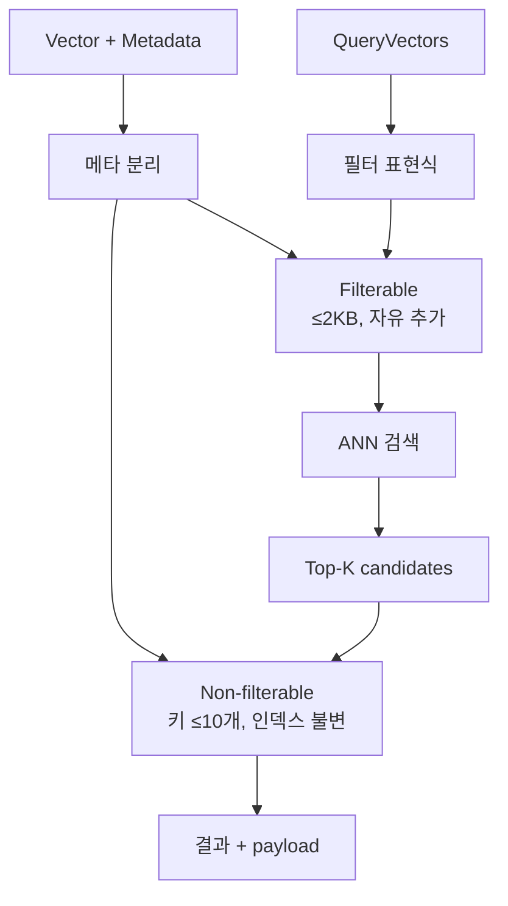
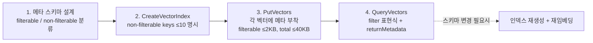

# Amazon S3 Vectors — Metadata 모델 (Filterable vs Non-Filterable)

## 핵심 요약

S3 Vectors는 각 벡터에 메타데이터를 첨부할 수 있으나, **두 종류로 명확히 분리**된다: filterable(쿼리 필터에 사용 가능)과 non-filterable(검색 시 함께 반환만 됨). 두 카테고리는 **용량 제한이 다르고**, non-filterable 키는 **인덱스 생성 시 명시**해야 하며 생성 후 변경 불가다. 이 스키마 결정이 운영 전체를 좌우하므로 인덱싱 전에 카테고리·키·크기를 확정하는 것이 핵심.

- **두 카테고리**: filterable / non-filterable. 검색·반환·과금이 다름.
- **크기 한도**: **벡터당 총 메타 40 KB**, **filterable 부분 ≤ 2 KB**, **non-filterable** = 나머지(최대 ~38 KB).
- **non-filterable 키 한도**: **인덱스당 최대 10개**, 각 키 이름 ≤ 63자. **인덱스 생성 시 확정, 이후 불변**.
- **카테고리 전환 불가**: 한 번 non-filterable로 지정된 키를 나중에 filterable로 바꿀 수 없음 (반대도 동일).
- **타입**: 문자열·숫자·불리언·배열 등 JSON 기본 타입 지원. 중첩 표현은 제한.

## 핵심 기능 및 서비스

| 항목 | filterable | non-filterable |
|---|---|---|
| 쿼리 필터 표현식에 사용 | 가능 (`==`, `IN`, `>`, `<` 등) | **불가** |
| 검색 응답에 함께 반환 | 가능 | 가능 (returnMetadata 옵션) |
| 인덱스 생성 시 키 지정 | 자동(자유 추가) | **사전 명시 필수, 불변** |
| 인덱스당 키 개수 | 사실상 자유 | **최대 10개** |
| 벡터당 크기 한도 | **≤ 2 KB** | 총 40 KB 한도 내 나머지(~38 KB) |
| 변경 가능성 | 벡터 단위로 추가/수정 가능 | 키 자체는 인덱스 단위로 불변 |
| 권장 용도 | tenant ID, 언어, 카테고리, 날짜 등 거친 분리 | 원문 스니펫, source URL, chunk 위치 등 큰 paylod |

## 시스템 아키텍처

filterable은 쿼리 시 인덱스 내부에서 사전 필터링 경로에 진입, non-filterable은 결과 후 부착(payload) 역할.

## 처리 흐름

스키마 설계 → 인덱스 생성 → 적재 → 쿼리 순. 1번에서 실수하면 인덱스 재생성 필요.

## 유사 기술 비교

| 항목 | S3 Vectors | OpenSearch | Pinecone | pgvector |
|---|---|---|---|---|
| 필터 가능 메타 한도 | **2 KB / 벡터** | 매핑 필드 수만큼 | 40 KB / 벡터 (기본) | 컬럼 자유 |
| 페이로드(non-filter) 한도 | ~38 KB / 벡터 | _source 자유(샤드 한도) | 메타 분리 없음 | TOAST로 큰 값 |
| 스키마 불변성 | non-filter 키 **불변** | 매핑 부분 변경 가능 | metadata schema 자유 | ALTER TABLE 가능 |
| 필터 표현식 풍부도 | 기본 비교/논리 | 풀 DSL | 풍부 | 풀 SQL |
| 적합 케이스 | 거친 필터 + 큰 payload | 정밀 필터 + 풀텍스트 | 운영 단순 | RDB 트랜잭션 |

## 실제 사례

### LangChain S3 Vectors — 기본 metadata payload 초과 버그
`langchain-aws`의 기본 metadata 생성기가 chunk 텍스트·source 정보 등을 모두 filterable로 넣으려 시도 → **2 KB 한도 초과로 PutVectors 실패**. 이슈 #693에서 보고됨. 해결: 큰 텍스트는 non-filterable로 분리하고, filterable에는 tenant/lang 같은 작은 필드만.

### Bedrock Knowledge Bases — 자동 스키마 매핑
KB가 vector index를 자동 생성할 때, KB metadata 필드를 filterable/non-filterable로 자동 분배. 사용자가 KB의 `metadata.json` 사이드카에서 `inclusions` / `exclusions`를 지정해 거친 필터(예: `category`, `language`)만 filterable로 올리는 것이 모범.

## 활용 시나리오

### 시나리오 1: 멀티테넌트 RAG의 tenant 격리
모든 벡터에 `tenant_id`를 filterable로 부착. 쿼리마다 `filter: {tenant_id == "X"}` 강제 → 데이터 격리. 다만 [[fl-2026-06-02-aws-s3-vectors-recall-vs-filter-tradeoff]]에서 보듯 강한 filter는 recall 하락 위험.

### 시나리오 2: 큰 원문 스니펫 보존
chunk 원문(수 KB)을 non-filterable `chunk_text`에 저장 → 검색 응답에 함께 반환되어 LLM 프롬프트 구성 시 별도 GetObject 불필요. 단, 인덱스 생성 시 키 이름을 정확히 박아둬야 함.

### 시나리오 3: 언어·카테고리·날짜 거친 분리
`lang`, `category`, `created_at`을 filterable로 두고 쿼리에서 BUCKET 단위 분리. 의미 기반 정밀 필터(예: "법무 카테고리 중에서도 계약 관련")는 LLM 재랭킹으로 후처리 — recall 보호.

## 장단점 및 트레이드오프

| 항목 | 내용 |
|---|---|
| 장점 | (1) Filter / payload 분리로 **검색 경로 최적화** (작은 필터, 큰 payload) (2) Non-filterable 키 사전 명시로 인덱스 메모리 사용량 예측 가능 (3) 검색 응답에 payload 부착으로 추가 GetObject 호출 불필요 |
| 단점 | (1) **카테고리 결정이 1회성** — 잘못 분류한 키 변경 시 인덱스 재생성+재임베딩 (2) filterable 2 KB 한도가 빡빡 — 큰 텍스트 강제 분리 (3) non-filterable 키 10개 한도가 멀티테넌트·다중 도메인에서 빠르게 소진 |
| 트레이드오프 | "스키마 자유도" vs "검색 성능·운영 단순성". S3 Vectors는 RDB / OpenSearch 수준의 자유도를 포기하고, 사전 결정의 안전·성능을 챙긴다. **인덱싱 전 스키마 워크숍**이 사실상 필수. |

## 함정 및 안티패턴

- **chunk 원문을 filterable로 넣기**: 1 chunk = 4~8 KB라면 2 KB 한도 초과로 PutVectors 실패. → non-filterable `chunk_text` 키에 저장.
- **non-filterable 키를 인덱스 생성 후 추가 가정**: 불가. 누락된 키가 발견되면 새 인덱스 생성 + 재임베딩 외 경로 없음. → 인덱싱 전 메타 스키마 리뷰 게이트.
- **모든 필드를 filterable로**: 불필요한 필터링 인덱스 비용·쿼리 복잡도 증가. → 실제 필터에 쓰일 필드만 filterable, 나머지는 non-filterable payload.
- **5개 테넌트 + 6개 도메인 키를 다 non-filterable에**: 10개 한도 초과. → 테넌트 ID는 filterable로, payload는 도메인 묶음 키 1개로 압축(JSON 직렬화).
- **40 KB payload 가정으로 큰 청크 통째 저장**: 한도 내라도 PutVectors 페이로드가 비대 → 처리량 한도(2 MB/s 쓰기)에 더 빠르게 도달. chunk 크기를 1~2 KB로 유지.

## 참고 자료

- [Metadata filtering — AWS Docs](https://docs.aws.amazon.com/AmazonS3/latest/userguide/s3-vectors-metadata-filtering.html) — 필터 표현식 공식 (High)
- [Limitations and restrictions — AWS Docs](https://docs.aws.amazon.com/AmazonS3/latest/userguide/s3-vectors-limitations.html) — 모든 메타 한도 (High)
- [Vectors — AWS Docs](https://docs.aws.amazon.com/AmazonS3/latest/userguide/s3-vectors-vectors.html) — vector + metadata 모델 (High)
- [S3 Vectors best practices — AWS Docs](https://docs.aws.amazon.com/AmazonS3/latest/userguide/s3-vectors-best-practices.html) — 메타 스키마 설계 가이드 (High)
- [Using S3 Vectors with Amazon Bedrock Knowledge Bases — AWS Docs](https://docs.aws.amazon.com/AmazonS3/latest/userguide/s3-vectors-bedrock-kb.html) — KB의 metadata 매핑 (High)
- [S3 Vector big metadata error — AWS re:Post](https://repost.aws/questions/QUWezLMjc0S8GOiaa3jOOKGQ/s3-vector-big-metadata-error) — 한도 초과 사례 (Mid)
- [langchain-aws S3 Vectors metadata 버그 — GitHub #693](https://github.com/langchain-ai/langchain-aws/issues/693) — 추상화 한도 위반 (Mid)
- [llama_index Filterable metadata 2048 bytes — GitHub #21062](https://github.com/run-llama/llama_index/issues/21062) — 동일 버그 (Mid)
- [What are the limitations of AWS S3 Vector? — Milvus AI Reference](https://milvus.io/ai-quick-reference/what-are-the-limitations-or-quotas-for-using-aws-s3-vector) — 한도 비교 (Mid)
