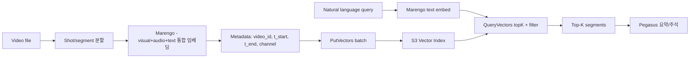

# TwelveLabs — 페타바이트 비디오 인텔리전스 with S3 Vectors

## 핵심 요약

TwelveLabs는 **비디오 파운데이션 모델** 기업으로, 두 모델 — **Marengo**(멀티모달 임베딩, 512차원) / **Pegasus**(비디오 → 텍스트 생성) — 을 EKS 위에서 운영하며 S3를 데이터 백본으로 사용한다. S3 Vectors GA(2025-12) 이후 Marengo 임베딩을 **S3 Vectors에 native 저장**해 페타바이트 비디오 아카이브를 cross-modal(텍스트 ↔ 비디오 ↔ 이미지 ↔ 오디오) 검색 가능한 자산으로 전환했다. "**write-only 스토리지 → 지속적 인사이트 원천**"의 전형 사례.

- **모델**: Marengo (멀티모달 임베딩, 512-dim) + Pegasus (비디오 언어 모델).
- **인프라**: Amazon EKS + EC2 auto-scale + S3(원본) + S3 Vectors(임베딩).
- **임베딩 차원**: **512** (멀티모달 통합 공간 — text/video/image/audio 동일 좌표계).
- **검색 모드**: any-to-any (자연어 → 비디오 / 이미지 → 비디오 / 비디오 → 비디오 등).
- **포지셔닝**: AWS 공식 GA 사례 — 비디오 인텔리전스 카테고리의 reference architecture.

## 시스템 아키텍처

원본 비디오는 S3, 처리/임베딩은 EKS 위 Marengo, 검색은 S3 Vectors + Pegasus 보조.

```mermaid
graph TD
  UPL[Video Upload S3] --> EKS[EKS - Marengo embedding worker]
  EKS --> EMB[512-dim embedding<br/>per shot/segment]
  EMB --> PUT[s3vectors:PutVectors]
  PUT --> VI[S3 Vector Index<br/>video segments]
  Q_TXT[Text query: "팀이 득점 후 환호하는 클립"] --> EMB_Q[Marengo text embed]
  Q_IMG[Image query] --> EMB_Q
  Q_VID[Video query] --> EMB_Q
  EMB_Q --> QV[s3vectors:QueryVectors topK]
  VI --> QV
  QV --> TOP[Top-K segments + timestamps + video IDs]
  TOP --> PEG[Pegasus VLM<br/>summarize / annotate]
  PEG --> OUT[App: timeline + 자연어 설명]
```

## 처리 흐름



## 핵심 기능 및 서비스

| 구성요소 | 역할 |
|---|---|
| Marengo | multimodal 임베딩 모델, 512-dim, text/video/image/audio 통합 |
| Pegasus | 비디오 → 텍스트 생성 (요약·구조화 출력) |
| Amazon EKS | 모델 추론 클러스터, EC2 auto-scale |
| Amazon S3 (raw) | 원본 비디오·처리 중간 출력 저장 |
| **S3 Vectors** | Marengo 임베딩 저장 + ANN 검색 |
| Filterable metadata | video_id, channel, time, tags |
| Bedrock 통합 | Marengo / Pegasus는 Bedrock에서도 호출 가능 |

## 유사 기술 비교

| 항목 | TwelveLabs on S3V | 자체 Faiss + S3 | Pinecone + 별도 비디오 모델 | OpenSearch + 임베딩 |
|---|---|---|---|---|
| 모델 통합도 | Marengo + Pegasus 일관 | 사용자 직접 결합 | 비디오 모델 직접 통합 X | 임베딩만 |
| 인프라 운영 | 매니지드 storage + EKS만 | 자체 인덱스 운영 | SaaS | OSS 운영 |
| Cross-modal | any-to-any (모델 능력) | 사용자 구현 | 부분 | 부분 |
| 페타바이트 스케일 | 검증됨 | 직접 검증 필요 | 비용 위험 | 비용 위험 |
| AWS 공식 사례 | Yes | No | No | 부분 |

## 실제 사례

### AWS 공식 case study — Petabyte 스케일
TwelveLabs는 비디오 파운데이션 모델을 연구 프로토타입에서 **페타바이트 스케일 프로덕션 시스템**으로 전환. AWS 인프라(EKS, EC2 auto-scale, S3, S3 Vectors)가 핵심 enabler.

### TwelveLabs 블로그 — "Cross-Modal Search with Marengo & S3 Vectors"
회사 공식 글에서 Marengo 임베딩 + S3 Vectors 통합을 **권장 표준 아키텍처**로 제시. 사용자가 직접 인덱스를 운영하지 않아도 페타바이트 검색 가능.

### Bedrock에 Marengo & Pegasus 통합
"From MP4 to API" — Bedrock의 Foundation Model 카탈로그에 Marengo & Pegasus 등재. **Bedrock + S3 Vectors + Marengo**가 비디오 RAG의 사실상 reference stack.

### Elastic 통합 사례
Marengo + Bedrock + Elasticsearch 케이스. ES도 동등 위치에서 임베딩 저장이 가능 — 워크로드별로 ES / S3V 선택.

## 활용 시나리오

### 시나리오 1: 미디어 아카이브 시맨틱 검색
방송사·OTT의 아카이브 영상 페타바이트 단위. 자연어로 "득점 후 환호 클립" 검색 → Marengo가 같은 임베딩 공간으로 매핑 → S3 Vectors ANN → Top-K 세그먼트 + 타임스탬프. 검색 빈도 long-tail이라 cold-friendly.

### 시나리오 2: 모니터링 / 보안 (March Networks 패턴)
대규모 CCTV·드론 영상. 사건 발생 시 자연어 / 이미지 쿼리로 유사 장면 검색. idle 99%+ → S3 Vectors 비용 압승.

### 시나리오 3: 콘텐츠 모더레이션
신규 업로드 영상이 정책 위반 사례와 유사한지 검사 → 위반 사례 임베딩을 S3 Vectors에 저장, 신규 영상 임베딩으로 nearest neighbor 검색.

## 장단점 및 트레이드오프

| 항목 | 내용 |
|---|---|
| 장점 | (1) **페타바이트 검증된 reference stack** — risk 낮음 (2) Marengo의 통합 임베딩 공간 → cross-modal 검색 자연 (3) S3V로 페타바이트 임베딩을 **저비용 운영** — 메모리 기반 인덱스 대비 1/10 (4) Bedrock 통합으로 모델 호출까지 매니지드 |
| 단점 | (1) Marengo / Pegasus 모델 자체의 API/추론 비용 — 임베딩 생성이 비쌈 (2) 512차원이 텍스트 전용 모델보다 작아 **텍스트 검색 정밀도는 별도 모델 대비 약함** — 텍스트는 Titan / Cohere 별도 인덱스 추천 (3) S3V의 처리량 한도 — 실시간 콘텐츠 모더레이션 같은 hot 워크로드는 hybrid 필요 |
| 트레이드오프 | "비디오 cross-modal" vs "텍스트 RAG 정밀도". 비디오는 Marengo + S3V 통합 강력, 텍스트 RAG는 별도 텍스트 임베딩 인덱스가 자연스럽다. **도메인별 인덱스 분리**가 표준. |

## 함정 및 안티패턴

- **비디오와 텍스트 임베딩을 같은 인덱스로**: 다른 모델·다른 차원이면 호환 불가. **도메인별 인덱스 분리** + [[fl-2026-06-02-aws-s3-vectors-embedding-model-lock-in]] 규약 준수.
- **세그먼트 메타를 일괄 filterable로**: 비디오 세그먼트 수가 수억 단위면 filterable 2KB 한도 빠르게 도달. **video_id, channel, time만 filterable**, transcript / OCR은 non-filterable.
- **실시간 모더레이션을 S3V만으로**: hot QPS 한도 + cold latency → hot 인덱스를 OSS로 export 또는 hybrid 운영.
- **임베딩 생성을 단일 EKS pod에 직렬화**: 페타바이트 적재 시 처리량 병목. **Marengo worker fan-out + S3V 인덱스 샤딩** 결합.
- **Marengo v→v+1 업그레이드 시 인덱스 in-place 가정**: 임베딩 공간 불호환 → 새 인덱스 + 재임베딩 (페타바이트 단위 비용 큼). 업그레이드 ROI 검증 필수.

## 참고 자료

- [TwelveLabs Case Study — AWS](https://aws.amazon.com/solutions/case-studies/twelvelabs-case-study/) — 공식 사례 (High)
- [Cross-Modal Search with Marengo & S3 Vectors — TwelveLabs Blog](https://www.twelvelabs.io/blog/marengo-and-s3-vectors) — Marengo + S3V 아키텍처 (High)
- [Unlocking video understanding with TwelveLabs Marengo on Bedrock — AWS ML Blog](https://aws.amazon.com/blogs/machine-learning/unlocking-video-understanding-with-twelvelabs-marengo-on-amazon-bedrock/) — Bedrock 통합 (High)
- [From MP4 to API: Video AI with Marengo & Pegasus on AWS — TwelveLabs](https://www.twelvelabs.io/blog/marengo-pegasus-on-amazon-bedrock) — Bedrock 통합 (High)
- [Video Embeddings for Multimodal Search — TwelveLabs](https://www.twelvelabs.io/product/embed) — Marengo 사양 (High)
- [Video Search with Marengo, Bedrock & Elasticsearch — TwelveLabs](https://www.twelvelabs.io/blog/twelve-labs-and-elastic-search) — 대안 스택 비교 (Mid)
- [Video Foundation Model Evaluation Framework — GitHub](https://github.com/twelvelabs-io/video-embeddings-evaluation-framework) — 평가 (Mid)
- [Build Agentic Video Analysis with Pegasus & Strands Agents SDK — Dev.to](https://dev.to/aws/build-agentic-video-analysis-with-twelvelabs-pegasus-and-strands-agents-sdk-5a0m) — 에이전트 활용 (Mid)
