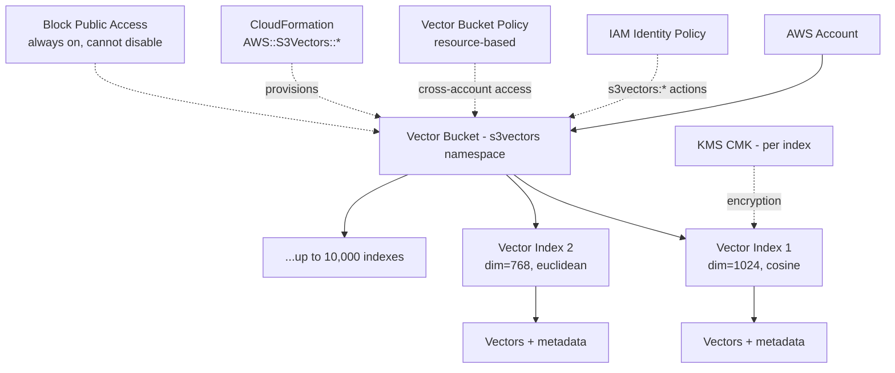
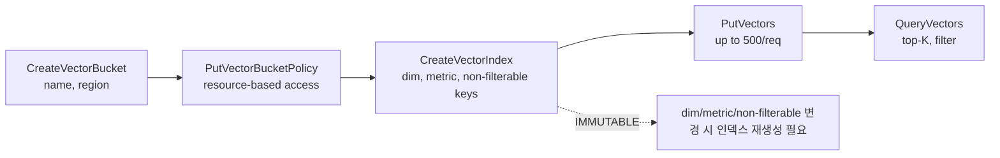

# Amazon S3 Vectors — Vector Bucket / Vector Index 리소스 모델

## 핵심 요약

S3 Vectors는 일반 S3 버킷과 **완전히 분리된 새 리소스 평면**을 도입한다. 최상위 리소스는 `vector bucket`이고, 그 안에 `vector index`를 N개 두는 2-tier 구조다. 서비스 네임스페이스도 일반 S3의 `s3`가 아닌 **`s3vectors`**로 분리되며, IAM·리소스 정책·CloudFormation 리소스 타입까지 별도다. 즉, 기존 S3 버킷 정책·VPC 엔드포인트·CRR·라이프사이클 정책이 vector bucket에 그대로 적용되지 않는다.

- **리소스 계층**: `vector bucket` → `vector index` → `vectors`. 인덱스는 생성 시 차원(dimension), 거리 메트릭, non-filterable 메타데이터 키를 **불변(immutable)**으로 고정한다.
- **네임스페이스 분리**: `arn:aws:s3vectors:<region>:<account>:bucket/<name>` / `.../index/<name>` — IAM 액션은 `s3vectors:CreateVectorBucket`, `s3vectors:PutVectors` 등 별도 prefix.
- **기본 보호**: Block Public Access 설정이 **항상 켜져 있고 끌 수 없음**. 일반 S3와 가장 큰 운영 차이.
- **CloudFormation**: `AWS::S3Vectors::VectorBucket`, `AWS::S3Vectors::VectorIndex`, `AWS::S3Vectors::VectorBucketPolicy` 리소스 타입.

## 시스템 아키텍처

vector bucket은 IAM·KMS·CloudFormation·PrivateLink와 묶이는 최상위 컨테이너, vector index는 검색 단위로 차원·메트릭·메타 스키마가 고정된다.

## 처리 흐름

리소스 생성은 bucket → index 순서이며, 인덱스 파라미터는 생성 후 변경 불가다.

## 핵심 기능 및 서비스

| 기능 | 설명 |
|---|---|
| Vector Bucket | 최상위 컨테이너. IAM·KMS·CFN 단위. BPA 항상 켜짐 |
| Vector Index | 검색 단위. 차원/메트릭/non-filterable 키가 **생성 시 고정** |
| 서비스 네임스페이스 | `s3vectors` (일반 S3의 `s3`와 분리). ARN, IAM 액션 모두 별도 |
| Bucket Policy | `PutVectorBucketPolicy` / `GetVectorBucketPolicy` / `DeleteVectorBucketPolicy` |
| Cross-account 액세스 | 리소스 기반 정책으로 가능 (S3와 동일 패턴) |
| 그래뉴어 권한 | 단일 인덱스 / 버킷 내 전체 인덱스 / 계정 내 전체 버킷 수준에서 부여 가능 |
| Block Public Access | **항상 활성, 비활성 불가** — 의도적 공개 노출 차단 |
| CloudFormation 지원 | `AWS::S3Vectors::VectorBucket`, `VectorIndex`, `VectorBucketPolicy` (GA에서 추가) |

## 유사 기술 비교

| 항목 | S3 Vectors Bucket/Index | 일반 S3 Bucket | OpenSearch Index | Pinecone Index |
|---|---|---|---|---|
| 네임스페이스 | `s3vectors` | `s3` | `es:*` / `aoss:*` | 별도 SaaS |
| 리소스 계층 | bucket → index → vectors | bucket → object | cluster → index → doc | project → index |
| 스키마 불변성 | dim/metric/non-filt 고정 | 자유 | 매핑 일부 변경 가능 | dim/metric 고정 |
| Public Access | **차단 강제** | 옵션 | 네트워크 정책 | API key 기반 |
| IaC | CFN 신규 타입 | CFN 풍부 | CFN/CDK | Terraform |
| 적합 케이스 | RAG 벡터 전용 | 일반 객체 | 검색+벡터 하이브리드 | 전용 벡터 SaaS |

## 실제 사례

### AWS Bedrock Knowledge Bases — vector bucket 자동 생성
Bedrock KB에서 vector store로 S3 Vectors를 선택하면 KB가 vector bucket과 index를 **자동 생성**한다. 사용자가 관리할 ARN은 KB가 추상화. KB 트러블슈팅에서 가장 흔한 이슈가 KB 서비스 롤이 `s3vectors:*` 액션 권한이 없어 `AccessDeniedException`이 나는 것 — 네임스페이스 분리의 직접적 결과.

### 멀티테넌트 SaaS — 테넌트별 vector index
한 vector bucket 안에 테넌트별 인덱스를 분리하고, 리소스 기반 정책으로 인덱스 ARN 단위 권한 부여. 인덱스당 10K까지 만들 수 있어 대다수 SaaS에 충분. KMS CMK를 인덱스별로 다르게 지정해 컴플라이언스 격리도 가능.

## 활용 시나리오

### 시나리오 1: 도메인별 인덱스 분리
지원팀 RAG vs 영업 RAG처럼 도메인이 다른 코퍼스는 차원/메트릭이 같아도 **인덱스를 분리**. 권한·검색 범위·삭제 정책을 독립적으로 운영하기 위함. 같은 vector bucket을 공유해 비용·관리 오버헤드는 최소화.

### 시나리오 2: Cross-account 데이터 공유
데이터 생성 계정의 vector bucket을 분석 계정에 리소스 기반 정책으로 read-only 공유. 일반 S3의 cross-account 패턴과 동일하지만 IAM 액션은 `s3vectors:QueryVectors`, `s3vectors:GetVectors` 등으로 작성.

### 시나리오 3: 스키마 변경에 대비한 인덱스 네이밍
non-filterable 키 / 차원 변경이 필요한 시점에 대비해 인덱스 이름에 `-v1`, `-v2` 버전 접미를 두고 blue/green 재인덱싱을 운영 표준으로 채택. 인덱스 파라미터 불변성 대응 패턴.

## 장단점 및 트레이드오프

| 항목 | 내용 |
|---|---|
| 장점 | (1) 네임스페이스 분리로 일반 S3 정책 사고가 vector data로 번지지 않음 (2) BPA 강제로 의도치 않은 공개 노출 원천 차단 (3) 인덱스 단위 권한·암호화로 멀티테넌트 친화적 (4) CFN/IaC 지원으로 거버넌스 통합 |
| 단점 | (1) 일반 S3 도구·정책·라이프사이클 룰을 **재사용할 수 없음** (2) BPA 비활성 불가 — 공개 정적 자산용 패턴은 부적합 (3) 인덱스 파라미터 불변 — 재인덱싱 비용 큼 (4) IAM 액션이 새 prefix라 기존 SCP / 가드레일 재작성 필요 |
| 트레이드오프 | "기존 S3 운영 자산 재활용" vs "벡터 워크로드 격리·안전성". AWS는 후자를 선택. 운영팀은 새 네임스페이스에 맞춘 IAM·CFN 표준을 한 번 더 만들어야 한다. |

## 함정 및 안티패턴

- **일반 S3 IAM 정책 재사용**: `s3:*` action으로 vector bucket 접근 시도 → 모두 거부. `s3vectors:*`로 별도 정책 작성 필요. Bedrock KB 권한 오류 1순위.
- **차원/메트릭 변경 인플레이스 기대**: 인덱스 생성 후 변경 불가 → blue/green 재인덱싱이 유일한 경로. 인덱스 이름 버전 접미가 사실상 필수.
- **vector bucket 1개에 모든 인덱스 몰아넣기**: 10K 인덱스 한도는 넉넉하지만, **권한·KMS 키·CFN 스택 폭발 반경**이 커짐. 도메인·환경(dev/prod)·테넌트별 bucket 분리가 운영상 안전.
- **공개 정적 자산 패턴 재사용 시도**: BPA를 끌 수 없음 → CloudFront origin으로 vector bucket을 직접 노출하려는 시도는 불가능. presigned URL이 표준 경로.
- **인덱스 이름에 PII / 테넌트 식별자 노출**: ARN이 CloudTrail·정책·에러 메시지에 그대로 노출 → 무작위 ID + 별도 매핑 테이블 권장.

## 참고 자료

- [Working with S3 Vectors and vector buckets — AWS Docs](https://docs.aws.amazon.com/AmazonS3/latest/userguide/s3-vectors.html) — 리소스 모델 공식 (High)
- [Vector buckets — AWS Docs](https://docs.aws.amazon.com/AmazonS3/latest/userguide/s3-vectors-buckets.html) — bucket 단위 운영 (High)
- [Identity and Access management in S3 Vectors — AWS Docs](https://docs.aws.amazon.com/AmazonS3/latest/userguide/s3-vectors-access-management.html) — `s3vectors` 네임스페이스 (High)
- [S3 Vectors identity-based policy examples — AWS Docs](https://docs.aws.amazon.com/AmazonS3/latest/userguide/s3-vectors-iam-policies.html) — IAM 예시 (High)
- [S3 Vectors resource-based policy examples — AWS Docs](https://docs.aws.amazon.com/AmazonS3/latest/userguide/s3-vectors-resource-based-policies.html) — 리소스 정책 예시 (High)
- [Managing vector bucket policies — AWS Docs](https://docs.aws.amazon.com/AmazonS3/latest/userguide/s3-vectors-bucket-policy.html) — PutVectorBucketPolicy 등 (High)
- [AWS::S3Vectors::VectorBucketPolicy — CloudFormation](https://docs.aws.amazon.com/AWSCloudFormation/latest/TemplateReference/aws-resource-s3vectors-vectorbucketpolicy.html) — CFN 리소스 타입 (High)
- [Bedrock KB with S3 Vectors — IAM troubleshooting — AWS re:Post](https://repost.aws/articles/ARBB7YtfrCRPGtBPnk09O_jA/bedrock-knowledge-base-with-s3-vectors-troubleshooting-iam-permission-issues) — KB 권한 오류 사례 (Mid)
