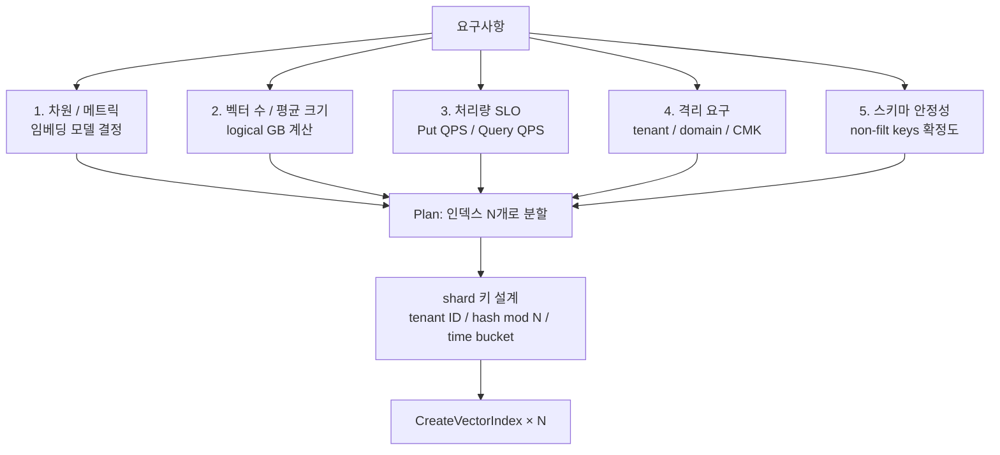
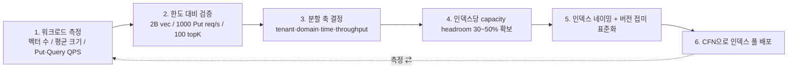

# S3 Vectors — Vector Index Capacity Planning

## 핵심 요약

S3 Vectors의 GA 한도는 **인덱스당 20억 벡터**, **버킷당 1만 인덱스** = **버킷당 최대 20조 벡터**다. 단일 인덱스 한도가 사실상 무한대에 가까워 AWS는 "**샤딩 없이 단일 인덱스로 통합 가능**"을 셀링 포인트로 내세운다. 하지만 **쓰기·쿼리 처리량 한도**(인덱스당 1,000 Put req/s 또는 2,500 vec/s, 수백 Query req/s)와 **메타 스키마 불변성** 때문에, 실제 운영에서는 **소유권·격리·처리량·스키마 변경 가능성**을 기준으로 인덱스 분할이 여전히 필요하다.

- **하드 한도**: 인덱스당 20억 벡터 / 버킷당 10K 인덱스 / 호출당 batch (Put 500 / Get 100 / Delete 500 / List 1000) / Top-K 100.
- **처리량 한도**: 인덱스당 1,000 Put req/s 또는 2,500 vec/s, 수백 Query req/s.
- **불변 파라미터**: dim / metric / non-filterable keys — 인덱스 생성 후 변경 불가.
- **분할 축**: 도메인 / 테넌트 / 처리량 / 스키마 변경 위험 / 보안 격리.

## 컴포넌트 다이어그램

## 적용 단계

## 핵심 기능 및 서비스

| 한도 | 값 | 영향 |
|---|---|---|
| 인덱스당 벡터 수 | **20억** | 사실상 코퍼스 상한 없음 |
| 버킷당 인덱스 수 | **10,000** | 멀티테넌트·도메인 분할 충분 |
| Put req/s/index | 1,000 | 고속 적재 시 인덱스 N 샤딩 강제 |
| Put vec/s/index | 2,500 | batch 묶음과 결합해 산출 |
| Query req/s/index | 수백 | 고QPS는 hot tier(OSS)로 이관 |
| Get/Delete batch | 100 / 500 | 일괄 운영 단위 |
| Top-K | **100** (GA) | 큰 후보군 필요 시 재랭킹 단계 |
| dim / metric / non-filt keys | 인덱스 생성 시 고정, 불변 | 변경 = 새 인덱스 + 재임베딩 |
| 가용 리전 (GA) | 14개 | 멀티 리전 배포 가능 |

## 유사 기술 비교

| 항목 | S3 Vectors | OSS Serverless | Pinecone Serverless | pgvector |
|---|---|---|---|---|
| 단일 인덱스 한도 | **20억** | OCU 의존 | 수십억 | 수천만 (실용) |
| 인덱스 수 한도 | 10K/bucket | 수백 collection | 수백 index | DB 자원 의존 |
| 샤딩 책임 | 사용자 (필요 시) | OCU가 자동 | 자동 | 사용자 |
| 처리량 확장 | 인덱스 추가 (수평) | OCU 추가 | 자동 | 인스턴스 수직 |
| 스키마 변경 | non-filt 키 불변 | 매핑 일부 변경 | 자유 | ALTER |

## 실제 사례

### TwelveLabs — 수십억 비디오 임베딩, 인덱스 분할
페타바이트 비디오 인텔리전스. 단일 코퍼스가 20억을 넘기지는 않지만 처리량·도메인(영화·스포츠·뉴스) 분리를 위해 다수 인덱스로 분할. 동일 dim·metric 표준화.

### AWS 공식 발표 — 25만 인덱스 / 400억 벡터 (프리뷰 4개월)
프리뷰 단계 고객들이 25만 인덱스를 생성. 평균 인덱스당 16만 벡터 — **인덱스 수가 많고 평균 크기가 작은** 분산 패턴이 우세함을 시사. 멀티테넌트·도메인 분리가 실제 운영에서 더 자주 채택.

### Bedrock KB의 자동 분할 부재
KB는 데이터 소스당 vector index 1개를 기본 생성 — 사용자가 도메인별 KB로 명시 분할해야 분산 효과 발생. **데이터 소스 1개에 도메인이 섞이면 처리량 / 스키마가 충돌**.

## 활용 시나리오

### 시나리오 1: 대용량 단일 코퍼스 (5억 벡터)
20억 한도 내. **단일 인덱스 가능**하지만 처리량·재인덱싱 위험을 고려해 4개 정도로 샤딩(hash mod 4). 검색 시 4개 병렬 + 머지. Top-K는 인덱스당 25씩 (총 100 보장).

### 시나리오 2: 멀티테넌트 SaaS (1000 테넌트, 평균 10만 벡터)
**테넌트당 인덱스 1개** + 인덱스별 CMK. 10K 한도 안에서 안전. 테넌트별 처리량·격리·삭제·청구 모두 깔끔.

### 시나리오 3: 시간 기반 분할 (연도별 인덱스)
컴플라이언스 코퍼스. `archive-2024`, `archive-2025`, `archive-2026` 인덱스. retention 정책이 인덱스 단위(연도 만료 시 DeleteVectorIndex). cross-year 검색은 multi-index query + 머지.

## 장단점 및 트레이드오프

| 항목 | 내용 |
|---|---|
| 장점 | (1) 단일 인덱스 한도가 매우 커 **샤딩이 선택**이 됨 (2) 인덱스 수 10K도 충분 — 멀티테넌트·도메인 자유 분할 (3) 인덱스 추가에 추가 인프라 비용 없음 — 분할 페널티 적음 (4) GA에서 Top-K 100으로 확장돼 후보군 수집 단계 단순화 |
| 단점 | (1) **처리량 한도가 인덱스 단위** — 고QPS는 결국 분할 강제 (2) 인덱스 파라미터 불변 → 잘못된 capacity 결정의 복구 비용 큼 (3) multi-index 쿼리는 앱 책임 (서비스가 federation 안 함) (4) FinOps 관점에서 인덱스 단위 비용 추적이 태깅 의존 |
| 트레이드오프 | "단일 통합 인덱스의 단순성" vs "분할로 얻는 처리량·격리·변경 안전성". AWS는 "샤딩 없이 통합 가능"을 강조하지만, 실제 운영에서는 격리·변경 위험 대응을 위해 분할이 자주 선택된다. |

## 함정 및 안티패턴

- **"20억 한도를 다 채워야 효율"**: 한도가 크다고 다 쓸 필요 없음. 처리량·격리·변경 위험이 더 중요한 분할 축. 한도 30~50% headroom 확보 권장.
- **차원 결정을 임베딩 PoC 전에**: 임베딩 모델을 바꾸면 차원이 바뀐다 — 인덱스 재생성 필요. 모델 선택을 capacity plan 첫 단계에.
- **non-filterable 키 부족 / 과다**: 10개 한도 내에서 정말 필요한 큰 payload 키만. 부족하면 인덱스 재생성, 과다하면 인덱스 메모리·비용 증가.
- **단일 인덱스에 모든 도메인 통합**: 한 도메인의 트래픽 폭증이 인덱스 처리량 한도에서 다른 도메인을 막음(noisy neighbor). **격리도 capacity 결정 요소**.
- **multi-index query를 동기 서비스 호출에서 직렬화**: 인덱스 N개 직렬 호출 = N배 latency. **병렬 호출 + 머지**가 기본.

## 참고 자료

- [Amazon S3 Vectors GA — AWS News Blog](https://aws.amazon.com/blogs/aws/amazon-s3-vectors-now-generally-available-with-increased-scale-and-performance/) — 한도 공식 (High)
- [Amazon S3 Vectors is now GA with 40× scale — AWS What's New](https://aws.amazon.com/about-aws/whats-new/2025/12/amazon-s3-vectors-generally-available/) — 한도 변화 (High)
- [S3 Vectors best practices — AWS Docs](https://docs.aws.amazon.com/AmazonS3/latest/userguide/s3-vectors-best-practices.html) — 처리량 가이드 (High)
- [Limitations and restrictions — AWS Docs](https://docs.aws.amazon.com/AmazonS3/latest/userguide/s3-vectors-limitations.html) — 모든 한도 (High)
- [Amazon S3 Vectors Key Improvements — Medium](https://medium.com/@servifyspheresolutions/amazon-s3-vectors-is-now-genrally-available-key-improvements-explained-4fe894757db4) — GA 한도 정리 (Mid)
- [AWS S3 Vectors GA — InfoQ](https://www.infoq.com/news/2026/01/aws-s3-vectors-ga/) — capacity 의미 (Mid)
- [AWS S3 upgrades 50 TB objects — Blocks & Files](https://blocksandfiles.com/2025/12/03/aws-s3/) — GA 컨텍스트 (Mid)
