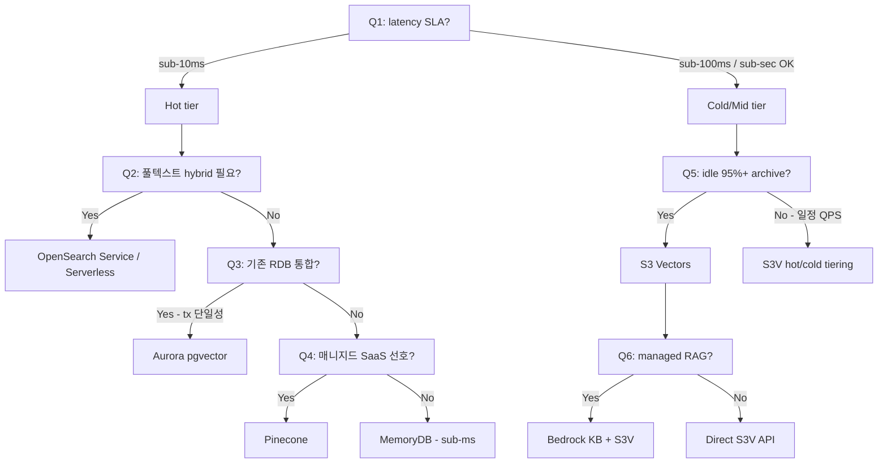
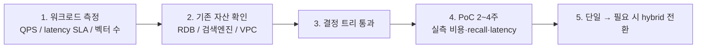

# Vector Store Decision Matrix — RAG용 벡터 DB 선택

## 핵심 요약

AWS 생태계에서 RAG 워크로드의 벡터 저장소는 **S3 Vectors / OpenSearch Service(+Serverless) / Aurora PostgreSQL pgvector / MemoryDB / Pinecone / DocumentDB / Neptune Analytics** 등으로 다양하다. 결정 축은 **(1) latency SLA, (2) 비용/idle, (3) 워크로드 빈도, (4) 검색 풍부도(풀텍스트·하이브리드), (5) 기존 RDB/검색엔진과의 통합, (6) 운영 부담**. **단일 정답 없음 — 워크로드 빈도 분포·SLA·기존 자산 기준으로 결정**.

- **Latency 영역**: sub-ms(MemoryDB) / sub-10ms(OSS) / sub-100ms(S3V) / sub-second(Kendra, Neptune).
- **Idle 비용 영역**: ~0(S3V) / 인스턴스 시간(pgvector, MemoryDB) / OCU 시간(OSS Serverless ~$350+/mo) / 월 최소(Pinecone $50+/mo).
- **AWS Prescriptive Guidance**: 공식 결정 가이드 존재. 의사결정 트리 기반.
- **하이브리드도 옵션**: cold=S3V + hot=OSS / Pinecone 조합이 표준 패턴.

## 컴포넌트 다이어그램 (결정 트리)

## 적용 단계

## 핵심 기능 및 서비스

| 옵션 | Idle | Latency | 강점 | 약점 | Best for |
|---|---|---|---|---|---|
| **S3 Vectors** | ~0 (Storage만) | sub-sec / ~100ms warm | 비용·대용량·매니지드 | 처리량 한도·튜닝 없음·필터 약함 | **cold archive RAG** |
| **OpenSearch Service (provisioned)** | 인스턴스 시간 | sub-10ms | hybrid 검색·풍부 DSL·GPU 가속 | 운영 복잡도 | hot·hybrid 검색 |
| **OpenSearch Serverless** | ~$350+/mo | sub-10ms | 매니지드 + hybrid | OCU 최소 비용 | hot·매니지드 |
| **Aurora pgvector** | DB 인스턴스 | 수십 ms | RDB tx 단일성·SQL | 수천만 벡터 한도 | RDB 통합 |
| **MemoryDB (vector)** | 인스턴스 | sub-ms | 최저 latency | 메모리 비용 | real-time AI |
| **Pinecone Serverless** | $50+/mo | 수십 ms | 매니지드 단순·튜닝 | AWS 외부 SaaS | 빠른 시작·운영 단순 |
| **Bedrock KB (관리)** | vector store 의존 | vector store 의존 | 매니지드 RAG 파이프라인 | tuning 자유도 ↓ | 매니지드 RAG |

## 유사 기술 비교

| 축 | S3 Vectors | OSS | Aurora pgvector | Pinecone |
|---|---|---|---|---|
| 운영 매니지드도 | 매우 높음 | 중간 | 중간 | 매우 높음 |
| 비용 효율 (cold) | **최상** | 낮음 | 중간 | 낮음 |
| 비용 효율 (hot) | 낮음 (처리량 차원) | 중간 | 중간 | 중간 |
| 검색 풍부도 | 기본 kNN + 거친 필터 | 풀 DSL + hybrid | SQL 통합 | 풍부 (in-algorithm filter) |
| 멀티테넌트 | 인덱스+CMK 분리 | collection / role | schema / row-level | namespace |
| Vendor lock-in | AWS | AWS | AWS / open standard | SaaS lock-in |

## 실제 사례

### AWS Prescriptive Guidance 결정 트리
공식 가이드는 latency SLA → 검색 풍부도 → 기존 자산 순으로 트리 구성. S3 Vectors는 "sub-100ms 허용 + cost-sensitive" 경로의 첫 옵션.

### Caylent — hybrid가 표준 패턴
순수 S3V만 추천하는 워크로드보다 hybrid(S3V + OSS) 추천 비율이 더 높음. PoC가 cold-only로 시작 → 사용량 늘면 hybrid 전환이 자연스러운 진화.

### HackerNoon 비교 — KB 백엔드 선택
Bedrock KB가 지원하는 S3V / OSS / PostgreSQL / Neptune Analytics 백엔드 비교. KB API는 동일하므로 백엔드 교체 가능 — **PoC 단계에서 백엔드 swap이 비교적 저렴**한 것이 KB의 장점.

### Cevo — "Beyond OpenSearch"
S3 Vectors가 OSS 대비 **비용 90% 절감**이라는 마케팅 외에 워크로드 분류 시 OSS도 여전히 필요한 영역을 명확히 분리. Hybrid 결정 가이드.

## 활용 시나리오

### 시나리오 1: 스타트업 PoC (1만~10만 벡터, QPS<1)
PoC 단계: **S3 Vectors + Bedrock KB**. 비용 거의 0, 운영 코드 0, 단일 API. 추후 사용량 증가 시 백엔드 교체.

### 시나리오 2: 실시간 추천 (1억 벡터, QPS 1000, 10ms SLA)
**OpenSearch Serverless (또는 Provisioned + GPU)**. S3V는 단일 인덱스 처리량 한도 + latency로 부적합. cold long-tail은 S3V hybrid로 보강.

### 시나리오 3: 기존 RDB 위 워크로드 (Aurora 사용 중, 1천만 벡터)
**Aurora pgvector**. tx 단일성·운영 단순·SQL 분석 통합. 1억 이상으로 커지면 외부 벡터 DB 분리 고려.

### 시나리오 4: 멀티테넌트 SaaS (테넌트당 인덱스)
**S3 Vectors + 테넌트별 CMK + Bedrock KB per tenant**. 10K 인덱스 한도 안에서 깔끔. hot 테넌트만 OSS로 promote.

## 장단점 및 트레이드오프

| 항목 | 내용 |
|---|---|
| 장점 (matrix) | (1) 워크로드 분류 기반의 명시적 선택 → 비용·SLA 예측 가능 (2) AWS 공식 가이드 + 커뮤니티 분석 풍부 (3) 하이브리드도 옵션이라 단계적 진화 가능 |
| 단점 (matrix) | (1) 옵션이 7개 이상이라 PoC 비교 비용 (2) 결정이 워크로드 빈도·SLA 측정에 의존 → 측정 없이 추측하면 오결정 (3) 운영 인력의 멀티 스택 학습 부담 |
| 트레이드오프 | "단일 표준화 vs 워크로드별 최적화". 표준화는 운영 단순, 최적화는 비용·성능. 작은 조직은 표준화(KB + S3V 또는 OSS) 권장, 큰 조직은 워크로드별 최적화. |

## 함정 및 안티패턴

- **첫 벤더 마케팅으로 결정**: "90% 절감"이 본인 워크로드에 적용된다고 가정 → cold 가정이 깨지면 비용 폭증.
- **모든 워크로드를 단일 벡터 DB로**: 워크로드 다양성이 큰 조직에서 단일 표준은 SLA·비용 모두에서 부적합.
- **결정 트리 없이 hybrid 도입**: hot/cold 비율 측정 없이 두 시스템 운영 부담만 가짐. **단일로 시작 → 측정 → hybrid 전환**.
- **PoC 비용을 운영 비용으로 추정**: PoC는 idle 거의 0, 운영은 QPS 누적. **운영 부하 시뮬레이션**이 PoC의 일부여야 함.
- **AWS 옵션만 검토**: Pinecone / Qdrant / Weaviate가 운영 단순성이나 in-algorithm filter 측면에서 강점일 수 있음. AWS는 자연스러운 통합·청구 단일성·VPC 통합에서 유리.

## 참고 자료

- [Vector database comparison — AWS Prescriptive Guidance](https://docs.aws.amazon.com/prescriptive-guidance/latest/choosing-an-aws-vector-database-for-rag-use-cases/vector-db-comparison.html) — 공식 비교표 (High)
- [Vector database options — AWS Prescriptive Guidance](https://docs.aws.amazon.com/prescriptive-guidance/latest/choosing-an-aws-vector-database-for-rag-use-cases/vector-db-options.html) — 옵션별 가이드 (High)
- [Dive deep into vector data stores using Bedrock KB — AWS ML Blog](https://aws.amazon.com/blogs/machine-learning/dive-deep-into-vector-data-stores-using-amazon-bedrock-knowledge-bases/) — KB 백엔드별 deep-dive (High)
- [Choosing the Right Vector Database on AWS — CloudThat](https://www.cloudthat.com/resources/blog/choosing-the-right-vector-database-on-aws-for-ai-and-ml-workloads) — 결정 가이드 (Mid)
- [AWS Vector Databases Part 3 — Dev.to](https://dev.to/aws-builders/aws-vector-databases-part-3-choosing-the-right-vector-database-on-aws-375m) — 옵션 분류 (Mid)
- [Bedrock KB: S3 Vector vs OpenSearch / PostgreSQL / Neptune — HackerNoon](https://hackernoon.com/aws-bedrock-knowledge-bases-comparing-s3-vector-store-vs-opensearch-postgresql-and-neptune) — KB 백엔드 비교 (Mid)
- [AWS Vector Store for RAG: Beyond OpenSearch — Cevo](https://cevo.com.au/post/aws-vector-store-for-rag-beyond-opensearch/) — 워크로드 분류 (Mid)
- [S3 Vectors 90% Cheaper Than Pinecone? Migration Guide — Dev.to](https://dev.to/dineshelumalai/s3-vectors-90-cheaper-than-pinecone-our-migration-guide-327c) — 마이그레이션 사례 (Mid)
