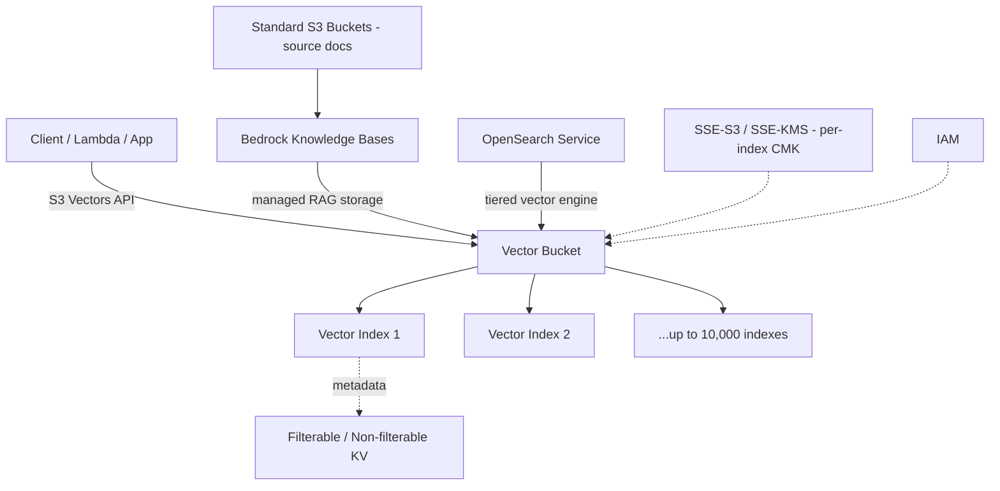
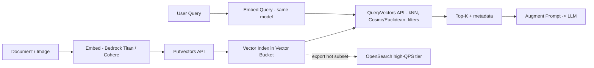

# Amazon S3 Vectors

## Core summary

Amazon S3 Vectors는 **S3 객체 스토리지에 네이티브로 벡터 임베딩을 저장·검색**할 수 있게 한 신규 스토리지 클래스로, 별도의 벡터 DB를 운영하지 않고도 S3 위에서 k-NN 유사도 검색을 수행한다. 2025년 7월 AWS Summit New York에서 프리뷰로 공개됐고, **2025-12-02 GA**되며 프리뷰 대비 규모가 40배 확장됐다. 핵심 포지셔닝은 "저비용·매니지드 벡터 스토리지" — 전용 벡터 DB 대비 최대 **90% 비용 절감**을 내세우며, 자주 질의되지 않는 대용량 RAG/시맨틱 검색 인덱스를 cold/warm 티어로 운영하기 위한 솔루션이다.

- **새로운 리소스 타입**: 일반 S3 버킷과 별개로 `vector bucket`이 생기고, 그 안에 `vector index`를 둠. 인프라 프로비저닝 없이 전용 API로 호출.
- **GA 스펙**: 인덱스당 최대 **20억 벡터**, 버킷당 최대 **10,000 인덱스** (프리뷰의 5천만/40배 확장).
- **레이턴시**: cold(저빈도) 쿼리 sub-second, 빈도 높은 쿼리 ~100ms 이하 (전용 벡터 DB보다는 10–50배 높은 레이턴시 영역).
- **통합**: Amazon Bedrock Knowledge Bases와 OpenSearch Service에 네이티브 통합, hot/cold 티어링 패턴 지원.

## System architecture

S3 Vectors는 일반 S3 버킷 옆에 별도 리소스 평면을 두는 구조다. 클라이언트는 전용 API로 vector bucket → vector index에 벡터를 넣고 질의하며, Bedrock KB / OpenSearch가 그 앞단에서 RAG 오케스트레이션과 hot-tier 검색을 담당한다.

## Processing flow

쓰기 경로는 임베딩 모델로 벡터를 만든 뒤 S3 Vectors API로 인덱스에 적재하고, 읽기 경로는 같은 모델로 쿼리를 임베딩해 k-NN 검색을 수행한다. 핫 워크로드만 OpenSearch로 이관하는 티어링이 권장 패턴.

## Core features and services

| Feature | Description |
|---|---|
| Vector bucket / Vector index | 새 리소스 타입. 일반 S3 버킷과 분리되어 벡터 전용 API로만 접근 |
| 규모 (GA 기준) | 인덱스당 최대 **20억 벡터**, 버킷당 최대 **10,000 인덱스** (프리뷰의 40배) |
| 거리 메트릭 | Cosine, Euclidean (k-NN 유사도 검색) |
| 메타데이터 | 키-값 쌍 첨부, 기본 filterable. **non-filterable key는 인덱스당 최대 10개**, 생성 후 변경 불가 |
| 레이턴시 | 저빈도 쿼리 sub-second, 빈번 쿼리 ~100ms 이하 (마케팅 기준) |
| 비용 | 스토리지 약 **$0.06/GB**, 쿼리 비용은 처리 데이터량에 비례 (호출 횟수 외에 처리량도 과금) |
| 암호화 | 기본 SSE-S3, 옵션 SSE-KMS (CMK), **인덱스별 전용 CMK** 지정 가능 |
| 가용 리전 (GA) | **14개 리전** (프리뷰의 5개에서 확장) |
| Bedrock KB 통합 | KB 생성 시 기존 S3 vector index 선택 또는 신규 생성. RAG 매니지드 경로 |
| OpenSearch 통합 | OpenSearch가 S3 Vectors를 vector engine으로 활용. tiered storage 패턴 (cold=S3, hot=OSS) |

## Similar technology comparison

| 항목               | Amazon S3 Vectors                               | Amazon OpenSearch Serverless (vector) | Pinecone (Serverless)                 | Aurora PostgreSQL + pgvector |
| ---------------- | ----------------------------------------------- | ------------------------------------- | ------------------------------------- | ---------------------------- |
| 모델               | 객체 스토리지 위의 매니지드 벡터 인덱스                          | 분산 검색 엔진 위의 벡터 검색                     | 전용 매니지드 벡터 DB                         | 관계형 DB의 확장                   |
| 인덱스당 최대 벡터       | **20억**                                         | 사실상 워크로드 / OCU 한정                     | 수십억 (티어별)                             | 수백만 ~ 수천만(실용)                |
| 레이턴시             | cold sub-sec, hot ~100ms (전용 DB 대비 10–50배 high) | 수~수십 ms                               | 수~수십 ms                               | 수십 ms                        |
| 가격 (개략)          | 스토리지 $0.06/GB + 쿼리 처리량 과금                       | OCU $0.24/h, 프로덕션 최소 ~$350/mo         | 최소 $50/mo, 워크로드별 $70–280/mo (≤10M 벡터) | 인스턴스 비용 (소규모는 매우 저렴)         |
| 처리량 한계           | **쓰기 <2MB/s**, hot 쿼리 ~200 QPS에서 천장 보고          | OCU 수에 따라 수평 확장                       | 자동 스케일                                | 단일 인스턴스 한계                   |
| Recall           | ~85–90%, **필터 적용 시 50% 이하로 떨어질 수 있음**, 튜닝 노브 없음 | HNSW/IVF 튜닝 가능                        | 튜닝 가능                                 | HNSW/IVFFlat 튜닝 가능           |
| Top-K            | 최대 **30**                                       | 제약 거의 없음                              | 제약 거의 없음                              | 제약 거의 없음                     |
| 하이브리드 검색 / 멀티테넌시 | 미지원                                             | 지원                                    | 지원 (네임스페이스)                           | 직접 구현                        |
| 적합 케이스           | **콜드 RAG 인덱스, 아카이브 시맨틱 검색, 비용 우선**              | **고QPS / 저지연 / 풀 텍스트+벡터 하이브리드**       | 운영 단순성·빠른 PoC                         | ≤10M 벡터, RDB와 한 트랜잭션         |

## Real-world cases

### TwelveLabs — 페타바이트 규모 비디오 인텔리전스
TwelveLabs는 비디오 파운데이션 모델을 프로덕션 시스템으로 전환하며 수십억 개의 임베딩을 S3 Vectors에 저장. "팀이 득점 후 환호하는 클립" 같은 자연어 쿼리를 같은 임베딩 공간으로 변환해 ANN 검색을 수행하고, 정확한 타임스탬프·비디오 ID를 반환하는 비디오 검색을 구현.

### Qlik — 분석/데이터 통합 제품의 전사 시맨틱 검색
Qlik은 수억 개 벡터와 다수 인덱스를 S3 Vectors에 적재하고 **OpenSearch를 앞단**에 두는 hybrid/tiered 구성으로, 자사 데이터 카탈로그·분석 제품 전반의 엔티티에 대한 시맨틱 검색을 제공.

### March Networks — 비디오/사진 인텔리전스 아카이브
March Networks는 대규모 비디오·사진 인덱스를 S3 Vectors로 저비용 운영. "수십억 개의 벡터를 경제적으로 저장하면서도 받아들일 만한 레이턴시"라는 트레이드오프를 명시적으로 선택한 사례.

### AWS 공식 발표 수치 (preview 4개월간)
프리뷰 기간 동안 고객들이 **25만+ 벡터 인덱스를 생성**하고 **400억+ 벡터를 적재**, **10억+ 쿼리**를 수행 — 초기 도입 속도가 빠른 신규 서비스 카테고리임을 보여줌.

## Use scenarios

### Scenario 1: 대용량 문서 아카이브에 대한 저빈도 시맨틱 검색
컴플라이언스·법무 문서, 과거 운영 매뉴얼 등 분기에 몇 번 검색되는 코퍼스. 항상 띄워두는 OpenSearch Serverless의 ~$350/mo 최소 비용이 부담이라면, Bedrock Titan V2로 임베딩 → S3 Vectors index에 적재 → Bedrock KB의 `Retrieve` API로 호출. cold sub-second 레이턴시면 충분.

### Scenario 2: Hot/Cold 티어드 RAG (OpenSearch + S3 Vectors)
최근 30일 문서는 OpenSearch Serverless에 두고 고QPS·저지연 응대, 그 이전은 S3 Vectors로 콜드 티어 운용. OpenSearch의 S3 Vectors engine 통합을 사용하면 단일 검색 API로 hot/cold를 묶을 수 있음.

### Scenario 3: 미디어 인텔리전스 — 이미지/비디오 임베딩 아카이브
Bedrock의 Titan Multimodal Embeddings G1로 이미지·키프레임을 임베딩하고 S3 Vectors index에 적재. 수억~수십억 규모의 미디어 카탈로그를 경제적으로 보관하고, 자연어/이미지 쿼리로 유사 콘텐츠를 검색.

## Pros and Cons & Trade-off

| Item | Detail |
|---|---|
| Pros | (1) **비용 최대 90% 절감** (대용량 / 저빈도 워크로드에서 특히 큼) (2) **인프라 프로비저닝 불필요** — vector bucket/index만 생성 (3) **인덱스당 20억 벡터**, 사실상 RAG 코퍼스 상한 걱정 없음 (4) Bedrock KB·OpenSearch 네이티브 통합으로 RAG 파이프라인 표준화 (5) 인덱스별 KMS CMK로 멀티테넌트 / 컴플라이언스 친화적 |
| Cons | (1) **쓰기 < 2MB/s**, hot 쿼리 ~200 QPS 천장 — 고처리량·저지연 워크로드 부적합 (2) Cold 쿼리 1M 벡터 ~500ms, 10M ~700ms — 대화형 응대엔 한계 (3) Recall 85–90% 수준, **튜닝 노브 없음** (4) **Top-K 최대 30, 하이브리드 검색·멀티테넌시 미지원** (5) Non-filterable metadata key 최대 10개, 인덱스 생성 후 변경 불가 — 스키마 결정이 1회성 (6) 일부 메트릭은 14개 리전만 가용 |
| Trade-off | "저비용·매니지드 스토리지" vs. "저지연·고QPS·풍부한 검색 기능"의 명시적 교환. 한 인덱스로 모든 RAG를 처리하려 하지 말고, **hot subset은 OpenSearch / Pinecone**, **cold + archive는 S3 Vectors**로 나누는 hybrid 아키텍처가 AWS도 권장하는 표준 패턴. |

## Pitfalls / Anti-patterns

- **고QPS 대화형 챗봇의 단일 인덱스로 사용**: hot 쿼리 ~200 QPS 천장, cold 수백 ms 레이턴시 → 사용자 응대 SLO 위반. **OpenSearch hot tier로 분리**하거나 캐시 레이어 추가.
- **메타데이터를 나중에 추가하려는 설계**: non-filterable key는 인덱스 생성 후 변경 불가, 인덱스당 10개 제한 → 인덱싱 전에 필터 스키마를 먼저 확정.
- **필터 조합으로 정밀 검색을 기대**: 필터 적용 시 **recall 50% 이하**로 떨어지는 사례 보고 → 필터링은 거친 분리(예: tenant ID, 언어)에만 사용하고, 의미 기반 추가 필터는 LLM 후처리/재랭킹으로.
- **모델 교체 후 인덱스 재사용**: Titan ↔ Cohere ↔ OpenAI 임베딩은 호환되지 않음 → 인덱스 단위로 모델을 잠그고, 교체 시 별도 인덱스로 재임베딩(앞 노트 [[fl-2026-06-02-aws-bedrock-embedding]]에서도 동일 경고).
- **Top-K > 30 의존**: API가 30에서 막힘 → 큰 후보군이 필요한 RAG는 multi-query 분할 후 머지하거나 OpenSearch로 이관.
- **대량 배치 인덱싱을 단일 인덱스로 한 번에**: 쓰기 처리량 < 2MB/s 제약 → 다중 인덱스 병렬화 또는 미리 청킹·압축. 대규모 신규 적재 시 SLA 계획에 반영.

## References

- [Amazon S3 Vectors — product page (AWS)](https://aws.amazon.com/s3/features/vectors/) — 공식 제품 소개 (High)
- [Amazon S3 Vectors now generally available — AWS News Blog](https://aws.amazon.com/blogs/aws/amazon-s3-vectors-now-generally-available-with-increased-scale-and-performance/) — GA(2025-12-02) 공식 발표, 40배 확장 (High)
- [Introducing Amazon S3 Vectors (Preview) — AWS News Blog](https://aws.amazon.com/blogs/aws/introducing-amazon-s3-vectors-first-cloud-storage-with-native-vector-support-at-scale/) — 2025-07 프리뷰 공개 (High)
- [Working with S3 Vectors and vector buckets — AWS Docs](https://docs.aws.amazon.com/AmazonS3/latest/userguide/s3-vectors.html) — vector bucket/index API 공식 문서 (High)
- [S3 Vectors best practices — AWS Docs](https://docs.aws.amazon.com/AmazonS3/latest/userguide/s3-vectors-best-practices.html) — 메타데이터·인덱스 설계 가이드 (High)
- [Using S3 Vectors with Amazon Bedrock Knowledge Bases — AWS Docs](https://docs.aws.amazon.com/AmazonS3/latest/userguide/s3-vectors-bedrock-kb.html) — Bedrock KB 통합 (High)
- [Advanced search with S3 vector engine on OpenSearch — AWS Docs](https://docs.aws.amazon.com/opensearch-service/latest/developerguide/s3-vector-opensearch-integration-engine.html) — OpenSearch tiered 패턴 (High)
- [Vector database options — AWS Prescriptive Guidance](https://docs.aws.amazon.com/prescriptive-guidance/latest/choosing-an-aws-vector-database-for-rag-use-cases/vector-db-options.html) — AWS 권장 벡터 DB 선택 가이드 (High)
- [Optimize agent tool selection using S3 Vectors and Bedrock KB — AWS Storage Blog](https://aws.amazon.com/blogs/storage/optimize-agent-tool-selection-using-s3-vectors-and-bedrock-knowledge-bases/) — 에이전트 RAG 사례 (High)
- [TwelveLabs case study — AWS](https://aws.amazon.com/solutions/case-studies/twelvelabs-case-study/) — 페타바이트 비디오 인텔리전스 사례 (High)
- [Amazon S3 Vectors GA reaches "Storage-First" RAG — InfoQ](https://www.infoq.com/news/2026/01/aws-s3-vectors-ga/) — GA 의미·업계 반응 (Mid)
- [AWS claims 90% vector cost savings — VentureBeat](https://venturebeat.com/data-infrastructure/aws-claims-90-vector-cost-savings-with-s3-vectors-ga-calls-it-complementary) — 90% 비용 절감 주장과 분석가 시각 (Mid)
- [AWS S3 Vectors Latency Analysis — Murray Cole](https://murraycole.com/posts/aws-s3-vectors-latency-analysis) — 100~1M 벡터 레이턴시 벤치 (Mid)
- [Architecting GenAI at Scale with S3 Vector Store — Caylent](https://caylent.com/blog/architecting-gen-ai-at-scale-lessons-from-aws-s-3-vector-store-and-the-nuances-of-hybrid-vector-storage) — hybrid 벡터 스토리지 패턴 (Mid)
