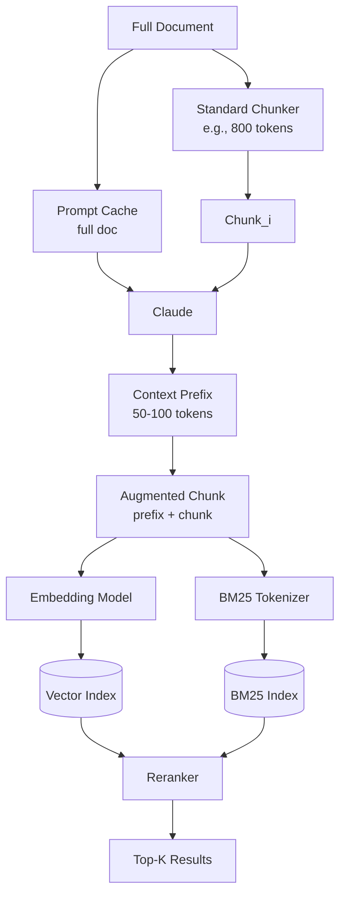

# Context-aware Chunking — Contextual Retrieval (Anthropic) focus

## 핵심 요약

Contextual Retrieval은 Anthropic이 2024년 9월 발표한 RAG 전처리 기법으로, 각 chunk를 임베딩하기 전에 **LLM(Claude)이 생성한 50–100 토큰의 문서 컨텍스트 prefix**를 부착한다. chunk 단독으로는 부족한 문맥(누가, 어디서, 어떤 문서의 일부인지)을 보강해 retrieval 정확도를 끌어올린다.

- **두 인덱스 동시 구축**: Contextual Embeddings(벡터)와 Contextual BM25(키워드) 양쪽에 동일 prefix 적용 → 의미·키워드 검색 모두 강화
- **Prompt caching이 비용 핵심**: 전체 문서를 캐시해 chunk 수만큼 반복 호출 시 비용을 ~90% 절감, 백만 토큰당 약 $1.02
- **Reranking과 결합 시 효과 극대화**: Contextual Retrieval 단독 49% 실패율 감소, reranker 결합 시 67% 감소(Anthropic 측정)

> 다른 Context-aware Chunking 전략은 `[[fl-2026-06-02-context-aware-chunking-overview]]` 참조.

## 컴포넌트 다이어그램

## 적용 단계

## 핵심 기능 및 서비스

| 기능 | 설명 |
|---|---|
| Contextual Embeddings | chunk에 LLM 생성 context prefix를 붙여 임베딩, 의미 검색 정확도 향상 |
| Contextual BM25 | 동일 prefix를 BM25 인덱스에도 적용, 키워드 검색 누락 보완 |
| Prompt Caching 활용 | 전체 문서를 한 번 캐시, chunk 수만큼 호출 시 캐시된 토큰은 90% 할인 |
| Hybrid Search Fusion | vector 유사도와 BM25 점수를 결합(예: Reciprocal Rank Fusion) |
| Reranking layer | 1차 검색 결과 상위 K개를 cross-encoder로 재순위 |
| Cookbook 구현 가이드 | Claude Cookbook의 contextual-embeddings 가이드에서 end-to-end 코드 제공 |

## 유사 기술 비교

| 항목 | Contextual Retrieval | Semantic Chunking | Late Chunking |
|---|---|---|---|
| 특징 | LLM이 chunk별 문맥 prefix 생성 | 임베딩 유사도로 동적 분할 | 전체 문서 임베딩 후 토큰 풀링으로 chunk 임베딩 |
| 장점 | 검색 실패율 최대 67% 감소, 키워드+의미 동시 강화 | 의미 경계 보존, 임플리먼테이션 단순 | LLM 추론 비용 없음, cross-reference 보존 |
| 단점 | chunk마다 LLM 호출(caching으로 완화), 인덱싱 시간↑ | 임베딩 호출 비용, threshold 튜닝 | 긴 컨텍스트 임베딩 모델 필요(예: Jina v3) |
| 적합 케이스 | 고가치 문서, 법률·금융, 컴플라이언스 | 산문, 블로그, 학술 | cross-reference 많은 문서, 대규모 |

## 임베딩 모델 호환성

Contextual Retrieval은 청크 앞에 LLM이 생성한 **컨텍스트 prefix 50~100 토큰을 추가**한 뒤 임베딩한다. 따라서 임베딩 모델의 max_seq가 확장 청크를 수용해야 하며, BM25와의 hybrid 결합에도 강한 모델이 적합하다.

### 호환성 좋은 임베딩 모델

| 모델 | 차원 / max tokens | 호환 이유 |
|---|---|---|
| `voyage-3-large` | 1024 / 32K | Anthropic Cookbook 권장 모델. 청크+컨텍스트 prefix 여유 수용 |
| `text-embedding-3-large` | 3072 / 8191 | 의미 정확도 + 8K max_seq로 확장 청크 안전 |
| `bge-m3` | 1024 / 8192 | 다국어 + sparse(BM25) 병행 — Contextual Retrieval의 BM25 결합 권장 흐름과 정합 |
| `cohere embed-multilingual-v3` | 1024 / 512 | 짧은 청크 + 짧은 prefix일 때만 — max_seq 512 한계 주의 |

### 추천되지 않는 임베딩 모델

| 모델 | 차원 / max tokens | 비추천 이유 |
|---|---|---|
| `multilingual-e5-large` | 1024 / 512 | 컨텍스트 prefix 추가로 빈번히 잘림 → 전략의 핵심 가정 깨짐 |
| `all-MiniLM-L6-v2` | 384 / 256 | 청크+prefix가 256 초과 — prefix 손실로 retrieval 정확도 저하 |
| `text-embedding-ada-002` | 1536 / 8191 | max_seq는 충분하나 BM25 hybrid에서 신모델 대비 retrieval 품질 후행 |

> Contextual Retrieval은 **청크 자체보다 50~100토큰 긴 입력**이 임베딩에 들어가므로, max_seq 512 이하 모델은 prefix가 잘리며 전략이 무효화된다.

## 실제 사례

### Anthropic 공식 발표 (2024-09)
Codebases, scientific papers, fiction 등 9개 데이터셋 평가에서 Contextual Embeddings 단독으로 retrieval 실패율 35% 감소, Contextual BM25 결합 시 49%, reranking 추가 시 67% 감소를 보고했다. 100만 문서 토큰당 약 $1.02의 contextualization 비용을 공개했다.

### Anthropic Cookbook 구현
공식 cookbook(`platform.claude.com/cookbook/capabilities-contextual-embeddings-guide`)에서 prompt caching을 활용한 비용 절감 코드와 함께 ParagraphChunker → Claude 호출 → 임베딩의 end-to-end 파이프라인을 제공한다.

### LlamaIndex Contextual Retrieval Cookbook
LlamaIndex는 자사 framework에 맞춘 Contextual Retrieval 예제를 공개. `ContextualRetriever` 형태로 wrapping해 기존 vector index와 호환 가능하게 노출한다.

## 활용 시나리오

### 시나리오 1: 법률·계약 문서 RAG
**맥락**: 조항 간 cross-reference(예: "제3조에서 정의한 바에 따라")가 많은 계약서.
**선택 이유**: 단일 chunk만으로는 "어떤 계약의 어떤 조항인지" 모호. context prefix가 결정적이다.
**구체적 적용**: 조항 단위 분할 → 각 chunk에 "이 조항은 X 계약 Y조의 일부로, 앞 조항에서 정의한 Z를 참조" 형식 prefix를 Claude로 생성 → Contextual Embeddings + Contextual BM25 + cross-encoder reranker.

### 시나리오 2: 사내 컴플라이언스/감사 자료
**맥락**: 부서·연도·규제 종류가 다양한 정책 문서.
**선택 이유**: chunk에 "어떤 부서·연도·규정"인지 명시되지 않으면 잘못된 문서가 검색됨.
**구체적 적용**: 문서 메타데이터(부서, 연도, 규정 ID)를 Claude prompt에 함께 주어 prefix를 생성, retrieval 시 metadata filter와 결합.

### 시나리오 3: 코드 저장소 + 문서 통합 검색
**맥락**: API reference, tutorial, source code를 한 인덱스에서 검색.
**선택 이유**: 함수 코드 chunk만으로는 "어떤 모듈의 어떤 책임"인지 모호.
**구체적 적용**: 모듈 README와 함수 docstring을 prompt cache에 적재, 각 함수 본문에 대해 "이 함수는 X 모듈의 Y 기능을 담당, 호출자는 Z" prefix를 생성.

## 장단점 및 트레이드오프

| 항목 | 내용 |
|---|---|
| 장점 | retrieval 실패율 최대 67% 감소, hybrid(vector + BM25) 동시 강화, prompt caching으로 비용 통제 |
| 단점 | 인덱싱 시 LLM 호출 필요(지연·비용), prefix 품질이 prompt 설계에 의존, 문서 갱신 시 재처리 비용 |
| 트레이드오프 | 인덱싱 비용 vs 검색 품질. 자주 갱신되는 문서는 ROI가 낮고, 안정적·고가치 문서일수록 ROI가 높다 |

## 함정 및 안티패턴

- **prompt caching 미사용**: 매 chunk마다 전체 문서를 prompt에 포함시키며 cache 활용 없이 호출 → 비용 10배 이상 증가. 반드시 `cache_control: ephemeral`로 문서 블록을 캐시
- **BM25 인덱스 생략**: Contextual Embeddings만 적용하고 BM25를 빼면 키워드 누락 사례 보완 불가 → 두 인덱스 모두 구축할 것
- **prefix 길이 폭주**: 50–100 토큰 가이드라인을 무시하고 200+ 토큰 prefix를 붙임 → chunk 본문이 임베딩 신호에서 희석. prompt에 분량 제약 명시
- **자주 갱신되는 문서에 적용**: 매일 변경되는 문서에 contextual augmentation을 매번 재실행 → 운영 비용 폭증. delta indexing 또는 hybrid 적용 권장
- **reranker 누락**: Anthropic 측정의 67% 감소는 reranker 결합 결과. reranker 없이 49%에 만족하지 말 것

## 참고 자료

- [Anthropic — Introducing Contextual Retrieval](https://www.anthropic.com/news/contextual-retrieval) — 공식 발표, 메트릭과 방법론
- [Claude Cookbook — Contextual Embeddings Guide](https://platform.claude.com/cookbook/capabilities-contextual-embeddings-guide) — 공식 구현 가이드와 코드
- [LlamaIndex Contextual Retrieval Cookbook](https://developers.llamaindex.ai/python/examples/cookbooks/contextual_retrieval/) — LlamaIndex 통합 예제
- [DataCamp — Anthropic's Contextual Retrieval: A Guide With Implementation](https://www.datacamp.com/tutorial/contextual-retrieval-anthropic) — 단계별 튜토리얼
- [Instructor — Implementing Contextual Retrieval with Async Processing](https://python.useinstructor.com/blog/2024/09/26/implementing-anthropics-contextual-retrieval-with-async-processing/) — 비동기 처리 패턴
- [GitHub — contextual-retrieval-by-anthropic](https://github.com/RionDsilvaCS/contextual-retrieval-by-anthropic) — 오픈소스 구현 예
