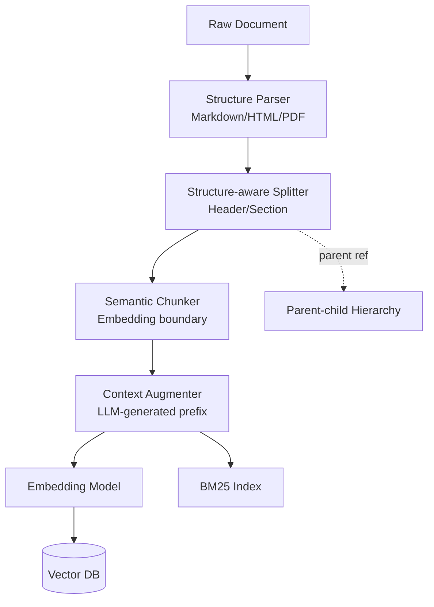
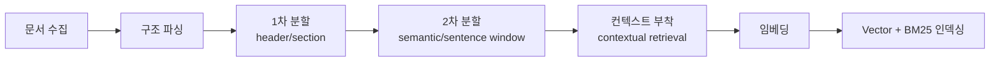

# Context-aware Chunking — Overview

## 핵심 요약

Context-aware Chunking은 문서를 단순 토큰/문자 수가 아니라 **의미·구조·문맥 경계**를 인식해 분할하는 RAG 전처리 기법 집합이다. naive fixed-size chunking이 문장 중간을 자르거나 헤더·표를 깨뜨려 검색 품질을 떨어뜨리는 문제를 해결한다.

- **스펙트럼 위에서 선택**: 가장 저렴한 fixed-size부터 LLM이 직접 분할 위치를 결정하는 agentic chunking까지 비용·품질 trade-off가 존재한다
- **다층 전략 결합이 표준**: 2026년 기준 단일 전략보다 structure-aware → semantic → contextual retrieval을 순차 또는 병렬 적용하는 하이브리드가 우세
- **도메인이 전략을 결정**: 표/구조화 문서는 structure-aware, 산문은 semantic, cross-reference가 많은 문서는 contextual 또는 late chunking이 적합

## 컴포넌트 다이어그램

Context-aware Chunking은 단일 알고리즘이 아니라 여러 기법이 stack을 이루는 구성이다.

## 적용 단계

문서 한 건이 vector store에 도달하기까지의 일반화된 파이프라인.

## 핵심 기능 및 서비스

| 기능 | 설명 |
|---|---|
| Structure-aware splitting | Markdown 헤더, HTML 태그, PDF layout 등 문서 구조 단위로 1차 분할 |
| Semantic boundary detection | 인접 문장 임베딩 코사인 유사도로 토픽 전환점 탐지 |
| Hierarchical / parent-child | 큰 chunk(parent)와 작은 chunk(child)를 동시에 보존, 검색은 child, 생성은 parent 컨텍스트 |
| Sentence window | 문장 단위 인덱싱 후 검색 시 좌우 N문장 윈도우 확장 |
| Contextual prefix augmentation | LLM이 각 chunk에 50–100 토큰 문서 요약을 prefix로 부착 |
| Late chunking | 긴 문서를 통째로 임베딩한 후 토큰 단위 풀링으로 chunk 임베딩 생성 (cross-reference 보존) |

## 유사 기술 비교

| 항목 | Context-aware Chunking | Fixed-size Chunking | Agentic / LLM Chunking |
|---|---|---|---|
| 특징 | 구조·의미 경계 인식 | 고정 토큰/문자 수 분할 | LLM이 분할점 결정 |
| 장점 | 검색 품질↑, 도메인 적응 | 구현·연산 비용 최저 | 가장 정교, 도메인 룰 학습 |
| 단점 | 파이프라인 복잡도, 일부 LLM 비용 | 의미 경계 파괴, 표·코드 깨짐 | 대규모 LLM 호출 비용 |
| 적합 케이스 | 프로덕션 RAG, 기술 문서, 구조화 문서 | 프로토타이핑, 균질한 짧은 문서 | 고가치·소량 문서, 법률·의료 |

## 임베딩 모델 호환성

Context-aware Chunking은 하위 전략(Semantic / Structure-aware / Contextual Retrieval)마다 청크 길이 분포·임베딩 활용 방식이 다르므로, 단일 임베딩 모델을 권장하기보다 **하위 전략별 매트릭스**로 정리한다.

### 호환성 좋은 임베딩 모델 (전략별)

| 하위 전략 | 추천 임베딩 | 호환 이유 |
|---|---|---|
| Semantic Chunking | `text-embedding-3-large`, `bge-m3`, `voyage-3-large`, `KURE-v1` | 청킹·인덱싱 동일 모델로 분포 일치, 의미 분리 정확도 SOTA |
| Structure-aware | `text-embedding-3-large`(8K), `voyage-3-large`(32K), `bge-m3`(8K), `jina-embeddings-v3`(Matryoshka) | 헤딩 단위 큰 청크(1K~4K) 안전 수용 |
| Contextual Retrieval | `voyage-3-large`(Anthropic Cookbook 권장), `text-embedding-3-large`, `bge-m3` | 청크 + 컨텍스트 prefix 50~100토큰을 안전히 수용 |

### 추천되지 않는 임베딩 모델 (공통)

| 모델 | 차원 / max tokens | 비추천 이유 |
|---|---|---|
| `multilingual-e5-large` | 1024 / 512 | structure-aware 헤딩 청크·contextual prefix에서 자주 잘림 |
| `all-MiniLM-L6-v2` | 384 / 256 | 의미 정확도·max_seq 모두 부족, semantic 경계 오탐 다발 |
| `cohere embed-english-v3.0` | 1024 / 512 | structure-aware의 큰 섹션 청크에 부족 |
| `text-embedding-ada-002` | 1536 / 8191 | 신모델 대비 의미 정확도 후행 — semantic chunking 신규 도입 비권장 |

> Context-aware의 성능 향상은 **청크 길이·prefix 가정이 임베딩 max_seq 안에 들어올 때**만 실현된다. 짧은 max_seq 모델과 결합 시 전략의 핵심 가정이 깨진다.

## 실제 사례

### Anthropic Claude
2024년 9월 Contextual Retrieval 발표. Claude로 각 chunk에 문서 컨텍스트 prefix를 생성, prompt caching으로 비용을 백만 토큰당 약 $1.02 수준으로 절감. Contextual Embeddings + Contextual BM25 + reranking 조합으로 검색 실패율을 최대 67% 감소시킨 결과를 공개했다.

### Microsoft Azure AI Search
Document Layout Skill을 통한 문서 레이아웃 인식 chunking을 정식 기능으로 제공. PDF/Office 문서의 표·헤더·섹션을 인식해 구조 단위로 분할 후 vectorize하는 파이프라인을 매니지드 서비스로 노출.

## 활용 시나리오

### 시나리오 1: 기술 문서 RAG (Markdown 기반)
**맥락**: 사내 개발 문서(Markdown, 수만 페이지)에 대한 QA 챗봇.
**선택 이유**: Markdown 헤더 구조가 명확해 1차로 구조 분할이 가장 ROI가 높다.
**구체적 적용**: `MarkdownHeaderTextSplitter`로 H1~H3 단위 분할 → 너무 큰 섹션은 semantic chunker로 2차 분할 → 코드 블록은 별도 chunk로 분리.

### 시나리오 2: 표·차트가 많은 PDF 보고서
**맥락**: 분기 재무 보고서, IR 자료 등 표 중심 PDF.
**선택 이유**: 표는 의미 경계가 명확하므로 구조 인식이 핵심. 본문 산문은 semantic이 보완.
**구체적 적용**: layout-aware parser(예: Unstructured, LlamaParse)로 표를 별도 노드화하고 caption + header row로 임베딩, 산문 섹션은 SentenceWindowNodeParser로 처리.

### 시나리오 3: 법률/계약서 cross-reference 처리
**맥락**: 조항 간 참조가 빈번한 계약·법령 문서.
**선택 이유**: chunk가 단독으로는 의미 불완전(예: "이 조항에서..."). Contextual Retrieval 또는 late chunking이 필요.
**구체적 적용**: 조항 단위 1차 분할 후 Anthropic Contextual Retrieval로 문서 요약 prefix 부착, Contextual BM25와 vector search 병행 후 reranker로 통합.

## 장단점 및 트레이드오프

| 항목 | 내용 |
|---|---|
| 장점 | 검색 정확도 개선(실패율 최대 49–67% 감소), 도메인 적응성, 산문·표·코드 혼합 문서 처리 |
| 단점 | 파이프라인 복잡도 증가, contextual augmentation은 LLM 호출 비용 발생, 평가·튜닝 코스트 |
| 트레이드오프 | 품질 vs 비용·지연. 단순 문서에는 over-engineering 위험. 프로토타이핑은 fixed-size로 시작 후 단계적 도입 권장 |

## 함정 및 안티패턴

- **무지성 semantic 적용**: 균질한 짧은 문서(FAQ 등)에 semantic chunker를 쓰면 효과는 미미한데 임베딩 호출 비용만 증가 → 먼저 fixed-size 또는 recursive로 baseline 측정 후 비교
- **구조 무시**: Markdown/HTML을 raw text로 취급해 헤더·표를 깨뜨림 → structure-aware splitter를 stack 최상단에 둘 것
- **chunk size 단일값 고정**: 모든 도메인에 한 사이즈 사용 → parent-child hierarchy로 다중 granularity 보존
- **평가 누락**: 청킹 전략 변경의 검색 품질 영향을 측정하지 않음 → recall@k, MRR 등 지표로 A/B 비교 필수

## 참고 자료

- [Anthropic — Introducing Contextual Retrieval](https://www.anthropic.com/news/contextual-retrieval) — Anthropic 공식 발표, 49–67% 검색 실패 감소
- [Claude Cookbook — Contextual Embeddings Guide](https://platform.claude.com/cookbook/capabilities-contextual-embeddings-guide) — 구현 가이드와 코드 예제
- [Azure AI Search — Chunk and Vectorize by Document Layout](https://learn.microsoft.com/en-us/azure/search/search-how-to-semantic-chunking) — Microsoft 공식 layout-aware chunking
- [LlamaIndex — Node Parser Modules](https://developers.llamaindex.ai/python/framework/module_guides/loading/node_parsers/modules/) — Markdown/HTML/Hierarchical parser 공식 문서
- [IBM Think — Chunking strategies for RAG with LangChain](https://www.ibm.com/think/tutorials/chunking-strategies-for-rag-with-langchain-watsonx-ai) — 전략 비교와 코드 튜토리얼
- [Max–Min semantic chunking for RAG (Springer 2025)](https://link.springer.com/article/10.1007/s10791-025-09638-7) — 의미 경계 탐지 알고리즘 학술 논문
