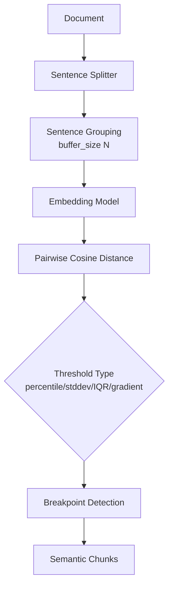

# Context-aware Chunking — Semantic Chunking focus

## 핵심 요약

Semantic Chunking은 인접 문장 또는 문장 그룹의 **임베딩 벡터 유사도**를 측정해 토픽 전환이 일어나는 지점에서 문서를 분할하는 기법이다. fixed-size 방식이 의미와 무관한 위치에서 자르는 문제를 해결한다.

- **분할 기준은 코사인 거리**: 인접 문장 임베딩 간 코사인 유사도가 임계치 아래로 떨어지면 boundary로 판정
- **threshold 결정 방식 다양**: percentile / standard deviation / interquartile / gradient 등 통계 기반 임계치 선택 가능
- **임베딩 비용이 1차 코스트**: 모든 문장을 임베딩해야 하므로 fixed-size 대비 임베딩 호출이 N배 증가

> 전체 Context-aware Chunking 전략 비교는 `[[fl-2026-06-02-context-aware-chunking-overview]]` 참조.

## 컴포넌트 다이어그램

## 적용 단계

## 핵심 기능 및 서비스

| 기능 | 설명 |
|---|---|
| `breakpoint_threshold_type` | `percentile`(기본), `standard_deviation`, `interquartile`, `gradient` 등 임계치 결정 방식 |
| `breakpoint_threshold_amount` | 임계치 수치 (예: percentile 95 = 상위 5% 거리에서 분할) |
| `buffer_size` | 문장을 몇 개씩 묶어 임베딩할지 (작을수록 세밀, 클수록 거시적) |
| `number_of_chunks` | 목표 chunk 수를 지정하면 threshold 자동 조정 |
| `min_chunk_size` | 최소 chunk 토큰 수 제한, 과도하게 짧은 chunk 방지 |
| Multimodal 확장 | 텍스트 외에 표/이미지 캡션 임베딩으로 cross-modal 경계 탐지 (연구 단계) |

## 유사 기술 비교

| 항목 | Semantic Chunking | Recursive Character Splitter | Sentence Window |
|---|---|---|---|
| 특징 | 임베딩 유사도로 동적 boundary | 구분자 우선순위 기반 재귀 분할 | 문장 단위 인덱싱 + 검색 시 윈도우 확장 |
| 장점 | 의미 응집도 최고, 동적 chunk 크기 | 빠르고 결정적, 임베딩 불필요 | 검색 단위는 작게, 컨텍스트는 풍부 |
| 단점 | 임베딩 호출 비용, 도메인별 threshold 튜닝 | 의미 경계 무시 가능 | 인덱스·메타데이터 크기 증가 |
| 적합 케이스 | 토픽 전환이 잦은 산문, 블로그, 학술 논문 | 균질한 문서, 프로토타이핑 | QA, 정확한 fact-lookup |

## 임베딩 모델 호환성

Semantic 청킹은 **임베딩 모델 자체가 청크 경계를 결정**한다. 따라서 청킹용·인덱싱용 임베딩의 **분포 일치(동일 모델 권장)** 와 **의미 분리 정확도**가 결합 적합도를 좌우한다.

### 호환성 좋은 임베딩 모델

| 모델 | 차원 / max tokens | 호환 이유 |
|---|---|---|
| `text-embedding-3-large` | 3072 / 8191 | 의미 분리 정확도 SOTA. 청킹·인덱싱 동일 모델로 분포 일치 |
| `bge-m3` | 1024 / 8192 | dense 의미 분리력 + 다국어. 청킹·인덱싱 통합 운영 적합 |
| `voyage-3-large` | 1024 / 32K | 의미 정확도 + 긴 컨텍스트로 가변 청크 안전 수용 |
| `KURE-v1` | 1024 / 8192 | 한국어 의미 경계 검출 정확도 우위 |

### 추천되지 않는 임베딩 모델

| 모델 | 차원 / max tokens | 비추천 이유 |
|---|---|---|
| `text-embedding-ada-002` | 1536 / 8191 | Kamradt 영상의 시연 모델이지만 의미 정확도가 3-small/large 대비 후행 — 신규 도입 비권장 |
| `all-MiniLM-L6-v2` | 384 / 256 | 의미 임베딩 정확도가 낮아 경계 오탐 다발, 청크 단위 깨짐 |
| `multilingual-e5-base` | 768 / 512 | 한국어 의미 분리 정확도가 e5-large·bge-m3 대비 떨어짐 |

> Semantic chunking은 **청킹용·인덱싱용 임베딩을 동일 모델로 통일**해야 분포 일치가 보장된다. 약한 임베딩은 청킹·인덱싱 모두에 누적 손실을 만든다.

## 실제 사례

### LangChain SemanticChunker
`langchain-experimental` 패키지에서 제공되며 OpenAI `text-embedding-3-small` 등과 결합해 사용한다. 2026년 기준 core 패키지 이전 논의가 진행 중. percentile / standard deviation / interquartile / gradient 네 가지 threshold 모드를 지원한다.

### LlamaIndex SemanticSplitterNodeParser
연속한 문장을 buffer 단위로 묶어 임베딩하고 코사인 거리로 분할. `SentenceWindowNodeParser`와 조합해 "의미 단위 분할 + 검색 시 윈도우 확장" 하이브리드 패턴이 권장된다.

### Max–Min Semantic Chunking (Springer 2025 논문)
연속 문장 쌍의 유사도가 아니라 chunk 내 최소 유사도(min)와 chunk 간 최대 유사도(max)를 동시에 최적화하는 알고리즘. naive percentile 대비 retrieval recall@10 개선을 보고.

## 활용 시나리오

### 시나리오 1: 토픽 전환이 잦은 블로그/뉴스 RAG
**맥락**: 한 글에 여러 주제가 섞인 콘텐츠.
**선택 이유**: fixed-size는 한 주제 중간을 자르거나 두 주제를 한 chunk에 묶어 검색 noise를 만든다.
**구체적 적용**: `SemanticChunker(threshold_type="percentile", amount=95)` 기본값으로 시작, recall@k 측정 후 90/85로 낮춰가며 튜닝.

### 시나리오 2: 학술 논문 RAG
**맥락**: 한 논문 안에 introduction / method / result 등 명확한 토픽 블록.
**선택 이유**: 섹션 헤더만으로는 부족하고, 같은 method 안에서도 sub-method 전환이 일어남.
**구체적 적용**: structure-aware로 섹션 분할 후 각 섹션 내부에서 SemanticSplitterNodeParser로 2차 semantic 분할.

### 시나리오 3: 고객 지원 트랜스크립트
**맥락**: 한 통화에 여러 이슈가 섞인 콜센터 transcript.
**선택 이유**: 화자 전환과 토픽 전환이 일치하지 않음. 임베딩 거리로 토픽 전환을 잡아야 한다.
**구체적 적용**: 화자 단위 1차 분할 → buffer_size=3으로 묶어 semantic boundary 탐지 → 짧은 chunk는 min_chunk_size로 병합.

## 장단점 및 트레이드오프

| 항목 | 내용 |
|---|---|
| 장점 | 동적 chunk 크기, 의미 응집도 우수, 토픽 전환 명확한 문서에서 retrieval 품질↑ |
| 단점 | 모든 문장 임베딩 호출 → 인덱싱 비용·시간 증가, 도메인별 threshold 튜닝 필요, 균질 문서에서 효과 미미 |
| 트레이드오프 | 임베딩 비용 vs 검색 품질. 인덱싱은 1회, 검색은 N회이므로 검색 트래픽이 많을수록 ROI↑ |

## 함정 및 안티패턴

- **default threshold 맹신**: percentile 95가 모든 도메인에 최적이 아님 → 도메인별 hold-out set으로 grid search
- **structure-aware 생략**: Markdown 헤더를 무시하고 semantic만 적용 → 명확한 구조 정보 손실. structure-aware 뒤에 semantic을 쌓을 것
- **너무 작은 buffer_size**: buffer=1로 문장 단위만 보면 자연스러운 문장 연결까지 boundary로 잘림 → 보통 buffer=2~3
- **min_chunk_size 미설정**: 단문 인터뷰 등에서 1~2 문장짜리 chunk가 양산되어 임베딩 품질 저하

## 참고 자료

- [LangChain SemanticChunker — DeepWiki](https://deepwiki.com/langchain-ai/langchain-experimental/3.2-semanticchunker) — 구현·옵션 상세
- [LlamaIndex Semantic Chunker (Developer Docs)](https://developers.llamaindex.ai/python/examples/node_parsers/semantic_chunking/) — `SemanticSplitterNodeParser` 공식 예제
- [Max–Min Semantic Chunking for RAG (Springer 2025)](https://link.springer.com/article/10.1007/s10791-025-09638-7) — 학술 알고리즘 비교
- [Chunking Techniques with LangChain and LlamaIndex (LanceDB Blog)](https://blog.lancedb.com/chunking-techniques-with-langchain-and-llamaindex/) — 실전 비교
- [Best Chunking Strategies for RAG 2026 (Firecrawl)](https://www.firecrawl.dev/blog/best-chunking-strategies-rag) — 2026 trend 정리
- [LangChain Issue #35553 — SemanticChunker core migration 논의](https://github.com/langchain-ai/langchain/issues/35553) — 패키지 이관 현황
