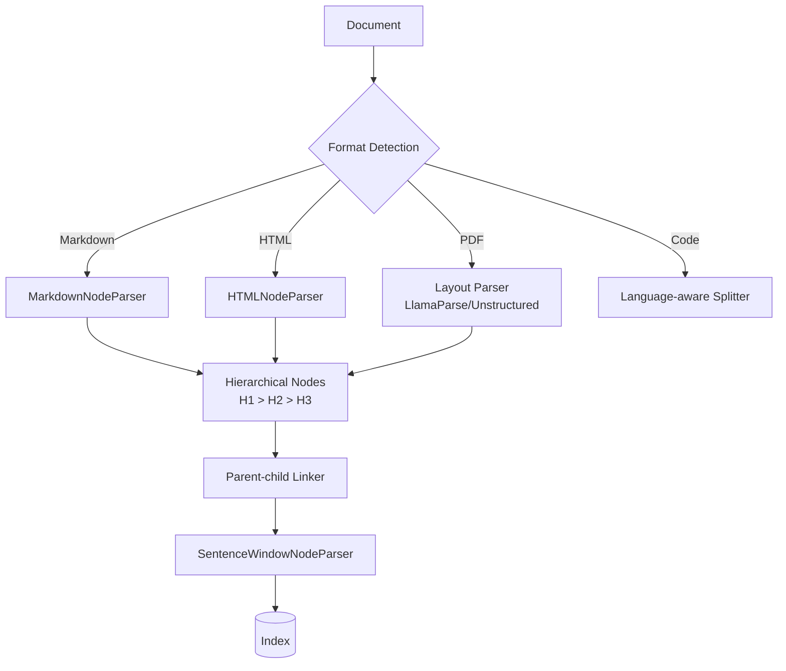

# Context-aware Chunking — Document-structure Aware focus

## 핵심 요약

Document-structure Aware Chunking은 Markdown 헤더, HTML 태그, PDF layout, 코드 클래스/함수 등 **문서의 명시적 구조**를 인식해 분할하는 기법이다. 구조가 명확한 문서에서 가장 ROI가 높은 1차 선택지이며, 다른 기법(semantic, contextual)의 상위 stack으로 자주 결합된다.

- **명시적 boundary 활용**: 헤더·태그·페이지 break 같은 결정적 신호로 분할 → 임베딩 호출 없이 의미 경계 확보
- **계층 구조 보존**: parent(섹션)–child(문단/문장) 관계를 메타데이터로 유지해 retrieval 시 컨텍스트 복원 가능
- **검색-생성 비대칭**: child chunk로 정밀 검색하고 parent 또는 sentence window로 LLM에 넓은 컨텍스트 제공

> 다른 Context-aware Chunking 전략은 `[[fl-2026-06-02-context-aware-chunking-overview]]` 참조.

## 컴포넌트 다이어그램

## 적용 단계

## 핵심 기능 및 서비스

| 기능 | 설명 |
|---|---|
| `MarkdownHeaderTextSplitter` (LangChain) / `MarkdownNodeParser` (LlamaIndex) | H1~H6 헤더 단위로 분할, 헤더 경로를 메타데이터로 저장 |
| `HTMLNodeParser` | BeautifulSoup 기반, 지정한 태그 집합(h1~h6, p, li 등)으로 분할 |
| `HierarchicalNodeParser` | 여러 chunk size를 동시에 생성, parent-child 관계 자동 부여 |
| `SentenceWindowNodeParser` | 문장 단위 인덱싱 + 검색 시 좌우 N문장 윈도우로 컨텍스트 확장 |
| `UnstructuredElementNodeParser` | Unstructured 라이브러리로 PDF/Office의 표·이미지·텍스트 요소 분리 |
| Azure Document Layout Skill | 매니지드 PDF/Office layout-aware chunking 파이프라인 |
| Language-aware code splitter | Python/JS 등 AST 기반 클래스·함수 단위 분할 |

## 유사 기술 비교

| 항목 | Structure-aware | Semantic Chunking | Recursive Character Splitter |
|---|---|---|---|
| 특징 | 문서 구조 신호 활용 | 임베딩 유사도 | 구분자 우선순위 재귀 |
| 장점 | 결정적, 빠름, 표·코드 보존 | 산문 의미 응집 | 단순, 의존성 없음 |
| 단점 | 비구조 텍스트에 적용 어려움 | 임베딩 비용 | 의미 경계 무시 |
| 적합 케이스 | Markdown 문서, 기술 docs, PDF 보고서, 코드 | 토픽 전환 잦은 산문 | 균질한 짧은 문서 |

## 임베딩 모델 호환성

Structure-aware 청킹은 헤딩·섹션·코드블록 단위로 가변 길이를 형성하며 **단일 청크가 1K~4K 토큰까지 커질 수 있다**. 따라서 **긴 max_seq**가 호환 결정의 1차 변수다.

### 호환성 좋은 임베딩 모델

| 모델 | 차원 / max tokens | 호환 이유 |
|---|---|---|
| `text-embedding-3-large` | 3072 / 8191 | 섹션 단위 큰 청크 안전 수용 + 의미 정확도 |
| `voyage-3-large` | 1024 / 32K | 헤딩 단위가 매우 큰 enterprise PDF/매뉴얼에 적합 |
| `bge-m3` | 1024 / 8192 | 다국어 + 8K max_seq로 대부분의 섹션 수용 |
| `jina-embeddings-v3` | 1024 / 8192 | Matryoshka로 큰·작은 청크 모두 차원 조절 가능 |

### 추천되지 않는 임베딩 모델

| 모델 | 차원 / max tokens | 비추천 이유 |
|---|---|---|
| `multilingual-e5-large` | 1024 / 512 | 섹션 청크가 빈번히 512 초과 → 헤딩 단위 의미 보존 실패 |
| `cohere embed-english-v3.0` | 1024 / 512 | max_seq 512로 헤딩 섹션 단위에 자주 부족 |
| `all-MiniLM-L6-v2` | 384 / 256 | max_seq 한계로 구조 청킹의 장점 무효 |

> Structure-aware는 **max_seq ≥ 8K 모델** 결합이 핵심. 짧은 컨텍스트 모델과 결합 시 헤딩 단위가 잘리면서 구조 인식 효과가 소실된다.

## 실제 사례

### Microsoft Azure AI Search
`Document Layout Skill`로 PDF의 표·헤더·페이지 break를 인식해 chunk를 생성하는 매니지드 파이프라인을 정식 제공. layout 정보를 chunk 메타데이터로 보존해 검색 결과에서 원본 위치 복원이 가능하다.

### LlamaIndex Hierarchical + Sentence Window 패턴
공식 cookbook에서 큰 parent(2048 토큰), 중간 child(512 토큰), 작은 grandchild(128 토큰) 3단 계층을 만들고 검색은 grandchild로, 생성은 parent로 보내는 패턴을 권장. 토큰 효율과 정확도 동시 개선을 보고했다.

## 활용 시나리오

### 시나리오 1: 사내 Markdown 위키 RAG
**맥락**: 수만 페이지 Markdown 기술 문서.
**선택 이유**: H1~H3 구조가 잘 정리되어 있어 별도 의미 분석 없이도 양질의 chunk를 얻을 수 있다.
**구체적 적용**: `MarkdownHeaderTextSplitter`로 H2 단위 분할 → 2048 토큰 초과 시 recursive로 2차 분할 → 헤더 경로를 chunk metadata에 보존해 reranker가 활용.

### 시나리오 2: 표·차트 포함 PDF 보고서
**맥락**: 분기 IR 자료, 의료 임상 시험 보고서.
**선택 이유**: 표 행을 raw text로 자르면 의미가 깨진다. 표는 별도 chunk로, 본문은 별도로 처리해야 한다.
**구체적 적용**: LlamaParse 또는 Unstructured로 layout 추출 → 표는 caption + header row를 description으로 임베딩 → 본문 산문은 SentenceWindowNodeParser.

### 시나리오 3: 코드베이스 검색
**맥락**: 모노레포 코드 검색·QA 봇.
**선택 이유**: 함수/클래스 경계로 자르지 않으면 부분 함수가 chunk가 되어 LLM이 잘못 추론한다.
**구체적 적용**: Python AST 또는 tree-sitter 기반 splitter로 클래스·함수 단위 분할 → docstring과 함수 본문을 별도 metadata field로 저장 → 함수 호출 그래프를 parent-child로 연결.

## 장단점 및 트레이드오프

| 항목 | 내용 |
|---|---|
| 장점 | 결정적·고속, 임베딩 비용 없음, 표·코드·이미지 보존, 메타데이터 풍부 |
| 단점 | 비구조 텍스트(필사본, OCR 저품질 PDF)에 한계, 포맷별 파서 유지보수 부담 |
| 트레이드오프 | 구현 단순성 vs 포맷 커버리지. 한 파서로 모든 문서를 처리하려는 욕심이 fragile pipeline을 만든다. 포맷별 라우팅이 보통의 정답 |

## 함정 및 안티패턴

- **Markdown을 raw text로 처리**: `RecursiveCharacterTextSplitter`만 쓰고 헤더를 무시 → 헤더 정보 손실, chunk 검색 시 컨텍스트 부족. 반드시 `MarkdownHeaderTextSplitter`를 stack 앞단에 둘 것
- **표 행 단위 chunk**: PDF 표를 행 단위 텍스트로 자름 → 한 행은 컨텍스트가 없음. 표 전체 또는 caption + header + body 묶음을 하나의 chunk로
- **parent-child 메타데이터 폐기**: 계층 파서로 만든 뒤 child만 인덱싱하고 parent 참조를 버림 → 검색 시 컨텍스트 복원 불가
- **OCR 저품질에 layout parser 강제**: 저품질 스캔 PDF는 layout 인식 실패율이 높아 NULL chunk 양산. 사전 OCR 품질 평가 후 fallback으로 fixed-size 사용

## 참고 자료

- [LlamaIndex Node Parser Modules](https://developers.llamaindex.ai/python/framework/module_guides/loading/node_parsers/modules/) — Markdown/HTML/Hierarchical/SentenceWindow parser 공식
- [LlamaIndex Markdown Node Parser API](https://developers.llamaindex.ai/python/framework-api-reference/node_parsers/markdown/) — API 레퍼런스
- [Azure AI Search — Chunk and Vectorize by Document Layout](https://learn.microsoft.com/en-us/azure/search/search-how-to-semantic-chunking) — Microsoft 공식 layout-aware
- [IBM Think — Chunking strategies for RAG](https://www.ibm.com/think/tutorials/chunking-strategies-for-rag-with-langchain-watsonx-ai) — 구조 기반 vs 의미 기반 비교
- [Document Chunking for RAG: 9 Strategies (LangCopilot)](https://langcopilot.com/posts/2025-10-11-document-chunking-for-rag-practical-guide) — 2026 실전 가이드
- [Milvus — Document segmentation in LlamaIndex](https://milvus.io/ai-quick-reference/how-do-i-handle-document-segmentation-in-llamaindex) — 계층 분할 패턴
