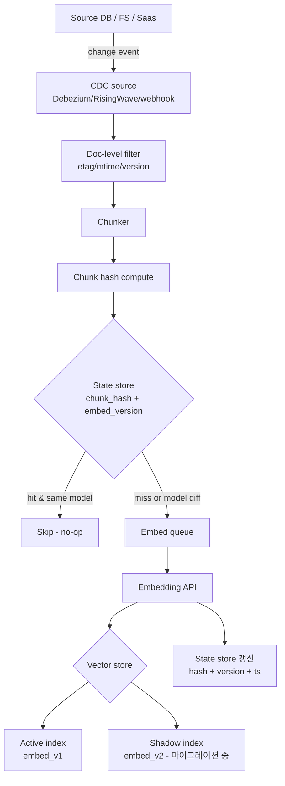
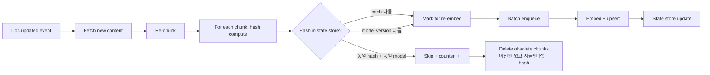

# Embedding Ingestion Pipeline - Incremental / CDC ingestion

## 핵심 요약

본 노트는 ingestion 파이프라인의 두 번째 어려움인 **변경 감지·증분 재임베딩·모델 업그레이드 시 마이그레이션**에 집중. 전체 흐름은 [[fl-2026-06-02-embedding-ingestion-pipeline-overview]] 참조.

- **2026 핵심 전환**: nightly batch 전체 재임베딩 → **chunk-level CDC + content hash 기반 incremental**로 재처리율 85-95% → 10-15%로 감소(LiveVectorLake 보고). embedding 비용 80-90% 절감.
- **CDC 인프라 단순화**: Debezium + Kafka + Flink 풀스택 → RisingWave가 `CREATE SOURCE` 한 문장 + 내장 `openai_embedding()` 함수로 대체. PostgreSQL WAL을 직접 구독.
- **Re-embedding 두 갈래**: (1) **Shadow Deployment** — embedding_v2 컬럼 추가 후 dual-write, backfill 완료 후 cut-over (정통, 안전, 비용 2배 일시). (2) **Drift-Adapter** (arXiv 2509.23471) — old/new embedding 사이의 작은 변환 layer 학습으로 recall 95-99% 보존, recompute 100x 절감.
- **변경 감지의 3단 위계**: 문서 단위(파일 mtime/etag) → chunk 단위(content hash) → 의미 단위(embedding distance threshold). 의미 단위까지 가면 hash가 같아도 surrounding context 변경 시 재임베딩 가능.

## 시스템 아키텍처

incremental ingestion의 핵심은 **state store(어떤 doc/chunk가 어떤 model version으로 적재됐는지)** 와 **변경 이벤트 source(file watcher, webhook, CDC log)** 의 결합.

## 처리 흐름

문서 1건이 변경됐을 때의 incremental 재처리 흐름. **chunk 수준에서 변경 분기**가 핵심.

## 핵심 기능 및 서비스

| 기능 | 설명 |
|---|---|
| Change source | DB CDC(Debezium/RisingWave), file watcher(S3 EventBridge, GCS notifications), webhook(Notion/Confluence/GitHub) |
| Chunk content hash | SHA-256(chunk_text + chunker_config). chunker 변경 시에도 hash 다르게 나오도록 config 포함 |
| State store | `(doc_id, chunk_index) → {chunk_hash, embed_model, embed_version, ts}`. PostgreSQL/Redis/DynamoDB |
| Deletion handling | re-chunk 후 사라진 hash는 vector store에서 delete. tombstone 운영도 옵션 |
| Re-embedding trigger | (1) chunk hash diff, (2) embed_model version diff, (3) 명시적 reindex 요청 |
| Shadow index | 새 model의 embedding을 별도 컬럼/index에 dual-write. cut-over까지 둘 다 운영 |
| Drift-Adapter | 작은 변환 layer(Procrustes/Low-Rank Affine/Residual MLP)를 paired old/new sample로 학습. <10μs latency 추가로 신구 space 호환 |
| Reindex orchestrator | model 업그레이드/chunker 변경/dimension 변경 시 전체 재임베딩 job 실행. Batch API 활용 |

## 유사 기술 비교

| 항목 | Nightly full re-index | Doc-level incremental | Chunk-level CDC (content hash) | Drift-Adapter (model upgrade) |
|---|---|---|---|---|
| 재처리율 | 100% (전체) | 변경된 doc의 모든 chunk | 변경된 chunk만(10-15%) | 0% (recompute 회피) |
| Freshness | nightly | 변경 후 분~시간 | 1-2초 | 즉시(query-time 변환) |
| 비용 | 매우 높음 | 중 | 낮음 (90% 절감) | 매우 낮음 (recompute 100x↓) |
| 운영 복잡도 | 낮음 | 중 | 중상(state store + CDC) | 중(adapter 학습 + 배포) |
| Recall 손실 | 0% | 0% | 0% | 1-5% (95-99% 회복) |
| 적합 케이스 | <10K doc, 변경 적음 | doc 단위 변경 중심 | chunk 일부 수정 빈번 | embedding model 업그레이드 |

## 실제 사례

### RisingWave - SQL 한 문장 CDC + 내장 embedding
RisingWave는 PostgreSQL WAL을 직접 구독하는 `CREATE SOURCE` + 내장 `openai_embedding()` 함수를 `CREATE MATERIALIZED VIEW` 안에 두는 패턴을 제시. 문서 row가 update되면 materialized view가 자동으로 changed chunk만 재계산해 vector store sink로 전달. Debezium + Kafka + Flink + custom worker 풀스택을 SQL 한 문장으로 대체.

### Debezium 2026 - vector embedding generation in CDC events
Debezium 2026 release notes는 change event 처리 파이프라인 내부에서 embedding API를 호출해 vector를 함께 생성·전달하는 기능을 정식 지원. CDC source가 row의 before/after를 모두 가지고 있어 **변경 폭이 충분한지(예: text similarity threshold)** 를 판단 후 embedding API 호출 여부를 결정하는 cost-aware 패턴이 가능.

### LiveVectorLake (arXiv 2601.05270) - chunk-level CDC 성능
LiveVectorLake는 chunk-level CDC를 적용해 평균 10-15% chunk만 재처리(표준 upsert 85-95% 대비). 변경 이벤트 → 검색 가능까지 평균 1.2-1.8초 latency. corpus 1B+ scale에서 nightly batch 대비 embedding 비용 88% 절감 보고.

### Drift-Adapter (EMNLP 2025, arXiv 2509.23471)
text-embedding 모델 업그레이드 시 신·구 embedding space 사이에 작은 변환 layer(Procrustes/Low-Rank Affine/Residual MLP)를 학습. 기존 ANN index 그대로 사용 가능. CLIP 1M item 업그레이드 실험에서 full re-embedding 대비 recall 95-99% 회복, recompute 비용 100x 절감, query latency <10μs 추가. Qdrant의 embedding migration tutorial이 이 접근 일부 인용.

## 활용 시나리오

### 시나리오 1: 사내 위키 / Notion 통합 (변경 빈도 중, freshness 분 단위)
**선택**: Notion webhook → SQS → embedding worker. doc 단위 변경 감지 + chunk-level hash로 재처리율 최소화.
**이유**: webhook이 doc id를 주므로 doc 단위 fetch + re-chunk + chunk hash 비교가 자연스러움. 분 단위 freshness 충족 + 변경 chunk만 처리해 비용 80%+ 절감.

### 시나리오 2: PostgreSQL DB row 기반 streaming RAG (sub-second)
**선택**: RisingWave `CREATE SOURCE` + `openai_embedding()` 내장 함수 + materialized view → S3 Vectors/Qdrant sink.
**이유**: PostgreSQL을 source of truth로 운영 중인 조직에서 별도 ingestion worker 없이 SQL 한 문장으로 변경 감지·embedding·sink 완결. 1-2초 freshness.

### 시나리오 3: Embedding model 업그레이드 (text-embedding-3 → Voyage 3-large)
**선택**: (A) 비용 무관·정합성 우선 → Shadow Deployment(dual-write embedding_v2 + Batch API로 backfill + cut-over). (B) 즉시 효과 + 비용 최소 → Drift-Adapter 학습 후 query-time 변환.
**이유**: 1억 chunk × $0.06/M × ~200 token = $1200 backfill. 일시 운영 부담을 안고 Shadow로 가는 게 표준. 비용 예산 부족 또는 즉시 효과 필요 시 Drift-Adapter로 1-5% recall 손실 감수.

## 장단점 및 트레이드오프

| 항목 | 내용 |
|---|---|
| 장점 | **비용 90% 절감 가능**: 변경 chunk만 재임베딩. **Freshness 초 단위**: webhook/CDC + streaming 파이프라인으로 batch 한계 돌파. **Model 업그레이드 비용 회피**: Drift-Adapter로 100x recompute 절감. |
| 단점 | **State store 운영 필수**: hash + version 추적 인프라가 추가됨. **CDC 인프라 의존**: Debezium·Kafka·RisingWave 중 1개 도입 필요. **삭제 처리 까다로움**: re-chunk 후 사라진 hash 정리(tombstone vs hard delete)를 명시적으로 설계. |
| 트레이드오프 | **재처리율 ↔ 정합성**: chunk hash만으로는 surrounding context 변경 미반영, 의미 거리 threshold까지 가면 정합성↑ 비용↑. **Shadow Deployment ↔ Drift-Adapter**: 비용·복잡도(Shadow) vs 즉시성·recall 손실 1-5%(Drift). **doc-level ↔ chunk-level CDC**: 운영 단순(doc) vs 비용 절감(chunk). |

## 함정 및 안티패턴

- **Hash에 chunker config 미포함**: chunker 파라미터(chunk_size, overlap, separator) 변경 시 hash가 동일하게 나와 stale chunk가 남음 → hash 입력에 chunker config의 stable signature 포함.
- **embed_model version을 vector에 기록하지 않음**: 업그레이드 진행 중에 어떤 vector가 신/구인지 식별 불가 → metadata에 `embed_model`, `embed_version`, `embed_ts` 필수 기록.
- **삭제된 chunk를 vector store에서 정리하지 않음**: 검색 결과에 사라진 내용이 계속 노출 → re-chunk 후 사라진 hash는 delete 처리. soft delete + 주기적 컴팩션도 옵션.
- **Doc-level만 CDC하고 chunk-level hash 생략**: doc 한 줄 수정에도 전체 chunk 재임베딩 → chunk hash로 변경 chunk만 선별 필수.
- **모든 변경을 즉시 재임베딩**: 띄어쓰기 한 칸 차이로도 비용 발생 → text similarity threshold(예: Jaccard 0.95)로 사소한 변경은 skip.
- **Model 업그레이드를 in-place로 진행**: Voyage 3-large로 일부만 갱신된 상태에서 query가 OpenAI dim 1536으로 들어와 검색 실패 → Shadow Deployment 또는 Drift-Adapter로 cut-over 시점 명확화.
- **Backfill을 sync API로**: 1억 chunk re-embedding을 sync로 보내면 비용 2배 + rate limit 직격 → Batch API(50% off) + 시간 분산.
- **State store를 vector DB 자체에 두기**: vector DB의 메타데이터 필터 성능이 hash 조회 부하 감당 못 함 → state store는 PostgreSQL/Redis 같은 OLTP에 분리.

## 참고 자료

- [RisingWave - RAG Architecture in 2026: How to Keep Retrieval Actually Fresh](https://risingwave.com/blog/rag-architecture-2026/) - CREATE SOURCE + 내장 openai_embedding(), nightly batch 안티패턴화
- [Debezium - What Nobody Explains About Debezium in 2026](https://debezium.io/blog/2026/05/22/what-nobody-explains-about-debezium-2026/) - CDC event 내 embedding 생성, before/after 활용한 cost-aware 재임베딩
- [arXiv - LiveVectorLake: Real-Time Versioned Knowledge Base Architecture](https://arxiv.org/html/2601.05270) - chunk-level CDC 10-15% 재처리율, 1.2-1.8s latency
- [arXiv - Drift-Adapter: Near Zero-Downtime Embedding Model Upgrades (2509.23471)](https://arxiv.org/abs/2509.23471) - 신·구 embedding 변환 layer, recompute 100x 절감, recall 95-99% 회복
- [Qdrant Docs - Migrate to a New Embedding Model](https://qdrant.tech/documentation/tutorials-operations/embedding-model-migration/) - shadow deployment 가이드
- [Medium (Google Cloud) - Migrating vector embeddings in production without downtime](https://medium.com/google-cloud/migrating-vector-embeddings-in-production-without-downtime-8a0464af6f55) - dual-write + cut-over 패턴
- [Decompressed - I Updated My Embedding Model and My RAG Broke: A Post-Mortem](https://decompressed.io/learn/rag-observability-postmortem) - in-place upgrade 장애 사례
- [Medium - Different Embedding Models, Different Spaces: Hidden Cost of Model Upgrades](https://medium.com/data-science-collective/different-embedding-models-different-spaces-the-hidden-cost-of-model-upgrades-899db24ad233) - embedding space 비호환성
- [DBI Services - RAG Series: Embedding Versioning with pgvector](https://www.dbi-services.com/blog/rag-series-embedding-versioning-with-pgvector-why-event-driven-architecture-is-a-precondition-to-ai-data-workflows/) - event-driven 전제 필요성
