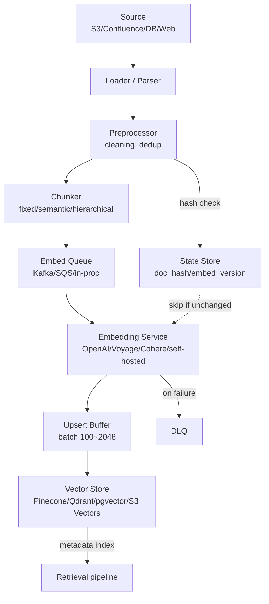
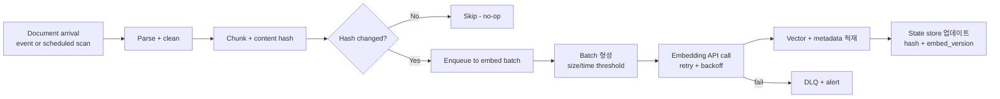

# Embedding Ingestion Pipeline - Overview

## 핵심 요약

RAG의 ingestion 단계는 **원본 문서 → chunking → embedding 생성 → vector store 적재**의 4단 파이프라인. 본 노트는 4축(모델 / 배치 / 적재 / incremental)을 균형 있게 다루는 **개론**이며, 각 축의 심화는 sibling 노트로 분기.

- **2026 기준 표준화된 흐름**: ingestion과 retrieval 파이프라인을 **물리적으로 분리**하는 것이 production 사고를 가장 많이 줄이는 단일 결정. ingestion은 throughput, retrieval은 latency 중심.
- **모델 다양화**: Voyage 3-large(품질) · OpenAI text-embedding-3(범용) · Cohere embed-v4(다국어 + rerank) · Gemini(저비용 $0.006/M) · Jina v3(long doc) 중 워크로드별 선택.
- **Streaming RAG로의 전환**: batch 야간 재인덱스 → **변경 감지 기반 streaming 재인덱스**가 2026의 default. nightly 배치는 stale embedding과 중복 비용으로 인해 안티패턴화.
- **Idempotency 필수**: chunk content hash를 key로 사용해 재실행이 no-op이 되도록 설계.

## 시스템 아키텍처

ingestion 파이프라인은 5개 컴포넌트 + 외부 의존성(embedding API, vector DB)으로 구성. 핵심은 **chunker와 embedding service 사이에 batching/queue 계층**을 두어 rate limit와 비용을 흡수.

## 처리 흐름

각 문서가 파이프라인을 통과할 때의 단계. **hash 비교로 변경된 chunk만 재임베딩**하는 흐름이 2026 표준.

## 핵심 기능 및 서비스

| 기능 | 설명 |
|---|---|
| Source connector | S3 / GCS / Confluence / Notion / DB / Web crawl. 변경 이벤트(webhook, CDC)와 batch scan 모두 지원 |
| Chunker | fixed-size, sentence/paragraph, semantic(임베딩 거리 기반), hierarchical(요약+상세). Markdown/HTML 구조 보존이 retrieval 품질에 직접 영향 |
| Embedding service | API 호출(OpenAI/Voyage/Cohere) 또는 self-hosted(BGE/E5/Jina). Batch API(OpenAI 50% 할인, 24h SLA) 적극 활용 |
| Idempotency layer | doc_id + chunk_index + content_hash + embed_model_version을 key로 보존. 재실행 시 변경 chunk만 처리 |
| Upsert buffer | batch size(Pinecone 100, Milvus bulk_insert, pgvector COPY) + time-based flush로 throughput 최적화 |
| State store | 어떤 doc/chunk가 어떤 model version으로 적재됐는지 추적. re-embedding 결정의 source of truth |
| DLQ + retry | 실패 chunk 보존(payload + error). poison message가 파이프라인 전체를 막지 않도록 격리 |
| Observability | throughput, lag, error rate, embedding cost($/doc), DLQ depth, queue length을 component별로 태깅 |

## 유사 기술 비교

| 항목 | Batch ingestion (nightly) | Streaming ingestion (event-driven) | Hybrid (batch backfill + streaming delta) |
|---|---|---|---|
| 특징 | cron/Airflow 기반 야간 재인덱스 | webhook/CDC → embed → upsert를 초 단위로 | 초기 백필은 batch, 이후 변경은 streaming |
| Freshness | 분~시간 단위 지연 | 1~2초 (LiveVectorLake 기준 1.2-1.8s) | 신규 변경은 즉시, 과거는 batch 기준 |
| Embedding 비용 | 매번 전체 재계산 → 비용↑ | 변경 chunk만(10-15%) → 90% 절감 | 백필 1회 후 incremental로 수렴 |
| 운영 복잡도 | 낮음 (cron + 스크립트) | 중상 (queue + state store + DLQ) | 중 (전환 시점 관리) |
| 적합 케이스 | <100K doc, 변경 빈도 낮음 | 변경 빈도 높음, freshness 요구 | 초기 적재 + 운영 전환 |
| 2026 안티패턴 여부 | 점차 안티패턴화 (nightly batch) | 권장 default | 권장 default |

## 실제 사례

### LangChain + Pinecone production tutorial (2026)
LangChain의 `RecursiveCharacterTextSplitter` + OpenAI text-embedding-3-small + Pinecone serverless가 가장 많이 인용되는 production 조합. ingestion 파이프라인은 LangChain의 `Document` → `embed_documents()` batch → `PineconeVectorStore.add_documents()` 흐름으로 구성되며, idempotency는 chunk metadata에 `source` + `hash`를 넣어 처리.

### RisingWave streaming RAG
RisingWave는 PostgreSQL WAL에 직접 연결해 단일 `CREATE SOURCE` 문으로 CDC 스트림을 열고, 내장 embedding 함수로 변경된 행만 재임베딩 후 vector store로 sink. Kafka·Debezium·Flink 풀스택을 SQL 한 문장으로 대체한 사례로 2026 streaming RAG 트렌드의 대표.

### Amazon Bedrock Knowledge Bases
S3 데이터 소스 + Bedrock Knowledge Base + S3 Vectors 조합으로 ingestion 파이프라인 코드 작성 없이 RAG 구축 가능. chunking 전략(fixed / semantic / hierarchical)과 embedding model 선택만 콘솔에서 지정. AWS 스택 위주 조직에서 빠른 PoC 경로로 채택.

## 활용 시나리오

### 시나리오 1: PoC ~ MVP (1만 ~ 10만 chunk, 변경 빈도 낮음)
**선택**: LangChain `embed_documents()` → Pinecone Serverless 또는 pgvector. batch 1회 + 주 1회 cron.
**이유**: 변경 빈도가 낮으므로 streaming 인프라가 과잉. content hash 기반 incremental만 갖춰도 충분. embedding 비용 < $10/월 수준.

### 시나리오 2: 사내 검색/문서 챗봇 (100만 ~ 1000만 chunk, hourly 갱신)
**선택**: Airflow batch backfill 1회 → Kafka/SQS 기반 streaming delta. embedding은 Cohere embed-v4 + 자체 rerank.
**이유**: 초기 백필 비용은 batch로 흡수, 이후는 변경 chunk만 처리해 비용·freshness 균형. hourly 이상의 freshness는 nightly batch로 불가.

### 시나리오 3: 실시간 협업/지식 도구 (Notion/Linear/Slack 류, sub-second freshness)
**선택**: webhook 또는 CDC(Debezium/RisingWave) → 즉시 embedding queue → vector store upsert. DLQ + circuit breaker 필수.
**이유**: 사용자가 방금 변경한 내용이 다음 검색에 반영돼야 하므로 batch는 불가. 변경 빈도 높음 + corpus 큼 → streaming이 비용·freshness 모두 우위.

## 장단점 및 트레이드오프

| 항목 | 내용 |
|---|---|
| 장점 | **모듈성**: source / chunk / embed / upsert가 독립 컴포넌트라 각각 최적화·교체 가능. **재실행 안전**: content hash 기반 idempotency로 partial failure에 강함. **freshness-비용 균형**: streaming 전환 시 변경 chunk만 재임베딩으로 90% 비용 절감 가능. |
| 단점 | **컴포넌트 수가 많음**: chunker / queue / embed / upsert / state / DLQ를 모두 운영해야 함. **chunking 품질이 retrieval 품질의 상한**: ingestion에서 한번 잘못 잘리면 retrieval 튜닝으로 회복 어려움. **embedding 비용이 ingestion 비용의 90%+**: model 선택·batch 전략이 cost driver. |
| 트레이드오프 | **Batch ↔ Streaming**: 운영 단순성(batch) vs freshness/비용(streaming). **fine chunk ↔ coarse chunk**: precision(fine) vs context window 효율(coarse). **proprietary API ↔ self-hosted**: 운영 zero(API) vs 비용·privacy(self-hosted). |

## 함정 및 안티패턴

- **Ingestion과 retrieval을 같은 프로세스에서 실행**: ingestion이 retrieval latency를 악화 → 별도 worker/cluster로 물리적 분리.
- **Hash 없이 nightly 전체 재임베딩**: 변경되지 않은 chunk까지 매일 재계산해 embedding 비용이 corpus 크기에 비례 → content hash + embed_version 기반 incremental 필수.
- **Chunking 파라미터를 처음 한 번만 결정**: domain·model·query 분포에 따라 최적 chunk size가 다른데도 hard-code → ingestion에 chunk_size를 파라미터화하고 A/B 평가.
- **DLQ 없이 try/except 무시**: 실패 chunk가 silent drop → 검색 결과에 구멍. DLQ + 재처리 lambda + 알람 필수.
- **Embedding model을 metadata에 기록하지 않음**: model 업그레이드 시 어떤 vector가 구버전인지 식별 불가 → `embed_model: "voyage-3-large"`, `embed_version: "2026-04"`를 매 vector에 기록.
- **Batch endpoint 미사용**: 실시간 endpoint로 대량 백필 → 비용 2배 + rate limit 직격. backfill은 Batch API(OpenAI 50% 할인, Cohere batch endpoint) 필수.
- **Chunk 단위 idempotency 없이 doc 단위 upsert**: 문서 일부만 변경돼도 전체 chunk 재처리 → chunk-level CDC로 10-15% 재처리율 달성 가능.

## 참고 자료

- [RisingWave - RAG Architecture in 2026: How to Keep Retrieval Actually Fresh](https://risingwave.com/blog/rag-architecture-2026/) - streaming RAG 패턴, nightly batch가 안티패턴화된 이유
- [Markaicode - RAG Production Architecture with LangChain (2026)](https://markaicode.com/architecture/rag-architecture-with-langchain/) - production 파이프라인 컴포넌트 표준
- [Medium - Building a Scalable Data Ingestion Pipeline for RAG Systems](https://medium.com/@tejpal.abhyuday/building-a-scalable-data-ingestion-pipeline-for-rag-systems-a-complete-guide-260c287395c5) - chunking·embedding·upsert 흐름 가이드
- [arXiv - LiveVectorLake: Real-Time Versioned Knowledge Base Architecture](https://arxiv.org/html/2601.05270) - chunk-level CDC로 10-15% 재처리율, 1.2-1.8s 업데이트 latency
- [Debezium - What Nobody Explains About Debezium in 2026](https://debezium.io/blog/2026/05/22/what-nobody-explains-about-debezium-2026/) - CDC 이벤트에서 embedding 생성 지원
- [Microsoft Azure - 10 RAG Shifts Redefining Production AI in 2026](https://medium.com/microsoftazure/10-rag-shifts-redefining-production-ai-in-2026-7acbdd66076c) - 2026 RAG 운영 트렌드
- [Kapa.ai - How to Build a RAG Pipeline from Scratch in 2026](https://www.kapa.ai/blog/how-to-build-a-rag-pipeline-from-scratch-in-2026) - end-to-end 파이프라인 구축
- [Informatica - RAG Data Ingestion: Enterprise Implementation](https://www.informatica.com/resources/articles/enterprise-rag-data-ingestion.html) - 엔터프라이즈 ingestion 패턴
