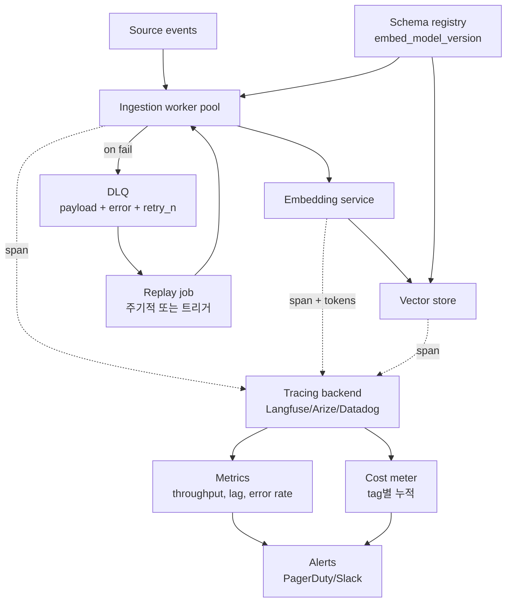
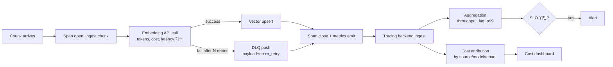

# Embedding Ingestion Pipeline - Production 운영 (DLQ / 모니터링 / 비용)

## 핵심 요약

본 노트는 ingestion 파이프라인이 실제 production에 들어갔을 때 발생하는 **운영 3대 문제 — 실패 격리(DLQ) · 관측(observability) · 비용 통제**에 집중. 전체 흐름은 [[fl-2026-06-02-embedding-ingestion-pipeline-overview]] 참조.

- **RAGOps 표준화** (arXiv 2506.03401, 2026): LLMOps를 확장한 RAG 전용 운영 프레임. ingestion·retrieval·generation 각 stage를 **span 단위 trace**로 관측 + chunk_id·similarity_score·doc_version·embed_model을 span metadata로 기록.
- **AI 워크로드 telemetry 폭증**: 전형적인 RAG 호출은 동등한 일반 API 대비 telemetry 10-50배 발생. **샘플링·tag 전략 없이 observability 비용이 ingestion 비용을 초과**하는 사례가 2026에 다수 보고.
- **DLQ는 ingestion의 backbone**: poison chunk가 전체 파이프라인 차단을 막는 1차 방어선. 실패 payload + error + retry 회수를 보존해 후속 분석·재처리 가능.
- **Cost driver 식별**: embedding API > observability backend > vector store storage 순. component-wise tag(source / model / pipeline stage / tenant)로 cost 귀속 → 최적화 우선순위 결정.

## 시스템 아키텍처

production 파이프라인은 ingestion worker · DLQ · state store · observability backend · cost meter의 5개 측면을 모두 갖춘다.

## 처리 흐름

운영 관점에서 chunk 1건이 흘러갈 때 어떤 신호가 어디로 가는지.

## 핵심 기능 및 서비스

| 기능 | 설명 |
|---|---|
| DLQ | 실패 chunk를 payload+error+retry_count와 함께 격리. SQS DLQ, Kafka DLT, 또는 별도 PostgreSQL table |
| Replay job | DLQ 처리: 자동 재시도(transient error) → 수동 분석(poison) 분기. backoff schedule 또는 manual approval |
| Span tracing | OpenTelemetry 또는 Langfuse SDK로 ingest.chunk, embed.api, vector.upsert를 nested span으로 |
| Span metadata | chunk_id, source, embed_model, embed_version, tokens_in, latency_ms, retry_n, status |
| Cost meter | input_tokens × $/M × tag. tag 권장: source, embed_model, pipeline_stage, tenant, env |
| Throughput / lag SLI | chunks_processed_per_sec, event_to_indexed_latency_p99, DLQ_depth |
| Schema registry | embed_model + version + dim의 정합성 검증. ingest 시점에 vector store schema와 비교 |
| Backpressure | source rate > worker capacity 시 queue 길이로 producer를 throttle 또는 Batch API로 우회 |
| Alerts | DLQ depth, embedding cost spike, embed_model drift, retrieval recall 저하 |
| Sampling / tag policy | telemetry 폭증 방지. 성공 span은 1-10% sampling, 실패는 100% 보존 |

## 유사 기술 비교

| 항목 | Langfuse | Helicone | Arize Phoenix | Datadog LLM Obs | LangSmith |
|---|---|---|---|---|---|
| 라이선스 | OSS (MIT) + Cloud | OSS + Cloud | OSS + Enterprise | proprietary (Datadog) | proprietary (LangChain) |
| 통합 방식 | SDK | Proxy (URL 변경) | SDK | SDK + APM | SDK (LangChain 친화) |
| 비용 자동 산정 | 자동 (OpenAI/Anthropic/Google pricing 내장, embedding tokens 지원) | 자동 (proxy 캡처) | 자동 | 자동 | 자동 |
| Embedding 추적 | 지원 (input tokens 별도 집계) | 지원 | 지원 | 지원 | 지원 |
| Self-host | 가능 | 가능 | 가능 | 불가 | 불가 |
| 강점 | OSS 1위, self-host, embedding 분리 트래킹 | 코드 변경 거의 없음 | ML-grade 평가 도구 결합 | Datadog 사용자에게 default | LangChain 사용자에게 default |
| 약점 | 일부 enterprise 기능 유료 | self-host 운영 부담 | 학습 곡선 | 비용 (Datadog 가격) | LangChain 외에선 부적 |
| 적합 케이스 | OSS·self-host 선호 | 빠른 도입 | ML 팀과 공유 | 기존 Datadog 사용자 | LangChain 기반 stack |

## 실제 사례

### RAGOps framework (arXiv 2506.03401, 2026)
RAG 운영을 LLMOps와 별도 프레임워크로 정립. ingestion·indexing·retrieval·reranking·generation 각 stage를 span 단위로 분리하고, **chunk_id·similarity_score·doc_version·retriever_strategy** 같은 메타데이터를 span에 기록해 hallucination·miss retrieval·stale index 원인을 stage별로 추적. ingestion 측면에서는 embed_model + version + token cost가 핵심 span attribute.

### OneUptime 보고서 - AI workload observability 비용 폭증 (2026-04)
일반 API 대비 RAG 호출은 telemetry를 10-50배 생성. ingestion 백필 1억 chunk 처리 시 span 별 평균 1KB만 잡아도 100GB telemetry. observability backend 비용이 embedding API 비용을 추월한 사례가 다수 보고됨. **해결**: 성공 span은 1-10% sampling, 실패는 100% 보존, embedding-only span은 별도 sampler.

### Langfuse production - embedding 비용 분리 트래킹
Langfuse는 OpenAI / Anthropic / Google 등 가격을 내장하고 embedding 호출의 input tokens를 별도 usage type으로 집계. tag 기반 cost 귀속(source · tenant · pipeline_stage)으로 어떤 source가 비용을 끌어올리는지 분 단위로 파악. OSS·self-host 가능해 enterprise 채택 다수.

### Helicone proxy 도입 사례
SDK 변경 없이 base URL만 Helicone proxy로 바꾸면 모든 OpenAI / Anthropic 호출을 캡처. 기존 ingestion 코드를 손대지 않고 cost·latency·error를 한 번에 모니터링하는 빠른 도입 패턴. trade-off는 self-host 운영 부담.

## 활용 시나리오

### 시나리오 1: PoC ~ MVP (월 ingest < 1000만 chunk)
**선택**: Helicone proxy (코드 변경 거의 없음) + DLQ를 SQS DLQ로 간단히. cost 알람은 weekly budget 알람 1개.
**이유**: PoC 단계에서 관측 인프라에 시간 쓰지 않고 가시성만 확보. proxy로 OpenAI/Anthropic 호출 즉시 캡처. embed cost는 월 $50-200 수준이라 component-wise tag까지 불필요.

### 시나리오 2: 엔터프라이즈 self-host 운영 (multi-tenant)
**선택**: Langfuse self-host + DLQ는 PostgreSQL table + replay worker. tag 정책: tenant_id, source, embed_model, env.
**이유**: multi-tenant 환경에서 tenant별 cost 귀속 필수. OSS라 라이선스 비용 zero + self-host로 PII 데이터 외부 유출 차단. tag 정책을 ingestion worker에 강제(span에 tenant 미포함 시 reject).

### 시나리오 3: Datadog 사용 중 대기업 (관측 stack 통합 우선)
**선택**: Datadog LLM Observability + DLQ는 SNS+SQS+Lambda replay + cost는 Datadog 대시보드.
**이유**: 기존 인프라 알람·on-call이 Datadog에 있어 별도 observability stack 도입이 운영 분기. APM trace와 LLM span을 동일 trace_id로 연결해 ingestion 장애 root cause를 application layer까지 추적 가능.

## 장단점 및 트레이드오프

| 항목 | 내용 |
|---|---|
| 장점 | **장애 격리**: DLQ로 poison chunk가 전체 ingest 차단 방지. **stage별 root cause 식별**: span tracing으로 embedding API · vector upsert · downstream 어디서 실패했는지 즉시 식별. **비용 가시화**: tag별 cost 귀속으로 최적화 우선순위 객관화. |
| 단점 | **Telemetry 비용 폭증 위험**: AI 워크로드는 일반 API 대비 10-50배 telemetry. sampling·tag 전략 없으면 ingestion 비용보다 관측 비용이 더 큼. **운영 컴포넌트 증가**: DLQ · replay · tracing · cost meter · schema registry 등 5+ 부수 인프라. **SLO 정의가 모호**: ingestion lag SLO(예: p99 < 5초)는 정의 가능, retrieval 품질 SLO(recall@10)는 ingestion만으로 보장 불가. |
| 트레이드오프 | **관측 깊이 ↔ 비용**: 모든 chunk span 보존(완벽) vs sampling(비용 절감, 일부 누락). **DLQ 수동 replay ↔ 자동 retry**: 자동(빠른 회복) vs 수동(poison message 분석 정확). **SDK 통합 ↔ proxy**: SDK(메타데이터 풍부) vs proxy(코드 변경 zero). |

## 함정 및 안티패턴

- **DLQ 없이 try/except 무시**: 실패 chunk가 silent drop → retrieval 결과에 구멍, 사용자만 알아챔 → DLQ + alert + replay 의무화.
- **Span에 embed_model 미기록**: 사고 발생 시 어떤 model로 embed된 vector가 영향받는지 식별 불가 → span attribute에 embed_model + embed_version 필수.
- **모든 span을 100% 보존**: ingestion 백필 시 telemetry 비용이 embedding 비용 초과 → 성공 span 1-10% sampling, 실패 100% 보존.
- **Cost를 model API bill로만 본다**: vector DB 저장 + observability backend + DLQ storage + retry로 인한 중복 비용 누락 → component-wise tag로 총비용 산정.
- **DLQ replay를 무한 자동 재시도로**: poison message가 영원히 retry되며 비용 누수 → max_retry 후 manual review queue로 이동.
- **Schema registry 없이 dim 변경**: text-embedding-3-large dim 3072 → 1024 truncate 시 vector store schema 불일치로 query 실패 → ingest 시점에 schema 검증.
- **Multi-tenant에서 tenant tag 강제하지 않음**: tenant별 cost 귀속 불가, noisy tenant 분리 불가 → ingestion worker에서 tenant tag 누락 시 reject.
- **Retrieval 품질 저하를 ingestion 문제로만 본다**: stale index일 수도 있지만 chunker 변경, embed model drift, query rewriter 회귀일 수도 있음 → span trace에서 stage별 metric 비교 후 진단.

## 참고 자료

- [arXiv - RAGOps: Operating and Managing Retrieval-Augmented Generation Pipelines (2506.03401)](https://arxiv.org/html/2506.03401v1) - RAG 전용 운영 프레임, span 단위 trace 표준
- [Future AGI - What is RAG Observability? Tracing Retrieval in 2026](https://futureagi.com/blog/what-is-rag-observability-2026) - span 정의·메타데이터 표준
- [OneUptime - Your AI Workloads Are About to Blow Up Your Observability Bill (2026-04)](https://oneuptime.com/blog/post/2026-04-01-ai-workload-observability-cost-crisis/view) - telemetry 10-50배 폭증
- [Galileo - 5 Best RAG Observability Tools Compared in 2026](https://galileo.ai/blog/best-rag-observability-tools) - RAG-specific 관측 도구 비교
- [Langfuse Docs - Token & Cost Tracking](https://langfuse.com/docs/observability/features/token-and-cost-tracking) - embedding tokens 분리 집계
- [BuildMVPFast - Langfuse vs Helicone vs Portkey 2026](https://www.buildmvpfast.com/blog/llm-observability-stack-langfuse-helicone-portkey-2026) - LLM 관측 stack 비교
- [Medium - Dead Letter Queues in FinTech Ingestion Pipelines](https://medium.com/@sonal.sadafal/%EF%B8%8F-dead-letter-queues-in-fintech-ingestion-pipelines-41562cc9e6ae) - DLQ 운영 표준
- [apxml.com - RAG Monitoring & Alerting (Distributed Systems)](https://apxml.com/courses/large-scale-distributed-rag/chapter-5-orchestration-operationalization-large-scale-rag/monitoring-logging-alerting-distributed-rag) - throughput / lag / failure 메트릭 설계
- [Decompressed - I Updated My Embedding Model and My RAG Broke: A Post-Mortem](https://decompressed.io/learn/rag-observability-postmortem) - schema registry 누락 사고 사례
