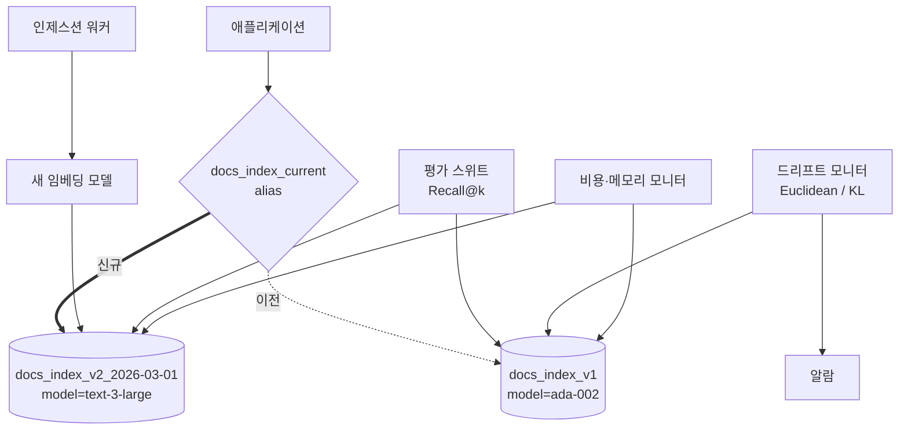
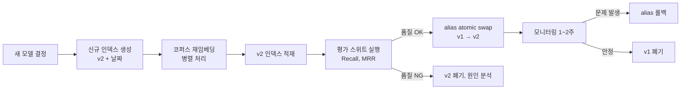

# Embedding-Index Deployment Operations — 운영/배포 관점 중심

## 핵심 요약

운영/배포 관점은 임베딩 모델과 벡터 인덱스를 한 쌍으로 묶어 **버전 전환·재인덱싱·드리프트 감지·비용 통제**를 어떻게 무중단으로 수행하느냐의 문제다. 모델·인덱스 결합도가 강해 모델을 바꾸면 인덱스가 전체 재구축되어야 하므로, alias 기반 blue/green 전환이 사실상 표준 패턴이다. 동시에 임베딩 드리프트(데이터 분포 변화)를 주기적으로 감지해 부분 재인덱싱 시점을 결정한다.

- **무중단 전환은 alias 패턴**: 인덱스 이름에 모델·날짜를 박고, 애플리케이션은 alias만 참조.
- **드리프트는 두 종류**: ① 데이터 분포 시프트(코퍼스 변화), ② 모델 버전 시프트(모델 교체). 처방이 다름.
- **비용은 임베딩 + 인덱스 + 듀얼-인덱스 윈도우**: blue/green 동안에는 일시적으로 저장소·임베딩 비용이 2배.

## 시스템 아키텍처

## 처리 흐름

## 핵심 기능 및 서비스

| 기능 | 설명 |
|---|---|
| Alias 기반 blue/green | `docs_index_current`처럼 alias만 참조, 원자적 스왑으로 무중단 |
| 병렬 재인덱싱 | 신규 인덱스를 별도 빌드하면서 기존 인덱스는 서비스 유지 |
| 평가 스위트 | ground-truth 쿼리 셋으로 Recall@k, MRR, nDCG 측정 후 컷오버 결정 |
| 드리프트 감지 | 임베딩 분포 시프트(Euclidean 평균 거리·KL divergence·PSI) 추적 |
| Drift-Adapter | 신규 모델 쿼리 임베딩을 기존 공간으로 매핑하는 학습된 변환층, 재인덱싱 회피 |
| 비용 가시화 | 임베딩 호출 비용·인덱스 메모리·듀얼-인덱스 윈도우 비용을 항목별 추적 |

## 유사 기술 비교

| 항목 | Blue/Green 재인덱싱 | Drift-Adapter | In-place 업그레이드 | Shadow 인덱스 |
|---|---|---|---|---|
| 무중단 | 가능 (alias swap) | 가능 (변환층 추가) | 불가 (다운타임) | 가능 |
| 저장 비용 | 2× (전환 기간) | ~1× (어댑터 추가) | 1× | 2× |
| 롤백 용이성 | 매우 강함 | 강함 | 약함 | 강함 |
| 품질 보장 | 동등 (모델 그대로) | 95~99% (재학습 의존) | 동등 | 동등 |
| 적합 케이스 | 모델 교체·차원 변경 | 비용 민감·일시 호환 | 동일 모델 마이너 버전 | 트래픽 분기 A/B |

## 실제 사례

### 표준 blue/green 패턴 (TianPan, 2026)
인덱스 이름에 모델 버전·날짜를 박고(`docs_index_v2_2026-03-01`) 애플리케이션은 `docs_index_current` alias만 참조. 신규 모델로 인덱스를 병렬 구축한 뒤 평가 스위트로 품질 검증, 통과하면 alias를 원자적으로 스왑. 문제 발생 시 alias만 되돌리는 즉시 롤백 가능.

### Drift-Adapter (arXiv 2509.23471)
경량 학습 변환층으로 신규 모델 쿼리 임베딩을 기존 임베딩 공간으로 매핑. 벤치마크에서 95~99% retrieval 성능 회복을 보고, 듀얼 인덱스 대비 저장 비용을 크게 절감. 비용·시간 제약이 강한 환경의 대안.

## 활용 시나리오

### 시나리오 1: 모델 교체 무중단 전환
**맥락**: text-embedding-ada-002 → text-embedding-3-large 업그레이드. **선택 이유**: 차원·공간이 모두 달라 in-place 불가. **적용**: 신규 인덱스 병렬 빌드 → 평가 → alias swap → 1~2주 모니터링 → 구 인덱스 폐기.

### 시나리오 2: 코퍼스 분포 시프트 대응
**맥락**: 6개월 운영 후 신규 도메인(법무 문서) 대량 유입으로 검색 품질 저하. **선택 이유**: 모델은 그대로지만 임베딩 분포가 학습 시점과 달라짐. **적용**: 드리프트 모니터링(KL divergence) → 임계치 초과 시 해당 도메인 청크 재임베딩 + 부분 재인덱싱.

### 시나리오 3: 비용 절감 대안 경로
**맥락**: 듀얼 인덱스 운영 비용이 부담. **선택 이유**: Drift-Adapter로 단일 인덱스 유지 + 변환층만 추가. **적용**: 신규·구 모델 쿼리/문서 페어로 어댑터 학습 → 쿼리 시 변환층 통과 → 기존 인덱스로 검색. Recall 손실 1~5% 수용.

## 장단점 및 트레이드오프

| 항목 | 내용 |
|---|---|
| 장점 | 무중단 모델·인덱스 업그레이드, 즉시 롤백, 점진적 품질 검증 |
| 단점 | 듀얼 인덱스 윈도우 동안 저장·임베딩 비용 2배, 모니터링·평가 스위트 구축 필요 |
| 트레이드오프 | Blue/green (안전·비용↑) ↔ Drift-Adapter (저비용·약간의 품질 손실), 빠른 컷오버 (조기 위험) ↔ 긴 모니터링 (비용↑) |

## 함정 및 안티패턴

- **alias 없이 인덱스 이름 직접 참조**: 애플리케이션 코드가 `docs_index_v1`을 직접 호출 → 전환할 때마다 배포 필요. **대안**: 처음부터 alias 도입.
- **평가 스위트 없이 컷오버**: 신규 모델이 MTEB 상위라는 이유만으로 alias를 스왑 → 도메인별 품질 저하 인지 실패. **대안**: 자체 ground-truth 쿼리 셋으로 Recall@k 측정.
- **드리프트 감지 부재**: 6개월~1년 그대로 운영 → 코퍼스가 학습 시점과 멀어졌는데 모름. **대안**: 주간/월간 임베딩 분포 통계 자동 수집, 임계치 알람.
- **구 인덱스 즉시 폐기**: alias 스왑 직후 v1 삭제 → 문제 발견 시 롤백 불가. **대안**: 최소 1~2주는 v1 유지.
- **재임베딩 비용 미예측**: 1억 청크 재임베딩이 수천 달러 API 비용이 될 수 있음을 사전 계산 안 함. **대안**: 모델 교체 전 비용 시뮬레이션 (`청크 수 × 평균 토큰 × 단가`).

## 참고 자료

- [Embedding Models in Production: Selection, Versioning, and the Index Drift Problem](https://tianpan.co/blog/2026-04-09-embedding-models-production-versioning-index-drift) — blue/green 표준 패턴
- [I Updated My Embedding Model and My RAG Broke: A Post-Mortem](https://decompressed.io/learn/rag-observability-postmortem) — 실패 사례와 교훈
- [Drift-Adapter: A Practical Approach to Near Zero-Downtime Embedding Model Upgrades](https://arxiv.org/pdf/2509.23471) — Drift-Adapter 논문
- [Monitoring Embedding/Vector Drift Using Euclidean Distance — Arize AI](https://arize.com/blog-course/embedding-drift-euclidean-distance/) — 드리프트 검출 방법
- [5 methods to detect drift in ML embeddings — Evidently AI](https://www.evidentlyai.com/blog/embedding-drift-detection) — 드리프트 검출 5가지 방법론
- [RAG in Production: Deployment Strategies and Practical Considerations](https://coralogix.com/ai-blog/rag-in-production-deployment-strategies-and-practical-considerations/) — 프로덕션 배포 전략
