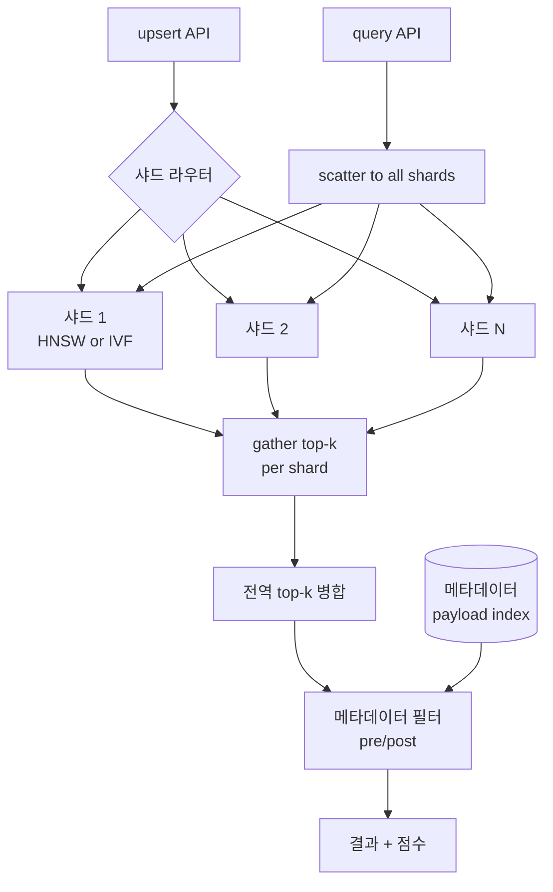
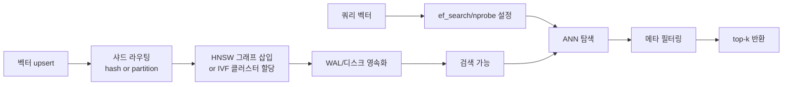

# Vector Index Operations — 벡터 인덱스 운영 중심

## 핵심 요약

벡터 인덱스는 임베딩 벡터를 ANN(Approximate Nearest Neighbor) 자료구조로 보관해 top-k 유사도 검색을 100~1000× 가속한다. 핵심 알고리즘은 HNSW(그래프), IVF(클러스터링), PQ(양자화 압축)이며, 데이터 규모·쓰기 빈도·메모리 예산·Recall 목표에 따라 선택과 조합이 달라진다. 운영 관점에서는 알고리즘 선택만큼 샤딩·메타데이터 필터링·재인덱싱 정책이 중요하다.

- **알고리즘 ≠ 압축**: HNSW/IVF는 탐색 자료구조, PQ는 압축 기법. 둘은 결합 가능(IVF-PQ, HNSW-PQ).
- **Recall ↔ Latency ↔ Memory 삼각형**: 한 축을 개선하면 다른 축이 악화. 워크로드 별 스윗스팟이 다름.
- **운영 가시성**: Recall@k, p99 latency, 인덱스 크기, 쓰기 처리량 네 지표를 동시에 추적해야 함.

## 시스템 아키텍처

## 처리 흐름

## 핵심 기능 및 서비스

| 기능 | 설명 |
|---|---|
| HNSW 그래프 색인 | 계층적 small-world 그래프, 95%+ Recall, 동적 삽입 지원, 메모리 2~5× IVF |
| IVF 클러스터링 | k-means Voronoi 셀로 파티셔닝, 메모리 효율, nprobe로 정확도 조절 |
| Product Quantization | 벡터를 부분 벡터로 분할·양자화, 10~50× 압축, 정확도 손실 작음 |
| Binary Quantization | 1-bit 양자화, 32× 압축, HNSW와 결합해 메모리 효율 극대화 |
| 메타데이터 필터링 | pre-filter(필터 후 탐색) vs post-filter(탐색 후 필터), 카디널리티에 따라 선택 |
| 샤딩·복제 | 수평 확장 + 가용성 (Milvus·Weaviate·Qdrant 모두 지원) |

## 유사 기술 비교

| 항목 | HNSW | IVFFlat | IVF-PQ | Binary Quantization + HNSW |
|---|---|---|---|---|
| 자료구조 | 다층 그래프 | 클러스터 + 평벡터 | 클러스터 + PQ 코드 | 1-bit 벡터 + 그래프 |
| Recall | 95~99% | 90~95% (nprobe 의존) | 80~92% | 90~95% |
| 메모리 | 가장 큼 (2~5× 평벡터) | 중간 | 매우 작음 (10~50× 압축) | 매우 작음 (~32× 압축) |
| 빌드 시간 | 느림 | 빠름 | 빠름 | 빠름 |
| 동적 삽입 | 강함 (rebuild 불필요) | 약함 (centroid 드리프트) | 약함 | 강함 |
| 적합 케이스 | <10M, 활발한 쓰기 | 수억~수십억 정적 셋 | 메모리 제약·대규모 | 메모리 ↓, Recall 유지 |

## 실제 사례

### Pinecone Serverless
사용자가 인덱스 알고리즘을 직접 선택하지 않도록 추상화하고, 내부적으로 dynamic indexing(HNSW 변형) + 압축을 자동 적용. p99 latency 일관성이 강점이나 self-host보다 느린 편.

### Qdrant
HNSW를 기반으로 페이로드 인덱스(메타데이터)와 벡터 인덱스를 분리·결합하는 filterable HNSW를 지원. 100M 벡터·768차원에서 필터링 검색·비용 효율이 우위라는 벤치마크가 보고됨.

### Milvus
샤딩·파티셔닝이 가장 성숙하여 수십억 벡터 스케일을 목표로 함. IVF·HNSW·DiskANN 등 여러 알고리즘을 동일 클러스터에서 선택해 운영.

## 활용 시나리오

### 시나리오 1: <10M 벡터, 활발한 쓰기
**맥락**: 사내 위키·이슈 트래커 인덱싱, 매시간 신규 문서 유입. **선택 이유**: HNSW는 rebuild 없이 동적 삽입 가능. **적용**: Qdrant/Weaviate HNSW (`M=16, ef_construction=200, ef_search=64`), 메모리 충분히 할당.

### 시나리오 2: 수억 벡터, 메모리 제약
**맥락**: 이커머스 상품·이미지 카탈로그 5억 건, 풀-RAM 인덱스 불가. **선택 이유**: IVF-PQ가 압축 + 디스크 친화적. **적용**: Milvus IVF_PQ (`nlist=4096, m=16`), nprobe 튜닝으로 Recall 95% 목표.

### 시나리오 3: 모바일/엣지 또는 비용 최소화
**맥락**: 메모리·비용을 극단 절감해야 하는 환경. **선택 이유**: Binary Quantization + HNSW로 메모리 ~32× 압축. **적용**: Qdrant BQ + rerank(원본 벡터로 상위 200건 정밀 평가).

## 장단점 및 트레이드오프

| 항목 | 내용 |
|---|---|
| 장점 | 100~1000× 검색 가속, 알고리즘·압축 조합으로 다양한 워크로드 대응 |
| 단점 | 알고리즘별 파라미터 튜닝(ef, nprobe, M 등) 필요, 메모리·디스크 운영 부담 |
| 트레이드오프 | HNSW (메모리↑·Recall↑·동적) ↔ IVF-PQ (메모리↓·정확도↓·정적), pre-filter (필터 강할 때 유리) ↔ post-filter (필터 약할 때 유리) |

## 함정 및 안티패턴

- **알고리즘 디폴트 그대로**: "default = HNSW"로 두고 메모리 폭발. **대안**: 데이터 규모와 메모리 예산을 먼저 산정 후 알고리즘 결정. 10M 이상이면 IVF-PQ나 BQ 검토.
- **메타데이터 카디널리티 무시**: HNSW에 post-filter로 카디널리티 높은 필터 적용 → top-k 후 거의 모두 탈락. **대안**: pre-filter 또는 필터 키별 파티셔닝.
- **단일 노드 운영**: 수억 벡터를 단일 노드에 강제 적재 → OOM 또는 latency 폭발. **대안**: 샤딩·복제 토폴로지 설계, 100M 단위로 분할.
- **Recall 측정 없음**: 인덱스 파라미터를 바꾸면서 Recall 변화를 측정 안 함 → 검색 품질이 조용히 저하. **대안**: ground-truth 쿼리 셋으로 주기적 Recall@10/50 측정.

## 참고 자료

- [HNSW vs IVFFlat: How to Choose the Right Vector Index](https://bigdataboutique.com/blog/hnsw-vs-ivfflat-how-to-choose-the-right-vector-index) — 알고리즘 선택 가이드
- [HNSW vs IVF-PQ: Vector Database Index Performance Guide](https://drcodes.com/posts/hnsw-vs-ivf-pq-vector-database-index-performance-guide) — 메모리·정확도 트레이드오프 상세
- [How does indexing work in a vector DB (IVF, HNSW, PQ, etc.)?](https://milvus.io/ai-quick-reference/how-does-indexing-work-in-a-vector-db-ivf-hnsw-pq-etc) — Milvus 공식 설명
- [Vector Database Performance Compared: pgvector vs Pinecone vs Qdrant vs Weaviate](https://dev.to/kencho/vector-database-performance-compared-pgvector-vs-pinecone-vs-qdrant-vs-weaviate-2ne6) — 벤치마크
- [Vector Search Indexing: HNSW, ANN, and What Actually Matters for Production](https://proptimiseai.com/blog/vector-search-indexing-hnsw-ann-production) — 프로덕션 관점
