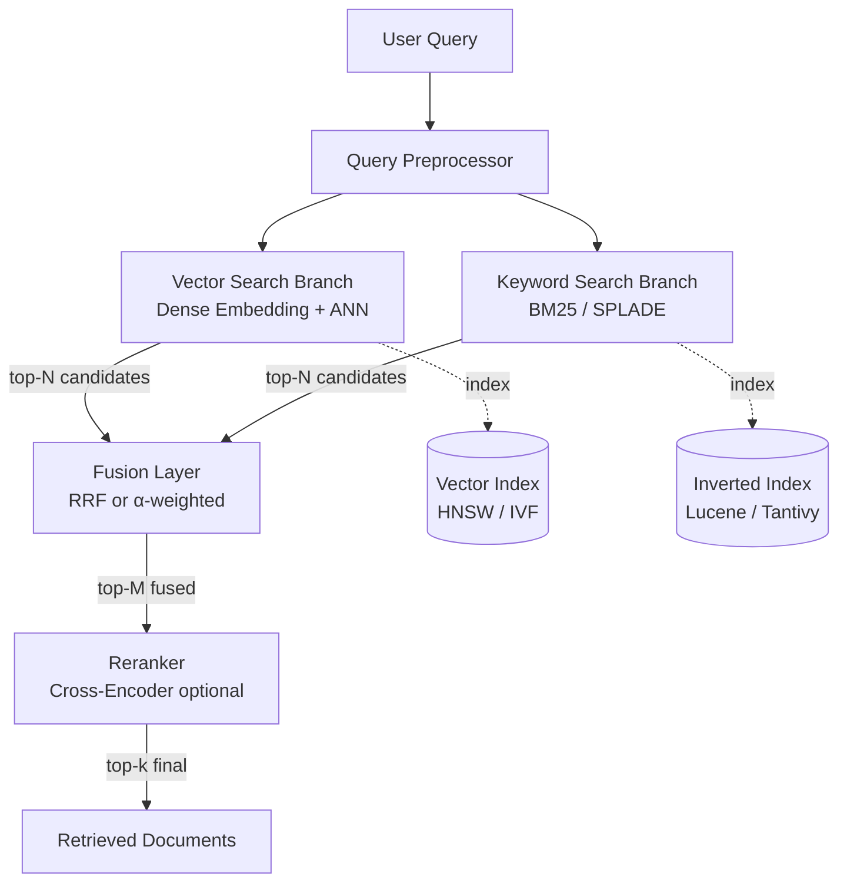
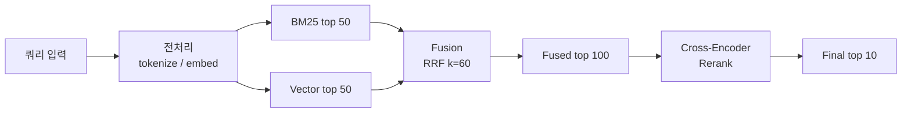

# Hybrid Search (Vector + Keyword) 최적화

## 핵심 요약

Hybrid Search는 dense embedding 기반 vector search와 sparse term 기반 keyword search(주로 BM25)를 결합하는 검색 전략이다. Vector는 의미적 유사성(semantic similarity)에 강하지만 고유명사 · 약어 · 정확 매칭에 취약하고, BM25는 그 반대 특성을 가지므로 두 결과를 융합해 RAG retrieval의 recall과 precision을 동시에 끌어올린다. "최적화"의 핵심 변수는 **융합 알고리즘**(RRF vs weighted), **가중치 α**, **score normalization**, **reranker 결합**이다.

- BEIR 등 표준 벤치마크에서 hybrid는 단일 전략 대비 **nDCG 5-15%** 개선이 일반적이며, cross-encoder reranker를 추가하면 추가 3-8% 향상이 보고됨
- RRF(Reciprocal Rank Fusion)는 score 호환성 문제를 우회하기 위해 **rank만 사용**하는 fusion 방식으로 사실상 production 표준
- α-weighted 융합은 단순하지만 score normalization과 도메인별 α 튜닝이 필수 — 2026년 발표된 DAT(Dynamic Alpha Tuning, arXiv:2503.23013)는 LLM으로 쿼리별 α를 동적 산출

## 시스템 아키텍처

Hybrid Search의 일반 구성은 두 retrieval branch가 병렬로 실행되고 fusion layer에서 결합된 뒤, 선택적으로 reranker가 top-k를 재정렬하는 구조다.

## 처리 흐름

쿼리 입력부터 최종 top-k 산출까지의 표준 처리 단계.

## 핵심 기능 및 서비스

| 기능 | 설명 |
|---|---|
| RRF (Reciprocal Rank Fusion) | `score = Σ 1/(k + rank_i)`, k=60 기본. score scale 불일치 문제 회피, 알고리즘 단순 |
| α-weighted 융합 | `α · vec_score + (1-α) · bm25_score`. α=0.7이 균형점으로 자주 사용 |
| Score Normalization | min-max 또는 z-score로 0-1 정규화 후 결합. weighted 방식의 필수 전처리 |
| Dynamic Alpha Tuning | 쿼리 특성(키워드 비중, 의도)에 따라 α를 동적 산출. LLM 또는 learned model 사용 |
| Reranker 결합 | fused top 100을 cross-encoder로 재정렬해 top 10 추출. 정밀도 결정타 |
| Query Routing | 키워드 우세/의미 우세 쿼리를 분류해 branch 가중치 또는 사용 여부 결정 |

## 유사 기술 비교

| 항목 | Hybrid Search (BM25 + Vector) | Pure Vector Search | Pure Keyword Search (BM25) | SPLADE (Learned Sparse) |
|---|---|---|---|---|
| 특징 | dense + sparse 융합 | dense embedding 단일 | inverted index + TF-IDF 계열 | sparse representation을 학습으로 생성 |
| 장점 | semantic + exact match 모두 커버, recall 최대 | 의미적 유사성 우수, 동의어 강함 | 인덱스 빠름, 해석 용이, infra 성숙 | sparse 형식 유지하며 semantic 일부 학습 |
| 단점 | infra 복잡, 두 인덱스 운영, 튜닝 파라미터 多 | 약어/숫자/고유명사 취약 | 동의어/패러프레이즈 약함 | 학습 모델 필요, 인덱스 크기 증가 |
| 적합 케이스 | production RAG, enterprise 검색 | 짧은 자연어 질의, 의미 중심 | 코드 검색, ID/SKU 등 정확 매칭 | 학습 리소스 있고 sparse 형식 유지가 중요한 경우 |

## 실제 사례

### Elasticsearch / Azure AI Search
RRF를 first-class 지원. Azure AI Search는 hybrid scoring에서 RRF를 기본 채택하며 `k=60`을 default로 노출. Lucene 기반 BM25 인덱스와 HNSW vector 인덱스를 동일 쿼리로 묶어 단일 응답으로 fused 결과를 반환.

### Weaviate
Hybrid가 native 기능. `fusionType`으로 `rankedFusion(RRF)`과 `relativeScoreFusion`을 선택 가능. `relativeScoreFusion`은 rank가 아닌 원본 score의 상대 비율을 유지해 score 정보를 보존하려는 도메인(예: ML feature pipeline)에 유리.

### Qdrant
v1.10부터 Query API에서 hybrid 공식 지원. server-side fusion으로 RRF와 DBSF(Distribution-Based Score Fusion) 모두 선택 가능해 client-side 결합 코드 제거. dense + sparse(예: BM42, SPLADE) 동시 인덱싱 가능.

### Pinecone
단일 hybrid index에서 dense + sparse 벡터 병행 저장. α 파라미터를 쿼리 시점에 명시해 weighted 조합 수행. Cohere Rerank 등 외부 reranker와의 조합이 표준 패턴.

## 활용 시나리오

### 시나리오 1: 사내 문서 RAG에서 약어/제품명 검색 실패 해결
**맥락**: Pure vector search 기반 RAG에서 "K8s pod CrashLoopBackOff" 같은 약어/에러코드 질의에서 관련 문서 누락 빈발.
**선택 이유**: Vector는 약어를 토큰 분해해 의미만 보고 BM25는 token exact match로 보강 가능.
**적용**: BM25 top 50 + dense top 50 → RRF(k=60) → cross-encoder rerank top 10. α 튜닝보다 RRF가 운영 부담 낮음.

### 시나리오 2: 멀티 도메인 검색에서 쿼리 유형별 가중치 조정
**맥락**: 코드 검색 + 자연어 FAQ 검색을 단일 검색창에서 처리해야 하는 개발자 포털.
**선택 이유**: 코드 쿼리는 exact match 비중이 압도적, FAQ는 의미 비중이 큼 → static α로 양쪽 만족 불가.
**적용**: 쿼리 분류기(또는 LLM 기반 DAT)로 쿼리당 α 동적 산출, weighted 융합 + score normalization 적용.

### 시나리오 3: 대규모 e-commerce 상품 검색
**맥락**: 상품 코드(SKU), 브랜드명, 자연어 설명("얇은 여름 반팔") 등 이질적 쿼리가 혼재.
**선택 이유**: 가격/카테고리 필터 + 의미 매칭 + 정확 SKU 매칭 모두 필요.
**적용**: Weaviate의 hybrid + metadata filter. SKU 우세 쿼리는 α 낮게, 자연어는 α 높게. 최종 단계에서 BGE-Reranker로 정밀도 보강.

## 장단점 및 트레이드오프

| 항목 | 내용 |
|---|---|
| 장점 | recall과 precision 동시 향상(BEIR +5-15% nDCG); 단일 전략 약점 상호 보완; production-검증된 fusion 패턴(RRF) 다수 |
| 단점 | 두 종류 인덱스 운영(저장/메모리/지연 증가); 튜닝 파라미터 폭발(α, k, top-N, reranker 모델 선택); cross-encoder 추가 시 latency 50-200ms 증가 |
| 트레이드오프 | RRF는 단순하지만 score 정보 손실 / weighted는 정밀하지만 도메인별 튜닝 필요; reranker는 정확도 ↑ vs 비용·지연 ↑; static α는 운영 단순 vs dynamic α는 품질 우위 |

## 함정 및 안티패턴

- **안티패턴 1**: weighted 융합에서 score normalization 생략 → vector cosine과 BM25 score 스케일이 달라 한쪽이 항상 지배. **대안**: min-max 정규화 후 weighted 합산, 또는 RRF로 전환.
- **안티패턴 2**: α를 한 번 정하고 모든 도메인에 재사용 → 도메인 drift로 점진 성능 저하. **대안**: 도메인별 validation set으로 α 재튜닝 또는 DAT 도입.
- **안티패턴 3**: reranker를 retrieval top-1000에 적용 → cost·latency 폭발. **대안**: fused top 50-100으로 후보 축소 후 rerank.
- **안티패턴 4**: BM25 인덱스에 stemming/stop-word 처리 누락 → keyword branch가 사실상 무력화. **대안**: 언어별 analyzer 명시 설정, 동의어 사전 적용.
- **안티패턴 5**: vector embedding 모델 교체 시 BM25 쪽만 그대로 두고 α 재튜닝 생략 → 균형 붕괴. **대안**: 임베딩 변경은 hybrid 파이프라인 전체 재검증의 트리거.

## 참고 자료

- [Hybrid Search Scoring (RRF) — Azure AI Search](https://learn.microsoft.com/en-us/azure/search/hybrid-search-ranking) — RRF 공식 동작과 k 파라미터 의미를 Microsoft 공식 문서에서 정리
- [DAT: Dynamic Alpha Tuning for Hybrid Retrieval in RAG (arXiv 2503.23013)](https://arxiv.org/html/2503.23013v1) — 쿼리별 α를 LLM으로 동적 산출하는 2026년 논문
- [Hybrid Search Alpha Tuning For RAG — LlamaIndex](https://www.llamaindex.ai/blog/llamaindex-enhancing-retrieval-performance-with-alpha-tuning-in-hybrid-search-in-rag-135d0c9b8a00) — α 튜닝 절차와 평가 방법 가이드
- [Hybrid Search: BM25, Vector & Reranking Reference 2026 — Digital Applied](https://www.digitalapplied.com/blog/hybrid-search-bm25-vector-reranking-reference-2026) — 2026년 production 패턴 종합 정리
- [Reciprocal Rank Fusion outperforms Condorcet and individual Rank Learning Methods (Cormack et al., SIGIR 2009)](http://cormack.uwaterloo.ca/cormack/cormacksigir09-rrf.pdf) — RRF 원논문
- [Weaviate Hybrid Search Documentation](https://weaviate.io/developers/weaviate/search/hybrid) — relativeScoreFusion vs rankedFusion 공식 설명
- [Qdrant Query API — Hybrid Search](https://qdrant.tech/documentation/concepts/hybrid-queries/) — v1.10+ server-side hybrid 공식 가이드
- [Hybrid Search and Re-Ranking in Production RAG — Towards Data Science](https://towardsdatascience.com/hybrid-search-and-re-ranking-in-production-rag/) — production RAG에서 hybrid + reranker 통합 패턴
