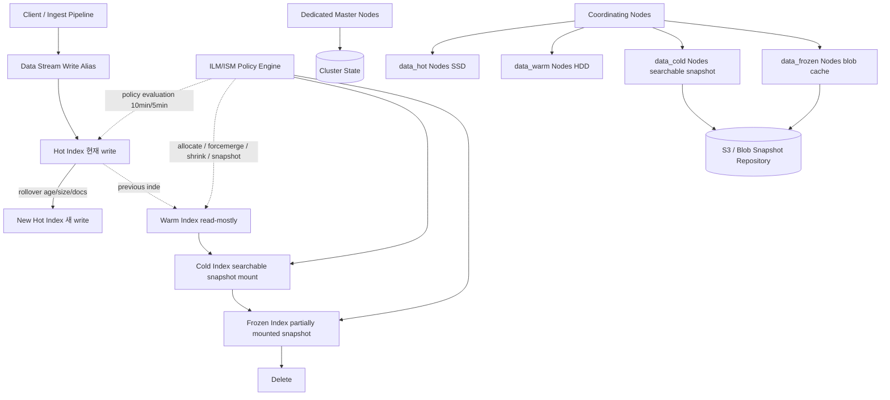

# Index Lifecycle & Scale-out Strategy (Elasticsearch / OpenSearch)

## 핵심 요약

Elasticsearch/OpenSearch에서 대규모 인덱스를 **시간·접근빈도 기반 단계(Hot → Warm → Cold → Frozen → Delete)로 자동 전이**시키는 정책(ILM/ISM)과, **샤드·노드 토폴로지를 수평으로 확장**해 처리량/저장량을 늘리는 운영 전략을 묶은 메서드. 로그·메트릭·시계열처럼 데이터 가치가 시간에 따라 급감하는 워크로드에서 비용/성능 트레이드오프를 다루는 표준 접근법.

- **ILM 단계**: Hot(쓰기+검색) → Warm(읽기 위주) → Cold(드물게 조회, searchable snapshot) → Frozen(부분 마운트 snapshot, 최저 비용) → Delete. 각 단계 진입은 age/size/doc count 조건으로 트리거
- **Scale-out 축**: ① primary shard 수(쓰기/저장 분산) ② replica 수(읽기 처리량/HA) ③ node role 분리(master / data_hot / data_warm / data_cold / data_frozen / coordinating / ingest) ④ Cross-cluster search/replication
- **결합 효과**: ILM의 `rollover`로 인덱스를 일정 크기에서 끊어 작은 단위로 유지 → 거대 샤드/oversharding 동시 회피 → tier 전환 시 노드 간 데이터 이동 비용 최소화
- **권장 샤드 크기**: search-heavy 10–30 GiB, write-heavy(로그) 30–50 GiB, 절대 상한 50 GB / 샤드당 2³¹ 문서

## 컴포넌트 다이어그램

ILM/ISM 정책 엔진이 주기적으로 인덱스 메타데이터를 평가해 phase action을 트리거하고, allocation rule이 노드 role(`data_hot` 등)에 따라 샤드를 적절한 tier로 재배치한다. write index만 rollover 대상이며, 이후 인덱스는 read-only로 변환되어 다음 tier로 이동한다.

## 적용 단계

1. **데이터 스트림 + write alias 생성**: `logs-app-*` 데이터 스트림으로 자동 인덱스 회전 가능 상태 확보
2. **ILM/ISM 정책 정의**: phase별 `min_age`, action(rollover/forcemerge/shrink/allocate/searchable_snapshot/delete) 명시
3. **Rollover 트리거 설정**: `max_primary_shard_size: 50gb`, `min_primary_shard_size: 10gb`, `max_age: 30d` 등 결합 조건
4. **Node role 토폴로지 구축**: `node.roles: [data_hot]`/`[data_warm]`/`[data_cold]`/`[data_frozen]` 분리, master 3대 dedicated
5. **정책 attach**: 인덱스 템플릿에 `index.lifecycle.name`/`policy_id` 지정 → 신규 인덱스 자동 적용
6. **모니터링**: shard count, segment count, queue depth, tier별 disk usage, ILM step error 알람

## 핵심 기능 및 서비스

| 기능 | 설명 |
|---|---|
| Rollover | write index가 size/age/doc 조건 도달 시 새 인덱스로 전환. `min_age`는 rollover 시점 기준 |
| Forcemerge | warm 진입 시 segment 병합으로 검색 성능 향상, 디스크 saving |
| Shrink | primary shard 수 축소(예: 30 → 5). warm/cold 진입 시 oversharding 해소 |
| Allocate | shard를 특정 node attribute/role(data_warm 등)로 이동 |
| Searchable Snapshot | cold/frozen에서 snapshot을 마운트해 검색 가능 상태 유지. 저장 비용 최대 90% 절감 |
| Partial Mount (Frozen) | snapshot의 일부만 로컬 blob cache로 로드해 거의 0 로컬 디스크로 검색 |
| Delete | retention 만료 시 인덱스 제거 |
| Node Roles | master / data_content / data_hot / data_warm / data_cold / data_frozen / coordinating / ingest 분리 |
| ISM Notification (OpenSearch) | phase 전환/에러 시 Slack/Email/Chime 알림 |
| ILM Audit Index (Elasticsearch) | phase 결과를 인덱스로 저장해 알림 구성 가능 |

## 유사 기술 비교

| 항목 | Elasticsearch ILM | OpenSearch ISM | InfluxDB Retention Policy | TimescaleDB Compression + Drop Chunks |
|---|---|---|---|---|
| 모델 | phase + action (선언적) | state + transition (상태 머신) | duration + replication factor | hypertable chunk 단위 |
| Hot/Warm/Cold tier | node roles 기반 | node attributes 기반 | tier 개념 없음 (단순 retention) | 단일 디스크, 압축으로 비용 절감 |
| Rollup/Downsampling | 8.x에서 TSDB downsampling | rollup 정책 유지 | continuous query | continuous aggregate |
| 알림 | 외부 index 기반 alerting 구성 | ISM이 직접 Slack/Email 발행 | Kapacitor 별도 | pg_cron + 트리거 |
| 적합 케이스 | 로그/메트릭 다단계 보관 | AWS 환경 OpenSearch 도입 | 단순 시계열 보관 | SQL 시계열 + JOIN 필요 |

## 실제 사례

### Elastic 공식 hot-warm-cold 레퍼런스
Elastic 자사 블로그에서 12–24개월 데이터를 cold+frozen tier로 보관하면 비용을 최대 **90%** 절감 가능하다고 보고. cold tier 단독으로도 read-only 데이터 저장 비용 최대 **50%** 절감 사례 공유.

### 대규모 로그 분석 파이프라인
Logstash/Beats → Elasticsearch 파이프라인에서 `logs-*` 데이터 스트림 + `max_primary_shard_size: 50gb` rollover + 7일 후 warm 이동 + 30일 후 frozen + 90일 후 삭제. dedicated master 3대, data_hot SSD, data_warm HDD, data_frozen는 S3 snapshot repo + 로컬 blob cache로 구성한 표준 패턴이 Elastic/Opster 가이드에서 반복적으로 인용.

### Amazon OpenSearch Service
AWS OpenSearch Service는 ISM과 UltraWarm(자체 searchable snapshot 변형) tier를 결합해 hot SSD → UltraWarm S3 → cold storage 흐름을 제공. 노드 어트리뷰트 기반 hot/warm 구성을 ILM과 동일한 정책 시멘틱으로 노출.

## 활용 시나리오

### 시나리오 1: 애플리케이션 로그 90일 보관 (비용 최적)
write-heavy 로그 워크로드 → data_hot SSD에서 `rollover` 50GB 또는 1일 → 7일 후 forcemerge + data_warm 이동 → 30일 후 searchable snapshot → frozen tier → 90일 후 delete. compliance 요건은 frozen tier로 분리해 hot 클러스터 부담 회피.

### 시나리오 2: 시계열 메트릭 + 다운샘플링
1분 raw 메트릭은 hot에서 7일 보관 → warm 단계에서 10분 단위 다운샘플링(8.x TSDB downsampling 또는 OpenSearch rollup) → 1년 보관. raw 인덱스는 동시 forcemerge + shrink로 샤드 수를 30 → 5로 축소해 oversharding 방지.

### 시나리오 3: 멀티 테넌트 SaaS 검색
테넌트별 인덱스 + rollover로 인덱스를 작게 유지 + replica 2로 검색 처리량 보장. 큰 테넌트는 별도 data_hot 노드 그룹에 allocation rule로 핀, 작은 테넌트는 공용 node에 배치. coordinating only node로 검색 fan-out 제어해 hot data node CPU 보호.

## 장단점 및 트레이드오프

| 항목 | 내용 |
|---|---|
| 장점 | 보관 비용을 최대 90%까지 절감. rollover 자동화로 거대 샤드 회피. node role 분리로 hot 클러스터 SLA 보호. tier 간 데이터 이동을 정책으로 선언적 관리. |
| 단점 | 정책/토폴로지가 복잡해져 오너십 분산 시 운영 사고 잦음. searchable snapshot 검색은 hot 대비 latency 큼. 정책 변경의 효과 검증이 느림(다음 phase 도달까지 시간 소요). |
| 트레이드오프 | shard 작게 유지(rollover 잦게) ↔ 너무 작으면 oversharding 발생. cold/frozen으로 옮길수록 비용↓ + 검색 latency↑. replica↑로 검색 처리량↑ + 저장 비용↑. master node 분리는 안정성↑ + 노드 비용↑. |

## 함정 및 안티패턴

- **안티패턴 1: ILM을 retention policy로만 사용** → 단계별 cost/performance tier 활용 없이 단순 삭제 정책처럼 운영 → hot tier에 오래 머무는 인덱스가 비용 폭증과 검색 성능 저하 유발 → tier 전이를 포함한 정책으로 재설계
- **안티패턴 2: Oversharding** → 일별 인덱스 + 30+ primary shard 관행으로 1GB 미만 샤드 양산 → cluster state 비대, 검색 thread pool 고갈 → `max_primary_shard_size` 기반 rollover로 전환, 주/월 단위 인덱스 검토
- **안티패턴 3: write index에 직접 searchable_snapshot 적용** → write index에는 snapshot action 불가, 실패 → 먼저 수동 rollover로 read-only 인덱스를 만든 뒤 action 진입
- **안티패턴 4: master node에 data 역할 겸직** → cluster state 처리와 데이터 I/O가 충돌해 split-brain/장애 → dedicated master 3대(odd number)로 분리
- **안티패턴 5: node attribute 기반 hot/warm(구버전) 잔존** → 8.x 이후 node role 기반 권장이지만 마이그레이션 안 한 클러스터에서 allocation 의도와 실제 배치 불일치 → `node.roles`로 명시 전환
- **안티패턴 6: forcemerge를 hot tier에서 강행** → segment 병합이 무거워 인입 throughput 급락 → warm 단계 진입 후, 트래픽 낮은 시간대에 수행

## 참고 자료

- [Index lifecycle management (ILM) in Elasticsearch](https://www.elastic.co/docs/manage-data/lifecycle/index-lifecycle-management) — ILM 공식 개요
- [ILM phases and actions](https://www.elastic.co/docs/manage-data/lifecycle/index-lifecycle-management/index-lifecycle) — phase별 action 레퍼런스
- [Elasticsearch data tiers: hot, warm, cold, frozen](https://www.elastic.co/docs/manage-data/lifecycle/data-tiers) — tier 개념 공식 문서
- [Size your shards](https://www.elastic.co/docs/deploy-manage/production-guidance/optimize-performance/size-shards) — 10–50 GiB 권장, 200M doc 상한 등 공식 가이드
- [Node roles](https://www.elastic.co/docs/deploy-manage/distributed-architecture/clusters-nodes-shards/node-roles) — master/data_hot/data_warm/data_cold/data_frozen/coordinating 역할
- [Searchable snapshots](https://www.elastic.co/docs/deploy-manage/tools/snapshot-and-restore/searchable-snapshots) — cold/frozen tier의 핵심 기술
- [Implementing Hot-Warm-Cold in Elasticsearch with ILM (Elastic Blog)](https://www.elastic.co/blog/implementing-hot-warm-cold-in-elasticsearch-with-index-lifecycle-management) — 적용 패턴
- [OpenSearch Index State Management](https://docs.opensearch.org/latest/im-plugin/ism/index/) — ISM 공식 문서
- [Choosing the number of shards (Amazon OpenSearch Service)](https://docs.aws.amazon.com/opensearch-service/latest/developerguide/bp-sharding.html) — AWS 공식 sharding 가이드
- [Elasticsearch ILM vs OpenSearch ISM (Opster)](https://opster.com/guides/opensearch/opensearch-data-architecture/elasticsearch-ilm-vs-opensearch-ism-policy/) — 두 시스템 차이 비교
- [Elasticsearch Oversharding (Opster)](https://opster.com/guides/elasticsearch/capacity-planning/elasticsearch-oversharding/) — oversharding 진단·해결
