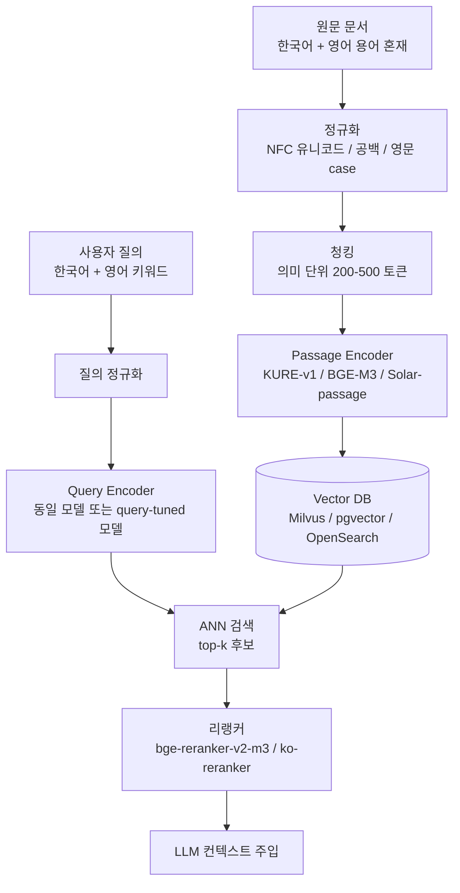

# 한국어 RAG 임베딩 모델 선정 - 한국어 품질 우선, 영어 코드스위칭 대응

## 핵심 요약

한국어 RAG에서 임베딩 모델 선정은 "한국어 retrieval 품질 → 영어 토큰 혼재(code-switching) 견고성 → 운영 비용" 순으로 우선순위를 잡아야 한다. 글로벌 다국어 모델(OpenAI `text-embedding-3-large`, Cohere v3 등)은 한국어 토크나이저 효율과 의미 압축이 떨어지는 경우가 많아, **한국어 특화 finetune 모델(KURE-v1, KoE5, bge-m3-ko)** 또는 한국어 코퍼스 비중이 충분한 다국어 모델(BGE-M3, jina-v3, Solar Embedding)이 실제 한국어 retrieval에서 우위를 보인다.

- **한국어 토큰 효율**: 같은 문장에서도 영어 중심 토크나이저는 토큰이 1.5~2배 부풀려져 8K context를 실질적으로 절반 이하로 쓰게 만든다.
- **자연어 내 영어 혼재 케이스**: 한국어 본문 + 영어 기술 용어/고유명사(예: "Kafka의 Streams API를 이용해…")가 빈번하므로, 영어 토큰 임베딩 품질도 같이 보장되어야 한다 → **단일 한국어 전용 모델보다 한국어 강화 다국어 모델이 안전**.
- **벤치마크 단독 판단 금지**: MTEB-ko-retrieval 리더보드 + 자체 도메인 데이터 평가 + 태스크별(검색/리랭킹/QA) 분해, "3중 검증"이 사실상 표준.

## 시스템 아키텍처

한국어 RAG의 임베딩 레이어는 단순 "모델 1개"가 아니라 **인덱싱 파이프라인(passage encoder) + 질의 파이프라인(query encoder) + 리랭커**의 3단 구조로 분리된다. 한국어/영어 혼재를 견디려면 토크나이저 단계에서 정규화를 한 번 거치는 것이 안정적이다.



## 처리 흐름

```mermaid
flowchart LR
  A[모델 후보군 선정] --> B[한국어 벤치마크<br/>MTEB-ko / KorSTS / Ko-MTEB]
  B --> C[자체 데이터 평가셋<br/>실제 도메인 QA 100-300쌍]
  C --> D[코드스위칭 셋<br/>한영 혼재 질의/문서 별도]
  D --> E[Recall@k / nDCG / MRR<br/>각각 분해 측정]
  E --> F{한국어 우위<br/>임계치 통과?}
  F -- No --> A
  F -- Yes --> G[운영 비용 검증<br/>차원/지연/온프레미스 가능성]
  G --> H[리랭커 조합 결정]
  H --> I[프로덕션 배포]
```

## 핵심 기능 및 서비스

| 모델 | 차원 | 컨텍스트 | 한국어 특화 | 영어 동시 강도 | 비고 |
|---|---|---|---|---|---|
| KURE-v1 (`nlpai-lab/KURE-v1`) | 1024 | 8192 | 매우 강함 (BGE-M3 finetune, 한국어 query-doc 2M쌍 학습) | 베이스가 다국어라 보존 | MTEB-ko-retrieval 상위, 오픈소스 |
| KoE5 (`nlpai-lab/KoE5`) | 1024 | 512 | 강함 (multilingual-e5 finetune, ko-triplet-v1.0) | e5 베이스 다국어 | 첫 한국어 특화 임베딩으로 알려짐 |
| BGE-M3 (`BAAI/bge-m3`) | 1024 | 8192 | 우수 (한국어 포함 100+ 언어) | 매우 강함 | Dense+Sparse+Multi-vector 단일 모델 |
| bge-m3-ko (`dragonkue/bge-m3-ko`) | 1024 | 8192 | BGE-M3의 한국어 강화 finetune | 베이스 다국어 보존 | 커뮤니티 finetune |
| Solar Embedding-1-Large (Upstage) | 4096 | 4K | 강함 (한국 기업 제작) | 양호 | query/passage 별 모델 분리 제공 |
| jina-embeddings-v3 | 1024 (Matryoshka 가변) | 8192 | 다국어 평균 우수 (Task LoRA) | 매우 강함 | 작업별 LoRA 어댑터 |
| multilingual-e5-large | 1024 | 512 | 평균 | 강함 | 베이스라인/저비용 |
| text-embedding-3-large (OpenAI) | 3072 | 8191 | 평균 | 매우 강함 | 한국어 토큰 효율 약점, API 의존 |

## 유사 기술 비교

| 항목 | KURE-v1 | BGE-M3 | Solar Embedding-1-Large | text-embedding-3-large |
|---|---|---|---|---|
| 한국어 retrieval 품질 | 최상위 (한국어 fine-tuned) | 상위 (다국어 강자) | 상위 (한국어 친화) | 중상위 (다국어 일반) |
| 코드스위칭 견고성 | 베이스 BGE-M3 덕분에 견고 | 매우 견고 (100+ 언어 균형) | 양호 | 매우 견고 |
| 컨텍스트 길이 | 8192 | 8192 | 4096 | 8191 |
| 차원 / 저장 비용 | 1024 | 1024 (sparse 병행 시 추가) | 4096 (높음) | 3072 (높음) |
| 셀프호스팅 | 가능 (오픈소스) | 가능 (오픈소스) | API 중심 | API 전용 |
| 적합 케이스 | 한국어 비중 80%+ 폐쇄망 RAG | 한/영/일/중 혼재 멀티테넌트 | 업스테이지 Solar LLM 스택과 통합 시 | PoC 빠른 시작, 글로벌 SaaS |

## 실제 사례

### SK하이닉스 RAG 플랫폼 (AWS 사례)
사내 기술 문서 RAG 구축 시 **Jina Embeddings v2 base (en)** 을 SageMaker Endpoint로 운영하고 Amazon OpenSearch를 벡터 저장소로 사용. 한국어 문서가 다수임에도 영어 임베딩 모델을 선택한 사례인데, 사내 도메인 평가셋 기준으로 비용/지연/정확도 균형에 맞춰 선택했다는 점이 핵심. → **리더보드와 실제 도메인 결과가 갈릴 수 있음**을 보여주는 반례로 자주 인용된다.

### 업스테이지 Solar Embedding 스택
한국 기업이 직접 제작한 모델로, `solar-embedding-1-large-query`와 `solar-embedding-1-large-passage`를 **인코더 분리** 방식으로 운영. 질의-문서 비대칭 특성을 모델 단에서 반영한 구조로, asymmetric retrieval(짧은 질의 → 긴 문서)에 강하다.

### 고려대 NLP&AI Lab — KURE
BGE-M3을 한국어 200만 query-doc 쌍 + hard negative 5개로 finetune. **MTEB-ko-retrieval 리더보드를 함께 공개**하여 평가 표준화에 기여. 한국어 도메인 finetune이 다국어 베이스 대비 retrieval에서 유의미한 개선을 만든다는 공개 증거.

## 활용 시나리오

### 시나리오 1: 한국어 90%+ 사내 위키 / 기술문서 RAG
**선택**: KURE-v1 또는 bge-m3-ko + 한국어 리랭커(`Dongjin-kr/ko-reranker` 등)
**이유**: 한국어가 압도적이고 일부 영어 기술용어(`Kubernetes`, `RAG`, `OAuth`)가 섞이는 전형. BGE-M3 베이스를 유지하므로 영어 토큰도 잘 처리.
**적용**: 청크 300~500 토큰, dense + BM25 하이브리드(2-stage). 리랭커가 top-50 → top-5 압축.

### 시나리오 2: 한/영 동률 멀티테넌트 SaaS 검색
**선택**: BGE-M3 또는 jina-embeddings-v3
**이유**: 테넌트별 언어 비율이 다르며 한 모델로 다국어를 일관되게 다뤄야 함. BGE-M3는 dense/sparse를 한 모델에서 제공해 인덱스 일원화에 유리.
**적용**: Matryoshka 임베딩(jina-v3)이라면 차원을 256~1024 사이에서 비용/품질 트레이드오프 조절.

### 시나리오 3: PoC / 짧은 일정 + 정확도 우선
**선택**: OpenAI `text-embedding-3-large` 또는 Solar Embedding API
**이유**: 셀프호스팅 운영 부담 없이 즉시 시작. 한국어 품질이 충분히 나오는지 자체 평가셋으로 검증 후 후속 단계에서 KURE/BGE-M3로 마이그레이션.
**적용**: 200~300쌍 골든셋을 먼저 만들어 두면 모델 교체 시 회귀 검증이 즉시 가능.

## 장단점 및 트레이드오프

| 항목 | 내용 |
|---|---|
| 장점 (한국어 특화 모델) | 같은 도메인 데이터에서 다국어 범용 모델보다 Recall@k가 5~15%p 높게 보고되는 사례 다수. 한국어 토크나이저 효율로 컨텍스트 활용도 ↑. |
| 단점 (한국어 특화 모델) | 영어 단독 문서 retrieval은 BGE-M3/jina-v3 같은 균형 다국어 모델보다 떨어질 수 있음. 모델 카드의 학습 데이터 도메인 편향(뉴스/위키) 확인 필요. |
| 트레이드오프 | (1) 차원 ↑ → 저장 비용/ANN 지연 ↑ (Solar 4096차원 vs KURE 1024차원). (2) 컨텍스트 길이 ↑ → 모델 가중치/RAM ↑ (512 vs 8192). (3) API 모델은 속도/운영 편하지만 데이터 외부 전송 + 한국어 토큰 비효율로 비용 압박. |

## 함정 및 안티패턴

- **안티패턴 1**: "MTEB 영어 리더보드 1위니까 한국어도 잘 되겠지" → 한국어 토크나이저가 형태소 단위로 잘게 쪼개져 의미가 분산. **대안**: 반드시 MTEB-ko-retrieval / 자체 도메인 셋으로 재평가.
- **안티패턴 2**: 한국어 전용 모델을 골라놓고 영어 PDF/마크다운(코드 블록 포함)을 그대로 인덱싱 → 영어 임베딩 품질이 미달. **대안**: 한국어 강화된 다국어 모델(BGE-M3, jina-v3) 또는 언어 감지 후 라우팅(한 본문은 KURE, 영문 본문은 e5/jina).
- **안티패턴 3**: 질의/문서에 같은 모델만 쓰면서 비대칭 retrieval에서 성능 저하 → **대안**: Solar처럼 query/passage 분리 모델 사용, 또는 BGE-M3의 instruction 프롬프트(`"query: ..."`) 활용.
- **안티패턴 4**: 정규화 생략 — 한국어 NFC/NFD 유니코드 차이로 동일 단어가 다른 벡터로 인코딩됨. **대안**: 인덱싱·질의 모두 `unicodedata.normalize("NFC", ...)` 강제.
- **안티패턴 5**: 청크 크기를 임베딩 모델 max length(예: 8192)에 맞춰 키움 → 청크 내 의미 희석으로 retrieval 정확도 ↓. **대안**: 200~500 토큰 의미 단위 청킹 + 부모-자식(parent-child) 청킹으로 컨텍스트 보강.

## 참고 자료

- [nlpai-lab/KURE (GitHub)](https://github.com/nlpai-lab/KURE) — 고려대 NLP&AI Lab의 한국어 retrieval 임베딩 + MTEB-ko-retrieval 리더보드.
- [nlpai-lab/KURE-v1 (Hugging Face)](https://huggingface.co/nlpai-lab/KURE-v1) — 모델 카드(차원 1024, 8192 컨텍스트, BGE-M3 finetune 상세).
- [KURE / KoE5 소개 (Medium, Youngjoon Jang)](https://yjoonjang.medium.com/koe5-%EC%B5%9C%EC%B4%88%EC%9D%98-%ED%95%9C%EA%B5%AD%EC%96%B4-%EC%9E%84%EB%B2%A0%EB%94%A9-%EB%AA%A8%EB%8D%B8-multilingual-e5-finetune-22fa7e56d220) — 학습 데이터셋·하이퍼파라미터 회고.
- [Upstage Solar Embedding-1-Large 소개](https://ko.upstage.ai/feed/tech/solar-embedding-1-large) — query/passage 분리 임베딩과 한국어 성능 주장.
- [SK하이닉스 RAG 플랫폼 사례 (AWS Tech Blog)](https://aws.amazon.com/ko/blogs/tech/sk-hynix-rag-platfrom-analysis-evaluation/) — 한국 기업의 임베딩 + OpenSearch 운영 사례.
- [KT Cloud 임베딩 & 벡터 인덱싱 가이드](https://tech.ktcloud.com/entry/2026-03-ktcloud-rag-embedding-vectorindex-%EA%B2%80%EC%83%89-%EC%83%89%EC%9D%B8) — 다국어 모델 선정 전략과 인덱싱 기법.
- [임베딩 모델 선택 가이드 — Data Dynamics](https://www.data-dynamics.io/ko/blog/embedding-model-guide) — 한국어 벤치마크 관점의 선정 절차("3중 검증").
- [jina-embeddings-v3 (arXiv 2409.10173)](https://arxiv.org/abs/2409.10173) — Task LoRA 기반 다국어 임베딩, MTEB 다국어 64.44.
- [ConCSE: Contrastive Learning for Code-Switched Embeddings (arXiv 2409.00120)](https://arxiv.org/pdf/2409.00120) — 한영 코드스위칭 임베딩 contrastive 학습.
- [HiKE: Korean-English Code-Switching Evaluation (arXiv 2509.24613)](https://arxiv.org/pdf/2509.24613) — 한영 코드스위칭 평가 프레임워크.
- [MTEB Leaderboard (Hugging Face)](https://huggingface.co/spaces/mteb/leaderboard) — Korean retrieval 태스크 포함 다국어 리더보드.
