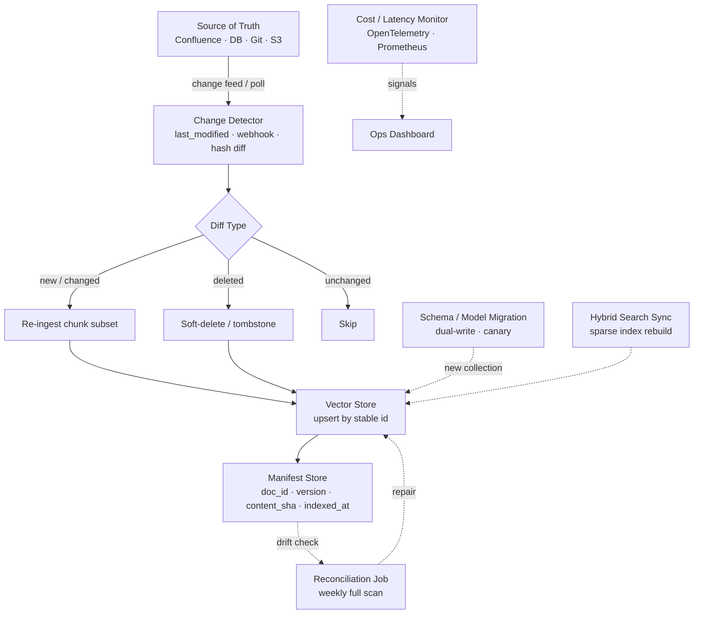
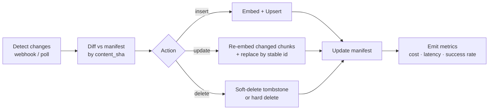

# RAG Data Ingestion Architecture — 운영 고려사항

## Core summary

RAG 인제션은 1회성 배치가 아니라 **지속적 상태 동기화 시스템**이다. 원본의 변경/삭제, embedding 모델 교체, schema 진화, 신선도 SLA, 비용 통제, hybrid search 결합 — 운영 단계의 결정이 retrieval 품질과 비용을 장기적으로 지배한다. 핵심은 **결정적 식별자 + 변경 감지 + 부분 재처리 + 관측성**의 4축이다.

- **Incremental indexing이 표준**: 매 사이클마다 전체 corpus를 재임베딩하지 않고, content hash로 변경 chunk만 처리해 비용을 한 자릿수 % 수준으로 절감
- **Stable identifier가 운영의 prerequisite**: 결정적 `chunk_id`가 없으면 update·delete가 best-effort로 전락 — incremental·hybrid·rollback 모두 무너짐
- **Freshness는 SLA 항목**: "10분 이내 반영" 같은 명시적 목표를 정의하고 manifest와 vector store 사이의 drift를 모니터링
- **Hybrid search가 production 기본값**: 2024년 이후 production-grade RAG는 dense(vector) + sparse(BM25/SPLADE) 결합이 사실상 표준 — 운영 측면에서 sparse 인덱스의 재빌드 정책을 함께 관리해야 함

## System architecture

운영 관점에서 본 ingestion은 **상태 동기화 루프**이며, manifest store가 truth source 역할을 하고 reconciliation·observability·rollback 서비스가 주변에 배치된다.

## Processing flow

운영 사이클 한 번의 일반화된 흐름. **manifest와 vector store의 상태를 정렬**하는 것이 목표.

1. **Detect**: source의 last_modified·webhook·CDC stream으로 변경 후보 수집
2. **Diff**: 원본 chunk의 `content_sha`를 manifest와 비교. 신뢰 가능한 last_modified가 없으면 hash로 fallback
3. **Action**: insert / update / delete를 분리해 처리 — update는 stable id로 replace, delete는 보통 soft-delete(tombstone)
4. **Manifest update**: doc·chunk별 새 version·hash·indexed_at 기록
5. **Observe**: cost / latency / success rate / freshness drift를 metric으로 emit

## Core features and services

| 운영 차원 | 핵심 메커니즘 | 주요 결정 |
|---|---|---|
| Change detection | webhook + poll + CDC + hash | 신뢰 가능한 last_modified 존재 여부 |
| Incremental update | stable id 기반 replace | id 규칙, chunking 결정의 안정성 |
| Delete 시맨틱 | soft-delete vs hard-delete | 감사·rollback 요구 |
| Reconciliation | manifest vs vector store full scan | 주기, 비용 |
| Model migration | dual-write + canary + cutover | namespace 분리, 평가 파이프라인 |
| Schema evolution | additive field vs new collection | 강제 필드 변경 시 backfill |
| Hybrid search 운영 | sparse 인덱스 동기 갱신 | dense와 sparse의 sync 정책 |
| Observability | step-level cost, freshness drift | metric/trace span 단위 |
| Cost control | embedding skip rate, batch size | manifest의 hit ratio |
| Freshness SLA | "X분 이내 반영" 정의 | webhook → upsert end-to-end latency |

## Similar technology comparison

운영 패턴(특히 변경 감지·재인제션) 관점에서의 4가지 접근.

| Item | Full reindex (정기 배치) | Incremental by hash | CDC-based streaming | EraRAG (LSH 기반 증분) |
|---|---|---|---|---|
| 변경 감지 | 없음(전체 재처리) | content hash 비교 | DB·log stream | hyperplane LSH bucket |
| 비용 | 가장 비쌈 | 변경 비율에 비례 | event당 비용 | bucket update만 |
| 신선도 | 사이클 주기에 의존 | 사이클 + 변경 처리 시간 | near real-time | near real-time |
| 운영 복잡도 | 낮음 | 중간 (manifest 필요) | 높음 (스트림 인프라) | 높음 (LSH 운영) |
| 적합 시나리오 | 소규모, 변경 적음 | 일반 production | 핵심 비즈니스 데이터, 신선도 SLA 엄격 | 빠르게 성장하는 corpus |

## Real-world cases

### Incremental indexing for large RAG systems (Vasanthan)
"매일 100만 chunk가 들어오는데 매번 재임베딩은 불가능"이라는 문제에서 출발해, `doc_id + chunk_idx + content_hash`로 만든 stable id와 manifest table을 도입. 결과적으로 매 사이클의 embedding API 호출을 5% 미만으로 줄이고 freshness를 시간 단위로 단축.

### EraRAG (arXiv 2506.20963)
Hyperplane-based LSH로 chunk를 bucket에 배정하고, 신규 corpus가 들어올 때 bucket 단위 incremental update만 수행. 영향받는 segment만 갱신해 large-scale corpus의 incremental 비용을 sub-linear로 끌어내림. growing corpus(공식 문서 매일 추가 등)에 특히 유효.

## Use scenarios

### Scenario 1: 매일 수만 건의 신규 문서 (성장형 corpus)
- **운영 결정**: webhook + 야간 reconciliation의 hybrid. webhook은 신선도 SLA, reconciliation은 누락 보정
- **메커니즘**: webhook payload → diff → 변경 chunk만 upsert. manifest에 indexed_at 기록. 야간에 manifest와 vector store full scan으로 drift 보정
- **모니터링**: webhook end-to-end latency p95, reconciliation에서 발견된 drift 건수

### Scenario 2: Embedding 모델 교체 (3-large → 다음 세대)
- **운영 결정**: dual-write + canary
- **메커니즘**: 새 namespace를 만들어 신규 chunk를 dual-write, evaluation 파이프라인이 두 namespace의 retrieval 품질을 비교. 기준 통과 후 query traffic을 점진 이전, 구 namespace는 grace period 후 삭제
- **모니터링**: 동일 query set에 대한 recall@k 차이, latency, 비용

### Scenario 3: 컴플라이언스 요구 — 원본 삭제 시 vector도 30일 내 삭제 보장
- **운영 결정**: hard delete + 감사 로그
- **메커니즘**: source 삭제 이벤트가 도착하면 doc_id로 vector store의 모든 chunk를 일괄 삭제. manifest에 deleted_at 기록. 30일 후 audit log만 남기고 manifest row도 archival
- **모니터링**: 삭제 요청 ~ 실제 vector 삭제까지의 latency, 미삭제 잔여 chunk 0건

## Pros and Cons & Trade-off

| Item | Detail |
|---|---|
| Pros | Incremental + manifest 운영으로 embedding 비용을 한 자릿수 % 수준으로 압축. Stable id 기반 update/delete가 거버넌스(GDPR 등) 대응을 단순화 |
| Cons | Manifest store가 새로운 single point of state — 백업·복구·일관성 관리 추가 부담. Reconciliation 비용이 corpus 크기에 비례 |
| Trade-off | **Webhook(실시간) vs Polling(주기적)**: 전자는 신선도, 후자는 운영 단순성. **Soft-delete vs Hard-delete**: 감사·rollback vs storage/메모리 절약. **Sparse 인덱스 동기 vs 비동기**: 일관성 vs throughput |

## Pitfalls / Anti-patterns

- **last_modified만 믿고 변경 감지**: 일부 source(예: rendered HTML)는 last_modified가 부정확 → hash fallback을 항상 함께 운영
- **delete를 metadata flag만으로 처리하고 ANN 인덱스에 남김**: filtered search 비용 누적, recall 오염 → tombstone을 정기적으로 compaction
- **embedding 모델 교체를 in-place로 수행**: dim·분포가 달라지면 인덱스 일관성 깨짐 → 항상 namespace 분리 + dual-write + cutover
- **Manifest 백업 없이 운영**: manifest 손실 시 incremental의 기준점이 사라져 full reindex 강제 → manifest는 transactional DB(Postgres 등)에 두고 정기 백업
- **Reconciliation을 영원히 미루기**: webhook 누락이 누적되어 drift가 음소거 상태로 커짐 → 주 1회 이상 full scan, drift 건수를 alert 대상으로
- **Sparse(BM25/SPLADE) 인덱스를 무시**: hybrid search 도입 후 dense만 갱신 → keyword recall이 stale 데이터로 떨어짐. sparse 인덱스 갱신 정책을 dense와 paired로 운영
- **Freshness SLA 없이 "되도록 빠르게"**: 측정 불가능 → "webhook ~ query-ready까지 p95 < 10분" 처럼 측정 가능한 SLO로 정의

## References

- [Incremental Indexing Strategies for RAG Systems (Medium)](https://medium.com/@vasanthancomrads/incremental-indexing-strategies-for-large-rag-systems-e3e5a9e2ced7) — manifest + stable id 기반 incremental 전략의 실전 가이드
- [Incremental and Continuous Data Ingestion Strategies (Unstructured)](https://unstructured.io/insights/incremental-data-ingestion-strategies-for-continuous-pipelines) — webhook·poll·hash 조합의 continuous ingestion 운영 패턴
- [EraRAG: Efficient and Incremental Retrieval Augmented Generation for Growing Corpora (arXiv)](https://arxiv.org/pdf/2506.20963) — LSH 기반 sub-linear incremental update 기법
- [RAG Pipeline Challenges: From Data Ingestion to Retrieval (Unstructured)](https://unstructured.io/insights/rag-pipeline-challenges-from-data-ingestion-to-retrieval) — production 운영에서 자주 발생하는 인제션 장애 패턴
- [Best Practices for Implementing RAG Systems in Production (Unstructured)](https://unstructured.io/insights/rag-systems-best-practices-unstructured-data-pipeline) — 운영 best practice + hybrid search 결합
- [Building Production RAG: Architecture, Chunking, Evaluation & Monitoring (2026 Guide) (premai.io)](https://blog.premai.io/building-production-rag-architecture-chunking-evaluation-monitoring-2026-guide/) — 운영 단계 모니터링·평가 지침
