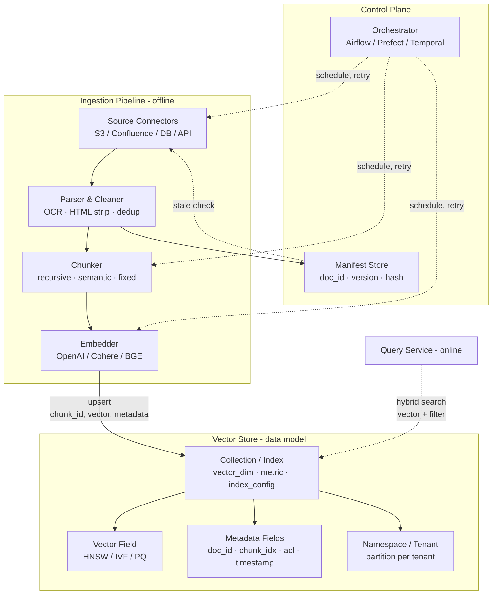
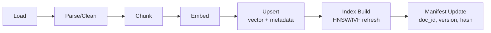

# RAG Data Ingestion Architecture — Overview (Pipeline + Schema 통합)

## Core summary

RAG 시스템의 **offline indexing workflow**와 **vector store 데이터 모델**을 한 장의 아키텍처로 통합한 관점이다. 인제션 파이프라인은 "어떻게 데이터를 변환·적재할 것인가"를, 스키마는 "변환된 데이터가 어떤 형태로 저장·검색될 것인가"를 정의하며, 두 결정은 retrieval 품질·운영 비용·확장성을 동시에 좌우한다.

- **Offline / Online 분리 원칙**: 인제션(offline indexing)과 retrieval(online query)을 독립 서비스로 분리해 vendor lock-in과 결합도를 줄이는 것이 2026년 production-grade 표준
- **Pipeline ↔ Schema 결합점**: chunk 단위로 vector + metadata를 함께 upsert하는 순간이 두 영역의 인터페이스 — chunk_id / doc_id / version 같은 stable identifier가 contract 역할
- **데이터 품질이 곧 retrieval 품질**: 파이프라인의 chunking·embedding 결정과 스키마의 metadata 필터·인덱스 파라미터가 **동시에** 정렬되어야 의미 있는 recall·precision 확보
- **Storage layer의 다중 책임**: vector 저장 / metadata 저장 / index 운영 / multi-tenancy를 한 시스템이 담당하므로 스키마 설계가 운영 정책(권한·격리·재인제션)을 결정

## System architecture

Ingestion pipeline(좌측 5 컴포넌트)이 vector store의 데이터 모델(우측 collection·index·metadata)에 chunk 단위로 적재되며, orchestrator와 manifest store가 두 영역을 묶는 control plane 역할을 한다.

## Processing flow

원본 소스에서 시작해 query-ready 상태에 도달하기까지의 5단계를 두 영역의 책임으로 나눠 본 흐름.

1. **Pipeline 책임 (A→D)**: 원본 fetch → 정규화 → 분할 → 벡터화. 결정 변수는 chunk size·overlap·embedding 모델
2. **결합점 (D→E)**: chunk 단위로 vector + metadata를 한 트랜잭션처럼 upsert. `chunk_id = hash(doc_id + chunk_idx + content_hash)`로 idempotency 보장
3. **Schema 책임 (E→F)**: 새 vector를 적절한 namespace·collection에 배치, 인덱스(HNSW/IVF) 갱신
4. **공통 책임 (G)**: manifest store에 doc_id·version·hash 기록 → 다음 incremental 사이클의 입력

## Core features and services

| 영역 | 핵심 결정 항목 | 영향받는 품질 차원 |
|---|---|---|
| Pipeline · Source | Source connector, 인증, schedule | 데이터 신선도, 커버리지 |
| Pipeline · Chunking | chunk size, overlap, split 방식 | recall, precision, context fit |
| Pipeline · Embedding | 모델 선택, batch size, 비용 | semantic 정확도, latency, 비용 |
| Schema · Vector field | dimension, metric (cosine/dot/L2) | recall 상한, storage 크기 |
| Schema · Index | HNSW (M·efConstruction) vs IVF (nlist·nprobe) vs quantization (PQ·SQ) | latency, memory, build cost |
| Schema · Metadata | 필드 구조, 필터 인덱스, ACL | filtered search 성능, governance |
| Schema · Tenancy | namespace / collection / row-level | 격리 강도, 운영 비용 |
| Control · Manifest | doc_id · version · content_hash | incremental 동기화 정확도 |

## Similar technology comparison

Pipeline과 Schema가 결합하는 방식에 따라 vector store별 아키텍처 trade-off가 갈린다.

| Item | Pinecone Serverless | Weaviate | Qdrant | pgvector |
|---|---|---|---|---|
| 결합 방식 | namespace 단위로 vector + metadata 통합 | class(=collection) + schema 정의 | collection + payload(metadata) | 일반 SQL 테이블 + vector 컬럼 |
| Multi-tenancy | namespace (partition per tenant) | per-tenant shard (multi-tenancy mode) | collection 또는 payload filter | schema-per-tenant 또는 RLS |
| Pipeline 친화도 | managed upsert API, 운영 부담 낮음 | 자체 modules(text2vec)로 임베딩 내재 가능 | 고QPS upsert, 자체 운영 필요 | 기존 RDB ETL 자산 재사용 |
| 스키마 유연성 | 메타데이터는 dictionary-like | 강한 schema (property type 명시) | payload 자유도 높음 | SQL 컬럼 그대로 |
| 적합 시나리오 | SaaS 다테넌트, 운영 단순화 | hybrid search + 강한 스키마 | 고성능·자기호스팅 | 기존 Postgres 스택 통합 |

## Real-world cases

### Informatica enterprise RAG ingestion 레퍼런스
대기업 환경에서 connector(SaaS·DB·파일) → quality gate → chunk·embed → vector store의 layered ingestion을 권장하며, governance(권한·계보·품질)를 vector DB 스키마 메타데이터로 함께 적재해 retrieval 단계에서 필터링하는 패턴을 표준으로 제시.

### Unstructured.io production 사례
Confluence·Google Docs·support ticket을 원본으로 한 자동 incremental ingestion 사례로, source change를 hash로 감지해 변경 chunk만 upsert하는 패턴과 `chunk_id = stable hash`로 update/delete를 결정적으로 만드는 설계를 공개.

## Use scenarios

### Scenario 1: 사내 지식베이스 RAG (multi-source · multi-tenant)
- **Context**: Confluence + Google Drive + Slack 메시지 통합 검색, 부서별 권한 분리
- **Pipeline 결정**: source-별 connector + 통합 chunker (recursive 800 tokens, 15% overlap) + OpenAI `text-embedding-3-large`
- **Schema 결정**: tenant 단위 namespace, metadata 필드 `dept`, `source`, `acl_tags`, `updated_at`, HNSW (M=16, efConstruction=200)
- **결합점**: query 시 `tenant_namespace + filter(dept, acl_tags)`로 격리 보장

### Scenario 2: 코드 자산 RAG (실시간성 중요)
- **Context**: 모노레포의 PR·이슈·코드 chunk를 RAG로 노출, push 즉시 반영 필요
- **Pipeline 결정**: webhook trigger → 변경 파일만 처리하는 incremental DAG
- **Schema 결정**: `repo_id`, `branch`, `commit_sha`, `path`, `lang`을 metadata로 두고, 동일 path에 대해 stale chunk를 `deprecated_at`으로 soft-delete
- **결합점**: 신선도 SLA를 만족하려면 pipeline의 webhook latency와 schema의 HNSW insert cost를 함께 최적화

### Scenario 3: 컴플라이언스 문서 RAG (감사 추적 필수)
- **Context**: 규제 문서 RAG, 모든 검색 결과에 원본·버전·해시 추적 필요
- **Pipeline 결정**: parser 단계에서 page·section anchor 보존, manifest에 SHA-256 기록
- **Schema 결정**: `doc_id`, `version`, `section_anchor`, `content_sha`를 metadata로 강제 필드화
- **결합점**: 감사 시점의 chunk를 재현하려면 pipeline의 chunking 결정과 schema의 version 필드가 1:1로 매핑되어야 함

## Pros and Cons & Trade-off

| Item | Detail |
|---|---|
| Pros | Pipeline과 Schema를 같은 도면 위에 두면 retrieval 품질 / 운영 비용 / 신선도 SLA를 통합적으로 의사결정 가능. Stable identifier 기반의 incremental update로 운영 비용 절감 |
| Cons | 두 영역의 결정이 강결합 — 한쪽 변경(예: embedding 모델 교체로 dim 변경)이 vector field 재인덱싱을 강제. 운영팀과 ML팀의 협업 비용 증가 |
| Trade-off | **결합도 vs 유연성**: 강한 스키마(Weaviate)는 거버넌스에 유리하지만 evolution 비용 큼 / 느슨한 스키마(Pinecone, Qdrant payload)는 빠른 prototyping에 유리하지만 일관성 책임이 application으로 이동 |

## Pitfalls / Anti-patterns

- **"Pipeline만 보고 chunking 결정" → 메타데이터 필터링 불가**: chunk 단위가 너무 커서 메타데이터 1개가 여러 의미 단위를 덮어 filtered search가 무의미해짐 → chunking 결정에 retrieval 시점 필터까지 함께 고려
- **"Embedding 모델만 교체"하고 인덱스 재빌드 생략**: dim이 같아도 분포가 달라져 HNSW의 ef·M 파라미터가 기존 데이터와 불일치 → 모델 교체는 namespace를 분리해 dual-write·canary로 전환
- **Schema에 verbose JSON metadata 적재**: 모든 raw payload를 metadata에 넣으면 인덱스 메모리 증가·필터 latency 증가 → searchable 필드와 보존용 필드를 분리(별도 doc store) 
- **doc_id 없이 chunk만 upsert**: 원본 삭제·갱신 시 어떤 chunk를 무효화할지 추적 불가 → `doc_id + version + content_hash`를 항상 metadata로 강제
- **Online retrieval과 ingestion을 같은 서비스로 통합**: indexing burst가 쿼리 latency를 침해 → 별도 서비스 또는 별도 read replica로 분리

## References

- [RAG Architecture: Best Practice → Vector Database Ingestion (Medium)](https://medium.com/@shekhar.manna83/rag-architecture-best-practice-vector-database-ingestion-6a7aecaa5ae4) — production-grade RAG 아키텍처의 layered ingestion 가이드
- [Best Practices for Implementing RAG Systems in Production (Unstructured)](https://unstructured.io/insights/rag-systems-best-practices-unstructured-data-pipeline) — chunking·embedding·자동 업데이트 best practice
- [RAG Data Ingestion: Enterprise Implementation (Informatica)](https://www.informatica.com/resources/articles/enterprise-rag-data-ingestion.html) — enterprise governance까지 포함한 layered ingestion 설계
- [Best Vector Databases in 2026 (MarkTechPost)](https://www.marktechpost.com/2026/05/10/best-vector-databases-in-2026-pricing-scale-limits-and-architecture-tradeoffs-across-nine-leading-systems/) — 9개 vector store의 스키마·인덱싱·multi-tenancy 비교
- [Vector‑native RAG on Oracle: embeddings, HNSW/IVF, and hybrid search (Oracle Blogs)](https://blogs.oracle.com/developers/vector%E2%80%91native-rag-on-oracle-embeddings-hnsw-ivf-and-hybrid-search-under-database-governance) — DB 내장 vector·인덱스·governance 통합 관점
- [Pinecone vs Weaviate vs Qdrant vs pgvector (Second Talent, 2026)](https://www.secondtalent.com/resources/pinecone-vs-weaviate-vs-qdrant-vs-pgvector/) — 4개 vector DB의 multi-tenancy·스키마 모델 비교
