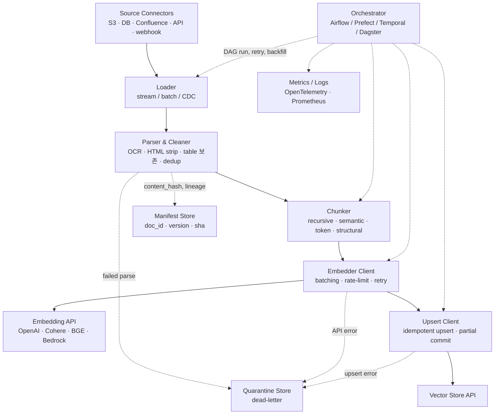
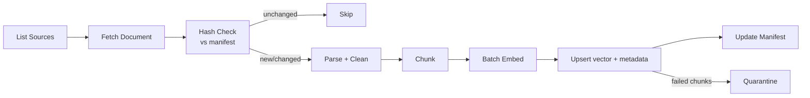

# RAG Data Ingestion Architecture — Pipeline 중심

## Core summary

RAG 인제션 파이프라인은 원본 source → vector store까지 데이터를 흘리는 **offline batch/stream ETL 시스템**이며, orchestration·throughput·error handling·observability가 핵심 운영 차원이다. 일반 ETL과 다른 점은 단계마다 LLM/embedding API 비용·latency가 dominant cost이고, chunking 결정이 retrieval 품질에 비가역적으로 반영된다는 점이다.

- **5단계 DAG**: Load → Parse/Clean → Chunk → Embed → Upsert. 각 단계가 독립 retry·rate-limit·idempotency 정책을 가짐
- **비용·latency의 bottleneck은 embedding 단계**: 외부 API 호출이 가장 비싸고 가장 느림 → batching·캐싱·동시성이 운영 핵심
- **Failure mode의 비대칭성**: load·parse는 fail-fast가 안전, embed·upsert는 partial success를 견뎌야 함 (chunk 1개 실패가 doc 전체 재처리를 강제하면 비용 폭증)
- **상태가 있는 ETL**: 일반 ETL과 달리 chunk 단위의 stable identifier와 manifest store를 유지해야 incremental update가 성립

## System architecture

Pipeline은 orchestrator가 지휘하는 5단계 DAG와, 각 단계에서 분기되는 **side store**(manifest / quarantine / metrics)로 구성된다.

## Processing flow

DAG 한 사이클의 실제 처리 순서. 각 단계의 출력은 다음 단계의 입력이자 manifest의 갱신 신호.

1. **List**: source connector가 후보 문서 목록을 반환 (page token / cursor 사용)
2. **Fetch**: 원본 byte/stream을 가져와 staging area에 적재
3. **Hash check**: manifest의 이전 content_hash와 비교 → unchanged면 skip해 비용 절감
4. **Parse/Clean**: 포맷별 텍스트 추출, encoding 정규화, near-dup 제거
5. **Chunk**: 토큰 한도와 semantic 경계 사이에서 분할 (보통 400~1,000 tokens + 10~20% overlap)
6. **Batch embed**: chunk를 batch(보통 50~200개)로 묶어 embedding API 호출, rate-limit·retry 적용
7. **Upsert**: stable `chunk_id`로 vector + metadata 적재 (replace semantics)
8. **Manifest update**: doc_id·version·hash·indexed_at 기록 → 다음 사이클의 입력

## Core features and services

| Component | 책임 | 운영 결정 변수 |
|---|---|---|
| Source connector | 외부 시스템 인증·페이지네이션·cursor 관리 | rate-limit, OAuth refresh, change feed 지원 여부 |
| Loader | byte 스트림 안정 fetch, retry | concurrency, timeout, staging 위치 |
| Parser / Cleaner | 포맷별 텍스트 추출, OCR, dedup | OCR 엔진 선택, table·code block 보존 정책 |
| Chunker | semantic 경계 + 토큰 한도 trade-off | chunk size, overlap, splitter 알고리즘 |
| Embedder client | batching, rate-limit, retry, 동시성 | batch size, max concurrency, backoff |
| Upsert client | idempotent write, partial commit | batch size, ack 정책, error mapping |
| Manifest store | doc·chunk lineage, hash, version | DB 선택(Postgres/DynamoDB), TTL |
| Orchestrator | DAG, schedule, retry, backfill | Airflow vs Prefect vs Temporal vs Dagster |
| Observability | step-level metrics, traces, cost | OpenTelemetry span 단위, 비용 attribution |

## Similar technology comparison

같은 RAG 인제션을 구현하는 방식이지만 운영 모델이 다른 4가지 접근.

| Item | Airflow + 커스텀 DAG | Temporal workflows | LangChain / LlamaIndex 내장 인제스터 | Unstructured.io / Airbyte 같은 ETL 서비스 |
|---|---|---|---|---|
| 모델 | task DAG, scheduler 중심 | durable workflow, code-first | high-level API, prototype 친화 | managed connector, 운영 위탁 |
| 강점 | 풍부한 operator, 운영 익숙함 | failure resilience, long-running step, exactly-once | 빠른 시작, vector store 어댑터 풍부 | connector 다수, 운영 부담 낮음 |
| 약점 | LLM 비용 attribution이 task 단위라 거칠다 | learning curve, scheduler 부재 | production 운영 기능(backfill·DLQ) 부족 | 비용·잠금·세밀한 제어 부족 |
| 적합 시나리오 | 기존 Airflow 운영팀 | exactly-once 필요, 외부 API 다수 | PoC·중소 규모 | 다수 SaaS connector 필요, 빠른 도입 |

## Real-world cases

### Unstructured.io continuous ingestion 사례
Confluence·Google Docs·support ticket을 source로 한 production 사례에서 webhook + 정기 polling을 결합해 변경 감지 → hash 비교 → 변경된 doc만 재처리하는 패턴을 표준으로 제시. Quarantine store로 parse 실패 문서를 격리해 부분 실패가 전체 DAG를 막지 않게 설계.

### n8n RAG system architecture
n8n 블로그가 공개한 production guide는 ingestion을 separate workflow(node sequence)로 두고 retrieval과 분리한 패턴을 권장. 각 노드(load·chunk·embed·upsert)가 독립 retry·error handler를 가지며, embedding API 호출 비용을 노드 단위로 추적해 cost dashboard로 시각화.

## Use scenarios

### Scenario 1: 대용량 batch 인제션 (PDF 수십만 건)
- **Context**: 컴플라이언스 문서 corpus를 1회 적재 후 월 1회 backfill
- **선택**: Airflow + KubernetesPodOperator로 parser·embedder를 수평 확장
- **운영 포인트**: embedding batch size를 64~128로 잡고, 동시 pod 수와 vendor rate-limit을 맞춰 throughput 확보. 실패 chunk는 DLQ로 보내 야간 재시도 DAG에서 정리

### Scenario 2: 실시간 incremental 인제션
- **Context**: GitHub push / Confluence edit 이벤트마다 즉시 반영
- **선택**: Temporal workflow + webhook trigger. workflow가 hash 비교 → 변경 chunk만 처리
- **운영 포인트**: workflow 단위 retry가 exactly-once를 보장해 중복 upsert 방지. embedding API 장애 시 workflow가 sleep 후 자동 재개

### Scenario 3: 하이브리드 (정기 backfill + 실시간 동기화)
- **Context**: 평시는 webhook 기반 incremental, 주 1회 full reconciliation
- **선택**: 두 DAG (incremental / reconciliation)를 분리하고 manifest store를 공유
- **운영 포인트**: reconciliation DAG가 manifest와 vector store를 비교해 drift(누락·고아 chunk)를 보정. embedding 비용 spike를 막기 위해 reconciliation은 rate-limited

## Pros and Cons & Trade-off

| Item | Detail |
|---|---|
| Pros | DAG 분리로 retry·backfill·관측성이 표준화. Manifest 기반 hash check로 embedding 비용을 가장 크게 절감 |
| Cons | 단계 수가 많아 operational surface가 큼 — connector·orchestrator·embedding vendor·vector store가 각각 SLA를 가짐. 단계 간 contract(chunk_id, schema) 변경이 비용을 유발 |
| Trade-off | **Batch vs Stream**: batch는 비용·throughput에 유리, stream은 신선도에 유리. 대부분 production은 hybrid (실시간 webhook + 야간 reconciliation)로 수렴 |

## Pitfalls / Anti-patterns

- **모든 사이클마다 전체 corpus 재임베딩**: embedding API 비용이 선형 증가 → hash check 단계를 빠뜨리지 말고, content_hash로 skip 비율을 모니터링
- **embed → upsert를 한 task로 묶기**: API 호출 실패 시 이미 임베딩된 chunk를 버리고 다시 호출 → embed와 upsert를 별도 task로 분리하고 중간 결과(임베딩 vector)를 staging에 보관
- **DLQ 없는 DAG**: parse 실패 1건이 DAG 전체 fail → quarantine store + 별도 재처리 DAG로 분리, success rate metric으로 감시
- **orchestrator 재시작에 의존하는 retry**: scheduler 장애 시 in-flight job이 사라짐 → workflow durability(Temporal)나 task 상태를 외부 store에 영속화
- **chunking 결정을 코드에 하드코딩**: 모델·도메인 변경 시 chunker 코드 수정 → chunker config를 manifest에 함께 기록해 어떤 파라미터로 만든 chunk인지 재현 가능하게 유지
- **observability 단위가 너무 거칠다**: "DAG 성공/실패"만 보면 embedding 비용 spike를 놓침 → step 단위로 token·cost·latency span을 OpenTelemetry로 emit

## References

- [Building Production RAG: Architecture, Chunking, Evaluation & Monitoring (2026 Guide) (premai.io)](https://blog.premai.io/building-production-rag-architecture-chunking-evaluation-monitoring-2026-guide/) — production RAG 파이프라인의 단계별 모니터링·평가 지침
- [Best Practices for Implementing RAG Systems in Production (Unstructured)](https://unstructured.io/insights/rag-systems-best-practices-unstructured-data-pipeline) — 인제션 단계별 best practice + DLQ·quarantine 패턴
- [Incremental and Continuous Data Ingestion Strategies (Unstructured)](https://unstructured.io/insights/incremental-data-ingestion-strategies-for-continuous-pipelines) — webhook + polling 하이브리드 incremental 전략
- [RAG System Architecture: A Production Implementation Guide (n8n Blog)](https://blog.n8n.io/rag-system-architecture/) — workflow 기반 인제션 + retrieval 분리 사례
- [How to Build a RAG Pipeline from Scratch in 2026 (kapa.ai)](https://www.kapa.ai/blog/how-to-build-a-rag-pipeline-from-scratch-in-2026) — 2026년 production RAG 구성요소 정리
- [RAG Pipeline Deep Dive: Ingestion, Chunking, Embedding, and Vector Search (Medium)](https://medium.com/@derrickryangiggs/rag-pipeline-deep-dive-ingestion-chunking-embedding-and-vector-search-abd3c8bfc177) — 단계별 구현 디테일
