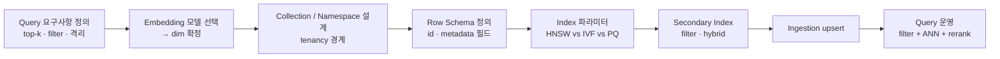

# RAG Data Ingestion Architecture — Vector DB Schema 설계

## Core summary

RAG의 vector store 스키마는 **`id` + `vector(dim)` + `metadata payload`**를 한 단위로 묶고, 그 위에 ANN 인덱스(HNSW / IVF / 양자화)와 multi-tenancy 경계(namespace / collection / shard)를 얹어 query-time filtered similarity search를 가능하게 하는 데이터 모델이다. RDB의 테이블 설계가 query 패턴에서 출발하듯, vector schema도 **검색 시점의 filter·격리·top-k 요구**에서 역으로 설계해야 한다.

- **3개 layer로 분리**: 데이터 layer(vector + metadata), 인덱스 layer(HNSW/IVF/quantization), 격리 layer(tenant/namespace)
- **Metadata는 인덱스 비용**: filter용 필드는 보통 별도 인덱스를 생성해야 빠른 pre/post filtering 가능 → 모든 필드를 metadata에 넣으면 메모리·latency 비용 발생
- **인덱스 선택은 데이터 동역학에 종속**: 자주 insert/delete되는 corpus는 HNSW, 거의 정적인 대규모 corpus는 IVF + quantization이 일반적
- **Stable id가 스키마의 contract**: id 설계가 idempotency·재인제션·삭제 시맨틱을 지배 — 보통 `chunk_id = hash(doc_id, chunk_idx, content_sha)`

## System architecture

Vector store는 collection·index·tenant 경계를 명시하는 **선언적 데이터 모델**이며, 그 안에 `id`/`vector`/`metadata`가 row 단위로 들어간다.

```mermaid
graph TD
    subgraph Tenant[Tenancy Layer]
        T1[Namespace / Shard A<br/>tenant: customer-1]
        T2[Namespace / Shard B<br/>tenant: customer-2]
    end

    subgraph Collection[Collection / Index Definition]
        C[vector_dim: 1536<br/>metric: cosine<br/>index: HNSW M=16 ef=200<br/>distance: cosine]
        T1 --> C
        T2 --> C
    end

    subgraph Row[Row Schema]
        R[id : str/uuid<br/>vector : float32[dim]<br/>metadata : payload]
    end

    C --> R

    subgraph Meta[Metadata Payload]
        M1[doc_id]
        M2[chunk_idx]
        M3[content_sha]
        M4[source / lang / acl_tags]
        M5[indexed_at / version]
        M6[searchable text<br/>for hybrid]
    end

    R --> M1
    R --> M2
    R --> M3
    R --> M4
    R --> M5
    R --> M6

    subgraph Indexes[Secondary Indexes]
        S1[Vector ANN<br/>HNSW / IVF / PQ]
        S2[Metadata filter index<br/>payload indexes]
        S3[Full-text / sparse<br/>BM25 / SPLADE for hybrid]
    end

    C --> S1
    C --> S2
    C --> S3
```

## Processing flow

스키마 결정은 ingestion이 시작되기 전 **선언 단계**에서 이뤄지고, 이후 query·운영 정책이 그 위에서 동작.



1. **요구사항에서 출발**: 어떤 필터(tenant, source, time)·top-k·격리가 필요한지 정의
2. **dim 확정**: embedding 모델이 vector 차원을 결정 (OpenAI 3-large=3072, BGE=1024 등)
3. **Tenancy 경계**: tenant·환경·데이터 종류별로 namespace / collection / shard 분리
4. **Row schema**: id 규칙 + metadata 필드 카탈로그 (searchable / filter / 보존용 분리)
5. **Index 파라미터**: HNSW(M·efConstruction·ef) 또는 IVF(nlist·nprobe), PQ/SQ 적용 여부
6. **Secondary index**: 필터 필드는 payload index, hybrid는 sparse(BM25/SPLADE) 인덱스
7. **운영**: 모델 교체·필드 추가 시 새 collection을 만들고 dual-write로 migration

## Core features and services

| 스키마 요소 | 정의 | 운영 영향 |
|---|---|---|
| `id` | row의 unique key. 보통 `hash(doc_id + chunk_idx + content_sha)` | upsert idempotency, 삭제·교체 |
| `vector(dim)` | float32 array, dim은 embedding 모델에 종속 | storage, ANN 인덱스 메모리 |
| Metric | cosine / dot / L2. 보통 normalize 후 cosine | recall, latency 일관성 |
| `doc_id` | 원본 문서의 stable id | 문서 삭제·재인제션 단위 |
| `chunk_idx` | doc 내 분할 순번 | 원본 위치 복원, ordering |
| `content_sha` | chunk text의 hash | 변경 감지, deterministic id |
| `source` / `lang` / `acl_tags` | 필터·권한 필드 | 격리, ACL, hybrid filter |
| `indexed_at` / `version` | 시간·버전 | freshness, rollback |
| HNSW (M, efConstruction, ef) | graph 기반 ANN | 빠른 insert/delete, 메모리 많이 사용 |
| IVF (nlist, nprobe) | 클러스터 기반 ANN | 메모리 절약, 대규모·정적 corpus |
| PQ / SQ (양자화) | vector 압축 | 메모리 절감, 약간의 recall 손실 |
| Namespace / Tenant | 논리·물리 격리 | multi-tenant 권한, blast-radius 제한 |

## Similar technology comparison

같은 row schema 개념이라도 vendor별 표현·강제력이 다르다.

| Item | Pinecone Serverless | Weaviate | Qdrant | pgvector (Postgres) |
|---|---|---|---|---|
| 스키마 표현 | namespace + metadata dict (loose) | class + property (strong typed) | collection + payload (loose~typed) | SQL DDL + vector 컬럼 |
| Vector field | vector_dim per index | vectorizer module 옵션 (자동 임베딩) | named vectors (multi-vector) | `vector(dim)` 컬럼 |
| Metadata 필터 | 동적 payload + selective index | property type 명시, 인덱스 자동 | payload index (수동 추가) | SQL 인덱스(B-tree, GIN 등) |
| 인덱스 알고리즘 | 자체 ANN (managed) | HNSW (옵션 flat) | HNSW + quantization (binary/SQ/PQ) | HNSW / IVFFlat (pgvector 0.5+) |
| Multi-tenancy | namespace (partition per tenant) | multi-tenancy mode (per-tenant shard) | collection or payload filter | schema-per-tenant 또는 RLS |
| Hybrid search | sparse-dense (`pinecone-text`) | BM25 + vector 내장 | sparse vector field 지원 | `tsvector` + vector |
| 적합 시나리오 | SaaS 다테넌트, 운영 단순 | 강한 스키마·hybrid 우선 | 고성능, 자기호스팅, multi-vector | 기존 Postgres 자산 통합 |

## Frequently confused concepts (스키마 관점)

| 이 개념 | 헷갈리는 대상 | 핵심 차이 |
|---|---|---|
| Collection / Index | Namespace / Tenant | Collection은 데이터 모델 정의 단위, Namespace는 같은 collection 내 격리 단위 |
| Metadata filter | Payload | "Payload"는 row에 매달리는 모든 부가 데이터, "Metadata filter"는 그중 인덱싱되어 filtered search에 쓰이는 부분집합 |
| HNSW · IVF | PQ · SQ | 전자는 **인덱스 구조**(데이터를 어떻게 조직), 후자는 **압축 기법**(vector를 어떻게 줄임). 둘은 직교 — 보통 함께 사용 |

## Real-world cases

### Pinecone serverless의 namespace per tenant 패턴
Pinecone 공식 가이드는 SaaS 환경에서 customer별 namespace를 두는 것을 multi-tenancy의 1차 선택지로 제시. 같은 index 안에서 namespace로 partition을 나누고, query는 namespace를 명시해 다른 tenant 데이터 누출을 원천 차단. 인덱스 1개로 수만 namespace까지 확장 가능.

### Oracle DB의 vector-native 스키마 (HNSW + IVF 선택지)
Oracle Database 23ai가 vector 컬럼을 1급 시민으로 도입하면서, 같은 테이블에 HNSW와 IVF를 선택 가능하게 설계. metadata는 일반 SQL 컬럼으로 두고, vector ANN과 SQL predicate를 같은 optimizer가 결합 평가. governance(audit, RLS)를 RDB 자산 그대로 활용.

## Use scenarios

### Scenario 1: SaaS 다테넌트 지식베이스
- **요구사항**: 1만+ customer, customer별 데이터 격리, 검색 시 cross-tenant leakage 0
- **스키마**: 1 collection + tenant당 namespace, metadata에 `tenant_id`도 중복 저장(방어선), HNSW (M=16, efConstruction=200), cosine
- **이유**: 인덱스 수 폭증을 피하면서 격리 보장, 신규 tenant 온보딩은 namespace 생성으로 O(1)

### Scenario 2: 정적 대용량 corpus (검색 비용 최적화)
- **요구사항**: 10억+ chunk, 변경 거의 없음, 메모리 비용이 1순위
- **스키마**: IVF + PQ (nlist=4096, nprobe=64, PQ subvectors=64), metadata는 필수 필드 5개로 최소화
- **이유**: HNSW는 graph 전체를 메모리 상주 — 10억 규모는 비현실적. IVF + PQ로 메모리 1/8 수준

### Scenario 3: 빈번한 갱신 + hybrid search
- **요구사항**: 매일 수만 chunk 갱신, keyword + semantic 동시 검색
- **스키마**: HNSW + sparse field(BM25/SPLADE), metadata에 `updated_at`·`acl_tags` 인덱스
- **이유**: HNSW가 insert/delete 친화적, sparse + dense 하이브리드로 keyword 정확도 보완

## Pros and Cons & Trade-off

| Item | Detail |
|---|---|
| Pros | 명시적 스키마는 운영 governance·rollback·hybrid search를 가능하게 함. id·hash 규칙을 강제해 idempotency 확보 |
| Cons | 스키마 변경이 비싸다 — 필드 추가는 대부분 가능하지만, dim 변경·tenant 모델 변경은 사실상 새 collection을 만들고 backfill해야 함 |
| Trade-off | **Strong schema(Weaviate) vs Loose payload(Pinecone, Qdrant)**: 전자는 일관성·hybrid에 유리, 후자는 evolution 속도에 유리. **HNSW vs IVF+PQ**: 신선도/QPS vs 메모리/규모 |

## Pitfalls / Anti-patterns

- **모든 raw text를 metadata에 적재**: 필터·인덱스 비용이 폭증 → searchable metadata와 보존용 doc store(S3·Postgres)를 분리, vector store에는 필터 키와 short text만
- **dim mismatch를 런타임에 발견**: embedding 모델 교체 시 collection이 거부 → CI에서 embedding 모델 dim과 collection 정의를 assert
- **무거운 PQ를 작은 corpus에 적용**: 100만 미만에서는 PQ의 recall 손실이 메모리 이득보다 큼 → 규모에 맞춰 양자화 결정 (보통 1억+에서 의미)
- **tenant 격리를 metadata filter만으로 처리**: 코드 결함 1개가 cross-tenant 누출 → namespace/shard 레벨의 물리 격리를 1차 방어선, metadata filter는 2차
- **chunk_id = uuid4 같은 비결정적 id**: 재인제션마다 중복 row 생성 → 항상 deterministic hash 기반 id
- **HNSW ef를 빌드와 쿼리에서 같은 값 사용**: efConstruction은 빌드 품질, ef(=ef_search)는 쿼리 정확도/latency — 별도 튜닝 필요

## References

- [Vector Database Basics: HNSW (Tiger Data)](https://www.tigerdata.com/blog/vector-database-basics-hnsw) — HNSW의 동작 원리와 IVF 대비 trade-off
- [Vector‑native RAG on Oracle: embeddings, HNSW/IVF, and hybrid search (Oracle Blogs)](https://blogs.oracle.com/developers/vector%E2%80%91native-rag-on-oracle-embeddings-hnsw-ivf-and-hybrid-search-under-database-governance) — vector 컬럼·HNSW·IVF·hybrid의 통합 스키마 관점
- [Using HNSW Vector Indexes in AI Vector Search (Oracle Blogs)](https://blogs.oracle.com/database/using-hnsw-vector-indexes-in-ai-vector-search) — HNSW 파라미터(M, efConstruction, ef) 운영 가이드
- [Pinecone vs Weaviate vs Qdrant vs pgvector (Second Talent, 2026)](https://www.secondtalent.com/resources/pinecone-vs-weaviate-vs-qdrant-vs-pgvector/) — 4개 vector DB의 스키마·인덱스·multi-tenancy 비교
- [Best Vector Databases in 2026: Pricing, Scale Limits, and Architecture Tradeoffs (MarkTechPost)](https://www.marktechpost.com/2026/05/10/best-vector-databases-in-2026-pricing-scale-limits-and-architecture-tradeoffs-across-nine-leading-systems/) — 9개 vector store의 데이터 모델·스케일 한계
- [What Is a Vector Database? Governance Guide [2026] (Atlan)](https://atlan.com/know/what-is-a-vector-database/) — vector·metadata payload·ANN 인덱싱·필터의 통합 설명
