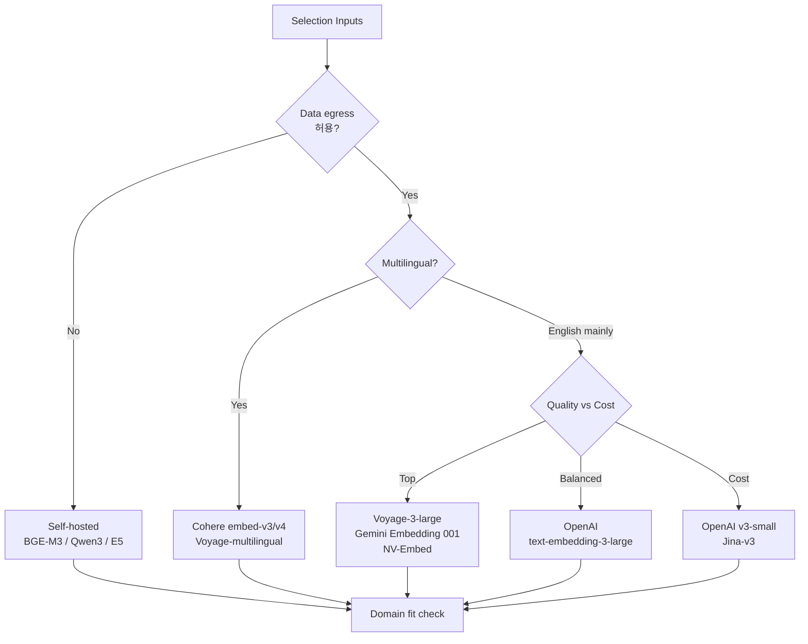
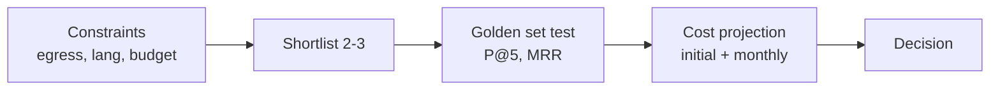

# RAG Data Ingestion — Embedding (Model Selection focus)

## Core summary

RAG ingestion 단계에서 어떤 임베딩 모델을 채택할지의 의사결정을 정리하는 노트다. 후보군은 크게 commercial API(OpenAI/Cohere/Voyage/Titan)와 OSS(BGE/E5/Qwen/Jina)로 나뉘며, 선택축은 retrieval 품질·언어·차원·단가·운영 형태(managed vs self-host)다.

- **단일 정답 없음**: 최상위 모델조차 도메인 적합도 차이가 크다 — leaderboard만 보고 결정하지 말 것
- **모델은 lock-in**: 교체는 전량 re-embedding이므로 결정의 비용이 큼 (운영 비용 노트 참조)
- **3개 카테고리**: top quality(Voyage·Gemini Embedding·NVIDIA NV-Embed) / cost-efficient(OpenAI v3-small·Jina-v3) / self-host(BGE-M3·Qwen3·E5)

## System architecture

선택 결정은 사용 환경(VPC/오픈), 언어, 도메인 3축의 매핑이다.

## Processing flow

후보 좁히기 → 후보 평가 → 최종 결정의 3단계 의사결정 흐름이다.

1. **Constraint filtering**: 데이터 egress 가능성, 필수 언어 커버리지, monthly token budget으로 후보 1차 컷
2. **Shortlist**: 2~3개로 좁힘. MTEB는 참고만, 도메인 적합도가 우선
3. **Golden set 평가**: 도메인 Q&A 50~200건으로 Precision@5, MRR 비교 (품질 평가 노트 참조)
4. **비용 산정**: 초기 적재(corpus 토큰 × 단가) + 월 증분 + storage 차원 환산
5. **결정**: 품질 회귀가 허용 범위면 더 저렴한 쪽

## Core features and services

| Model | Provider | Dim (default) | Context | 단가 ($/1M tokens) | 강점 |
|---|---|---|---|---|---|
| text-embedding-3-large | OpenAI | 3072 (256~3072 가변) | 8191 | $0.13 | 균형, Matryoshka, 광범위 ecosystem |
| text-embedding-3-small | OpenAI | 1536 (가변) | 8191 | $0.02 | 비용 효율 기본값 |
| embed-multilingual-v3.0 | Cohere | 1024 | 512 | $0.10 | 다국어 100+, input_type asymmetric |
| embed-v4 | Cohere | 가변 (matryoshka) | 늘어남 | (변동) | 최신 multilingual SOTA |
| voyage-3-large | Voyage AI | 1024 | 32K | (상대적 고가) | 최상위 retrieval 품질 |
| amazon.titan-embed-text-v2:0 | AWS | 1024 (256/512/1024) | 8192 | (Bedrock 가격) | 다국어 100+, AWS 통합, Matryoshka |
| BGE-M3 | BAAI (OSS) | 1024 | 8192 | self-host | dense+sparse 동시, 다국어, 한국어 강 |
| Qwen3-Embedding | Alibaba (OSS) | 변동 | 32K | self-host | 최신 OSS top, MTEB 상위 |
| Jina-embeddings-v3 | Jina AI | 1024 | 8192 | $0.02 | 가격대비 품질, multilingual |
| Gemini Embedding 001 | Google | 가변 | 2048 | (Vertex 가격) | English MTEB 상위 (~68.32) |

## Similar technology comparison

| Item | OpenAI v3-large | Cohere embed-v3 | Titan v2 | BGE-M3 (OSS) |
|---|---|---|---|---|
| Trait | Matryoshka, 균형, 가장 보편적 | input_type asymmetric, rerank 연계 | AWS 통합, Matryoshka | dense+sparse, self-host |
| Pros | Eco-system 크고 latency 낮음 | Query/Doc 비대칭 인코딩으로 retrieval 정밀 | Bedrock·VPC 친화, 비용 예측 쉬움 | 데이터 외부 유출 없음, 단가 0, 도메인 fine-tune 자유 |
| Cons | 데이터 외부 전송, lock-in | 영문 외 latency 약간 큼 | AWS 외부 사용 불편 | 인프라 운영 부담, latency 본인 책임 |
| Best fit | 일반 RAG/실험 단계 기본값 | Cohere rerank-v3와 결합한 high-quality retrieval | AWS 중심 stack | 보안·도메인 fine-tuning 요구 환경 |

## Real-world cases

### MyEngineeringPath — OpenAI vs Cohere vs OSS 실측
실험 결과 retrieval 품질 차이는 일반 도메인에서 5~10%p 수준이고, 도메인 특화(법률·의료)에서 그 폭이 더 커진다는 결론. 가격은 자릿수 차이(OpenAI ≪ Voyage)라 단순 leaderboard보다 ROI 계산이 결정적이다.

### Particula — 도메인 적합도 우선
법률·의료 등 특수 도메인에서는 SOTA managed 모델보다 BGE-M3 + 도메인 fine-tuning이 더 좋은 retrieval을 내는 사례. "테스트하지 않으면 선택은 도박"이라는 메시지.

## Use scenarios

### Scenario 1: 실험/PoC 단계의 빠른 시작
**컨텍스트**: 모델 비교 데이터가 아직 없음, 빠른 prototype 필요  
**선택**: OpenAI `text-embedding-3-small`. 단가 $0.02, 1536 dim 가변, 8K context — 거의 모든 use case에 적합한 기본값  
**다음 단계**: 출시 전 도메인 golden set으로 v3-large/Cohere/BGE-M3 비교

### Scenario 2: 한국어 + 영어 cross-lingual
**컨텍스트**: 한국어 사내 위키 + 영문 기술문서 동시 검색  
**선택**: BGE-M3 (self-host) 또는 Cohere `embed-multilingual-v3.0` (managed). BGE-M3는 한국어 임베딩 벤치마크에서 상위권, 단가 0, dense+sparse 모두 제공  
**참고**: KoE5, Solar Embedding 같은 한국어 특화 모델도 후보 — 도메인 따라 검증 필수

### Scenario 3: 데이터 egress 불가 (금융·헬스케어)
**컨텍스트**: 사내 데이터 외부 API 전송 금지  
**선택**: BGE-M3 또는 Qwen3-Embedding self-host (vLLM, Text Embeddings Inference 등). 인프라 비용은 들지만 단가는 0, fine-tuning 자유  
**보강**: 임베딩 단가가 0이라도 GPU·운영 비용이 들기 때문에 corpus 규모에 따라 손익분기점 산정 필요

## Pros and Cons & Trade-off

| 항목 | 내용 |
|---|---|
| Pros | • 후보가 풍부 — managed/OSS, 영문/다국어, 비용/품질 스펙트럼 넓음 • Matryoshka 모델 등장으로 차원·비용 trim 가능 • 도메인 fine-tuning 비용이 LLM 대비 저렴 (임베딩 모델은 가볍다) |
| Cons | • Lock-in 강함 — 교체 = 전량 re-embed • MTEB 단일 점수가 도메인 성능을 보장하지 않음 • 다국어 모델은 단일 언어 전용 대비 약간 손해 • 단가 자릿수 차이로 corpus 크기에 따라 의사결정 뒤집힘 |
| Trade-off | • **Top quality vs Cost**: Voyage-3-large ≫ OpenAI v3-large ≫ v3-small — 5~10%p 품질 vs 10x 비용 차이 • **Managed vs Self-host**: 운영 부담 ↔ 데이터 통제·lock-in 회피 • **Multilingual vs English-only**: 통합 운영 ↔ 단일 언어 성능 우위 • **Dense-only vs Dense+Sparse**: 단순 ↔ hybrid retrieval에서 sparse도 함께 제공(BGE-M3) |

## Pitfalls / Anti-patterns

- **Anti-pattern 1: MTEB 점수만 보고 선정** → 도메인 적합도 차이가 크고 MTEB v1↔v2 비교 불가 → 자체 golden set으로 P@5, MRR 측정 후 결정
- **Anti-pattern 2: query/document 같은 input_type 사용 (Cohere)** → asymmetric 모델 강점 무력화 → ingestion 시 `search_document`, query 시 `search_query`
- **Anti-pattern 3: 다국어 vs 영문 모델을 a/b 없이 결정** → 영문만 쓰는데 multilingual 채택해 latency·정확도 손해 → 실제 트래픽 분포 확인
- **Anti-pattern 4: 차원을 최대치로 고정** → 3072 dim 저장 = 4x storage, 4x 검색 비용 → Matryoshka는 1024 또는 512 trim, 회귀 측정 후 채택
- **Anti-pattern 5: 단가만 비교, infra/migration 비용 누락** → self-host의 GPU·운영비, lock-in 교체비용 미계산 → 12개월 TCO로 비교

## References

- [Embeddings Comparison — OpenAI vs Cohere vs OSS (MyEngineeringPath)](https://myengineeringpath.dev/tools/embeddings-comparison/) — 2026년 6모델 50K 문서 실측 비교
- [Best Embedding Models 2026 (Mixpeek)](https://mixpeek.com/curated-lists/best-embedding-models) — 모델별 차원/단가/MTEB 정리
- [Embedding Model Leaderboard MTEB March 2026](https://awesomeagents.ai/leaderboards/embedding-model-leaderboard-mteb-march-2026/) — 최신 MTEB v2 리더보드 스냅샷
- [NVIDIA Text Embedding Model Tops MTEB Leaderboard](https://developer.nvidia.com/blog/nvidia-text-embedding-model-tops-mteb-leaderboard/) — NV-Embed 69.32 사례
- [Best Embedding Models for RAG in 2026 (StackAI)](https://www.stackai.com/insights/best-embedding-models-for-rag-in-2026-a-comparison-guide) — RAG 관점의 모델 매트릭스
- [Comparing Cohere, Amazon Titan, OpenAI Embedding Models](https://medium.com/@aniketpatil8451/comparing-cohere-amazon-titan-and-openai-embedding-models-a-deep-dive-b7a5c116b6e3) — 3대 managed 모델 deep dive
- [한국어 임베딩 모델 (PyTorchKR)](https://discuss.pytorch.kr/t/topic/8180) — 국문, Solar/BGE-M3/KoE5 비교
