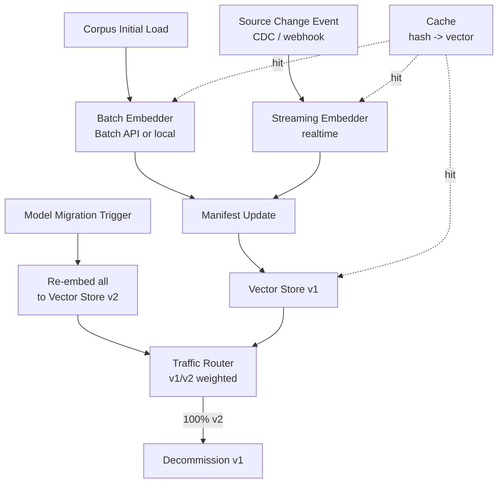
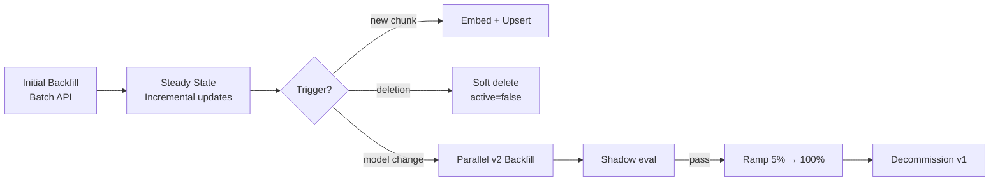

# RAG Data Ingestion — Embedding (Operations focus)

## Core summary

RAG ingestion의 embedding 단계를 **프로덕션에서 운영하는** 시점의 결정과 패턴을 정리하는 노트다. 비용 절감(batch/cache), 변경 처리(incremental), 모델 교체(re-embedding migration), 차원·latency 통제가 핵심 주제다.

- **임베딩이 비용의 절반**: 프로덕션 RAG에서 embedding 비용이 전체의 40~60%, ingestion 파이프라인 실행 시간의 93% 이상 차지
- **Batch API의 효과가 큼**: 동일 corpus를 batch 처리하면 50% 절감 (예: 100K docs 50M tokens, $1.00 → $0.50)
- **Hybrid batch + incremental**: 초기 적재는 batch, 운영 단계 변경은 event-driven incremental
- **Migration은 parallel-run**: in-place 교체 불가 — 새 인덱스에 병렬 적재 → traffic ramp-up → 구버전 폐기

## System architecture

운영 architecture는 batch backfill 경로와 streaming incremental 경로가 manifest를 공유하는 dual-path 구조다.

## Processing flow

운영 단계의 가장 흔한 5가지 흐름을 시간 순서로 묶은 시퀀스다.

1. **Initial Backfill**: 전체 corpus를 Batch API로 일괄 임베딩 — 50% 비용 절감, latency 무관
2. **Steady State**: 새 문서/수정만 incremental — content hash dedup, 100~1000 단위로 micro-batch
3. **Soft delete**: 원본 삭제 시 `active=false` 메타로 표시 (소급 영향 검토용 보존)
4. **Model migration**: v2 인덱스 병렬 backfill → shadow query로 평가 → 점진 ramp-up
5. **Decommission**: ramp-up 완료 후 v1 인덱스 archive/삭제

## Core features and services

| Feature | Description |
|---|---|
| Batch API (OpenAI / Cohere / Anthropic) | 비동기 큐 처리, 24h SLA, 50% 단가 (예: OpenAI Batch) |
| Content-hash dedup | 동일 chunk content는 이미 임베딩된 벡터를 재사용 — 캐시 hit rate 30~50% 흔함 |
| Collection versioning | `docs_v1`, `docs_v2` 별도 인덱스로 병렬 운영 |
| Async/parallel ingestion | 30분 작업이 2.5분으로 단축된 사례 (92% 개선) — async/await + multi-key 병렬 |
| Dimension parameter | OpenAI v3의 `dimensions` 파라미터로 출력 trim (3072 → 1024 등) — storage·검색비용 비례 절감 |
| Event-driven sync | CDC / webhook으로 원본 변경을 즉시 반영 (pgvector + Debezium 패턴) |
| Soft delete | 삭제 즉시 제거 대신 `active=false` 메타 → 회복 가능, 감사 추적 가능 |

## Similar technology comparison

| Item | Batch backfill | Incremental streaming | Hybrid (batch + incremental) |
|---|---|---|---|
| Trait | 비동기 큐, 대량 처리 | event-driven, low-latency | 초기 batch + 운영 streaming |
| Pros | 단가 50% 절감, throughput 최대 | freshness 우수, 변경 즉시 반영 | 두 장점 결합, 운영 표준 패턴 |
| Cons | 24h 지연 가능, freshness 약함 | 비용 비효율 (단건 embed), throughput 한계 | 두 path 동기화 운영 복잡 |
| Best fit | 최초 적재, 모델 교체 backfill | 운영 단계 신규/수정 처리 | 프로덕션 권장 — Bell 사례 |

## Real-world cases

### Bell Canada — Hybrid batch+incremental (ZenML)
대규모 초기 적재는 batch 처리, 운영 단계의 신규/수정 문서는 event-driven incremental로 처리. 신규 문서가 도착하면 큐로 들어가 micro-batch로 embed → upsert. 모듈성과 확장성 확보 사례.

### Embedding Versioning with pgvector — Event-driven
pgvector에서 doc_id + version + content hash 3-tuple 관리. 같은 doc_id에 새 버전이 들어오면 이전 버전을 `active=false`로 표시하고 새 임베딩을 upsert. Postgres trigger + outbox 패턴으로 일관성 보장.

### open-webui — Async/parallel ingestion 개선 PR
async/await + batching + parallel 적용으로 ingestion 시간을 30분 → 2.5분으로 단축. 임베딩 처리가 파이프라인의 93%를 차지하던 병목이 사라진 사례.

## Use scenarios

### Scenario 1: 모델 교체 (v3-small → v3-large 업그레이드)
**컨텍스트**: retrieval 품질을 5%p 끌어올리고 싶음. 기존 인덱스 10M chunks  
**선택 이유**: in-place 교체는 dimension·semantics 불일치로 중단 위험  
**적용**: ① 새 인덱스 `docs_v2` 생성 ② Batch API로 전량 재임베딩 (50% 절감) ③ shadow eval (P@5, MRR) ④ 5% → 25% → 100% traffic ramp-up ⑤ 회귀 발생 시 즉시 v1로 fallback ⑥ 24~48h 안정화 후 v1 decommission

### Scenario 2: 운영 비용 30% 절감 (CFO 요청)
**컨텍스트**: monthly OpenAI bill 중 임베딩 항목이 매우 큼  
**선택 이유**: embedding이 비용의 40~60%이므로 ROI 큼  
**적용**: ① Batch API 전환 (50%↓) ② content-hash dedup (재계산 회피, 30~50% hit) ③ dimensions 1536→1024 trim (storage 33%↓) ④ Jina v3 또는 v3-small로 후보 모델 다운그레이드 (golden set 평가 후) → 합산 30~60% 절감 가능

### Scenario 3: 실시간 freshness가 중요한 도큐먼트 헬프 데스크
**컨텍스트**: 제품 docs가 매일 업데이트되며 사용자가 즉시 최신 답을 받아야 함  
**선택 이유**: 배치 24h 지연은 SLA 위반  
**적용**: webhook으로 docs 변경 감지 → micro-batch (100 chunks, 30s window) → 즉시 embed + upsert. 동시에 야간 batch로 전체 검증/dedup 정합성 점검

## Pros and Cons & Trade-off

| 항목 | 내용 |
|---|---|
| Pros | • Batch API로 50% 비용 절감 가능 (대규모 corpus 효과 큼) • Cache + dedup으로 30~50% 추가 절감 • Async/parallel로 ingestion 시간을 분 단위로 단축 • Versioning으로 모델 교체를 zero-downtime으로 |
| Cons | • Batch는 24h 지연 SLA — freshness 요건과 충돌 • Hybrid는 두 path 동기화·중복 처리 방지 로직 추가 비용 • 모델 교체는 사실상 전량 재계산 — 단발성 큰 비용 • Self-host는 GPU·운영비가 단가를 대체 (작은 corpus는 손해) |
| Trade-off | • **Batch vs Realtime**: 50% 절감 ↔ freshness 지연 • **Cache 적극성**: hit rate 향상 ↔ 캐시 invalidation 복잡도 • **Dimension trim**: 비용↓ ↔ 품질 회귀 가능 (Matryoshka로 완화) • **Migration ramp-up 속도**: 빠름 = 위험↑ / 느림 = 비용 (이중 인프라 기간)↑ |

## Pitfalls / Anti-patterns

- **Anti-pattern 1: 인덱스 in-place로 모델 교체** → dimension·semantics 불일치로 retrieval 붕괴 → 새 collection(`docs_v2`)에 병렬 적재, traffic ramp-up
- **Anti-pattern 2: dedup 없이 매번 전체 embed** → 비용 폭증, embedding이 ingestion latency 93% 차지 → content-hash manifest로 idempotent ingestion
- **Anti-pattern 3: 단건 동기 embed로 backfill** → 10x 비싼 단가 + throughput 한계 → Batch API 또는 100~1000 batched parallel calls
- **Anti-pattern 4: Soft delete 미적용 (즉시 hard delete)** → 잘못 삭제 시 회복 불가, 감사 추적 불능 → `active=false` 메타로 표시, 일정 기간 후 hard delete
- **Anti-pattern 5: dimensions 파라미터 무시** → 3072 dim 그대로 저장해 storage·검색 비용 4x → Matryoshka 모델은 1024/512로 trim 후 회귀만 확인
- **Anti-pattern 6: 모델 변경을 retrieval eval 없이 진행** → 비용은 줄였지만 품질 회귀를 모름 → shadow eval로 P@5, MRR 변화 측정 (품질 평가 노트 참조)

## References

- [The Economics of RAG: Cost Optimization (TheDataGuy)](https://thedataguy.pro/writing/2025/07/the-economics-of-rag-cost-optimization-for-production-systems/) — embedding이 비용의 40~60% 차지, batch 50% 절감 사례
- [RAG Cost Optimization Strategies (Zenvanriel)](https://zenvanriel.com/ai-engineer-blog/rag-cost-optimization-strategies/) — batch/cache/dimension trim 종합
- [Bell: Hybrid Batch/Incremental RAG (ZenML)](https://www.zenml.io/llmops-database/building-modular-and-scalable-rag-systems-with-hybrid-batch-incremental-processing) — production hybrid 패턴
- [Embedding Versioning with pgvector (dbi-services)](https://www.dbi-services.com/blog/rag-series-embedding-versioning-with-pgvector-why-event-driven-architecture-is-a-precondition-to-ai-data-workflows/) — versioning + event-driven
- [Managing Knowledge Base Updates and Refresh Cycles (APXML)](https://apxml.com/courses/optimizing-rag-for-production/chapter-7-rag-scalability-reliability-maintainability/rag-knowledge-base-updates) — re-embed 운영 패턴
- [Optimize RAG Pipeline with Async/Parallelism/Batching (open-webui PR)](https://github.com/open-webui/open-webui/discussions/13966) — 30분 → 2.5분 단축 사례
- [Embedding APIs for RAG: Cost Implementation Guide (ofox.ai)](https://ofox.ai/blog/embedding-api-rag-complete-guide-2026/) — provider별 비용 비교
