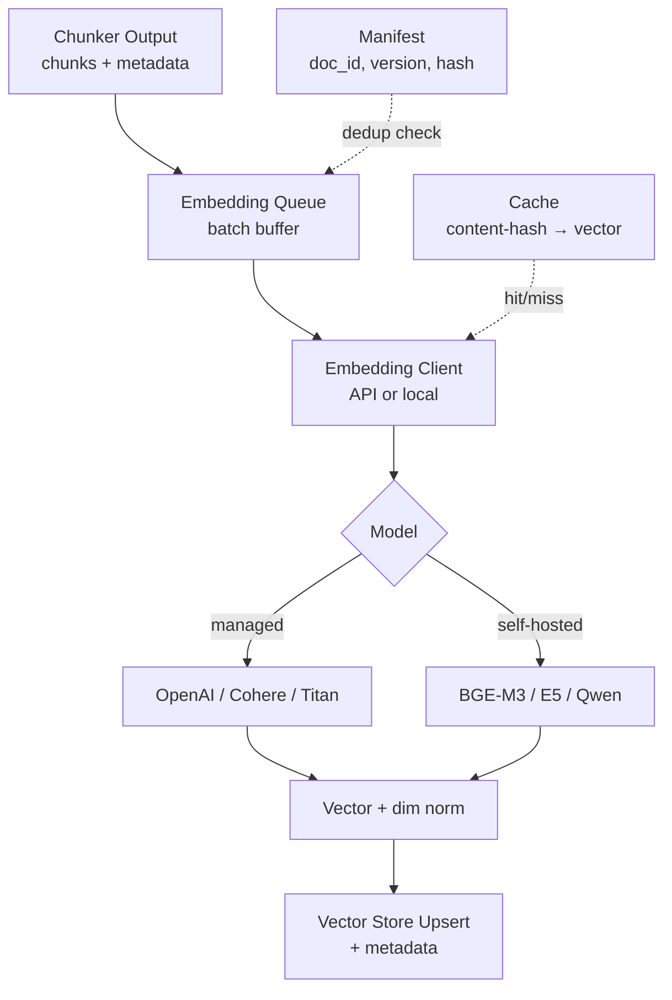
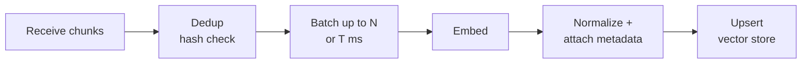

# RAG Data Ingestion — Embedding (Overview)

## Core summary

RAG ingestion 파이프라인에서 chunked 텍스트 조각을 dense vector로 변환하는 단계의 **균형 잡힌 입문 노트**다. Chunking 다음, Vector Store 적재 직전에 위치하며, retrieval 품질과 운영 비용의 1차 결정 요인이다. 상세 주제는 sibling 노트로 위임한다.

- **위치**: Document Loader → Chunking → **Embedding** → Vector Store 의 3번째 단계
- **비용 구조의 큰 부분**: 프로덕션 RAG에서 embedding 비용이 전체의 40~60%를 차지하며, ingestion 파이프라인 실행 시간의 90% 이상을 점유
- **선택은 사실상 lock-in**: 모델 교체 시 전량 re-embedding 필요 — 차원·언어·input_type semantics가 모두 묶임
- **3개 결정축**: 모델 선택(품질·언어·비용) / 운영(batch·incremental·migration) / 품질 평가(MTEB·domain golden set)

## System architecture

Embedding 단계는 chunked 텍스트를 입력 큐로 받아 batched embedder를 거쳐 vector + metadata 쌍을 vector store에 upsert하는 구조다.

## Processing flow

Chunk가 도착한 시점부터 vector store 인덱스에 반영되기까지의 5단계 흐름이다.

1. **Receive**: chunker가 내보낸 chunks + metadata stream 수신
2. **Dedup**: content hash로 이미 임베딩된 chunk skip (re-embedding 비용 회피)
3. **Batch**: provider별 권장 batch size로 묶기 (예: OpenAI 100~2048, Cohere 96)
4. **Embed**: 모델 호출. 동기/Batch API/local inference 중 선택
5. **Upsert**: 벡터 + doc_id/version/source 메타 → vector store. dimension mismatch 시 인덱스 재구축 필요

## Core features and services

| Feature | Description |
|---|---|
| Asymmetric encoding | `input_type` 구분 (search_query vs search_document) — Cohere 대표, 동일 모델로 비대칭 인코딩 |
| Matryoshka representation | 출력 차원 trim (Titan v2: 256/512/1024, OpenAI v3: 256~3072 등) |
| Batched inference | provider별 batch endpoint — 50% 비용 절감 (예: 100K docs $1.00 → $0.50) |
| Cache layer | content-hash 또는 query 캐시 — 프로덕션에서 30~50% hit rate 관찰 |
| Multilingual coverage | Cohere embed-v4, BGE-M3, Voyage-multilingual — 한국어 포함 100+ 언어 |
| Self-hosted option | BGE-M3, E5, Qwen3 등 OSS 모델 — 데이터 외부 전송 회피 |
| Versioning | doc_id + content hash + model version 3-tuple로 incremental sync 보장 |

## Similar technology comparison

| 항목 | Embedding-based retrieval | Sparse / BM25 | Re-ranker (cross-encoder) |
|---|---|---|---|
| Output | Dense vector (의미 공간) | Term frequency vector | Pairwise relevance score |
| 비용 | Embedding API 호출 누적 | 인덱싱 단발성 (낮음) | Query 시점 N개 후보별 계산 (높음) |
| Pros | 의미 매칭, 다국어, paraphrase 강함 | 정확 키워드(제품명·인명) 강함, 인덱싱 저렴 | retrieval 후순위 정렬 품질 극대화 |
| Cons | 임베딩 비용, lock-in, 키워드 매칭 약함 | 동의어·맥락 약함 | 단독 사용 불가, latency 큼 |
| Best fit | 의미 검색·RAG retrieval 기본 | hybrid의 sparse side | retrieval top-K 재정렬 |

## Real-world cases

### Bell Canada — Hybrid batch/incremental RAG (ZenML)
대규모 문서는 batch로 초기 적재하고, 신규/수정 문서는 event-driven incremental update로 처리하는 hybrid 아키텍처. 초기 적재의 비용 효율과 운영 단계의 freshness를 동시에 잡은 패턴이다.

### Particula — Production RAG embedding 선택
도메인 적합도가 leaderboard 점수보다 중요함을 강조. OpenAI/Cohere는 일반 도메인, 법률·의료 등 특수 도메인은 fine-tuning 또는 OSS 모델 직접 학습이 더 나은 경우가 많다.

## Use scenarios

### Scenario 1: Managed API 우선 (속도 우선 스타트업)
**컨텍스트**: 빠른 출시, ML 엔지니어링 리소스 부족  
**선택 이유**: 모델 운영·재학습 부담 없이 SOTA에 근접  
**적용**: OpenAI `text-embedding-3-small` 기본 + Batch API → 비용 50% 절감, 1024 dim으로 축소 저장

### Scenario 2: 자체 호스팅 (보안·비용·도메인 특화)
**컨텍스트**: 사내 데이터 외부 전송 금지, 도메인 fine-tuning 필요  
**선택 이유**: vendor lock-in 회피, 단가 → 0(고정 인프라)  
**적용**: BGE-M3 또는 Qwen3 임베딩을 vLLM/Text Embeddings Inference로 self-host, 도메인 corpus로 contrastive fine-tuning

### Scenario 3: 다국어 운영 (한국어 + 영어 검색)
**컨텍스트**: 한국어 사내 위키 + 영문 기술문서 통합 검색  
**선택 이유**: cross-lingual retrieval 품질이 ROI 결정  
**적용**: Cohere `embed-multilingual-v3.0` 또는 BGE-M3 — 한쪽 언어 query로 다른 언어 문서를 검색하는 use case에서 단일 multilingual 모델이 두 개 모델보다 운영 단순

## Pros and Cons & Trade-off

| 항목 | 내용 |
|---|---|
| Pros | • LLM이 도메인 지식에 접근 가능 — fine-tuning 없이 최신/사내 데이터 활용 • Citation 가능 — 출처 메타데이터로 응답 검증 • 다국어·paraphrase 강함 |
| Cons | • 비용 누적 — embedding이 ingestion 비용의 절반 이상 • 모델 lock-in — 교체 시 전량 재계산 • Chunk 단위로 의미 손실 발생 • 키워드 정확 매칭 약함 → BM25 hybrid 필요 |
| Trade-off | • **차원**: 큰 차원 = 정확도↑·저장/검색비용↑ (Matryoshka로 부분 완화) • **Managed vs Self-hosted**: 운영 부담↓ vs 비용·lock-in 통제↑ • **Batch vs Realtime**: 50% 비용 절감 vs freshness 지연 • **모델 품질 vs 단가**: Voyage-3 = top retrieval / OpenAI v3 = 비용 효율 / BGE-M3 = self-host |

## Pitfalls / Anti-patterns

- **Anti-pattern 1: query/document를 같은 input_type으로 인코딩** → asymmetric 모델(Cohere) 사용 시 retrieval 품질 큰 폭 하락 → ingestion 시 `search_document`, 검색 시 `search_query` 명시
- **Anti-pattern 2: 모델 교체를 in-place로 시도** → 차원·semantics 불일치로 시스템 중단 → 새 인덱스(`docs_v2`)에 병렬 적재 → traffic ramp-up → 구버전 제거
- **Anti-pattern 3: dedup 없이 매번 전체 임베딩** → 비용 폭증, freshness 지연 → content hash 기반 incremental 적재, manifest로 idempotency 보장
- **Anti-pattern 4: 단가만 보고 모델 선정** → 도메인 부적합으로 retrieval 품질 저하 → 최소 한 차례 golden set으로 후보 2~3개 비교 후 결정
- **Anti-pattern 5: dimension 축소 없이 3072 그대로 저장** → 스토리지·검색 latency 비례 증가 → Matryoshka 모델은 256/512/1024로 trim, 품질 회귀만 확인

## References

- [Embedding Pipeline — 2026 Modern AI Search & RAG Roadmap (Nemorize)](https://nemorize.com/roadmaps/2026-modern-ai-search-rag-roadmap/lessons/embedding-pipeline) — embedding 단계 정의와 위치
- [RAG Pipeline Deep Dive: Ingestion, Chunking, Embedding (DEV)](https://dev.to/derrickryangiggs/rag-pipeline-deep-dive-ingestion-chunking-embedding-and-vector-search-2877) — 4단계 책임 정리
- [Choosing Embedding Models for RAG: What Actually Matters in Production (Particula)](https://particula.tech/blog/which-embedding-model-for-rag-semantic-search) — 도메인 적합도 우선 원칙
- [The Economics of RAG: Cost Optimization for Production Systems](https://thedataguy.pro/writing/2025/07/the-economics-of-rag-cost-optimization-for-production-systems/) — embedding이 비용의 40~60% 차지
- [Bell: Hybrid Batch/Incremental RAG (ZenML)](https://www.zenml.io/llmops-database/building-modular-and-scalable-rag-systems-with-hybrid-batch-incremental-processing) — production hybrid 사례
- [임베딩 모델 선택 가이드 — 한국어 벤치마크 (data-dynamics)](https://www.data-dynamics.io/ko/blog/embedding-model-guide) — 국문, 한국어 RAG 임베딩 선택
