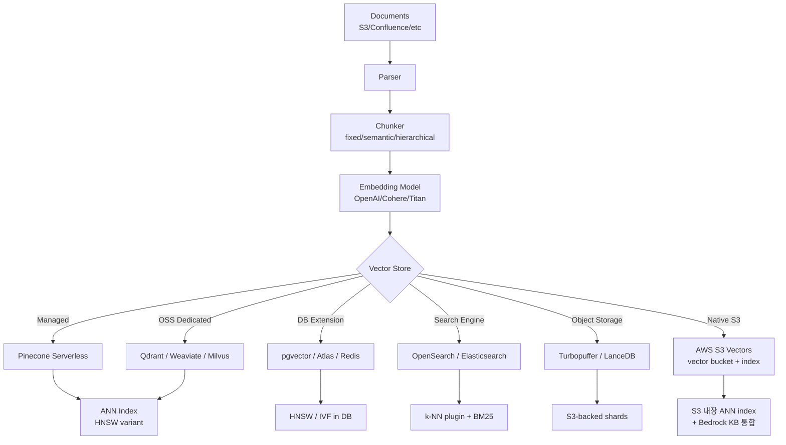
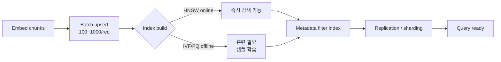

# RAG Data Ingestion - Vector DB Comparison

## Core summary

RAG ingestion 파이프라인의 마지막 단계인 **벡터 저장소(vector store)** 선택을 비교하는 노트. ingestion 관점에서의 선택축은 **bulk upsert 처리량 · 메타데이터 필터 성능 · 하이브리드 검색 지원 · 인덱스 알고리즘(HNSW/IVF/PQ) · 운영 모델(매니지드 vs self-host) · 비용 구조**이며, 2026년 현재 7~10개 후보가 사실상의 표준으로 자리잡았다.

- **전용 매니지드형**: Pinecone (serverless 아키텍처, 운영 부담 최소)
- **전용 OSS형**: Qdrant (Rust, 최고 raw 성능), Weaviate (하이브리드/모듈), Milvus (대규모·GPU 인덱스)
- **DB 내장형**: pgvector (Postgres 확장, 가장 채택률 높음), MongoDB Atlas Vector, Redis Vector
- **검색엔진 겸용**: OpenSearch / Elasticsearch (BM25 + dense 하이브리드 강점)
- **신흥 object-storage 기반**: Turbopuffer (Cursor, Notion, Linear가 채택 — 100B+ vector를 object storage 기반으로 비용 10x 절감), **AWS S3 Vectors** (2025-12 GA, S3에 native vector 인덱스를 내장, "Storage-First" 아키텍처로 RAG 비용 최대 90% 절감)

## System architecture

RAG ingestion에서 벡터 DB의 역할은 "임베딩 적재 + ANN 인덱스 빌드 + 메타데이터 색인" 세 가지로 요약된다. 후보군은 인덱스 빌드와 저장의 분리 여부, 컴퓨트-스토리지 분리 여부에서 갈린다.

## Processing flow

ingestion 흐름은 후보군별로 batch 크기·중복 처리·인덱스 빌드 시점이 달라진다. 운영 관점에서 중요한 단계는 **upsert → 인덱스 빌드 → consistency 확보** 세 지점이다.

## Core features and services

| Feature | 설명 |
|---|---|
| ANN index | HNSW가 사실상 표준. Milvus는 IVF/PQ/CAGRA·GPU index까지 폭넓게 지원 |
| Hybrid search | BM25(sparse) + dense vector 결합. RRF fusion으로 recall@10 ~91% 도달 가능 |
| Metadata filter | pre-filter vs post-filter. Qdrant·Weaviate가 pre-filter 강점 |
| Quantization | scalar/binary/product quantization. Milvus·Qdrant 지원. pgvector는 미지원이 약점 |
| Multi-tenancy | Pinecone namespaces, Weaviate tenants, Qdrant collections 단위 격리 |
| Bulk ingest API | 100~1000 vector/req batch. Pinecone import API, Milvus bulk_insert |
| GPU acceleration | Milvus GPU_IVF_PQ, CAGRA (NVIDIA cuVS 통합). 10B+ scale에서 10x faster |
| Object-storage 분리 | Turbopuffer가 컴퓨트-스토리지 분리로 비용 10x 절감 (vs 노드 단위 과금) |
| Native S3 vector | AWS S3 Vectors (2025-12 GA). 인덱스당 2B vector, 버킷당 20T vector, sub-100ms latency. Bedrock KB / OpenSearch tiered storage / SageMaker 통합 |

## Similar technology comparison

| Item            | Pinecone                   | Qdrant           | Weaviate           | Milvus                | pgvector                           | OpenSearch k-NN   | S3 Vectors                          |
| --------------- | -------------------------- | ---------------- | ------------------ | --------------------- | ---------------------------------- | ----------------- | ----------------------------------- |
| 형태              | Managed only               | OSS + Cloud      | OSS + Cloud        | OSS + Zilliz Cloud    | Postgres 확장                        | OSS + AWS managed | AWS managed (S3 native)             |
| 언어/엔진           | Proprietary (Rust 기반 추정)   | Rust             | Go                 | C++/Go                | C (Postgres)                       | Java (Lucene)     | Proprietary (S3 내장)                  |
| 인덱스             | HNSW 변형(proprietary)       | HNSW             | HNSW               | HNSW/IVF/PQ/CAGRA/GPU | HNSW(v0.7+)/IVFFlat                | HNSW (Lucene)     | Proprietary (storage-optimized ANN) |
| QPS @1M (참고)    | 1620+                      | ~1840 (최고)       | 중상위                | 중상위                   | ~640 (HNSW)                        | 중하위               | 중하위 (cost-optimized, sub-100ms)      |
| P99 latency @1M | 20–30ms                    | 10–15ms          | ~16ms              | ~18ms                 | 15–25ms                            | 20–30ms           | <100ms (GA 기준)                       |
| Hybrid search   | 지원                         | 지원 (native)      | 지원 (best-in-class) | 지원                    | 별도 구현 필요                           | 지원 (BM25 강점)      | 미지원 (OpenSearch tiered storage로 보완)  |
| Quantization    | 내부 최적화                     | scalar/binary/PQ | binary/PQ          | full 지원               | 미지원                                | binary            | 내부 최적화 (storage 효율 우선)               |
| Scale 한계        | Managed serverless로 사실상 무한 | 1B+ 분산           | 1B+ 분산             | 10B+ (production)     | ~10M (확장 없이) / 50M (pgvectorscale) | 1B+               | 인덱스당 2B, 버킷당 20T vector              |
| 비용 모델           | 사용량 과금 (vector-월)          | 노드 시간당           | 노드 시간당             | 노드 시간당                | Postgres 비용에 포함                    | 인스턴스 시간당          | PUT GB + 스토리지 GB + 쿼리 API ($2.5/M)   |
| 운영 부담           | 거의 없음                      | OSS는 본인이 운영      | OSS는 본인이 운영        | 가장 무거움 (의존성 多)        | 기존 DBA가 운영                         | OpenSearch 운영팀 필요 | 거의 없음 (S3 운영 그대로)                    |
| 강점              | 운영 zero, multi-tenant      | raw 성능, filter   | 하이브리드 검색           | 초대규모/GPU              | 운영 자산 재사용                          | BM25 통합           | 비용 90% 절감, Bedrock KB native 통합      |
| 약점              | 벤더 락인, 가격                  | 커뮤니티 작음          | 메모리 사용량            | 컴포넌트 복잡               | scale 한계                           | 벡터 전용 대비 성능       | AWS 락인, 하이브리드 미지원, latency 후순위       |

## Real-world cases

### Pinecone @ Notion AI
Notion AI는 Pinecone을 백엔드로 사용하며 **단일 인덱스 안에 수천 개 namespace**를 두어 워크스페이스별 격리와 비용 효율을 동시에 달성. ingestion 측면에서는 사용자 페이지 변경 이벤트를 Pinecone으로 upsert하는 파이프라인을 운영. (단, 2025년 Cursor·Notion·Linear가 Turbopuffer로 마이그레이션한 사례가 공개되어 비용 절감 트렌드의 한 축이 됨.)

### Milvus @ 10B+ scale 추천 시스템
Milvus의 분산 아키텍처와 GPU_IVF_PQ 인덱스(cuVS 기반)는 추천 시스템·이미지 검색 등 10억~100억 벡터 규모에서 채택된다. NVIDIA cuVS의 IVF-PQ는 IVF-Flat 대비 **4–5x 인덱스 압축**과 GPU에서 10x 빠른 검색을 제공한다고 Milvus·NVIDIA 문서가 명시.

### Turbopuffer @ Cursor / Notion search / Linear
2025–2026년 신흥 사례: object storage(S3 등) 위에서 벡터 인덱스를 서빙하는 Turbopuffer가 Cursor의 100B+ code retrieval, Notion 검색, Linear 이슈 검색의 백엔드로 채택. 컴퓨트-스토리지 분리로 vector DB 비용을 **10x 감축**한 사례로 보고됨.

### AWS S3 Vectors @ Bedrock Knowledge Bases RAG
2025-07 preview, 2025-12 GA. **S3 자체에 vector 인덱스를 내장**한 최초의 클라우드 object storage 서비스. preview 대비 인덱스당 용량이 40배 증가(50M → 2B vector), 버킷당 20T vector를 지원하며 query latency도 sub-100ms로 개선. Amazon Bedrock Knowledge Bases와 native 통합되어 RAG 파이프라인의 임베딩 적재·검색을 추가 인프라 없이 수행 가능. 또한 OpenSearch와 **tiered storage** 패턴으로 결합해 cold vector는 S3 Vectors, hot vector는 OpenSearch로 분리하는 운영 모델이 권장됨. 14개 AWS 리전에서 사용 가능.

## Use scenarios

### Scenario 1: 사내 문서 RAG 챗봇 PoC (1만~100만 청크)
**선택**: pgvector 또는 Pinecone Serverless.
**이유**: pgvector는 기존 Postgres 운영팀이 그대로 다룰 수 있어 운영 비용 최소; Pinecone Serverless는 코드 한 줄로 시작 가능. 1M 이하 scale에서는 8개 후보 모두 성능 충분.

### Scenario 2: 검색 품질이 핵심인 엔터프라이즈 검색 (1000만~1억 청크 + BM25 결합)
**선택**: Weaviate 또는 OpenSearch.
**이유**: 하이브리드 검색이 deciding feature. Weaviate Hybrid Search 2.0(2025-10)의 learned fusion은 쿼리 패턴 기반 가중치를 학습. OpenSearch는 BM25 자체가 강력해 기존 검색 인프라와 통합 시 유리.

### Scenario 3: 초대규모 임베딩 / GPU 활용 (10억+ 벡터)
**선택**: Milvus (자체 운영) 또는 Turbopuffer (관리형 + S3 비용 모델).
**이유**: Milvus는 GPU_IVF_PQ·CAGRA로 GPU 가속 + 분산. Turbopuffer는 object storage 기반으로 vector-당 비용이 노드 단위 과금 후보군의 1/10. raw latency가 가장 중요한 워크로드는 Milvus, 비용/콜드 데이터 비중이 높은 워크로드는 Turbopuffer.

### Scenario 4: AWS 위주 인프라 + Bedrock 기반 RAG (비용 최우선)
**선택**: **AWS S3 Vectors** (단독) 또는 **S3 Vectors + OpenSearch tiered storage** (성능 보완).
**이유**: 이미 S3·Bedrock·IAM 등 AWS 스택을 사용 중이면 별도 vector DB 도입 없이 RAG 파이프라인 구성 가능. Bedrock Knowledge Bases가 S3 Vectors를 native 데이터 소스로 지원해 ingestion·query를 추가 인프라 없이 수행. cold/대량 vector는 S3 Vectors, hot/저지연 vector는 OpenSearch로 분리하면 비용·성능을 동시에 최적화. **단**, 하이브리드 검색(BM25 결합)이 필요하면 OpenSearch가 필수.

## Pros and Cons & Trade-off

| Item | Detail |
|---|---|
| Pros | **선택지 풍부**: scale·운영부담·예산에 따라 최소 3개 후보군이 존재. **하이브리드 검색 보편화**: 2026년 현재 주요 5개(Weaviate/Qdrant/Pinecone/ES/OpenSearch) 모두 native 지원. **pgvector 성숙**: pgvectorscale로 50M까지 dedicated DB와 경쟁. |
| Cons | **마이그레이션 비용 큼**: 임베딩 재적재 + 인덱스 재빌드 + 검색 튜닝 다시 필요. **벤더 락인**: Pinecone 등 매니지드형은 export API가 제한적. **벤치마크 편차**: 워크로드(dim, recall target, filter 비율)에 따라 순위가 뒤집힘 — 벤더 발표 수치 그대로 신뢰 금지. |
| Trade-off | **운영부담 ↔ 유연성**: Managed(Pinecone)은 운영 zero지만 비용/락인. OSS(Qdrant/Milvus)는 자유롭지만 운영팀 필요. **단일 DB(pgvector) ↔ 전용 DB**: scale·검색 품질이 1순위면 전용, 운영 통합·트랜잭션이 1순위면 pgvector. **노드 과금 ↔ object storage**: hot data 비중 높으면 Pinecone/Qdrant, cold 비중 높으면 Turbopuffer류. |

## Pitfalls / Anti-patterns

- **벤더 벤치마크를 그대로 비교**: 각 벤더가 자기에게 유리한 dim/recall target/filter ratio로 측정. → ANN-Benchmarks 같은 중립 벤치마크 + **자기 데이터로 PoC** 필수.
- **pgvector를 처음부터 100M+로 시도**: pgvector는 quantization 미지원이라 인덱스가 메모리에 다 안 들어가면 latency 폭증. → 10M까지는 vanilla pgvector, 50M까지는 pgvectorscale, 그 이상은 dedicated DB로 mig.
- **메타데이터 필터를 post-filter로 사용**: 필터 적중률 낮으면 결과 부족 + recall 저하. → Qdrant/Weaviate의 **pre-filter** 사용, 또는 partitioning 설계.
- **하이브리드 검색 없이 BM25만 쓰던 인덱스를 그대로 벡터로 대체**: keyword 매칭이 강한 도메인(코드/약어/오타)에서 recall 급락. → BM25 + dense를 RRF로 fusion해 91% recall@10 확보.
- **이중 운영을 단순 합산으로 평가**: "벡터 DB + 검색엔진"을 별도 운영하면 ingestion 파이프라인이 두 배가 됨. → 가능하면 hybrid 지원 단일 시스템(Weaviate/OpenSearch/Qdrant)으로 통합.
- **인덱스 빌드 시간을 무시한 capacity 계산**: HNSW는 online 가능하지만 IVF/PQ는 학습 단계 필요. 초기 백필 시 수 시간~수 일 소요 가능 → bulk ingest API + 인덱스 빌드 시점 분리 설계.

## References

- [Firecrawl - Best Vector Databases in 2026: A Complete Comparison Guide](https://www.firecrawl.dev/blog/best-vector-databases) - 2026년 기준 8개 주요 DB 비교, scale/managed/hybrid 축
- [DataCamp - Best Vector Databases 2026: Pinecone, Chroma, Qdrant & More](https://www.datacamp.com/blog/the-top-5-vector-databases) - 사용 사례별 추천 가이드
- [Tensoria - Pinecone vs Qdrant vs Weaviate vs pgvector (100M Vector Benchmark)](https://tensoria.fr/en/blog/vector-database-comparison) - 100M scale 벤치마크 수치 (QPS/latency)
- [Weaviate Docs - Hybrid Search](https://docs.weaviate.io/weaviate/search/hybrid) - BM25 + dense fusion 공식 문서
- [Milvus Docs - GPU_IVF_PQ Index](https://milvus.io/docs/gpu-ivf-pq.md) - GPU 인덱스 구조와 사용법
- [NVIDIA Technical Blog - cuVS IVF-PQ Deep Dive](https://developer.nvidia.com/blog/accelerating-vector-search-nvidia-cuvs-ivf-pq-deep-dive-part-1/) - cuVS 알고리즘과 압축률
- [Particula - Turbopuffer vs Pinecone: Why Cursor and Notion Migrated](https://particula.tech/blog/turbopuffer-vs-pinecone-vector-database-migration) - 2025–2026 마이그레이션 사례
- [Pinecone - Serverless Architecture](https://www.pinecone.io/blog/serverless-architecture/) - Pinecone serverless 아키텍처 공식 설명
- [Digital Applied - Hybrid Search BM25/Vector/Reranking 2026 Reference](https://www.digitalapplied.com/blog/hybrid-search-bm25-vector-reranking-reference-2026) - hybrid 검색 latency/recall 수치
- [AWS - Amazon S3 Vectors is now generally available (2025-12)](https://aws.amazon.com/about-aws/whats-new/2025/12/amazon-s3-vectors-generally-available/) - GA 발표, 인덱스당 2B / 버킷당 20T vector
- [AWS News Blog - Amazon S3 Vectors GA with increased scale and performance](https://aws.amazon.com/blogs/aws/amazon-s3-vectors-now-generally-available-with-increased-scale-and-performance/) - sub-100ms latency, Bedrock KB 통합, 14개 리전
- [AWS Docs - Working with S3 Vectors and vector buckets](https://docs.aws.amazon.com/AmazonS3/latest/userguide/s3-vectors.html) - vector bucket/index 개념, API, 제약사항
- [InfoQ - Amazon S3 Vectors Reaches GA, "Storage-First" Architecture for RAG](https://www.infoq.com/news/2026/01/aws-s3-vectors-ga/) - storage-first 아키텍처, 비용 90% 절감 분석
- [VentureBeat - AWS claims 90% vector cost savings with S3 Vectors GA](https://venturebeat.com/data-infrastructure/aws-claims-90-vector-cost-savings-with-s3-vectors-ga-calls-it-complementary) - 기존 vector DB와의 보완 관계 분석
