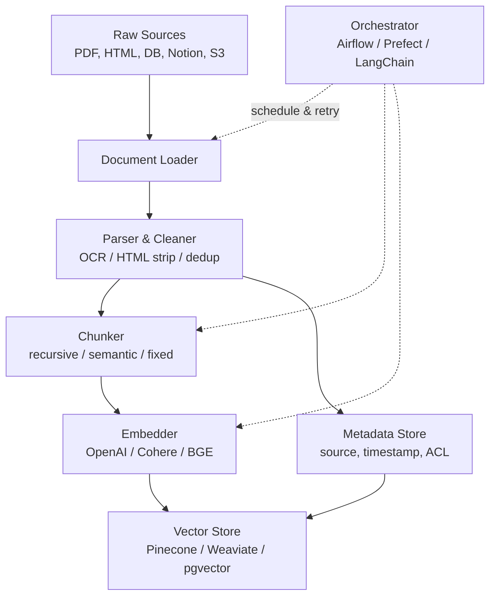
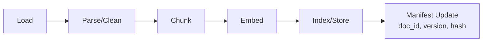

# RAG Data Ingestion

## Core summary

RAG(Retrieval-Augmented Generation) 시스템에서 외부 지식 소스를 검색 가능한 vector index 형태로 변환·적재하는 **offline 입력 파이프라인 단계**다. Document Loader → Chunking → Embedding → Vector Store 저장 순서로 진행되며, retrieval 품질의 1차 결정 요인이다.

- **Offline 단계**: 사용자 query와 무관하게 사전 처리됨. Query-time의 retrieval/generation과 명확히 분리된 phase
- **GIGO 원칙 강함**: retriever는 noise와 signal을 구분하지 못하므로 ingestion 품질이 곧 시스템 품질
- **Chunking 전략 의존**: chunk size·overlap·split 방식이 recall/precision 분포를 결정 — 예외를 던지지 않고 조용히 품질이 떨어지는 특성
- **Freshness 책임**: 원본 문서가 변경/삭제될 때 vector index 동기화를 ingestion layer가 담당 (doc_id + version 분리, 이전 버전 비활성화)

## System architecture

Ingestion pipeline은 source connector → parser/cleaner → chunker → embedder → vector store 어댑터의 5개 컴포넌트와 메타데이터 store가 병렬로 연결된 구조다.

## Processing flow

Raw document에서 시작해 query-ready vector index에 도달하기까지의 5단계 처리 흐름이다.

1. **Load**: source connector가 원본을 stream 또는 batch로 fetch
2. **Parse/Clean**: 포맷별 텍스트 추출 (PDF OCR, HTML tag strip, table 보존), encoding 정규화, dedup
3. **Chunk**: 토큰 한도와 semantic 경계 사이의 trade-off를 적용해 분할 (보통 400~1,000 tokens + 10~20% overlap)
4. **Embed**: 각 chunk를 dense vector로 변환. 메타데이터(source, section, timestamp)는 별도 필드로 부착
5. **Index/Store**: vector + metadata를 vector DB에 upsert. doc_id/version으로 idempotency 보장

## Core features and services

| Feature | Description |
|---|---|
| Document Loaders | PDF·Word·HTML·Markdown·DB row·SaaS(Notion, Confluence) 등 포맷별 connector. LlamaHub는 160+ connector 제공 |
| Text Splitters / Chunkers | Fixed-size, Recursive Character, Semantic, Parent-Document 등 분할 전략 선택 |
| Embedding Models | text-embedding-3-large(OpenAI), Cohere Embed v3, BGE, E5 등 dense vector encoder |
| Vector Stores | Pinecone, Weaviate, Qdrant, Milvus, pgvector — HNSW/IVF 등 ANN index 제공 |
| Metadata Filtering | source·tag·timestamp·ACL을 vector와 함께 저장해 filtered retrieval 지원 |
| Hybrid Index | BM25 sparse index를 vector와 병행 적재해 keyword + semantic 결합 검색 |
| Incremental Sync | doc_id + version + content hash로 변경분만 re-embed (full re-index 회피) |

## Similar technology comparison

| 항목 | RAG Data Ingestion | Traditional ETL (Airbyte/Fivetran) | Search Indexing (Elasticsearch) |
|---|---|---|---|
| Output | Dense vector + metadata | Structured tables (row/column) | Inverted index (term → docs) |
| Primary use | Semantic similarity search | Analytics / BI / Data warehouse | Keyword full-text search |
| Pros | 의미 기반 검색, LLM 직접 연결 | 검증된 connector 생태계, 트랜잭션 일관성 | 빠른 keyword 매칭, 성숙한 도구 |
| Cons | Chunk 손실, 임베딩 비용, freshness 어려움 | 비정형 텍스트에 부적합 | 동의어·의미 매칭 약함 |
| Best fit | LLM 컨텍스트 주입용 지식베이스 | 정형 데이터 분석/리포팅 | 정확한 용어 검색 (제품명, 인명) |

## Real-world cases

### LlamaIndex IngestionPipeline (오픈소스 표준)
LlamaIndex는 ingestion을 1급 시민으로 다루며 `IngestionPipeline` 추상화를 제공한다. LlamaHub의 160+ connector로 PDF/Notion/DB row를 통합 처리하고, transformation chain(metadata extractor → chunker → embedder)을 선언적으로 구성한다. 프로덕션에서는 LangChain이 orchestration, LlamaIndex가 indexing/retrieval을 담당하는 패턴이 흔하다.

### Vectara (Managed RAG-as-a-Service)
문서 ingestion·embedding·indexing·retrieval·reranking·hallucination 완화를 단일 API로 묶은 enterprise 플랫폼. ML 엔지니어링 역량이 부족한 팀이 ingestion 파이프라인을 직접 구축하지 않고도 production RAG를 운영할 수 있게 한다.

### Unstructured.io (Parsing 특화)
PDF·Word·이메일 등 비정형 문서의 parsing 단계만 전문화한 서비스. 표·이미지·heading 구조를 보존하면서 chunk-ready 텍스트로 변환해 ingestion 파이프라인의 "parse" 단계 품질을 끌어올린다.

## Use scenarios

### Scenario 1: 사내 위키 기반 Q&A 봇
**컨텍스트**: Notion/Confluence에 흩어진 사내 문서를 직원이 자연어로 질의  
**선택 이유**: 키워드 검색은 동의어·맥락 누락이 잦고, LLM 단독은 사내 정보를 모름  
**적용**: Notion connector로 일 1회 incremental sync → recursive chunking(500 tokens, overlap 50) → text-embedding-3-large → Pinecone. ACL 메타데이터로 부서별 filtered retrieval

### Scenario 2: 기술 문서 versioning이 중요한 API 레퍼런스
**컨텍스트**: 제품 SDK가 매주 릴리즈, 구버전·신버전 문서가 공존  
**선택 이유**: 응답 품질이 freshness에 직접적으로 의존하며, 잘못된 API 시그니처 인용은 critical bug  
**적용**: doc_id + version 분리 저장, 각 버전을 metadata field로 보존. Query 시 `version=latest` filter. 구버전은 즉시 삭제하지 않고 `active=false`로 soft-deprecate

### Scenario 3: 법률·의료 등 정확도 critical 도메인
**컨텍스트**: 인용 출처가 응답에 필수, hallucination이 비용/안전 이슈로 직결  
**선택 이유**: 정확한 chunk 경계와 citation을 위해 의미 단위 분할 + 메타데이터 보존 필요  
**적용**: Semantic chunking + parent-document retrieval (작은 chunk로 검색하되 retrieval 시 부모 section 반환), section heading·page number를 메타데이터로 부착해 citation에 활용

## Pros and Cons & Trade-off

| 항목 | 내용 |
|---|---|
| Pros | • LLM에 도메인 지식 주입 가능 — fine-tuning 없이 최신/사내 데이터 활용 • Citation 가능 — 출처 메타데이터로 응답 검증 • Update 비용 저렴 — re-train 대신 re-embed만 |
| Cons | • Chunk 단위로 컨텍스트 손실 발생 (long-range dependency 약화) • Embedding API/compute 비용 누적 (특히 semantic chunking) • 데이터 변경 시 freshness 관리 복잡 (re-index 주기, 버전 분리) • Garbage-in 시 retriever가 noise를 signal로 오인 |
| Trade-off | • **Chunk 크기**: 작으면 precision↑·recall↓, 크면 반대 • **Semantic vs Recursive chunking**: 정확도 +9%까지 가능하나 embedding 비용·latency 증가 (예: 한 기업 사례에서 semantic 청킹으로 vector 수 4.2배↑, 평균 chunk 38 tokens로 줄어 정확도가 오히려 12% 하락) • **Vendor lock-in**: managed vector DB는 운영 부담↓ but 비용·이전 비용↑ • **Sync 주기**: 실시간 CDC는 freshness↑ but 인프라 복잡도↑ |

## Pitfalls / Anti-patterns

- **Anti-pattern 1: 단일 chunk size 고정** → 도메인별·문서 유형별 최적 size가 다른데 한 값으로 통일 → 도메인별 evaluation으로 size·overlap을 결정하고 문서 유형별로 다른 splitter 적용
- **Anti-pattern 2: 메타데이터 누락한 채 vector만 저장** → filtered retrieval/citation 불가, 신버전·구버전 구분 불능 → source·timestamp·section·doc_id·version·ACL을 vector 저장 시점에 함께 upsert
- **Anti-pattern 3: BM25 등 sparse index를 함께 두지 않음** → 제품명·인명·코드 토큰 같은 정확 매칭 query에서 조용히 누락 → hybrid search(vector + BM25) 기본 채택
- **Anti-pattern 4: Full re-index만 운영** → 데이터 증가 시 비용·시간 폭증, freshness 지연 → content hash 기반 incremental update + doc_id versioning
- **Anti-pattern 5: Parsing 단계를 가볍게 처리** → 표·heading·코드 블록이 망가져 retriever가 의미를 잃음 → 비정형 문서는 Unstructured.io 같은 전문 parser로 구조 보존
- **Anti-pattern 6: Ingestion 품질을 측정하지 않음** → chunking·embedding 변경의 영향이 invisible → golden Q&A set으로 Precision@K, Recall@K, MRR을 정기 측정

## References

- [RAG Pipeline Deep Dive: Ingestion, Chunking, Embedding, and Vector Search](https://dev.to/derrickryangiggs/rag-pipeline-deep-dive-ingestion-chunking-embedding-and-vector-search-2877) — ingestion 4단계의 구조와 각 단계 책임 정리
- [Best Chunking Strategies for RAG Pipelines (Redis)](https://redis.io/blog/chunking-strategy-rag-pipelines/) — Redis 공식 블로그, fixed/recursive/semantic chunking 비교
- [Chunking Strategies for RAG: Methods, Trade-offs & Best Practices (Atlan)](https://atlan.com/know/chunking-strategies-rag/) — chunking 전략별 trade-off 매트릭스
- [Common Challenges in RAG and How to Solve Them in Production (Unstructured)](https://unstructured.io/insights/rag-pipeline-challenges-from-data-ingestion-to-retrieval) — ingestion→retrieval 전 구간 실패 모드와 해결책
- [RAG Anti-Patterns: 7 Failure Modes Engineering Guide 2026](https://www.digitalapplied.com/blog/rag-anti-patterns-7-failure-modes-2026-engineering-guide) — production RAG의 7가지 anti-pattern
- [How to Build a RAG Pipeline from Scratch in 2026 (kapa.ai)](https://www.kapa.ai/blog/how-to-build-a-rag-pipeline-from-scratch-in-2026) — 2026년 기준 파이프라인 구축 가이드
- [LangChain vs LlamaIndex in 2026 (DEV)](https://dev.to/lycore/langchain-vs-llamaindex-in-2026-what-we-actually-use-and-why-52eb) — 두 프레임워크의 ingestion 책임 분담 패턴
- [LLM RAG 파이프라인: 청킹 전략과 임베딩 최적화 실전 2026](https://www.youngju.dev/blog/llm/2026-03-04-llm-rag-chunking-embedding-optimization-2026) — 국문, semantic chunking 실패 사례 포함
