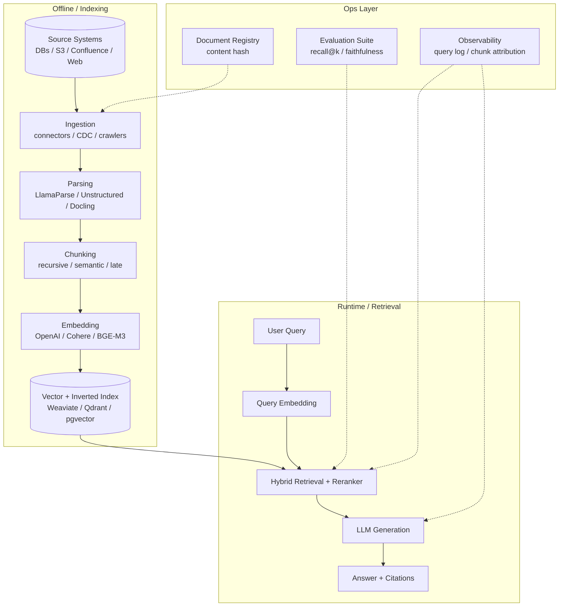
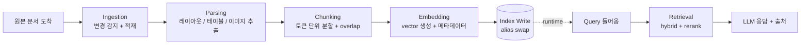

# RAG Indexing Pipeline (LLM 데이터 파이프라인)

## 핵심 요약

LLM 기반 데이터 파이프라인(통칭 RAG indexing pipeline)은 비정형 원본 문서를 LLM이 활용 가능한 검색 가능한 인덱스로 변환하는 5단계 시스템이다. **수집(Ingestion) → 파싱(Parsing) → 청킹(Chunking) → 임베딩(Embedding) → 검색(Retrieval)**로 구성되며, 각 단계의 설계·운영 품질이 최종 LLM 응답의 정확도·비용·지연을 결정한다.

- 2026년 production 경험칙: **RAG 실패의 약 80%가 ingestion·chunking 단계에서 발생**하며 LLM 자체보다 retrieval 품질이 답변 품질의 주요 결정 요인
- Generation보다 retrieval이 bottleneck — vector search 단일 전략은 hybrid + reranker + agentic / graph-augmented 패턴으로 확장 중
- 파이프라인은 두 시점으로 분리됨: **Offline (Ingestion Phase)**는 문서 → 인덱스, **Runtime (Retrieval Phase)**는 질의 → top-k → LLM. 운영 부담은 Offline 측에 집중

## 시스템 아키텍처

5단계 파이프라인과 운영 layer(observability, evaluation, incremental sync)의 전체 구조.

## 처리 흐름

신규 문서가 도착하면 offline 파이프라인이 인덱스를 갱신하고, runtime은 그 인덱스를 읽어 응답을 생성한다.

## 핵심 기능 및 서비스

| 단계 | 핵심 기능 | 대표 도구 / 서비스 |
|---|---|---|
| Ingestion (수집) | source connector, schedule/event 트리거, CDC 또는 content-hash 기반 증분 동기화 | Airbyte, Fivetran, LangChain DocumentLoader, 자체 crawler |
| Parsing (파싱) | 레이아웃 인식, 테이블·이미지·코드 추출, Markdown / JSON 산출 | LlamaParse(90+ 포맷), Unstructured(30+ 포맷), Docling(셀프호스팅), AWS Textract($0.0015/page), Mistral OCR 3, LandingAI ADE |
| Chunking (청킹) | semantically complete 분할, overlap, metadata 부착 | LangChain RecursiveCharacterTextSplitter, LlamaIndex SemanticSplitter, Unstructured chunkers |
| Embedding (임베딩) | dense vector 생성, batching, dimensionality 조정 | OpenAI `text-embedding-3-small/large`, Cohere `embed-v4`, BAAI `BGE-M3`, Voyage AI `voyage-3-large`, Qwen3-Embedding |
| Retrieval (검색) | ANN + sparse 결합, reranking, metadata filter | Weaviate, Qdrant, Pinecone, Elasticsearch, pgvector + Cohere/BGE reranker |
| Ops layer | 증분 인덱싱, alias-based zero-downtime 배포, recall@k·faithfulness 모니터링, CI/CD 게이트 | LangSmith, Arize Phoenix, Ragas, TruLens |

## 유사 기술 비교

| 항목 | LlamaIndex | LangChain | Haystack | DSPy |
|---|---|---|---|---|
| 특징 | 데이터 적재·인덱싱 특화 | 범용 LLM orchestration | 엔터프라이즈 modular pipeline | 프로그램형 LLM 최적화 |
| Framework overhead (ms) | ~6 | ~10 | ~5.9 | ~3.53 |
| 강점 | 92% retrieval accuracy 벤치 / 인덱스 추상화 다양 | 가장 큰 생태계, 에이전트·툴 호출 | 평가 도구 강함, 감사 가능 | overhead 최소, 자동 prompt 튜닝 |
| 약점 | agent / 워크플로 약함 | 인덱싱 추상화는 LlamaIndex보다 약함 | 시작 학습 곡선 | 생태계·문서 상대적으로 얕음 |
| 적합 케이스 | 데이터 중심 RAG | RAG + agentic, 멀티툴 | 규제 산업, 감사 요건 | retrieval/prompt 자동 최적화 연구·실험 |

> 실무 흔한 조합: **LlamaIndex로 ingestion/indexing, LangChain(또는 LangGraph)으로 orchestration**. 두 프레임워크는 충돌이 아니라 역할 분담.

## 실제 사례

### LlamaIndex / LlamaParse 생태계
LlamaIndex는 ingestion·인덱싱 추상화에 집중해 90+ 포맷 파싱(LlamaParse), 다양한 chunking 전략(SemanticSplitter, HierarchicalNodeParser), 다종 vector store 통합을 단일 SDK로 제공. retrieval 정확도 벤치마크에서 LangChain 대비 우위(약 92% vs 85%) 보고가 다수.

### Unstructured.io
Open-source 파싱·청킹 라이브러리. 30+ 포맷의 element-aware 추출과 RAG 전용 chunking 전략을 함께 제공해 "한 단계 안에 파싱+청킹"을 묶는 패턴 확산. 상업 API fallback 존재.

### Haystack (deepset)
Modular pipeline + 강한 evaluation 도구를 강점으로 규제 산업(금융·헬스케어) RAG 배포에 채택. CI/CD에 retrieval accuracy / faithfulness 게이트를 자연스럽게 결합 가능.

### Databricks / 엔터프라이즈 데이터레이크 RAG
Delta Lake + Spark + Mosaic AI Vector Search 조합으로 batch 증분 인덱싱 + 대규모 corpus 운영. 사내 BI 자산을 RAG에 그대로 노출하는 패턴이 2026년 보편화.

## 활용 시나리오

### 시나리오 1: 사내 위키 / Confluence RAG 챗봇
**맥락**: 수만 페이지의 위키 + 첨부 PDF를 단일 챗봇에서 검색.
**선택 이유**: 다양한 포맷, 빈번한 페이지 수정, 권한·메타데이터 필요 → 단순 vector DB만으로는 부족.
**적용**: Confluence/Notion connector(증분 sync) → LlamaParse(첨부 PDF 레이아웃 보존) → recursive 512 / overlap 64 → BGE-M3(자사 다국어) → Weaviate hybrid + Cohere Rerank. 권한은 chunk metadata로 필터.

### 시나리오 2: 코드 + 문서 통합 검색 (개발자 포털)
**맥락**: 코드(repo) + API 레퍼런스 + 디자인 문서를 한 검색창에서 조회.
**선택 이유**: 코드는 exact match, 문서는 의미 매칭이 강해야 함. chunking·임베딩 전략을 분리해야 retrieval 품질 확보.
**적용**: Repo loader(파일 변경 감지) + Markdown 파서 → **코드는 함수/클래스 단위 청킹**, **문서는 semantic 청킹** → 동일 embedding 모델 + 별도 namespace → hybrid retrieval(BM25 가중치 ↑) + reranker.

### 시나리오 3: 규제 산업의 감사 가능한 RAG
**맥락**: 금융 정책 문서 기반 Q&A, 응답마다 출처·인덱스 버전 추적 필요.
**선택 이유**: 운영 안정성·재현성·감사 로그가 정확도만큼 중요.
**적용**: Haystack pipeline + Ragas evaluation을 CI/CD 게이트로. 인덱스는 content-hash 기반 증분 + alias swap으로 무중단 배포. 모든 응답에 `index_version`, `chunk_id`, `retrieval_score`를 함께 로깅.

## 장단점 및 트레이드오프

| 항목 | 내용 |
|---|---|
| 장점 | 도메인 지식·실시간 자료를 LLM에 안전하게 주입 / fine-tuning 대비 비용·갱신 비용 낮음 / 출처 인용으로 hallucination 부분 완화 |
| 단점 | 5단계 모두 운영 부담(인덱스 무결성·증분 동기화·embedding 모델 버전) / 각 단계 튜닝 파라미터 폭발 / 임베딩 모델 교체 시 전체 corpus 재임베딩 필요 |
| 트레이드오프 | semantic chunking은 recall +9% vs token-based 대비 약 14배 느림 / 고품질 embedding 모델은 cost·dimensionality ↑ / hybrid + reranker는 정확도 ↑ vs latency·infra ↑ / managed parser(LlamaParse)는 쉬움 vs 페이지당 비용 누적 |

## 함정 및 안티패턴

- **안티패턴 1**: 청킹을 단순 `chunk_size=1000` 글자 단위로 고정 → 문장·문단 중간 절단으로 retrieval recall 급락. **대안**: recursive 400-512 토큰 + 10-20% overlap을 기본값으로 시작, 필요 시 semantic chunking 도입.
- **안티패턴 2**: PDF를 raw OCR text로 평면화(layout 정보 폐기) → 테이블·다단·헤더 손실로 답변 품질 저하. **대안**: 레이아웃 인식 파서(LlamaParse, Docling, Mistral OCR 3) + Markdown 산출.
- **안티패턴 3**: 임베딩 모델을 충분한 검토 없이 도입하고, 추후 교체 시도 → 대규모 corpus 재임베딩 비용·다운타임 발생. **대안**: 모델 결정 전에 자사 도메인 sample로 retrieval 벤치마크 수행, alias-based 인덱스로 무중단 교체 경로 설계.
- **안티패턴 4**: 전체 인덱스 재구축(rebuild) 위주 운영 → 다운타임·비용·문서 일관성 결손. **대안**: document registry + content-hash 변경 감지로 **증분 인덱싱**, alias swap으로 zero-downtime 배포.
- **안티패턴 5**: retrieval만 모니터링하고 chunk-level attribution은 누락 → 품질 회귀 시 단계 책임 추적 불가. **대안**: 응답에 `chunk_id`, `index_version`, `retrieval_score` 로깅 + recall@k / faithfulness 자동 평가 CI/CD 게이트.
- **안티패턴 6**: chunking을 한 번 정한 뒤 도메인이 바뀌어도 그대로 사용 → corpus drift로 recall 점진 저하. **대안**: 분기별 retrieval 메트릭 회귀 검사, 필요 시 chunking 전략 재튜닝.

## 참고 자료

- [RAG Pipeline Challenges: From Data Ingestion to Retrieval — Unstructured](https://unstructured.io/insights/rag-pipeline-challenges-from-data-ingestion-to-retrieval) — 각 단계 실패 모드와 80% 실패 원인 분포 정리
- [Building Production RAG: Architecture, Chunking, Evaluation & Monitoring (2026) — Prem AI](https://blog.premai.io/building-production-rag-architecture-chunking-evaluation-monitoring-2026-guide/) — 2026 production RAG 종합 가이드
- [Top Document Parsing APIs for 2026 — LlamaIndex](https://www.llamaindex.ai/insights/top-document-parsing-apis) — 파싱 도구 비교 (LlamaParse / Unstructured / Docling / Textract 등)
- [Best Chunking Strategies for RAG (and LLMs) in 2026 — Firecrawl](https://www.firecrawl.dev/blog/best-chunking-strategies-rag) — 7가지 chunking 전략 벤치마크 (recursive 512 우위)
- [Best Embedding Model for RAG 2026: 10 Models Compared — Milvus](https://milvus.io/blog/choose-embedding-model-rag-2026.md) — 임베딩 모델 비교(MTEB 점수, 비용, 사용처)
- [Production RAG in 2025 | Evaluation Suites, CI/CD Quality Gates & Observability — Dextralabs](https://dextralabs.com/blog/production-rag-in-2025-evaluation-cicd-observability/) — production 운영 패턴, CI/CD 품질 게이트
- [What Matters in Production RAG — Arpit Bhayani](https://arpitbhayani.me/blogs/rag-production/) — 증분 인덱싱, document registry, alias 배포 패턴
- [Best RAG Frameworks 2026: LangChain vs LlamaIndex vs DSPy — Iternal](https://iternal.ai/blockify-rag-frameworks) — 프레임워크 overhead 벤치마크와 사용처 매핑
- [LlamaIndex vs LangChain vs Haystack: Which RAG Framework? — Kanerika](https://kanerika.com/blogs/llamaindex-vs-langchain-vs-haystack/) — 프레임워크 강점과 결합 패턴
