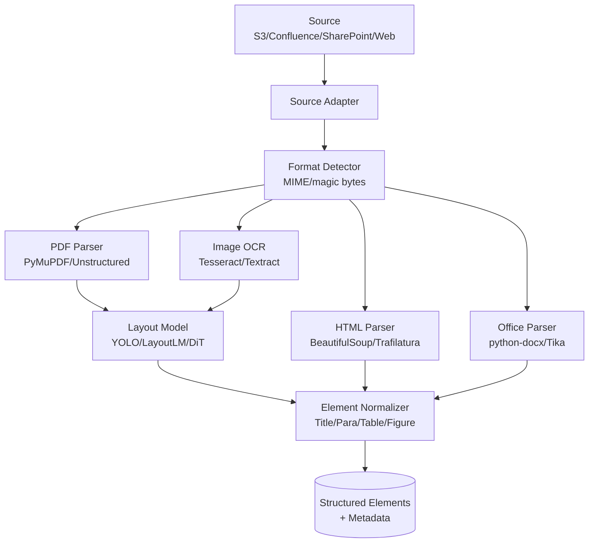
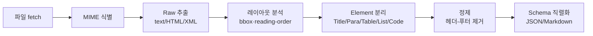

# RAG Ingestion - Document Loading & Parsing

## 핵심 요약

Document Loading & Parsing은 RAG ingestion 파이프라인의 최상단 단계로, 다양한 포맷(PDF/HTML/DOCX/PPTX/MD/이미지)으로 존재하는 원본 문서를 LLM이 처리 가능한 구조화된 텍스트 + 메타데이터로 변환한다. 단순히 "텍스트를 뽑는" 작업이 아니라, **레이아웃·표·헤딩 계층·읽기 순서를 보존**해야 downstream chunking과 retrieval 품질이 결정된다.

- **파싱 품질 = RAG 품질의 상한선**: 표가 깨지거나 헤딩이 평탄화되면 어떤 chunking·embedding으로도 회복 불가
- **포맷별 전용 파서 필요**: PDF/스캔본/HTML/Office는 동일 도구로 처리 불가, multi-tool fallback 전략이 표준
- **Layout-aware vs Text-only**: 최신 도구(Unstructured, LlamaParse, Docling)는 OCR + 레이아웃 모델로 표/그림/헤딩을 구조 보존, 전통적 도구(pypdf, Tika)는 raw text only

## 시스템 아키텍처

Document Loader는 일반적으로 **Source Adapter → Format Detector → Format-specific Parser → Element Normalizer → Output Schema** 5단계로 구성된다. Layout-aware 도구는 Parser 단에 vision/OCR 모델이 추가된다.

## 처리 흐름

소스에서 파일을 가져와 포맷을 식별하고, 포맷 전용 파서로 raw 추출 후 레이아웃 분석을 거쳐 의미 단위 element 리스트로 정규화한다. 마지막에 chunking 단계에 넘기기 좋은 스키마로 직렬화한다.

## 핵심 기능 및 서비스

| 도구 | 강점 | 약점 |
|---|---|---|
| Unstructured.io | 25+ 포맷, layout 모델 통합, partition API 표준화 | 자체 호스팅 시 OCR 모델 무거움, 라이선스 분기 |
| LlamaParse | LLM 기반 표·수식·이미지 캡셔닝, Markdown 출력 | 클라우드 API only, 비용 페이지당 과금 |
| Docling (IBM) | 오픈소스 + 빠름, DocLayNet 학습 모델, Markdown/JSON | 한국어 OCR 정확도 영문 대비 낮음 |
| Apache Tika | 1000+ 포맷, 안정적, JVM 기반 | 레이아웃 손실, 표 추출 약함 |
| PyMuPDF (fitz) | 빠른 PDF 텍스트·이미지 추출, AGPL | 스캔본 OCR 별도, 레이아웃 reconstruction 수동 |
| Marker | PDF→Markdown 특화, 표·수식 LaTeX 변환 | PDF 전용, GPU 권장 |
| AWS Textract | 관리형 OCR + 표/폼 추출, 한글 지원 | 페이지당 과금, 레이아웃 element 구조 제한적 |
| Azure Document Intelligence | prebuilt 모델(영수증·송장 등) 풍부 | 벤더 락인 |
| LangChain DocumentLoaders | 200+ 소스 어댑터 (Notion/Slack/Confluence 등) | 파서 자체는 외부 라이브러리 wrapping |

## 유사 기술 비교

| 항목 | Unstructured.io | LlamaParse | Docling | Apache Tika |
|---|---|---|---|---|
| 특징 | 레이아웃 모델 + 25+ 포맷 통합 API | LLM 기반 시맨틱 파싱 | 경량 오픈소스 PDF/Office 특화 | JVM, 광범위 포맷 |
| 장점 | 자체 호스팅 가능, element 구조 풍부 | 표·수식 품질 최고, Markdown 출력 깔끔 | 빠르고 가벼움, on-prem 친화 | 1000+ 포맷, 매우 안정 |
| 단점 | 모델 무거움, 처리량 낮음 | API 종속, 비용 | 한국어 OCR 약함 | 표 추출 빈약, 레이아웃 손실 |
| 적합 케이스 | 엔터프라이즈 다포맷 자체 호스팅 | 학술 PDF·재무 보고서 등 표 풍부 문서 | 비용 민감 + 영문 중심 | 메일·아카이브 등 대용량 잡식 |

## 실제 사례

### Anthropic Claude (Contextual Retrieval)
Anthropic은 2024년 Contextual Retrieval 블로그에서 ingestion 단계의 문서 파싱이 retrieval 품질을 결정한다고 강조했다. 청킹 전 단계에서 문서 구조(섹션/헤딩)를 보존해야 contextual chunk prefixing이 의미를 갖는다고 사례로 제시.

### Notion AI
Notion은 블록 기반 자체 스키마를 그대로 RAG ingestion에 활용한다. PDF/외부 문서를 import할 때 Unstructured와 유사한 레이아웃 파싱을 거쳐 Notion 블록 트리로 매핑, retrieval 시 블록 계층을 그대로 활용해 컨텍스트 윈도우 효율을 올린다.

### IBM watsonx Discovery
IBM은 내부 RAG 스택에 자사 오픈소스 Docling을 사용한다. DocLayNet 데이터셋으로 학습된 레이아웃 모델로 표·수식·이미지를 구조 보존 추출 후 Granite 모델로 임베딩하는 파이프라인을 공개했다.

## 활용 시나리오

### 시나리오 1: 사내 PDF 정책 문서 RAG
- **맥락**: 보안·HR·재무 정책 PDF 수만 건, 표·체크리스트·서명란이 핵심 정보
- **선택**: Unstructured.io 자체 호스팅 (PII 외부 전송 금지)
- **적용**: `partition_pdf` strategy="hi_res"로 레이아웃 모델 사용, 표는 `unstructured.html`로 보존, downstream에서 표 단위 청크 + Markdown 형식 prefix

### 시나리오 2: 학술 논문 RAG (수식·표 풍부)
- **맥락**: 수천 편의 arxiv PDF, 수식·표가 핵심
- **선택**: LlamaParse + Marker 조합
- **적용**: 1차 LlamaParse로 표/수식 Markdown 변환, 실패한 페이지는 Marker로 fallback, LaTeX 수식 보존 후 임베딩

### 시나리오 3: Confluence/SharePoint 등 멀티 소스 통합
- **맥락**: Confluence(HTML), SharePoint(DOCX/PPTX), 공유드라이브(PDF) 혼재
- **선택**: LangChain DocumentLoaders로 소스 어댑터 통일 + Unstructured로 포맷별 파싱
- **적용**: 각 소스 API에서 raw 가져온 후 동일 Unstructured `partition()` 호출로 element 스키마 통일, downstream chunking은 source-agnostic하게 처리

## 장단점 및 트레이드오프

| 항목 | 내용 |
|---|---|
| 장점 | Layout-aware 파싱 시 표·헤딩 보존으로 retrieval 정확도 큰 폭 향상, 모듈화로 포맷 추가 용이 |
| 단점 | Layout 모델 사용 시 처리량 급락(10~50x 느림), GPU 비용, 한국어 OCR 정확도 격차 |
| 트레이드오프 | **속도 vs 품질**(fast strategy vs hi_res), **비용 vs 정확도**(LlamaParse API vs 자체 호스팅), **재현성 vs 진화**(파서 버전 업그레이드 시 동일 PDF가 다른 element 생성 → 재인덱싱 필요) |

## 함정 및 안티패턴

- **안티패턴 1**: pypdf 단일 파서로 모든 PDF 처리 → 표·다단 레이아웃 깨짐, 읽기 순서 뒤섞임 → **대안**: 포맷·복잡도 기반 router (단순 텍스트 → pypdf, 표·레이아웃 → Unstructured hi_res, 수식 → LlamaParse)
- **안티패턴 2**: 헤더/푸터/페이지번호 제거 안 함 → 모든 chunk에 동일 footer 등장 → embedding noise, MMR 효과 감소 → **대안**: parser 단에서 element 타입으로 분리 후 `Header`/`Footer`/`PageNumber` 명시 제외
- **안티패턴 3**: 표를 평탄 텍스트로 추출 → 셀-행 관계 손실, retrieval 시 잘못된 행 매칭 → **대안**: 표는 HTML/Markdown 보존 후 표 단위 chunk + summary metadata
- **안티패턴 4**: 동일 파서로 재인덱싱 시 버전 고정 안 함 → 라이브러리 업그레이드 후 chunk boundary가 미세하게 바뀌어 incremental sync 시 전체 reindex 발생 → **대안**: parser 버전·설정 hash를 chunk metadata에 기록, mismatch 시에만 reprocess
- **안티패턴 5**: 한글 PDF에 영문 OCR 모델 적용 → 인식률 50% 이하 → **대안**: 언어 감지 후 multilingual OCR(Tesseract `kor+eng`, Textract 한글) 라우팅

## 참고 자료

- [Unstructured.io Docs](https://docs.unstructured.io/) - 25+ 포맷 partition API 공식 문서
- [LlamaParse Documentation](https://docs.cloud.llamaindex.ai/llamaparse/getting_started) - LLM 기반 PDF 파서 가이드
- [Docling GitHub (IBM)](https://github.com/DS4SD/docling) - 오픈소스 layout-aware 파서
- [Anthropic - Introducing Contextual Retrieval](https://www.anthropic.com/news/contextual-retrieval) - ingestion 품질이 retrieval에 미치는 영향 사례
- [Apache Tika](https://tika.apache.org/) - JVM 기반 범용 콘텐츠 추출
- [PyMuPDF Docs](https://pymupdf.readthedocs.io/) - 고속 PDF 파서 레퍼런스
- [LangChain Document Loaders](https://python.langchain.com/docs/integrations/document_loaders/) - 200+ 소스 어댑터 카탈로그
- [Marker GitHub](https://github.com/VikParuchuri/marker) - PDF→Markdown 변환 도구
