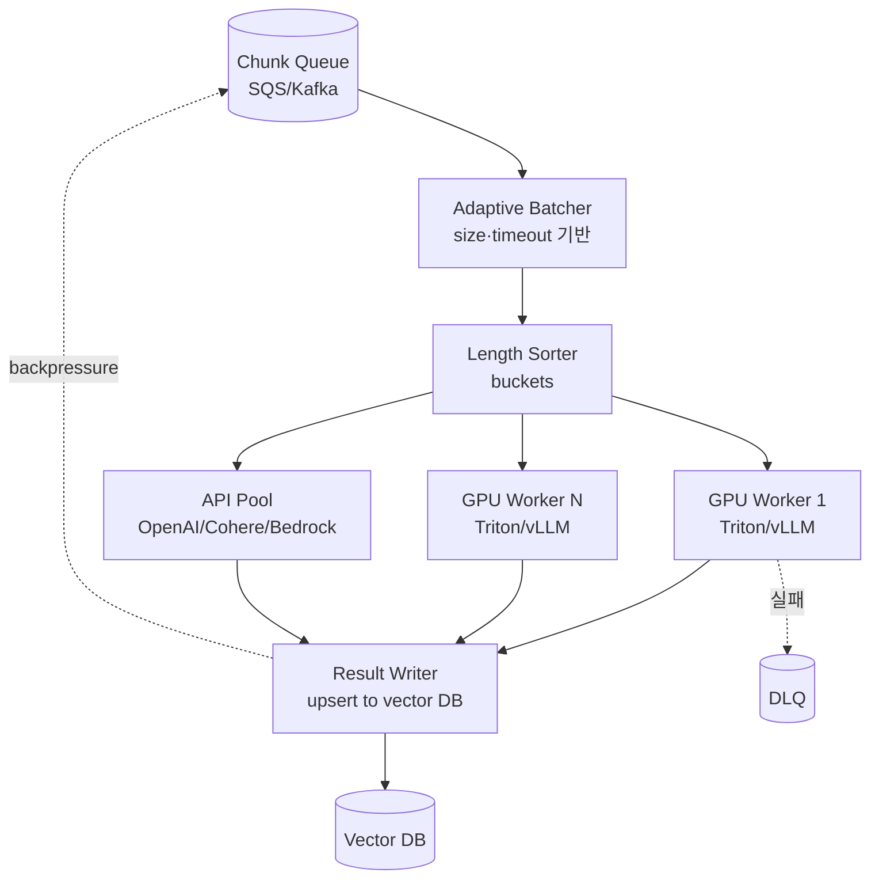
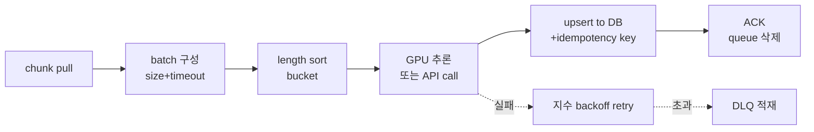

# RAG Ingestion - Embedding Generation (Batch & Throughput Tuning)

> 본 노트는 임베딩 모델 선택·품질이 아닌 **대규모 배치 임베딩의 처리량·지연·비용 튜닝**에 초점을 둔다. 모델 선택은 [[fl-2026-06-02-rag-data-ingestion-embedding-model-selection]], [[fl-2026-06-02-korean-rag-embedding-selection]] 참조.

## 핵심 요약

대규모 ingestion(수백만~수십억 chunk)에서 embedding generation은 **GPU·API 비용의 80%+를 차지**하는 병목이다. 같은 모델·같은 코퍼스라도 배치 처리 전략(batch size, padding, sorting, prefetch)에 따라 처리량이 5~20배 차이 난다. throughput tuning은 단순 "큰 배치" 문제가 아니라 **메모리·sequence length·rate limit이 얽힌 다목적 최적화** 문제다.

- **Throughput vs Memory**: 큰 batch는 throughput↑ but GPU OOM 위험, 적응형 batch sizing 필요
- **Length sorting의 효과**: 길이 정렬 후 batching은 padding 낭비를 50~80% 감소
- **API rate limit이 사실상의 throughput 상한**: OpenAI/Cohere 등 외부 API는 RPS·TPM 한계, 자체 호스팅이 일정 규모 이상에서 항상 유리
- **Idempotency 키 필수**: 재시도·중복 ingestion 시 동일 chunk → 동일 embedding 보장 안 하면 vector DB 중복 누적

## 시스템 아키텍처

대규모 임베딩 시스템은 **Queue → Batcher → Inference Worker (GPU/API) → Result Writer → DLQ** 5층 + 백프레셔 제어로 구성된다. 자체 호스팅 시 GPU 워커가 ray·triton·vLLM 위에 올라간다.

## 처리 흐름

queue에서 chunk를 꺼내 동적 batch 구성 후 GPU/API에 보내 임베딩을 생성하고, 결과를 vector DB에 upsert한다. 실패는 retry 후 DLQ. backpressure로 queue 폭주 방지.

## 핵심 기능 및 서비스

| 도구 | 강점 | 약점 |
|---|---|---|
| Sentence-Transformers | 가장 보편적 PyTorch SDK, encode() 표준 | 단일 프로세스 throughput 제한, 동적 batching 없음 |
| NVIDIA Triton Inference Server | dynamic batching, model ensemble, gRPC/HTTP, 최고 처리량 | 설정 복잡, model repository 관리 |
| vLLM | PagedAttention, 긴 sequence에서 throughput 우수 | LLM 중심, encoder-only는 제한적 |
| Text Embeddings Inference (HuggingFace TEI) | encoder 전용 고성능 서버, Rust, flash-attn 활용 | 모델 호환성 검증 필요 |
| Ray Serve | 워커 스케일아웃·라우팅, 다중 GPU 클러스터 친화 | 운영 복잡도, 단일 호스트엔 과함 |
| Bedrock Cohere/Titan | 관리형, 청구 단순, ap-northeast-2 가용 | rate limit, 길이 제한, 모델 선택 제약 |
| OpenAI text-embedding-3 | 품질·차원 가변(MRL), 광범위 언어 | RPS/TPM 한계, 데이터 전송 정책 |
| Cohere Embed v3 | 다국어, compressed embedding (int8) 제공 | API only |
| Modal/Replicate/Banana | 서버리스 GPU, burst 처리 | cold start, 비용 단가 |

## 유사 기술 비교

| 항목 | Triton + 자체 GPU | vLLM 자체 호스팅 | OpenAI Embeddings API | Bedrock Cohere |
|---|---|---|---|---|
| 특징 | dynamic batching 최강 | LLM·long context 친화 | 관리형, 비용 단순 | 관리형 + 서울 리전 |
| 장점 | 최고 throughput, 모델 자유 | 긴 sequence 효율 | 운영 0, 빠른 시작 | 리전 내 데이터, IAM 통합 |
| 단점 | 설정 복잡, GPU 자본투자 | encoder 모델 지원 제한 | TPM 한계, 데이터 외부 | 모델 제약, 차원 고정 |
| 적합 케이스 | 1억+ chunk 정기 reindex | LLM 임베딩 혼용 | <1천만 chunk, MVP | AWS 종속·규제 산업 |

## 실제 사례

### Cohere - Compass embedding pipeline
Cohere는 자사 Compass 제품 ingestion에서 length sorting + bucket batching으로 처리량을 4배 향상시켰다고 발표했다. fixed batch size 32 → adaptive (16~128) 변경 후 GPU util 60% → 92%.

### Pinecone - Bulk import 가이드
Pinecone은 1억 vector bulk import 시 (1) S3에 임베딩 parquet 사전 적재 (2) async import API로 vector DB에 server-side ingestion 패턴을 권장. 클라이언트 throughput 병목 제거.

### Anthropic Claude API - Batch API
Anthropic Batch API(50% 할인)는 임베딩이 아닌 LLM이지만, RAG ingestion에서 동일 패턴이 적용된다. **지연 허용 시 batch 모드로 비용 50% 절감**이 대규모 ingestion 표준이 되고 있다. OpenAI도 batch API 동일 할인 제공.

## 활용 시나리오

### 시나리오 1: 1억 chunk 초기 ingestion
- **맥락**: 신규 RAG 시스템, 1억 chunk 한 번 임베딩 필요, 1주일 deadline
- **선택**: Triton + A100 4장 또는 OpenAI Batch API
- **적용**: 자체 호스팅 시 length bucket [128/256/512] × batch 64/32/16 동적 배정, GPU 4장 병렬, 예상 60시간. API 사용 시 batch API 50% 할인 + 24시간 SLA로 약 $5K (text-embedding-3-small 기준)

### 시나리오 2: 일일 100만 chunk incremental
- **맥락**: 매일 100만 chunk 신규/갱신
- **선택**: SQS + Lambda + Bedrock (관리형 풀스택)
- **적용**: SQS batch size 25, Lambda 동시성 50, Bedrock Titan v2, 분당 약 12K chunk → 1.4시간 내 완료. rate limit 초과 시 backoff + DLQ

### 시나리오 3: 비용 50% 절감 ops 개선
- **맥락**: OpenAI API 월 $20K 임베딩 비용 발생, 50% 절감 목표
- **선택**: hot path는 그대로, 정기 reindex만 batch API 전환
- **적용**: 전체 임베딩 중 reindex 비중 80% 분석 → batch API 전환, 월 $8K 절감, latency는 24시간 허용

## 장단점 및 트레이드오프

| 항목 | 내용 |
|---|---|
| 장점 | 적절한 batching으로 GPU util 90%+ 달성, 비용·처리량 5~20배 개선, length sorting으로 padding 낭비 제거 |
| 단점 | 동적 batch는 latency variance 증가, length sort는 ordering 보장 약함, 자체 호스팅은 GPU capex 필요 |
| 트레이드오프 | **throughput vs latency**(큰 batch는 단건 지연↑), **자체 호스팅 vs API**(BEP는 보통 월 1~5천만 chunk), **batch API vs realtime**(50% 할인 vs 24h SLA) |

## 함정 및 안티패턴

- **안티패턴 1**: batch size를 고정 (e.g., 32)으로만 운영 → 짧은 chunk에선 GPU underutilization, 긴 chunk에선 OOM → **대안**: adaptive batcher (target tokens 기반, e.g., 16K tokens/batch)
- **안티패턴 2**: chunk 순서대로 그대로 batch → 길이 편차로 padding 50%+ → **대안**: 256~1024 chunk 윈도우 내 length sort + bucketing
- **안티패턴 3**: idempotency key 누락 → 재시도 시 중복 vector upsert, DB 폭증 + retrieval 노이즈 → **대안**: `content_hash` 또는 `chunk_id` 기반 upsert, vector DB의 deterministic ID 사용
- **안티패턴 4**: API 호출 retry에 지수 backoff 없음 → rate limit 폭주 시 동기화된 retry로 영구 실패 → **대안**: exponential backoff + jitter, Retry-After 헤더 존중, circuit breaker
- **안티패턴 5**: GPU 워커 1대에서 batch size만 키움 → 메모리는 늘지만 추론 속도가 비선형으로 둔화 → **대안**: 워커 수평 확장 + per-worker optimal batch (보통 32~128)
- **안티패턴 6**: API rate limit을 코드에 하드코딩 → 한도 상향 후에도 throughput 안 늘어남 → **대안**: token bucket을 환경변수/설정으로, 한도는 provider API에서 동적 감지
- **안티패턴 7**: 임베딩 결과를 메모리에 모았다가 한 번에 write → OOM, write 실패 시 전체 재작업 → **대안**: streaming upsert, 1K~10K vector 단위 partial commit

## 참고 자료

- [NVIDIA Triton - Dynamic Batching](https://docs.nvidia.com/deeplearning/triton-inference-server/user-guide/docs/user_guide/model_configuration.html#dynamic-batcher) - 공식 dynamic batching 설정
- [Hugging Face Text Embeddings Inference](https://github.com/huggingface/text-embeddings-inference) - Rust 기반 고성능 임베딩 서버
- [OpenAI Batch API](https://platform.openai.com/docs/guides/batch) - 50% 할인 batch 모드
- [Anthropic Batch API](https://docs.anthropic.com/en/docs/build-with-claude/batch-processing) - 24시간 SLA batch 처리
- [Pinecone - Bulk Import](https://docs.pinecone.io/guides/data/understanding-imports) - 대용량 import 패턴
- [vLLM Docs](https://docs.vllm.ai/) - PagedAttention 기반 LLM/encoder serving
- [Sentence-Transformers - Batch Encoding](https://www.sbert.net/docs/sentence_transformer/usage/efficiency.html) - 효율 가이드
