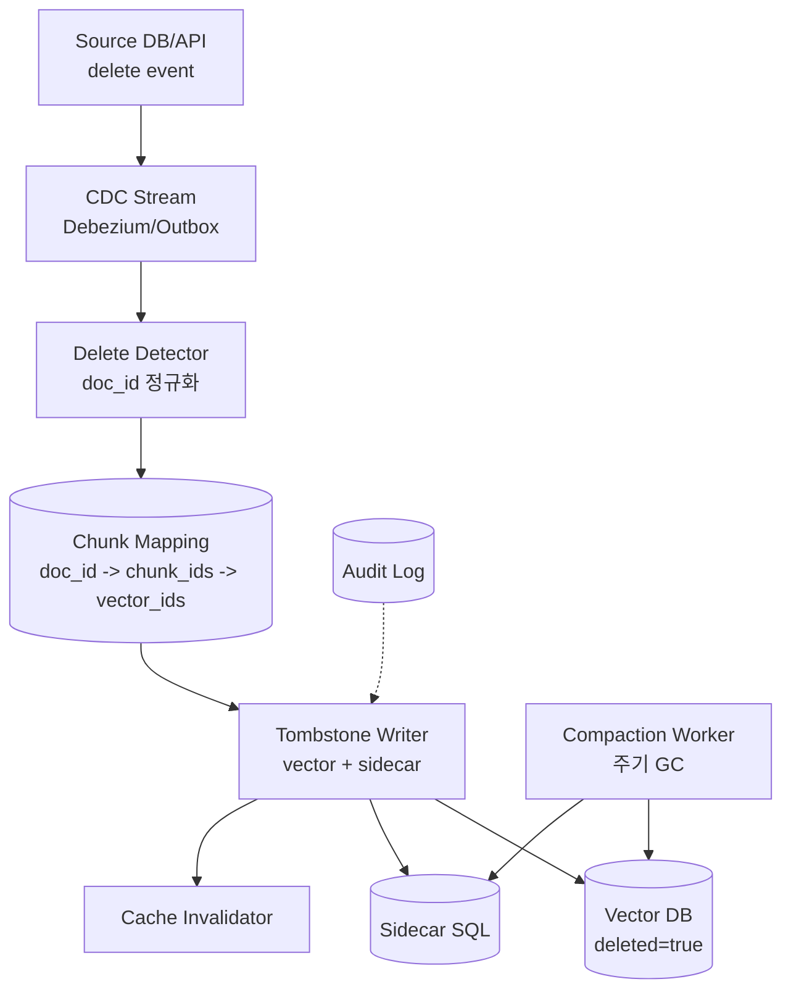
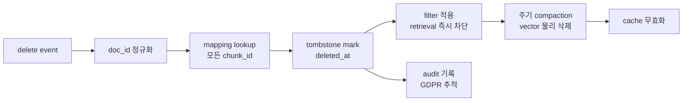

# RAG Ingestion - Incremental Sync (Deletion & Tombstones)

> 본 노트는 incremental sync 전반이 아닌 **삭제 전파·tombstone·일관성** 관점에 초점을 둔다. 일반 CDC 파이프라인은 [[fl-2026-06-02-embedding-ingestion-pipeline-incremental-cdc]] 참조.

## 핵심 요약

Incremental ingestion에서 가장 자주 깨지는 부분은 **삭제·갱신·중복 제거**다. 신규 추가는 append-only로 쉬우나, 삭제는 (1) 어디에 어떤 chunk가 분산됐는지 추적 (2) 모든 vector·sidecar에서 제거 (3) 캐시·인덱스 일관성 보장이 모두 필요하다. 삭제 누락은 RAG에서 **stale 답변·정보 누출·규제 위반(GDPR right-to-erasure)**의 직접 원인이다.

- **물리 삭제 vs tombstone**: 즉시 삭제는 racing·rollback에 약함, soft delete + 주기적 compaction이 표준
- **One-to-many 매핑**: 1개 source document → N개 chunk → M개 vector → K개 cache key, 매핑 추적 필수
- **GDPR/DSAR 요구**: 개인정보 삭제 요청 시 모든 derived artifact (vector + LLM cache + log)에서 제거 가능해야 함
- **Eventual consistency 허용 한계**: 보통 분~시간 단위 OK, 그러나 규제·민감 정보는 SLA 명시 필요

## 시스템 아키텍처

Deletion-aware ingestion은 **Source CDC → Delete Detector → Chunk Index (mapping store) → Vector DB Tombstoner → Compaction Worker → Cache Invalidator** 6컴포넌트로 구성된다. 매핑 store가 핵심.

## 처리 흐름

source의 delete 이벤트가 도착하면 매핑에서 영향받는 chunk·vector 집합을 찾아 tombstone을 기록하고, 즉시 retrieval에서 제외되도록 mark, 이후 compaction에서 물리 삭제 + 캐시 무효화.

## 핵심 기능 및 서비스

| 기능/도구 | 설명 |
|---|---|
| Debezium / AWS DMS | source DB CDC 표준, delete 이벤트 포함 |
| Kafka Connect + Outbox | application-level delete intent를 outbox로 안정 발행 |
| Pinecone `delete_by_metadata` | metadata filter로 일괄 삭제 |
| Weaviate `delete by where filter` | filter 기반 batch delete |
| pgvector + SQL DELETE | 트랜잭션 단일성, 가장 단순 |
| OpenSearch `_delete_by_query` | filter 기반 비동기 삭제 |
| LangChain RecordManager | doc-to-chunk mapping + soft delete 표준 패턴 |
| LlamaIndex DocumentStore | doc_id → ref_doc_info 매핑 관리 |
| Tombstone TTL | deleted_at + TTL로 자동 compaction |
| GDPR audit log | 삭제 요청·실행·완료 timestamp 영구 기록 |

## 유사 기술 비교

| 항목 | Hard delete (즉시) | Soft delete + filter | Tombstone + compaction | Versioned (no delete) |
|---|---|---|---|---|
| 특징 | DELETE 즉시 실행 | flag 표시 후 query에서 제외 | mark → 주기 GC | 새 버전만 추가, 구 버전 read-only |
| 장점 | 단순, 저장 절약 | rollback 가능, 빠름 | 일관성 + 효율 균형 | audit 완벽, 시점 조회 |
| 단점 | rollback 불가, 동시성 위험 | 저장 누적, filter 누락 위험 | compaction 복잡 | 저장 큼, 삭제 의미 약화 |
| 적합 케이스 | 비규제 + 즉시성 | 일반 RAG | 대규모 production | 법률/감사 영역 |

## 실제 사례

### LangChain RecordManager + Indexing API
LangChain은 incremental indexing 표준 패턴으로 `RecordManager`를 제공, source hash 기반으로 추가·수정·삭제를 추적한다. `cleanup="incremental"` 모드에서 source에서 사라진 record를 vector DB에서 자동 제거. RAG ingestion의 reference 구현.

### Pinecone - Bulk delete & namespace
Pinecone은 대규모 삭제 시 `delete_by_metadata` filter + namespace 단위 truncate를 권장. 개별 vector 삭제는 비용이 높아 namespace 단위 재구성이 종종 더 효율적이라고 안내.

### GDPR Right-to-be-forgotten 사례
EU 규제 하에서 RAG 운영 시 user data ingest 30일 이내 삭제 요청 처리 의무. 다수 회사가 (1) user_id metadata 강제 (2) 삭제 요청 → 모든 vector·log·cache·LLM 학습 데이터에서 제거 (3) 완료 audit 패턴 채택. Microsoft Copilot, Notion AI가 공개 사례.

## 활용 시나리오

### 시나리오 1: Confluence 페이지 삭제 즉시 RAG에서 제외
- **맥락**: 회사 정책 변경으로 wiki 페이지 삭제, 답변에서 즉시 사라져야 함
- **선택**: Confluence webhook → soft delete + filter
- **적용**: webhook으로 `page.removed` 이벤트 수신 → mapping store에서 chunk_ids 조회 → vector metadata `deleted_at` 기록 → retrieval filter `deleted_at IS NULL`. 1시간 후 compaction worker가 물리 삭제

### 시나리오 2: GDPR 삭제 요청 처리
- **맥락**: user_id=X의 모든 데이터 삭제 요청, 72시간 SLA
- **선택**: tenant_id+user_id 강제 metadata + bulk delete
- **적용**: `delete_by_metadata({user_id: X})` 모든 vector DB에 발행, sidecar SQL CASCADE 삭제, LLM cache key (`user_id=X*`) 패턴 invalidate, audit log에 완료 timestamp 기록

### 시나리오 3: 문서 갱신 시 stale chunk 정리
- **맥락**: 동일 doc_id 문서가 수정됨, 청크 경계·내용이 부분적으로 바뀜
- **선택**: 전체 chunk replacement (content-hash diff)
- **적용**: 신규 chunking 결과를 기존 doc_id의 chunk와 hash 비교 → 사라진 chunk soft delete, 새 chunk insert, 변경 없는 chunk는 그대로 유지 (임베딩 비용 절감)

## 장단점 및 트레이드오프

| 항목 | 내용 |
|---|---|
| 장점 | 데이터 일관성·법적 준수 보장, stale 답변 방지, rollback 가능, audit 추적 |
| 단점 | 매핑 store 추가 인프라, compaction 복잡, soft delete는 저장 누적 |
| 트레이드오프 | **즉시성 vs 일관성**(hard delete vs tombstone), **저장 vs 복잡도**(compaction 주기 vs 인덱스 비대), **추적 vs 비용**(전체 audit 비용 vs 규제 risk) |

## 함정 및 안티패턴

- **안티패턴 1**: source 삭제 이벤트를 polling으로 처리 → 짧은 수명 record 누락, eventual consistency 깨짐 → **대안**: CDC log 기반 또는 outbox pattern, polling은 reconciliation 용도로만
- **안티패턴 2**: chunk → vector 매핑이 vector DB에만 존재 → vector DB 장애 시 mapping 조회 불가 → **대안**: mapping을 별도 source-of-truth(SQL/DynamoDB)에 보존, vector DB는 derived
- **안티패턴 3**: 삭제 시 retrieval filter 미적용, 즉시 reindex만 시도 → reindex 중에는 삭제된 데이터가 답변에 노출 → **대안**: tombstone mark 즉시 + filter, 물리 삭제는 비동기
- **안티패턴 4**: cache 무효화 누락 → LLM 답변 cache가 삭제된 데이터를 계속 반환 → **대안**: delete 이벤트에 cache invalidation 단계 필수, key 패턴 또는 broadcast
- **안티패턴 5**: GDPR 삭제 audit 없음 → 규제 점검 시 증빙 불가 → **대안**: (request_id, user_id, requested_at, completed_at, scope_hash) 영구 저장
- **안티패턴 6**: tombstone TTL 없음 → soft delete가 영원히 누적, 인덱스 비대 → **대안**: 30~90일 TTL, compaction worker가 주기 GC
- **안티패턴 7**: doc 갱신을 delete-then-insert로 처리 → 임베딩 비용 N배, 변경 없는 chunk까지 reembed → **대안**: chunk content-hash diff → 변경분만 reembed

## 참고 자료

- [LangChain - Indexing API](https://python.langchain.com/docs/how_to/indexing/) - RecordManager 기반 incremental sync 표준
- [Pinecone - Delete Records](https://docs.pinecone.io/guides/data/delete-data) - 대규모 삭제 best practice
- [Weaviate - Batch Delete](https://weaviate.io/developers/weaviate/manage-data/delete) - filter 기반 일괄 삭제
- [Debezium Documentation](https://debezium.io/documentation/) - CDC delete event 처리
- [OpenSearch - Delete by Query](https://opensearch.org/docs/latest/api-reference/document-apis/delete-by-query/) - 비동기 대량 삭제
- [GDPR - Right to erasure](https://gdpr-info.eu/art-17-gdpr/) - Article 17 원문
- [Microsoft - Data deletion in Copilot](https://learn.microsoft.com/en-us/copilot/microsoft-365/manage-public-web-access) - 엔터프라이즈 RAG의 삭제 정책 예시
