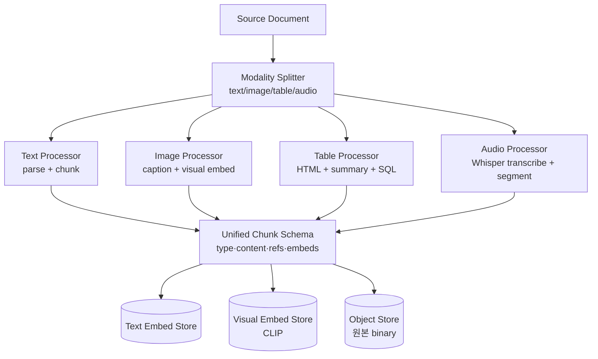
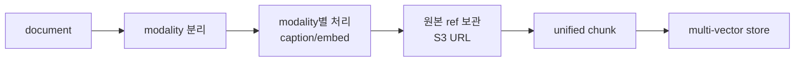

# RAG Ingestion - Multi-modal Ingestion

## 핵심 요약

Multi-modal ingestion은 텍스트 외 **이미지·표·차트·코드·오디오·비디오**를 RAG가 검색·생성 가능한 형태로 변환하는 단계다. 단일 텍스트 임베딩 공간에 묶는 방식(text-captioning)과 modality별 임베딩 공간을 분리해 cross-modal 검색하는 방식(CLIP/ColPali)이 공존한다. 어떤 modality든 핵심은 **"검색 가능한 representation + 답변 시 원본 참조"** 두 축을 동시에 보장하는 것.

- **3가지 전략**: (1) captioning (모든 modality를 텍스트로 변환) (2) cross-modal embedding (CLIP-like) (3) multi-vector (텍스트 + 시각 embedding 동시 보유)
- **Table은 별도 modality 취급 권장**: 텍스트 평탄화는 셀-행 관계 손실, structure-aware 임베딩 또는 SQL fallback
- **오디오·비디오는 cost-heavy**: 전체 트랜스크라이브 vs 키프레임 추출 + 청크 trade-off
- **원본 보존 필수**: caption은 lossy, 답변·인용 시 원본 (이미지/오디오 segment)이 필요

## 시스템 아키텍처

Multi-modal ingestion은 **Source Splitter (modality 라우팅) → Modality-specific Processor → Unified Chunk Schema → Multi-vector Store** 구조다. modality마다 별도 pipeline이지만 schema는 통일.

## 처리 흐름

document를 modality별로 분리해 각각 caption(또는 cross-modal embedding) + 원본 참조 metadata와 함께 통일 schema로 저장, retrieval 시 modality 통합 또는 분리 검색.

## 핵심 기능 및 서비스

| 도구/기능 | 설명 |
|---|---|
| OpenAI CLIP | 텍스트-이미지 공동 임베딩 공간, cross-modal 검색 표준 |
| ColPali / ColQwen | 페이지 이미지 직접 임베딩, OCR 우회, 표·차트 강함 |
| GPT-4o / Claude 3.5 Sonnet vision | 이미지/차트 captioning + table extraction |
| Whisper / Distil-Whisper | 음성 ASR 표준, segment timestamp 포함 |
| AssemblyAI / Deepgram | 관리형 ASR + diarization |
| Unstructured table extraction | PDF 표를 HTML 구조 보존 추출 |
| Tabula / Camelot | PDF 표 → CSV/DataFrame |
| MERLOT / VideoMAE | 비디오 임베딩, frame + temporal |
| LlamaIndex MultiModalVectorStoreIndex | text + image 동시 검색 추상화 |
| LangChain MultiVectorRetriever | 1 chunk → N embedding (원본 + summary) |
| AWS Bedrock multimodal embeddings (Titan, Cohere) | 관리형 cross-modal 임베딩 |

## 유사 기술 비교

| 항목 | Captioning (이미지→텍스트) | CLIP-like cross-modal | ColPali (page-image) | Multi-vector |
|---|---|---|---|---|
| 특징 | VLM이 이미지 설명 → 텍스트 임베딩 | 텍스트·이미지 공동 공간 | 페이지 이미지를 그대로 임베딩 | 모달리티별 임베딩 동시 보유 |
| 장점 | 기존 text RAG 재사용, 인간 검수 가능 | 직접 cross-modal 검색 | OCR/파싱 불필요, 표·차트 강함 | 검색 유연성 최고 |
| 단점 | lossy, captioning 비용 큼 | 텍스트-이미지 매칭 품질 변동 | 저장·연산 큼 (페이지당 다수 vector) | 인덱스 복잡도 |
| 적합 케이스 | 표·차트 풍부 문서 + 정확한 답변 | 이미지 검색 중심 (e-commerce) | PDF/스캔본 위주 엔터프라이즈 | 학술·기술 문서 |

## 실제 사례

### Cohere - Embed v3 multimodal & ColPali
Cohere Embed v3는 텍스트·이미지 동일 공간 임베딩을 제공하고, ColPali는 페이지 이미지를 직접 임베딩하는 접근으로 2024년 다수 PDF RAG 벤치마크에서 OCR+text 파이프라인을 능가했다고 보고됨. 페이지를 통째 임베딩하는 패러다임의 부상.

### OpenAI - GPT-4o multimodal RAG
OpenAI는 GPT-4o로 차트·다이어그램이 포함된 문서를 caption + 원본 이미지 동시 저장 후 retrieval 시 이미지를 모델에 직접 첨부하는 패턴 가이드를 공개. caption은 검색용, 원본은 답변 컨텍스트.

### YouTube/Spotify - Video/Audio RAG
대규모 미디어 플랫폼은 Whisper로 전체 트랜스크립트 생성 후 segment 단위 청킹, 동시에 keyframe 이미지를 CLIP으로 임베딩해 visual query("X가 나오는 장면")까지 지원하는 multi-modal 구조 채택.

## 활용 시나리오

### 시나리오 1: 차트·표 풍부 재무 보고서 RAG
- **맥락**: 분기 보고서 PDF, 표·차트·수식이 핵심 정보, OCR로는 부족
- **선택**: ColPali 또는 LlamaParse + GPT-4o vision
- **적용**: 페이지 이미지를 ColPali로 임베딩, 동시에 표는 Markdown 추출 후 별도 임베딩, 답변 시 원본 페이지 이미지를 LLM에 첨부

### 시나리오 2: 사내 회의 녹음 RAG
- **맥락**: 주간 회의 녹음 2년치, "X 의제 결정 사항" 검색
- **선택**: Whisper + speaker diarization + 30초 segment
- **적용**: 전체 트랜스크라이브 + diarization으로 발화자 metadata, 30~60초 segment chunking, segment URL/타임스탬프 저장 → 답변에 인용 링크

### 시나리오 3: 제품 카탈로그 이미지 검색
- **맥락**: 수만 제품 이미지 + 설명, "빨간 가죽 운동화" 같은 visual query
- **선택**: CLIP 또는 Bedrock multimodal embedding
- **적용**: 텍스트 description과 이미지를 동일 임베딩 공간에 적재, 쿼리 텍스트로 image neighbor 검색, hybrid (text+image score weighted) ranking

## 장단점 및 트레이드오프

| 항목 | 내용 |
|---|---|
| 장점 | 표·차트·이미지·오디오 정보 RAG 통합, 답변 인용에 시각 자료 첨부, 도메인 확장성 |
| 단점 | ingestion 비용 5~20배(VLM/ASR/multi-vector), 인덱스 크기 폭증, modality별 평가 metric 부재 |
| 트레이드오프 | **captioning vs cross-modal**(텍스트 RAG 재사용 vs 직접 검색), **원본 보존 vs 비용**(이미지/오디오 binary 저장), **single space vs multi-vector**(검색 단순성 vs 정확도) |

## 함정 및 안티패턴

- **안티패턴 1**: 모든 이미지를 captioning만 → 색상·레이아웃 정보 손실, 시각적 query 불가 → **대안**: 중요한 이미지는 caption + visual embedding 동시 보유 (multi-vector)
- **안티패턴 2**: 표를 평탄 텍스트로 임베딩 → 셀-행 관계 손실, 행 단위 query 실패 → **대안**: 표는 HTML/Markdown 보존 + summary metadata + 큰 표는 SQL fallback (Text-to-SQL)
- **안티패턴 3**: 오디오 전체를 단일 chunk로 임베딩 → segment-level query 불가 → **대안**: timestamp 기반 30~60초 segment 청킹, segment URL metadata 보존
- **안티패턴 4**: 원본 binary를 vector DB에 저장 → DB 비대화·비용 폭증 → **대안**: 원본은 object storage(S3), vector DB는 reference URL만
- **안티패턴 5**: caption만 보존하고 원본 삭제 → 답변에 시각 자료 첨부 불가, audit 불가 → **대안**: 원본은 항상 유지 (retention 정책 별도)
- **안티패턴 6**: modality 평가를 텍스트 metric으로만 → 이미지·오디오 retrieval 실패를 측정 못함 → **대안**: modality별 golden set 별도 구축
- **안티패턴 7**: VLM/ASR을 ingestion마다 호출 → 비용 폭증 → **대안**: content hash cache, 동일 binary 재처리 방지

## 참고 자료

- [Anthropic - Vision Capabilities](https://docs.anthropic.com/en/docs/build-with-claude/vision) - Claude vision API 가이드
- [OpenAI - GPT-4o Vision](https://platform.openai.com/docs/guides/vision) - 이미지 captioning + reasoning
- [ColPali Paper (Manuel Faysse et al., 2024)](https://arxiv.org/abs/2407.01449) - 페이지 이미지 직접 임베딩
- [Cohere Embed v3 - Multimodal](https://cohere.com/blog/multimodal-embed-3) - cross-modal 임베딩 모델
- [OpenAI Whisper](https://github.com/openai/whisper) - ASR 표준 오픈소스
- [LlamaIndex - Multi-Modal](https://docs.llamaindex.ai/en/stable/module_guides/models/multi_modal/) - 멀티모달 인덱스 추상화
- [LangChain - MultiVectorRetriever](https://python.langchain.com/docs/how_to/multi_vector/) - 1 chunk N embedding 패턴
- [AWS Bedrock - Multimodal Embeddings (Titan)](https://docs.aws.amazon.com/bedrock/latest/userguide/titan-multiemb-models.html) - 관리형 multimodal embedding
