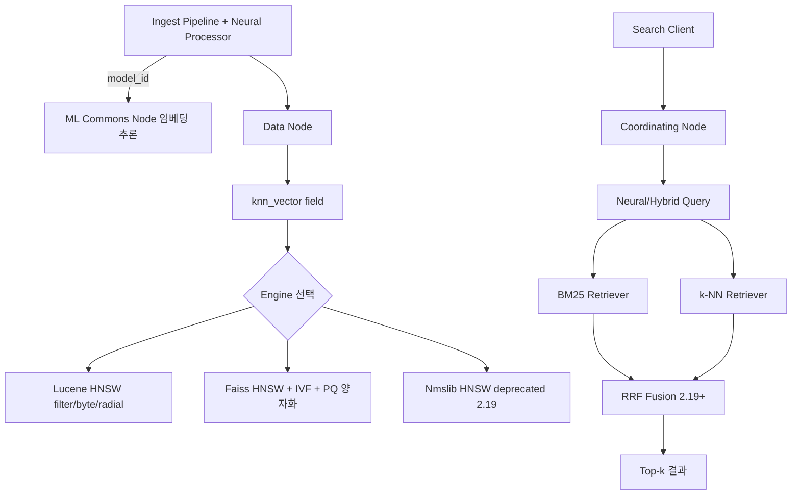
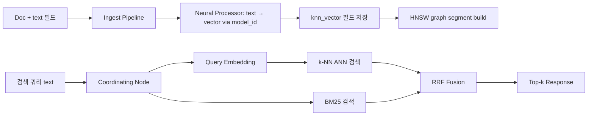

# Vector Search Architecture - OpenSearch k-NN Centric

## 핵심 요약

OpenSearch에 내장된 **k-NN 플러그인**을 사용해 BM25 lexical 검색과 dense vector 검색을 한 클러스터에서 동시에 운영하는 아키텍처. v3.0(2025-05)에서 vector engine 성능이 이전 대비 최대 **9.5배** 향상되며 본격적인 vector DB 대안으로 자리 잡았다. RAG·시맨틱 검색에 별도 vector DB 도입 없이 기존 OpenSearch 클러스터를 그대로 활용할 수 있다는 점이 큰 이점.

- **3가지 엔진**: Lucene(Java 내장) / Faiss(C++) / Nmslib(C++, 2.19에서 deprecated). Lucene은 필터링·byte vector 우수, Faiss는 IVF/PQ 양자화 지원
- **알고리즘**: 모든 엔진이 HNSW 지원, Faiss는 IVF 추가. 2.x부터 radial search·filter 지원 확대
- **하이브리드 검색**: BM25 + k-NN 결과를 `Neural Search` 플러그인의 **RRF(Reciprocal Rank Fusion)** 로 결합 (OpenSearch 2.19+). recall@10이 단일 retriever 대비 65/78% → 91% 수준으로 상승
- **양자화/디스크 검색**: 2x/4x/8x/16x/32x 양자화 및 disk-based vector search로 메모리 비용 통제

자매 노트: 제품 비교는 [[fl-2026-06-02-vector-search-db-comparison]], 일반 아키텍처 설계는 [[fl-2026-06-02-vector-search-architecture-design]], 운영(재인덱싱·모니터링)은 [[fl-2026-06-02-vector-search-operations]] 참조.

## 시스템 아키텍처

OpenSearch 노드는 Lucene 위에 k-NN 플러그인을 얹어 `knn_vector` 필드를 ANN 인덱스로 관리한다. Neural Search 플러그인은 텍스트→임베딩 변환을 ingest pipeline에서 자동화하고, 검색 시 query embedding 생성과 RRF 결합도 수행한다.

## 처리 흐름

색인 시점에 ingest pipeline이 임베딩을 채워 넣고, 검색 시점엔 query text를 동일 모델로 임베딩하여 ANN 검색 후 BM25와 결합한다.

## 핵심 기능 및 서비스

| 기능 | 설명 |
|---|---|
| `knn_vector` field | 1–16,000 차원 dense vector 저장. cosine/L2/inner-product |
| Lucene Engine | Java 내장, filter 강력, byte vector 지원, 작은~중간 규모 적합 |
| Faiss Engine | HNSW + IVF, PQ 양자화 지원. 대용량 적합 |
| Nmslib Engine | HNSW C++ 구현, 2.19에서 deprecated |
| Quantization | 2x~32x byte/half-float/int8. 메모리 대폭 절감 |
| Disk-based search | RAM 부족 시 디스크 기반 검색으로 fallback |
| ML Commons | 클러스터 내부에서 임베딩 모델 호스팅 (또는 외부 connector) |
| Neural Search Plugin | ingest/search 단계에서 자동 임베딩 + 하이브리드 |
| RRF Fusion | 2.19+ Neural Search에서 score-free 결합 |
| Radial Search | 벡터 거리 임계값 기반 검색 (2.x) |
| Filter Search | `pre`/`post`/`efficient` 필터 모드 지원 |

## 유사 기술 비교

| 항목 | OpenSearch k-NN | Elasticsearch Vector | 전용 Vector DB (Pinecone/Milvus 등) |
|---|---|---|---|
| 단일 클러스터에서 lexical+vector | 가능 (RRF 내장) | 가능 (rrf retriever) | 별도 검색 엔진 결합 필요 |
| 엔진 선택권 | Lucene / Faiss / Nmslib | Lucene only | 자체 엔진 |
| 양자화 | 2x~32x + disk search | int8/bbq 등 | 제품마다 상이 |
| 운영 부담 | OpenSearch 클러스터 일체 | Elastic 라이선스 고려 | 별도 인프라/관리자 필요 |
| 적합 케이스 | 기존 OpenSearch 사용처 + RAG | 같은 맥락 (Elastic) | 초고규모/특화 워크로드 |

## 실제 사례

### Amazon OpenSearch Service의 RAG 패턴
AWS는 자사 블로그에서 OpenSearch Service의 vector database 기능을 OpenSearch k-NN + Neural Search 조합으로 설명하며, Amazon Bedrock과 결합한 RAG 레퍼런스 아키텍처를 공식 제공. ingest pipeline에서 Bedrock 임베딩 모델(Titan Embeddings 등)로 자동 인덱싱하는 흐름.

### OpenSearch 3.0 성능 향상
OpenSearch 프로젝트가 2025-05 출시한 3.0에서 vector engine 성능이 이전 대비 **최대 9.5배** 향상됐다고 발표. 기존 클러스터에서 별도 vector DB 도입 없이 RAG·시맨틱 검색 도입을 결정한 조직이 증가하는 배경.

### 하이브리드 검색의 표준화 흐름
RRF가 OpenSearch, Elasticsearch, Azure AI Search, MongoDB Atlas, Weaviate에서 모두 hybrid search의 기본 결합 알고리즘으로 채택됨. OpenSearch는 2.19에서 Neural Search 플러그인을 통해 도입.

## 활용 시나리오

### 시나리오 1: 사내 문서 RAG 통합 클러스터
이미 사내 로그/검색 용도로 OpenSearch를 운영 중인 조직이 별도 vector DB 도입 없이 동일 클러스터의 신규 인덱스에 `knn_vector` 필드를 추가해 RAG를 구축. 운영 인력·CI·모니터링을 재사용해 도입 비용 최소화.

### 시나리오 2: 멀티 모달 검색 (텍스트+이미지)
이미지 CLIP 임베딩과 텍스트 BERT 임베딩을 각각 다른 `knn_vector` 필드에 저장 → query 측에서 두 retriever 결과를 RRF 결합. byte vector + Lucene engine으로 저장 비용 통제.

### 시나리오 3: 정확 매칭 보존 RAG
제품 코드/오류 코드 같은 정확 토큰 매칭이 중요한 도메인에서 vector 단독은 78% recall에 그치고 정확 식별자를 놓침. BM25 + k-NN을 RRF로 결합해 recall@10을 91% 수준으로 끌어올림.

## 장단점 및 트레이드오프

| 항목 | 내용 |
|---|---|
| 장점 | 기존 OpenSearch 클러스터 재사용. lexical+vector를 단일 인덱스에 결합. RRF score-free 결합으로 정규화 부담 제거. 양자화/disk search로 메모리 비용 통제. |
| 단점 | 전용 vector DB 대비 초고규모(10B+ vectors)에서 운영 복잡. ML Commons 모델 호스팅은 별도 노드 자원 필요. Nmslib deprecation 등 마이그레이션 일정 관리 필요. |
| 트레이드오프 | Lucene(메모리·기능 균형) ↔ Faiss(대규모·양자화) ↔ Nmslib(deprecated). HNSW(검색속도↑/메모리↑) ↔ IVF+PQ(메모리↓/recall↓). 양자화 압축률↑ ↔ recall↓. |

## 함정 및 안티패턴

- **안티패턴 1: 임베딩 모델 변경 시 부분 reindex** → 모델이 다른 vector를 한 인덱스에 섞으면 거리 계산이 무의미 → 새 인덱스 생성 후 alias swap (자세한 운영 절차는 [[fl-2026-06-02-vector-search-operations]])
- **안티패턴 2: Nmslib에 신규 의존** → 2.19에서 deprecated, 향후 제거 → 신규 인덱스는 Lucene 또는 Faiss로 시작
- **안티패턴 3: BM25와 vector의 raw score 가산** → BM25(14.3)와 cosine(0.87)은 스케일이 달라 무의미 → RRF 또는 정규화 후 weighted sum 사용
- **안티패턴 4: pre-filter 남용** → 큰 필터 셋에 pre-filter를 적용하면 ANN 효율 저하 → efficient filter 모드(2.x) 활용
- **안티패턴 5: 모든 워크로드에 HNSW + float32** → 메모리 폭증 → 양자화/byte vector + disk search 검토

## 참고 자료

- [k-NN methods and engines (OpenSearch)](https://docs.opensearch.org/latest/mappings/supported-field-types/knn-methods-engines/) — Lucene/Faiss/Nmslib 비교 공식
- [k-NN vector field type](https://docs.opensearch.org/latest/mappings/supported-field-types/knn-vector/) — 필드 정의 공식
- [Approximate k-NN search](https://docs.opensearch.org/latest/vector-search/vector-search-techniques/approximate-knn/) — ANN 동작 공식 문서
- [Amazon OpenSearch Service vector database capabilities](https://www.amazonaws.cn/en/blog-selection/amazon-opensearch-services-vector-database-capabilities-explained/) — AWS 공식 레퍼런스 아키텍처
- [Introducing RRF for hybrid search (OpenSearch Blog)](https://opensearch.org/blog/introducing-reciprocal-rank-fusion-hybrid-search/) — Neural Search 2.19 RRF 공지
- [Reciprocal Rank Fusion (BigData Boutique)](https://bigdataboutique.com/blog/reciprocal-rank-fusion-how-it-works-and-when-to-use-it) — RRF 원리·실험 비교
- [What is hybrid search? (Elastic)](https://www.elastic.co/what-is/hybrid-search) — hybrid search 정의·비교
