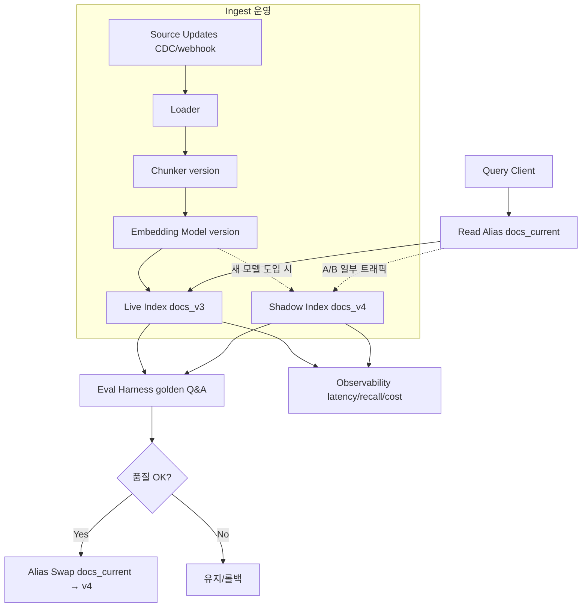
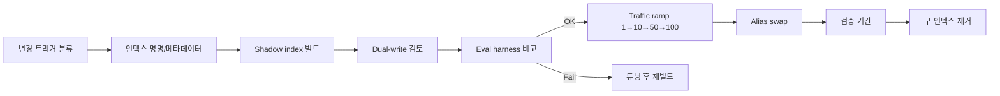

# Vector Search Architecture - Search/Indexing Operations (Reindex / Monitoring)

## 핵심 요약

Vector 검색·색인 시스템을 **운영** 단계에서 다루는 핵심 활동: ① 임베딩 모델/차원/metric 변경 시 **재인덱싱(reindex)** ② 인덱스 수명/버전 관리 ③ 검색 품질·latency·비용의 **지속 모니터링** ④ 데이터 drift·정책 변경 대응. 설계 단계 결정은 [[fl-2026-06-02-vector-search-architecture-design]] 참조.

- **모델 버전 = 인덱스 버전**: 한 인덱스에 다른 모델의 vector를 섞으면 거리 계산이 무의미. 모델 변경 시 새 인덱스 빌드 → alias swap 패턴이 표준
- **Shadow + 트래픽 점진 이전**: 새 인덱스를 백그라운드 빌드 → 일부 query를 양쪽에 보내 결과 비교 → 점진 라우팅 → 검증 기간(7–14일) 후 구 인덱스 제거
- **메타데이터 박제**: 모든 청크에 `model_name`, `model_version`, `dim`, `metric`, `chunker_version`을 저장. 쿼리 시 query 모델과 저장 모델이 일치하는지 assertion
- **검색 품질 지표**: recall@k / nDCG@k / MRR + LLM-as-judge. golden set은 정기 추가·갱신
- **운영 지표**: query latency p50/p95/p99, ANN recall, HNSW segment count, RAM 사용량, 인덱스 빌드 시간, 비용/1k query

자매 노트: 설계 결정은 [[fl-2026-06-02-vector-search-architecture-design]], 제품 선택은 [[fl-2026-06-02-vector-search-db-comparison]], OpenSearch 특화는 [[fl-2026-06-02-vector-search-opensearch-knn]].

## 컴포넌트 다이어그램

운영 컴포넌트는 ingest pipeline, alias router, retrieval eval harness, observability stack으로 구성. shadow index가 핵심이며 alias swap으로 무중단 전환을 만든다.

## 적용 단계

1. **변경 트리거 분류**: 모델/차원/metric 변경(전체 reindex) vs 청킹 정책 변경(전체 reindex) vs 데이터 추가/갱신(증분 ingest) vs 메타데이터 추가(부분 reindex 또는 in-place update)
2. **인덱스 명명 규약**: `docs_{source}_{model}-{version}_{chunker}_{vN}` 식으로 결정 인자를 박제 (예: `docs_confluence_openai-v3_chunk-500_v1`)
3. **Shadow index 빌드**: 새 인덱스를 prod에 영향 없는 노드 그룹에서 빌드. 대규모면 hot data 분할 batch
4. **이중 인입(dual-write) 검토**: 변경 트리거가 지속적인 source 갱신과 겹치면 이중 인입으로 신선도 유지
5. **품질 평가**: golden Q&A로 recall@k/nDCG/MRR 비교 + LLM-as-judge 표본. 임계값 통과 시 다음 단계
6. **트래픽 점진 이전**: 1% → 10% → 50% → 100%. 단계별 latency/품질 회귀 모니터
7. **alias swap**: 모든 트래픽을 새 인덱스로 라우팅. 구 인덱스 read-only 유지
8. **검증 기간 종료 후 제거**: 7–14일 모니터 후 구 인덱스 삭제. retention은 rollback 가능성에 따라 결정

## 핵심 기능 및 서비스

| 운영 항목 | 설명 |
|---|---|
| 모델 버전 메타데이터 | 모든 청크에 `model_name`, `model_version`, `dim`, `metric` 저장 |
| Shadow index | 신규 모델·청킹·스키마 변경의 prod 영향 없는 검증 인덱스 |
| Alias / read pointer | 무중단 전환의 단일 지점. 모든 client는 alias만 호출 |
| Dual-write | 변경 트리거 기간 동안 신선도 보장 |
| Eval harness | golden Q&A + recall@k/nDCG/MRR + LLM judge 자동 측정 |
| Drift 감지 | 새 doc 분포가 학습 시점 분포와 멀어질 때 모델 재선정 알림 |
| Latency budget | retriever 단계별 p50/p95/p99 추적 (BM25/vector/rerank) |
| Cost dashboard | 1k query당 비용 (모델 추론 + ANN 검색 + rerank) |
| Backfill 도구 | 전체 reindex 시 source → chunk → embed → store 파이프라인의 throttle/replay |
| Rollback runbook | alias swap 실패 시 즉시 이전 alias로 복귀 절차 |

## 유사 기술 비교

| 항목 | In-place update | Shadow + Alias swap | Blue/Green 인덱스 | Dual-write + 점진 이전 |
|---|---|---|---|---|
| 다운타임 | 없음 (단일 인덱스) | 없음 | 없음 | 없음 |
| 모델/차원 변경 | 불가 | 가능 | 가능 | 가능 |
| 운영 복잡도 | 가장 낮음 | 중간 | 중간 | 가장 높음 |
| 신선도 유지 | 자동 | 빌드 동안 정체 가능 | 빌드 동안 정체 가능 | 자동 |
| 적합 케이스 | 메타데이터 일부 수정 | 모델/스키마 변경 | 전면 리프레시 | 변경 기간 동안 source 갱신 빈번 |

## 실제 사례

### 임베딩 모델 메이저 업그레이드 (OpenAI v2 → v3)
공개 가이드에서 반복적으로 권장되는 표준 절차: 새 인덱스 빌드 → shadow 트래픽 → 점진 이전 → 검증 후 구 인덱스 제거. 인덱스 이름에 모델 버전을 박아 두는 패턴이 사실상 표준.

### Retrieval eval suite를 갖춘 팀의 전환 안정성
production RAG 팀 사례 분석에서 모델 전환을 매끄럽게 처리하는 조직은 공통으로 (a) 유지되는 retrieval eval suite (b) 청크 단위 model/version metadata (c) 문서화된 migration runbook을 갖춤. 이 셋이 없으면 silent failure가 누적됨.

### 검증 기간 종료 후 인덱스 제거 정책
업계 가이드는 7–14일 검증 후 구 인덱스 제거를 권장. 너무 짧으면 회귀 발견 누락, 너무 길면 인덱스 부풀어 비용/관리 부담.

## 활용 시나리오

### 시나리오 1: 임베딩 모델 메이저 업그레이드
요구: latency↓ + recall↑. shadow 인덱스 빌드(전체 N억 vector 재추론) → eval suite 통과 → 1% → 10% → 50% → 100% 트래픽 이전 → 14일 검증 후 구 인덱스 제거. 인덱스 이름에 `openai-v3` 박제.

### 시나리오 2: 청킹 정책 변경 (fixed-token → semantic)
chunker_version 변경 → 전체 reindex 트리거 → shadow 빌드 → eval로 동일 query의 recall@k 비교 → 회귀 없으면 swap. 동일 모델 사용이지만 인덱스 부피·청크 수가 달라지므로 비용·latency도 함께 모니터.

### 시나리오 3: 데이터 drift 대응
신규 도메인 doc 비중 증가 → drift 감지(query 분포 변화, recall 저하) → 별도 fine-tune된 모델 후보군 PoC → shadow → 점진 전환. golden Q&A에 신규 도메인 표본 추가.

## 장단점 및 트레이드오프

| 항목 | 내용 |
|---|---|
| 장점 | 무중단 모델/스키마 변경. eval harness로 회귀 가시화. 메타데이터 박제로 silent failure 차단. shadow로 prod 위험 격리. |
| 단점 | 전체 reindex는 비용·시간 큼(임베딩 추론 + ANN 빌드). 이중 인덱스 동안 저장 비용 2배. eval suite 유지 비용. |
| 트레이드오프 | 검증 기간 길게(안전↑/비용↑) ↔ 짧게(비용↓/회귀 위험↑). 이중 인입(신선도↑/복잡도↑) ↔ 단일 인입(빌드 중 정체). HNSW segment forcemerge(검색↑/일시적 비용↑). |

## 함정 및 안티패턴

- **안티패턴 1: 모델/차원 정보 미저장** → query 시 silent mismatch → 모든 청크에 `model_name`/`version`/`dim`/`metric` 저장 + query 시 assertion
- **안티패턴 2: in-place로 모델 교체 시도** → 한 인덱스에 다른 모델 vector 혼재 → 새 인덱스 + alias swap 패턴 사용
- **안티패턴 3: eval harness 없이 변경 강행** → 회귀를 production이 알려줌 → 변경 전 golden set 갱신 + 자동 비교 의무화
- **안티패턴 4: 구 인덱스 즉시 삭제** → rollback 불가 → 검증 기간 7–14일 동안 read-only로 유지
- **안티패턴 5: hot tier에서 전체 reindex 강행** → 운영 트래픽과 ingest 충돌 → 별도 노드 그룹/별도 클러스터에서 빌드 후 스냅샷 이관 (또는 OpenSearch ILM의 hot/warm 활용)
- **안티패턴 6: 모니터링이 latency만 보고 품질 미측정** → recall이 조용히 떨어져도 알 수 없음 → recall@k / nDCG / LLM-judge를 운영 지표로 정기 실행

## 참고 자료

- [Versioning Embeddings and Indexes (ShShell)](https://www.shshell.com/blog/multimodal-rag-module-22-lesson-3-index-versioning) — 인덱스/임베딩 버전 관리 가이드
- [Embedding Models in Production: Selection, Versioning, and the Index Drift Problem](https://tianpan.co/blog/2026-04-09-embedding-models-production-versioning-index-drift) — 메타데이터·drift·migration 베스트프랙티스
- [How to Update RAG Knowledge Base Without Rebuilding Everything](https://particula.tech/blog/update-rag-knowledge-without-rebuilding) — 증분 업데이트 패턴
- [What Matters in Production RAG (Arpit Bhayani)](https://arpitbhayani.me/blogs/rag-production/) — production RAG 운영 핵심
- [RAG in Production: Deployment Strategies (Coralogix)](https://coralogix.com/ai-blog/rag-in-production-deployment-strategies-and-practical-considerations/) — 배포·관측 가이드
- [Awesome RAG Production (GitHub)](https://github.com/Yigtwxx/Awesome-RAG-Production) — production RAG 도구·패턴 큐레이션
