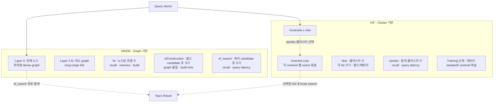
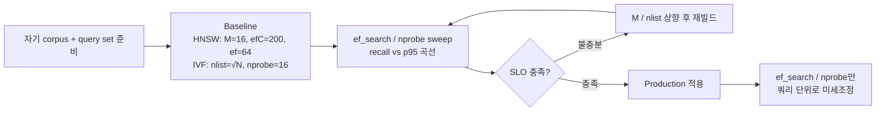

# Vector Search Performance Tuning — 인덱스 파라미터 (HNSW · IVF)

## 핵심 요약

ANN 인덱스의 파라미터 튜닝은 vector search 성능 튜닝의 **최저비용·최고효과 layer**다. HNSW는 그래프 기반(`M`, `efConstruction`, `ef_search`)이고 IVF는 클러스터 기반(`nlist`, `nprobe`)이며, 두 알고리즘 모두 **recall↔latency↔memory↔build time**의 4축 trade-off가 동일한 손잡이에 묶여 있다. 핵심은 어떤 파라미터가 **빌드 재실행을 요구**하고 어떤 파라미터가 **쿼리 단위로 변경 가능**한지를 구분해 운영 비용을 최소화하는 것.

- **HNSW가 일반적 production 1순위**: 동적 데이터(insert/delete) 친화, recall↔latency 곡선이 부드러움 — 단 메모리 비용 큼
- **IVF는 대용량·정적 corpus**: nlist 클러스터 단위 메모리 효율, PQ와의 조합이 자연스러움 — 빌드 시 학습 필요
- **변경 비용 비대칭**: `ef_search`/`nprobe`는 쿼리 단위(저렴), `M`/`efConstruction`/`nlist`는 인덱스 재빌드(비쌈)
- **벤치마크 곡선이 정답 대신**: "recall@10 = 0.95 지점의 p95"를 자기 데이터로 측정해 결정 — 공개 벤치마크 수치 그대로 차용 금지

## 컴포넌트 다이어그램

HNSW와 IVF는 같은 ANN 추상 위에 다른 자료구조를 두며, 각자의 파라미터가 graph/cluster의 모양과 탐색 폭을 정의한다.

## 적용 단계

워크로드별 SLO를 만족시키는 파라미터 셋을 찾는 grid search 절차.

1. **데이터/쿼리 준비**: 자기 corpus의 representative sample + ground-truth가 있는 query set (보통 1k~10k 쿼리)
2. **Baseline 빌드**: HNSW면 `M=16, efConstruction=200, ef_search=64`, IVF면 `nlist≈√N, nprobe=16`에서 시작
3. **쿼리 단위 sweep**: `ef_search` 또는 `nprobe`를 16 → 32 → 64 → 128 → 256 등으로 증가시키며 `recall@10`과 `p95 latency` 측정 → 곡선 그리기
4. **SLO 라인과의 교점**: 곡선이 SLO를 통과하면 그 지점의 파라미터로 production 고정
5. **곡선이 SLO에 못 미치면**: `M` (HNSW) 또는 `nlist` (IVF)를 상향하고 인덱스 재빌드 후 3단계 반복
6. **`efConstruction` 마지막 손잡이**: 빌드 시간을 허용 한도까지 사용해 graph 품질 확보 (보통 200~400)
7. **운영 반영**: `ef_search`는 쿼리 단위로 동적 변경 가능 — fast path / accurate path를 SLA tier로 분리할 수 있음

## 핵심 기능 및 서비스

| 파라미터 | 알고리즘 | 의미 | 변경 비용 | 1차 영향 |
|---|---|---|---|---|
| `M` | HNSW | 노드당 양방향 연결 수 (보통 8~64) | 인덱스 재빌드 | recall↑, memory↑, build time↑ |
| `efConstruction` | HNSW | 빌드 시 후보 큐 크기 (보통 100~400) | 인덱스 재빌드 | graph 품질↑, build time↑ (메모리/index size엔 영향 없음) |
| `ef_search` (=`ef`) | HNSW | 쿼리 시 후보 큐 크기 (보통 40~500) | 쿼리 단위 변경 가능 | recall↑, query latency↑ |
| `nlist` | IVF | 클러스터 수 (rule: ≈ √N) | 재훈련·재빌드 | 각 list 크기↓, 빌드/메모리 변동 |
| `nprobe` | IVF | 탐색 클러스터 수 (보통 1~128) | 쿼리 단위 변경 가능 | recall↑, query latency↑ |
| (옵션) `m` (=`PQ subvectors`) | IVF+PQ | PQ subvector 수 | 재훈련 | 메모리↓, recall↓ |

## 유사 기술 비교

| 항목 | HNSW | IVF (Flat) | IVF+PQ | DiskANN / Vamana |
|---|---|---|---|---|
| 구조 | 다층 graph | 클러스터 + 평탄 저장 | 클러스터 + 양자화 | disk-friendly graph |
| 메모리 | 큼 (graph 전체 in-memory) | 중간 | 작음 | RAM 적게 (SSD 활용) |
| 빌드 비용 | 큼 (`efConstruction`에 종속) | training + 분할 | training + PQ 학습 | 큼 |
| Insert/delete | 친화 (점진적) | 비친화 (재훈련 권장) | 비친화 | 제한적 |
| Recall↔Latency 곡선 | 부드러움 | 계단형 | 계단형 + 양자화 손실 | HNSW에 근접, RAM↓ |
| 적합 케이스 | 일반 production, 동적 데이터 | 대규모·정적 | 메모리 1순위 대규모 | 10억+ 규모, RAM 제약 |

## 실제 사례

### Milvus production tuning 권고
Milvus 공식 가이드는 production 시작점으로 `M=16, efConstruction=200, ef_search=64`를 권장하고, recall이 부족하면 `ef_search`를 우선 올린 뒤(쿼리 단위 변경 가능) 그래도 부족할 때만 `M`을 32까지 올리는 단계적 절차를 명시. 1천만 vector 기준 `ef_search=500`에서 98% recall + 5ms, `ef_search=100`에서 85% recall + 1ms.

### Couchbase 1M 벡터 IVF 사례
1M 제품 검색에서 `nlist=1000, nprobe=20`으로 90% recall + 5ms를 달성. 동일 corpus에서 `nlist=4096, nprobe=32`(90% recall) → `nlist=8192, nprobe=24`로 변경 시 recall 유지하며 query time 20% 단축 — `nlist`를 키우면 각 list 크기가 줄어 탐색 비용 감소.

## 활용 시나리오

### 시나리오 1: PoC → production 첫 튜닝
- **맥락**: default 파라미터로 PoC, production traffic에서 recall은 OK인데 p95가 SLO 초과
- **접근**: `ef_search`만 64 → 32 → 24로 하향하며 recall 손실 모니터링 → recall 손실이 2% 이내면 채택
- **이유**: 빌드 비용 없이 즉시 적용, 쿼리 단위 변경이라 롤백도 즉시

### 시나리오 2: 정적 5억 vector, 메모리 1순위
- **맥락**: 거의 변하지 않는 corpus, HNSW의 그래프 메모리가 부담
- **접근**: IVF + PQ로 전환, `nlist=√N≈22000`, `nprobe=64`, PQ subvectors=64
- **이유**: IVF는 클러스터 단위 로딩, PQ로 vector 자체도 압축 — 메모리 1/8~1/16

### 시나리오 3: 동적 corpus + 신선도 SLA
- **맥락**: 매일 수만 chunk 갱신, IVF의 재훈련 비용이 운영 부담
- **접근**: HNSW 유지, `M=24, efConstruction=300` (insert 친화 + graph 품질), `ef_search`는 라우팅 tier별로 분리(fast=32, accurate=128)
- **이유**: HNSW는 점진적 insert·delete 친화, ef_search 분리로 SLA tier 차등 가능

## 장단점 및 트레이드오프

| 항목 | 내용 |
|---|---|
| 장점 | 코드 변경 없이 metric만으로 튜닝 가능. 손잡이 수가 적어 grid search 비용이 낮음. ef_search/nprobe는 쿼리 단위 동적 변경 가능 |
| 단점 | M/nlist/efConstruction 변경은 인덱스 재빌드(수 시간~수일) — production에서 자주 못 함. 곡선이 자기 데이터에 종속이라 일반화된 추천값 신뢰 위험 |
| 트레이드오프 | **HNSW**: `M`↑ → recall↑·memory↑·build↑ / `ef_search`↑ → recall↑·latency↑ / **IVF**: `nlist`↑ → list 크기↓·메모리↑ / `nprobe`↑ → recall↑·latency↑ |

## 함정 및 안티패턴

- **공개 벤치마크 수치를 그대로 사용**: SIFT/GIST/Deep1B 등의 추천값은 분포가 다른 자기 데이터에서 효과 보장 안 됨 → 항상 자기 corpus로 grid search
- **`efConstruction`을 production에서 자주 변경**: 매번 전체 재빌드 → 안정값으로 고정 후 `ef_search`만 운영. 빌드 비용은 1회성으로 받아들이기
- **`ef_search`를 fixed 값으로만 운영**: 모든 쿼리에 같은 정확도 적용 → tier 분리(fast/accurate)로 비용·SLA 분리 가능
- **`M`을 무조건 키우기**: M > 64는 대부분 diminishing return + 메모리 비례 증가 → recall 부족하면 양자화 해제 또는 임베딩 모델 재검토가 더 효과적
- **IVF에서 `nprobe = nlist`로 운영**: brute search와 동일해 IVF의 의미 상실 → `nprobe ≪ nlist`가 정상
- **재빌드 없이 `M`만 메모리에서 변경 시도**: 일부 라이브러리(HNSW)는 M 변경 시 graph 무효화 → 항상 재빌드 비용 인지 후 결정
- **build-time과 query-time 파라미터 혼동**: `efConstruction`은 graph 품질, `ef_search`는 쿼리 정확도/latency — 별도 튜닝

## 참고 자료

- [What are the key configuration parameters for an HNSW index (Milvus)](https://milvus.io/ai-quick-reference/what-are-the-key-configuration-parameters-for-an-hnsw-index-such-as-m-and-efconstructionefsearch-and-how-does-each-influence-the-tradeoff-between-index-size-build-time-query-speed-and-recall) — HNSW 3 파라미터 영향 공식 설명
- [How can the parameters of an IVF index be tuned (Milvus)](https://milvus.io/ai-quick-reference/how-can-the-parameters-of-an-ivf-index-like-the-number-of-clusters-nlist-and-the-number-of-probes-nprobe-be-tuned-to-achieve-a-target-recall-at-the-fastest-possible-query-speed) — IVF nlist·nprobe 튜닝 절차
- [How to Choose Between IVF and HNSW for ANN Vector Search (Milvus Blog)](https://milvus.io/blog/understanding-ivf-vector-index-how-It-works-and-when-to-choose-it-over-hnsw.md) — HNSW vs IVF 선택 기준
- [How to Tune HNSW Parameters for Vector Search in MongoDB](https://oneuptime.com/blog/post/2026-03-31-mongodb-tune-hnsw-vector-search/view) — production tuning 워크플로우
- [Understanding Recall in HNSW Search (Marqo)](https://www.marqo.ai/blog/understanding-recall-in-hnsw-search) — recall 측정 방법론
- [Vector Search Performance: The Rise of Recall (Couchbase)](https://www.couchbase.com/blog/vector-search-indexing-recall-faiss/) — recall vs latency 곡선 + IVF 실제 사례 수치
