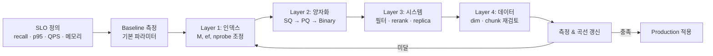

# Vector Search Performance Tuning — Overview (4 Layer 통합)

## 핵심 요약

Vector Search 성능 튜닝은 **인덱스 파라미터 · 양자화 · 시스템/쿼리 · 데이터/임베딩**의 4개 layer를 워크로드 SLO(recall@k, p95 latency, QPS, memory, $/query)에 맞춰 동시에 조정하는 방법론이다. 한 layer만 만지면 다른 차원이 쉽게 무너지므로(예: ef를 올려 recall은 얻었지만 p99 latency 침해), 항상 **측정 → 튜닝 → 재측정 루프**로 진행한다.

- **5개 SLO 차원이 동시에 trade-off**: recall · latency · throughput · memory · cost — "하나만 좋아지는" 변경은 거의 없음
- **튜닝의 진입 순서 권장**: ① 워크로드/SLO 정의 → ② 인덱스 파라미터(저비용 효과 큼) → ③ 양자화(메모리 큰 절감) → ④ 시스템/쿼리(replica·필터·rerank) → ⑤ 임베딩 모델·dim 재검토(최후)
- **벤치마크 곡선이 truth**: `recall@10 vs p95 latency` 곡선을 자기 데이터로 그려야 함 — 공개 벤치마크는 분포가 다름
- **운영 metric이 곧 튜닝 신호**: cache hit ratio, prefilter 선택도, queue depth, GPU/CPU 사용률을 함께 봐야 어느 layer에 병목이 있는지 식별 가능

## 컴포넌트 다이어그램

4개 튜닝 layer가 같은 query path 위에 적층되어 있다. 각 layer의 손잡이가 다음 layer의 비용에 영향을 미친다.

```mermaid
graph TD
    subgraph SLO[Workload & SLO]
        S1[recall@k 목표]
        S2[p95 latency 예산]
        S3[QPS / 동시성]
        S4[메모리 / cost]
    end

    subgraph L1[Layer 1 - 인덱스 파라미터]
        I1[HNSW: M, efConstruction, ef_search]
        I2[IVF: nlist, nprobe]
    end

    subgraph L2[Layer 2 - 양자화]
        Q1[Scalar Quantization int8/fp16]
        Q2[Product Quantization PQ]
        Q3[Binary Quantization Hamming]
    end

    subgraph L3[Layer 3 - 시스템/쿼리]
        Y1[Pre/post-filter]
        Y2[Hybrid rerank]
        Y3[Batched query]
        Y4[Replica / sharding]
        Y5[Warm cache]
    end

    subgraph L4[Layer 4 - 데이터/임베딩]
        D1[Embedding dim]
        D2[Normalize / metric 선택]
        D3[Chunking 결정 재검토]
    end

    SLO --> L1
    L1 --> L2
    L2 --> L3
    L3 --> L4
    L4 -.->|재임베딩 필요| L1

    M[Benchmark Harness<br/>recall@k vs p95 곡선]
    L1 -.-> M
    L2 -.-> M
    L3 -.-> M
    L4 -.-> M
    M -.->|signal| SLO
```

## 적용 단계

튜닝은 한 사이클씩 측정·변경·재측정을 반복하는 루프다. 한 사이클에서 한 layer만 바꾸는 것이 원칙.



1. **SLO 정의 (전제 조건)**: recall@10 ≥ 0.95, p95 < 50ms, ≥ 1k QPS, 메모리 ≤ X GB 처럼 측정 가능한 목표 명시
2. **Baseline 측정**: vendor 기본 파라미터로 자기 corpus에서 `recall@k vs p95 latency` 곡선을 먼저 그림
3. **Layer 1 — 인덱스**: HNSW면 `ef_search`(쿼리 시 변경 가능)부터, IVF면 `nprobe`부터. M·efConstruction·nlist는 빌드 재실행 비용이 있어 후순위
4. **Layer 2 — 양자화**: 메모리/비용이 1순위 SLO면 우선. SQ → PQ → Binary 순으로 추가 압축 시도, 각 단계에서 recall 손실 측정
5. **Layer 3 — 시스템/쿼리**: 필터링은 selectivity로 pre/post 결정. hybrid rerank는 top-N (보통 50~200)로 후처리. throughput은 replica + batched query
6. **Layer 4 — 데이터/임베딩**: 위 3개로도 SLO 미달이면 임베딩 모델·dim·chunk 결정 재검토. **비용·시간이 가장 큼**
7. **재측정 & 회귀 방지**: 변경 1건마다 동일 query set으로 평가, CI에 recall regression 알람 등록

## 핵심 기능 및 서비스

| Layer | 핵심 손잡이 | 1차 영향 차원 | 비용/위험 |
|---|---|---|---|
| L1. 인덱스 | HNSW `M`, `efConstruction`, `ef_search` | recall ↔ latency, build time | `M`/`efConstruction` 변경은 재빌드 |
| L1. 인덱스 | IVF `nlist`, `nprobe` | recall ↔ latency, 메모리 | `nlist` 변경은 재훈련 |
| L2. 양자화 | SQ (int8/fp16), PQ, Binary | 메모리·비용 ↔ recall | 압축률 ↑ → recall 손실 위험 |
| L3. 시스템 | pre/post-filter, hybrid rerank | recall · latency · selectivity | filter index 비용 |
| L3. 시스템 | replica, sharding, batching, cache | QPS · latency tail | 인프라 비용 |
| L4. 데이터 | embedding dim, metric, chunking | recall 상한, 메모리 | 재임베딩 비용 큼 |

## 유사 기술 비교

워크로드 패턴별로 어느 layer를 우선 튜닝하는지가 다르다.

| 항목 | RAG (LLM 보조) | E-commerce 추천 | 로그/이상탐지 | 다국어 semantic search |
|---|---|---|---|---|
| 1순위 SLO | recall@k, freshness | latency p95, QPS | throughput, 메모리 | recall, 언어 균형 |
| 우선 튜닝 layer | L1 → L3 (hybrid rerank) | L1 → L3 (replica) | L2 → L3 | L4 → L1 |
| 양자화 전략 | SQ (recall 보전) | SQ + PQ (대용량) | Binary (대규모) | SQ 정도 |
| 필터링 | 강한 pre-filter (tenant·acl) | 약한 pre-filter | tag pre-filter | language pre-filter |
| 적합 케이스 | 정확도 우선 | 비용·QPS 우선 | 메모리 1순위 | 다언어 corpus |

## 실제 사례

### Milvus / Zilliz tuning 가이드
Milvus 공식 reference는 4개 layer를 순서대로 적용하는 worksheet를 제공. HNSW는 `M=16, efConstruction=200`을 production 시작점으로 권장하고, `ef_search`만 쿼리 단위로 조정해 SLO를 맞춤. IVF는 nlist ≈ √N에서 시작해 `nprobe`로 recall/latency 조절.

### Qdrant binary quantization 케이스 (40× 가속)
Qdrant가 공개한 사례에서 OpenAI `text-embedding-ada-002`(1536 dim) + dbpedia 데이터셋으로 binary quantization 적용 시 검색 40× 빨라지고 recall@100 ≥ 0.98 (4× oversampling + rescore). 약간의 recall 손실은 rescore(top-N을 원본 벡터로 재정렬)로 보정 — Layer 2 + Layer 3의 결합이 핵심.

## 활용 시나리오

### 시나리오 1: 초기 PoC → production 진입
- **맥락**: PoC는 default 파라미터로 충분했지만 production traffic에서 p99 폭증
- **튜닝 순서**: SLO 정의 → baseline 측정 → `ef_search` 하향 → 양자화 SQ → replica 증설
- **결과 기대**: recall은 1~2% 손실로 흡수, p95 절반 이하

### 시나리오 2: 메모리/비용 제약이 1순위
- **맥락**: 1억 vector, dim=1536, 메모리 한도 100GB
- **튜닝 순서**: 즉시 양자화(PQ subvectors=64 또는 Binary + rescore) → HNSW `M` 하향 → IVF 전환 고려
- **결과 기대**: 메모리 1/8~1/32, recall 손실은 rescore로 95%+ 유지

### 시나리오 3: 필터링이 많은 multi-tenant 환경
- **맥락**: tenant 격리 + acl 필터 + 시간 범위 등 metadata 조건 3~5개
- **튜닝 순서**: pre/post-filter selectivity 분석 → filter index 추가 → HNSW의 filtered search 옵션 확인 → tenant별 namespace 분리
- **결과 기대**: filter selectivity > 10%면 pre-filter, < 1%면 post-filter가 일반적으로 유리

## 장단점 및 트레이드오프

| 항목 | 내용 |
|---|---|
| 장점 | 4개 layer로 분리해 변경 1건의 효과를 측정 가능. 인덱스 → 양자화 → 시스템 순서가 비용 대비 효과 큼 |
| 단점 | layer 간 결합이 강해 한 변경이 여러 차원을 동시에 흔듦 — benchmark harness가 없으면 개선·악화 구분 불가. 임베딩·인덱스 빌드 시간 비용이 ML 실험보다 비싸다 |
| 트레이드오프 | **Recall vs Latency**: HNSW ef·IVF nprobe / **Memory vs Recall**: 양자화 압축률 / **Build vs Query 비용**: `efConstruction` / **Throughput vs Tail latency**: batching |

## 함정 및 안티패턴

- **SLO 없는 튜닝**: "더 빠르게/정확하게"라는 모호한 목표 → 변경의 성공/실패 판단 불가. recall@k와 p95 latency를 숫자로 박은 SLO부터 작성
- **공개 벤치마크 수치를 그대로 신뢰**: SIFT/GIST 같은 dataset의 최적값은 자기 데이터에 적용 안 됨 → 항상 자기 corpus + 자기 query set으로 측정
- **여러 layer를 한 번에 바꾸기**: 어느 변경이 효과인지 attribution 불가 → 한 사이클당 한 변경, 같은 query set 재측정
- **양자화 후 rescore 생략**: PQ/Binary는 recall이 떨어지지만 rescore(top-N을 원본 벡터로 재정렬)로 대부분 회복 가능 → 둘을 paired로 사용
- **`efConstruction`을 production에서 자주 변경**: 매번 전체 재빌드 비용 발생 → production은 안정값으로 고정하고 `ef_search`만 쿼리 단위로 조절
- **Filter selectivity를 측정하지 않고 pre/post 선택**: 데이터 분포에 따라 정반대가 정답 → 실제 selectivity를 metric으로 emit
- **Hybrid rerank를 무조건 적용**: rerank 모델 호출 비용이 latency·cost를 침해 → top-N 크기와 SLO 영향 측정 후 도입

## 참고 자료

- [What are the key configuration parameters for an HNSW index (Milvus)](https://milvus.io/ai-quick-reference/what-are-the-key-configuration-parameters-for-an-hnsw-index-such-as-m-and-efconstructionefsearch-and-how-does-each-influence-the-tradeoff-between-index-size-build-time-query-speed-and-recall) — HNSW M·efConstruction·ef_search 트레이드오프 공식 가이드
- [How can the parameters of an IVF index be tuned (Milvus)](https://milvus.io/ai-quick-reference/how-can-the-parameters-of-an-ivf-index-like-the-number-of-clusters-nlist-and-the-number-of-probes-nprobe-be-tuned-to-achieve-a-target-recall-at-the-fastest-possible-query-speed) — IVF nlist·nprobe 튜닝 가이드
- [Vector Quantization Methods (Qdrant)](https://qdrant.tech/course/essentials/day-4/what-is-quantization/) — SQ/PQ/Binary 비교
- [Binary Quantization - Vector Search, 40x Faster (Qdrant)](https://qdrant.tech/articles/binary-quantization/) — Binary + rescore 결합 사례
- [Vector Search Performance: The Rise of Recall (Couchbase)](https://www.couchbase.com/blog/vector-search-indexing-recall-faiss/) — recall vs latency 곡선 관점
- [Vector Query Filters (Azure AI Search)](https://learn.microsoft.com/en-us/azure/search/vector-search-filters) — pre/post-filter 공식 가이드
