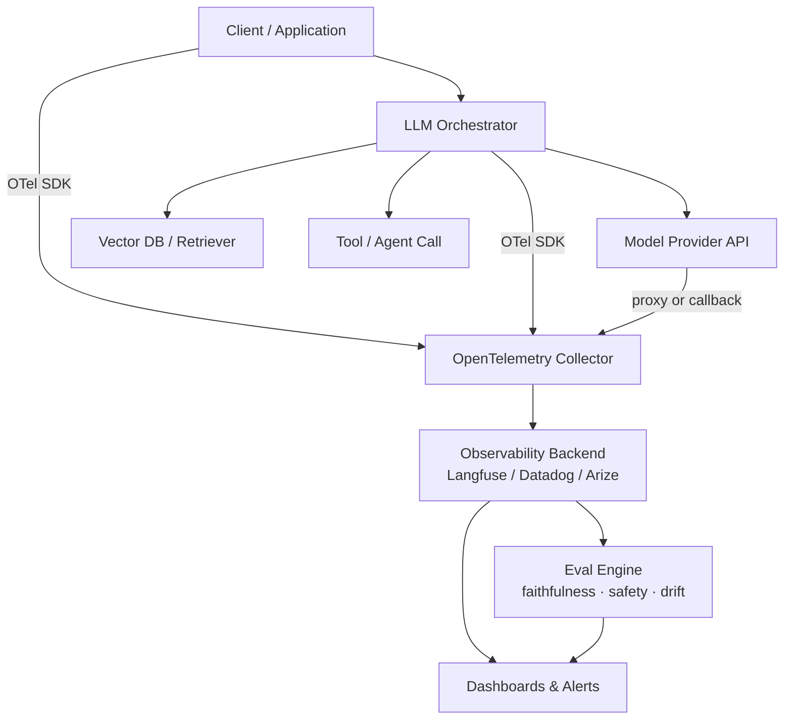
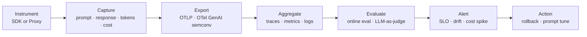

# AI 서비스 모니터링 환경 구축

## 핵심 요약

AI 서비스 모니터링은 운영 환경에서 동작하는 LLM·ML 시스템의 인프라 신호와 모델 품질 신호를 동시에 관측하여 가용성·정확도·비용을 통제하는 관측 체계다. 전통적 웹 서비스의 monitoring 패러다임(latency, error rate, throughput)만으로는 부족한데, LLM은 문법적으로 정상인 응답을 반환하면서도 사실관계가 틀린 환각(hallucination)을 일으킬 수 있기 때문이다.

- **이중 레이어 관측**: 인프라(GPU·메모리·p95/p99 latency) + 모델 품질(faithfulness·relevance·safety·drift)을 같이 추적
- **Monitoring vs Observability**: monitoring은 알려진 지표(cost, latency, error)를 트래킹, observability는 trace 단위로 prompt·context·tool call·span을 설명
- **표준화 흐름**: OpenTelemetry GenAI Semantic Conventions(CNCF, GenAI SIG)가 LLM trace의 attribute·event 스키마를 통일 중이며 2026년 기준 대부분 experimental 상태
- **비용 가시성 필수**: token 단위 과금 구조 때문에 user·feature·route별 token 소비량을 분해 추적해야 예산 통제 가능

## 시스템 아키텍처

LLM 애플리케이션은 client → orchestrator(LangChain·LangGraph) → model provider → vector DB → tool/agent 호출로 이어지는 분산 호출 그래프를 형성한다. 모니터링 환경은 각 hop에서 telemetry를 수집해 단일 trace로 묶고, 백엔드(observability platform)에서 집계·평가한다.

## 처리 흐름

수집 단계에서는 SDK 또는 proxy로 prompt·response·메타데이터를 추출하고, 전송 단계에서 OTLP로 collector에 전달한 뒤, 백엔드가 집계·평가·알림을 수행한다.

## 핵심 기능 및 서비스

| 기능 | 설명 |
|---|---|
| Trace 수집 | 사용자 요청 단위로 prompt → retrieval → tool call → response 전 경로를 span으로 기록 |
| Token·비용 추적 | prompt/completion token, cache hit ratio, user·feature 단위 cost attribution |
| Latency 메트릭 | p50/p95/p99, time-to-first-token(TTFT), streaming 구간별 지연 |
| Quality eval | faithfulness, relevance, toxicity, hallucination 점수를 online으로 채점 |
| Drift detection | prompt 분포, 응답 품질, 입력 데이터 통계의 시간축 변화 감지 |
| Prompt management | 프롬프트 버전 관리, A/B 비교, 회귀 검출 |
| Cost guardrail | 사용자·세션별 token budget, rate limit, cost spike 알림 |

## 유사 기술 비교

| 항목 | Langfuse | LangSmith | Helicone | Arize |
|---|---|---|---|---|
| 특징 | OSS·SDK 기반·PostgreSQL 중앙형 | LangChain 공식·자동 instrumentation | proxy 기반·ClickHouse+Kafka 분산형 | ML observability 출신·통계적 엄밀성 |
| 장점 | self-host 가능, 평가·프롬프트관리 통합 | LangChain/LangGraph 내부 가시성 최고 | 분 단위 도입, 비기술 팀도 UI 활용 가능 | 엔터프라이즈 ML 인프라와 통합 용이 |
| 단점 | 평가 깊이는 전용 도구 대비 얕음 | 비-LangChain 스택 통합 약함 | framework 레이어 분석은 약함 | LLM 특화 기능은 후발 |
| 적합 케이스 | 풀스택 OSS 관측 원할 때 | LangChain 중심 팀 | 빠른 production 도입, 솔로/소규모 | 기존 ML observability와 통합 |

## 실제 사례

### Datadog LLM Observability
Datadog가 자사 LLM Observability 제품에서 OpenTelemetry GenAI Semantic Conventions를 native 지원으로 추가, 벤더 종속 없이 표준 attribute(gen_ai.system, gen_ai.usage.input_tokens 등)로 trace를 수집·집계.

### Traceloop
OpenLLMetry 오픈소스 라이브러리를 통해 OpenAI·Anthropic·Bedrock SDK를 자동 instrumentation, user·feature 단위 token usage·latency를 granular하게 추적하는 사례를 공개.

## 활용 시나리오

### 시나리오 1: RAG 파이프라인 품질 회귀 감지
신규 임베딩 모델로 교체 후 검색 품질이 의심될 때, Langfuse trace에서 retrieval span의 score 분포를 시간축으로 비교하고 faithfulness eval을 online으로 돌려 회귀 여부를 SLO 위반 알림으로 감지.

### 시나리오 2: 비용 spike 원인 분리
일간 토큰 사용량이 전일 대비 3배로 튄 경우 user·feature·prompt 버전별로 분해해 특정 endpoint의 retry storm 또는 prompt 길이 증가가 원인임을 trace에서 확인 후 rate limit·prompt 압축으로 대응.

### 시나리오 3: 멀티벤더 LLM 통합 관측
OpenAI·Anthropic·Bedrock를 동시 사용하는 환경에서 OpenTelemetry GenAI semconv로 attribute를 표준화해 단일 dashboard에서 provider별 latency·cost·error rate를 비교, 라우팅 정책을 데이터 기반으로 조정.

## 장단점 및 트레이드오프

| 항목 | 내용 |
|---|---|
| 장점 | 환각·드리프트 등 LLM 고유 실패를 가시화, 비용 통제 가능, 모델 버전 비교 객관화 |
| 단점 | online eval 자체가 추가 LLM 비용·지연 유발, prompt 저장 시 PII·보안 부담, 표준이 experimental 단계 |
| 트레이드오프 | sampling rate ↑ → 관측 정밀도 ↑ but 비용·저장 ↑ / proxy 방식은 도입 빠르나 framework 내부 가시성 낮음 |

## 함정 및 안티패턴

- **안티패턴 1**: 인프라 메트릭만 보고 운영 → latency·error는 정상인데 응답 품질만 무너지는 경우 무탐지 → faithfulness/relevance online eval을 SLO에 포함
- **안티패턴 2**: prompt·response를 모두 원본 그대로 저장 → PII·secret 유출 위험 → SDK 레벨 redaction 또는 hashing을 instrumentation 단계에서 강제
- **안티패턴 3**: 벤더 SDK의 proprietary trace 포맷에만 의존 → 플랫폼 교체 시 데이터 마이그레이션 불가 → OTel GenAI semconv 기반으로 시작
- **안티패턴 4**: 100% sampling으로 시작 → 대규모 트래픽에서 저장·비용 폭증 → user·error·high-cost 우선 sampling 전략 적용

## 참고 자료

- [OpenTelemetry GenAI Semantic Conventions Guide (MLflow)](https://mlflow.org/docs/latest/genai/tracing/opentelemetry/genai-semconv/) — OTel GenAI semconv 공식 문서 기반 표준 attribute 설명
- [How OpenTelemetry Traces LLM Calls (Greptime)](https://greptime.com/blogs/2026-05-09-opentelemetry-genai-semantic-conventions) — agent reasoning·MCP tool 호출까지 포함한 trace 설계
- [Top LLM Observability Tools in 2026 (MLflow)](https://mlflow.org/articles/top-llm-observability-tools-in-2026-a-pro-guide/) — Langfuse·LangSmith·Helicone·Arize·Braintrust 비교
- [What is LLM Monitoring (Braintrust)](https://www.braintrust.dev/articles/what-is-llm-monitoring) — quality·cost·latency·drift 4축 정의
- [LLM Observability Explained (Splunk)](https://www.splunk.com/en_us/blog/learn/llm-observability.html) — hallucination·drift·cost 관리 관점 정리
- [Datadog LLM Observability supports OTel GenAI (Datadog)](https://www.datadoghq.com/blog/llm-otel-semantic-convention/) — 상용 플랫폼의 OTel native 지원 사례
