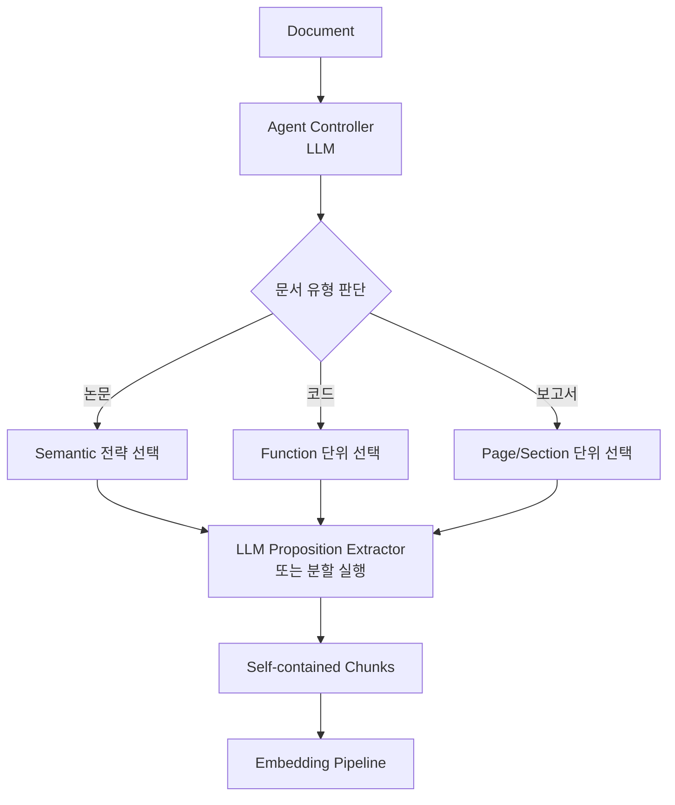

# Chunking Strategy - Agentic Chunking

## 핵심 요약

Agentic chunking은 LLM(또는 LLM 기반 agent)이 문서를 읽고 직접 청크 경계와 분할 방식을 결정하는 전략이다. 룰·임베딩 거리에 의존하는 다른 기법과 달리, "이 문서는 연구 논문이니 의미 단위로", "이 문서는 코드 파일이니 함수 단위로"처럼 문서 특성에 맞춰 적응한다. Proposition 추출(원자 명제 단위 분할) 변형이 가장 자주 인용된다.

- **메타 결정 + 분할 동시 수행**: agent가 청킹 방식 자체를 선택한 뒤 그 방식으로 분할.
- **Proposition 변형**: 문서를 LLM에 통과시켜 self-contained "명제" 단위로 재서술 → 각 명제를 청크로 사용.
- **고비용·고지연**: 청킹 단계에 LLM 호출이 들어가 비용·시간이 fixed/recursive 대비 수십~수백 배.
- **실험적 단계**: IBM·Devoteam 등이 가능성을 강조하지만 프로덕션 채택은 제한적이라는 평가가 일관됨.

## 컴포넌트 다이어그램

## 적용 단계

## 핵심 기능 및 서비스

| 기능 | 설명 |
|---|---|
| Strategy router | LLM이 문서 유형 보고 청킹 방식 선택 |
| Proposition extraction | 원문을 self-contained 명제로 재서술 (Chen et al. "Dense X Retrieval") |
| 자체 완결성 검증 | 각 청크가 외부 참조 없이 이해 가능한지 LLM 재확인 |
| IBM watsonx.ai 튜토리얼 | LangChain + watsonx.ai 기반 agentic chunking 실습 제공 |
| 비용 캐싱 | 동일 문서 재인덱싱 시 LLM 결과 캐시로 비용 완화 |

## 유사 기술 비교

| 항목 | Agentic | Semantic | Document-structured |
|---|---|---|---|
| 결정 주체 | LLM (생성형) | 임베딩 + 임계값 | 파서 (규칙) |
| 비용 | 매우 높음 (LLM 호출) | 중간 (임베딩) | 낮음 |
| 적응성 | 문서별 전략 변경 | 임계값 고정 | 형식 고정 |
| 결정론성 | 낮음 (프롬프트·온도 의존) | 중간 (모델 의존) | 완전 결정론 |
| 검증 가능성 | 어려움 (LLM blackbox) | 중간 | 쉬움 |

## 임베딩 모델 호환성

Agentic 청킹은 LLM이 proposition 단위(1문장, 평균 30~80 토큰)로 재작성한다. 청크 길이는 매우 짧고 의미 밀도는 높으므로 **컨텍스트 길이보다 의미 분리·정확도**가 결합의 핵심이다.

### 호환성 좋은 임베딩 모델

| 모델 | 차원 / max tokens | 호환 이유 |
|---|---|---|
| `text-embedding-3-large` | 3072 / 8191 | proposition 의미 정확도 우위 — 짧은 청크 retrieval 정밀도 |
| `bge-m3` | 1024 / 8192 | 짧은 proposition + 다국어. sparse 병행으로 hybrid 강화 |
| `cohere embed-v3` | 1024 / 512 | 짧은 청크 의미 보존 강함, proposition 임베딩에 부합 |
| `KURE-v1` | 1024 / 8192 | 한국어 proposition(의역·간결화) 정확도 |

### 추천되지 않는 임베딩 모델

| 모델 | 차원 / max tokens | 비추천 이유 |
|---|---|---|
| `voyage-3-large` | 1024 / 32K | proposition은 평균 30~80 토큰 — 32K 컨텍스트 활용 불가, ROI 저하 |
| `multilingual-e5-base` | 768 / 512 | 짧은 청크 의미 정확도가 후행 — agentic의 정밀 retrieval 목표와 부정합 |

> Agentic은 LLM 청킹 비용에 임베딩 비용이 더해진다. **저비용 + 의미 정확도 균형** 모델 선택이 운영성의 관건.

## 실제 사례

### IBM Think - "What Is Agentic Chunking?"
IBM 공식 글은 agentic chunking을 "LLM이 자체 이해를 사용해 분할 결정을 내리는 방식"으로 정의하고, semantic coherence·문서별 적응성을 핵심 가치로 제시. 동시에 비용·복잡성으로 인한 채택 한계를 명시.

### Devoteam - Agentic Chunking Guide
"하나의 방법으로 모든 문서를 처리하는 시대에서 문서별 전략을 LLM이 결정하는 시대로의 전환"이라 평가. 사례로 연구 논문·재무 보고서·코드 파일에 서로 다른 전략을 자동 적용하는 파이프라인 제시.

### Dense X Retrieval (Chen et al., 2023)
원문을 fact-level proposition으로 분해해 인덱싱하면 retrieval 정확도가 청크/문장 단위 대비 향상된다는 학술 보고. 현재 agentic chunking proposition 변형의 이론적 토대.

## 활용 시나리오

### 시나리오 1: 이질적 문서 코퍼스 통합 인덱싱
한 RAG 시스템이 마크다운 문서·PDF 보고서·코드·Slack 로그를 모두 처리해야 할 때, 각 문서에 맞는 청킹 방식을 LLM이 라우팅 → 사전 분류 파이프라인 단순화.

### 시나리오 2: Proposition 기반 high-precision retrieval
법률 조항·의료 가이드라인처럼 사실 단위 검색이 중요한 도메인에서 각 청크를 self-contained 명제로 변환해 retrieval precision 극대화.

### 시나리오 3: 정적 코퍼스·1회성 인덱싱
인덱싱이 자주 일어나지 않는 정적 코퍼스(연구 논문 아카이브·매뉴얼)는 일회성 LLM 비용을 감수하고 retrieval 품질을 최대화할 수 있는 후보.

## 장단점 및 트레이드오프

| 항목 | 내용 |
|---|---|
| 장점 | 문서별 적응·의미 응집도 최강·proposition 변형 시 retrieval precision 향상·메타데이터 자동 부여 |
| 단점 | LLM 호출 비용·인덱싱 지연·결과 비결정성·재현성 낮음·프로덕션 사례 적음·평가 어려움 |
| 트레이드오프 | "품질 vs 비용·운영성". 청킹 단계에 LLM 들어가면 인덱싱 비용이 retrieval 비용보다 훨씬 커질 수 있음. 정적 코퍼스에서는 정당화 가능, 빈번한 재인덱싱에서는 부적합 |

## 함정 및 안티패턴

- **안티패턴 1**: 동적 코퍼스(매시간 재인덱싱)에 agentic 적용 → LLM 비용 폭증. 대안: 정적 코퍼스에 한정하거나 변경분만 agentic 처리.
- **안티패턴 2**: 청킹 프롬프트가 명세 없이 자유 → 동일 문서가 재인덱싱마다 다르게 분할되어 retrieval 일관성 깨짐. 대안: 결과 스키마 고정·온도 0·캐싱.
- **안티패턴 3**: agentic이 항상 우수하다 가정하고 baseline(recursive) 없이 도입 → 비용만 늘고 retrieval 평가에서 우위 없음. 대안: 항상 recursive baseline과 A/B.
- **안티패턴 4**: Proposition 변환 결과를 원문 검증 없이 신뢰 → LLM의 사실 변형(hallucination)이 인덱스에 그대로 들어감. 대안: 원문 인용 유지·자동 사실 검증.

## 참고 자료

- [What Is Agentic Chunking? - IBM Think](https://www.ibm.com/think/topics/agentic-chunking) - 공식 정의 및 한계
- [Agentic Chunking Makes Your RAG Smarter - Devoteam](https://www.devoteam.com/expert-view/agentic-chunking-makes-your-rag-smarter/) - 실용 가이드
- [Agentic Chunking: Optimize LLM Inputs with LangChain and watsonx.ai - IBM Tutorial](https://www.ibm.com/think/tutorials/use-agentic-chunking-to-optimize-llm-inputs-with-langchain-watsonx-ai) - 실습 튜토리얼
- [The Definitive Guide to Agentic RAG Text Splitting - Medium](https://medium.com/@dewasheesh.rana/the-definitive-guide-to-agentic-rag-text-splitting-chunking-a75766ee307c) - 변형 패턴 정리
- [Best Chunking Strategies for RAG (and LLMs) in 2026 - Firecrawl](https://www.firecrawl.dev/blog/best-chunking-strategies-rag) - 비용·실용성 평가
