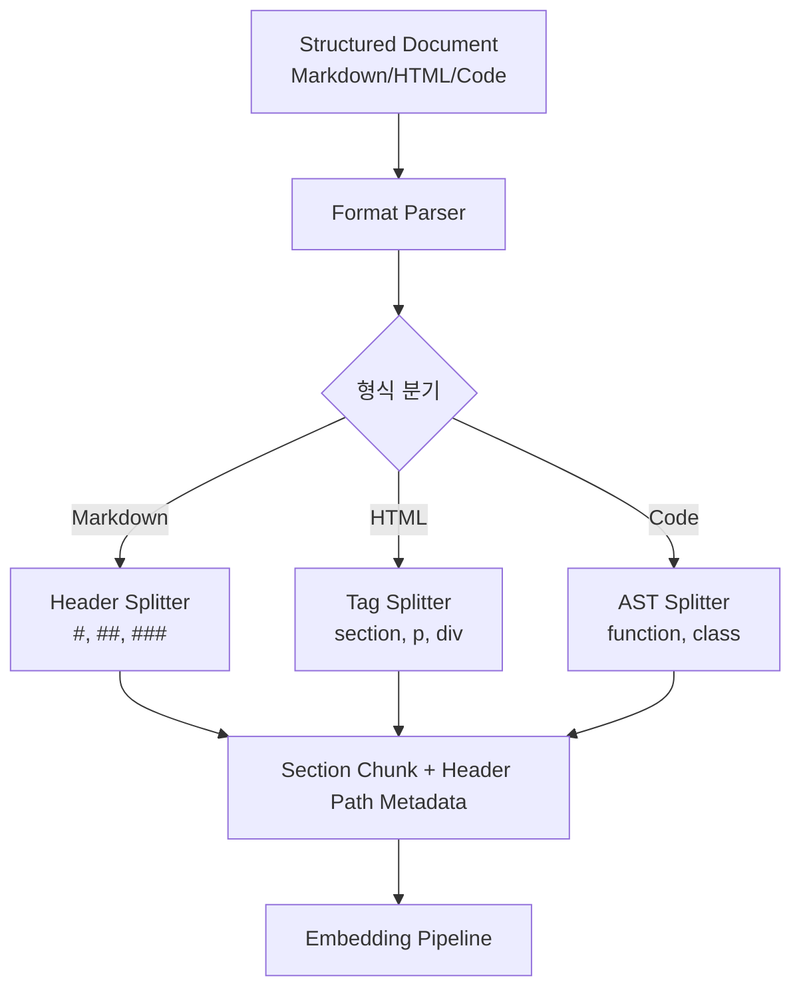

# Chunking Strategy - Document-structured Chunking

## 핵심 요약

Document-structured chunking은 문서에 이미 존재하는 구조 마커(마크다운 헤딩, HTML 태그, 코드 함수·클래스 정의)를 청크 경계로 직접 사용하는 전략이다. 헤딩 hierarchy가 자연스러운 의미 단위와 일치한다는 가정을 이용해, 한 청크 = 한 논리 섹션을 유지한다. 기술 문서·API 레퍼런스·코드베이스 RAG의 최적 선택.

- **의미 단위 보존이 가장 강함**: 저자가 의도한 섹션 경계를 그대로 사용.
- **메타데이터 자동 추출**: 헤딩 경로(`H1 > H2 > H3`)를 chunk metadata로 보존해 retrieval 품질·인용 정확도 향상.
- **형식 의존성이 강함**: 평문·OCR 결과·구조가 깨진 PDF에는 부적합.
- **포맷별 splitter**: 마크다운 / HTML / 언어별 코드 splitter가 별도로 제공됨.

## 컴포넌트 다이어그램

## 적용 단계

## 핵심 기능 및 서비스

| 기능 | 설명 |
|---|---|
| Markdown Header Splitter | `#`, `##`, `###` 단위로 분할. LangChain `MarkdownHeaderTextSplitter` |
| HTML Section Splitter | `<h1>`, `<section>`, `
` 태그 기준. LangChain `HTMLHeaderTextSplitter` |
| Code Splitter | 언어별 AST 기반 분할. LangChain `RecursiveCharacterTextSplitter.from_language(Language.PYTHON)` 등 |
| Header Path Metadata | `{"h1": "API", "h2": "Authentication"}` 형태로 청크에 자동 부여 |
| Fallback Recursive | 구조 분할 후 청크가 너무 크면 recursive로 2차 분할 |

## 유사 기술 비교

| 항목 | Document-structured | Recursive | Fixed-size |
|---|---|---|---|
| 분할 기준 | 헤딩·태그·AST | 구분자 hierarchy | 토큰 수 |
| 의미 보존 | 가장 강함 | 중간 | 낮음 |
| 메타데이터 | 헤딩 경로 자동 부여 | 없음 | 없음 |
| 형식 요구 | 구조화 필수 | 평문 OK | 무관 |
| 적합 케이스 | 기술 문서·코드·API | 일반 텍스트 | 베이스라인·로그 |

## 임베딩 모델 호환성

Document-structured 청킹은 헤딩·섹션·코드블록 단위로 가변 길이를 형성하며 **단일 청크가 1K~4K 토큰까지 커질 수 있다**. 따라서 **긴 max_seq**가 호환 결정의 1차 변수다.

### 호환성 좋은 임베딩 모델

| 모델 | 차원 / max tokens | 호환 이유 |
|---|---|---|
| `text-embedding-3-large` | 3072 / 8191 | 섹션 단위 큰 청크 안전 수용 + 의미 정확도 |
| `voyage-3-large` | 1024 / 32K | 헤딩 한 단위가 매우 큰 enterprise PDF/매뉴얼에 적합 |
| `bge-m3` | 1024 / 8192 | 다국어 + 8K max_seq로 대부분의 섹션 수용 |
| `jina-embeddings-v3` | 1024 / 8192 | Matryoshka로 큰 청크·작은 청크 모두 차원 조절 가능 |

### 추천되지 않는 임베딩 모델

| 모델 | 차원 / max tokens | 비추천 이유 |
|---|---|---|
| `multilingual-e5-large` | 1024 / 512 | 섹션 청크가 빈번히 512 초과 → 헤딩 단위 의미 보존 실패 |
| `cohere embed-english-v3.0` | 1024 / 512 | max_seq 512로 헤딩 섹션 단위에 자주 부족 |
| `all-MiniLM-L6-v2` | 384 / 256 | max_seq 한계로 구조 청킹의 장점 무효화 |

> Document-structured는 **max_seq ≥ 8K 모델** 결합이 핵심. 짧은 컨텍스트 모델과 결합 시 헤딩 단위가 잘리면서 구조 인식 효과가 소실된다.

## 실제 사례

### Unstructured.io 엔터프라이즈 RAG
Unstructured.io의 `chunk_by_title` 전략은 헤딩 hierarchy를 1차 경계로 사용하고 토큰 한도 초과 시 단락 단위로 2차 분할. SEC 10-K·의약품 라벨 같은 구조화 문서에서 일관된 retrieval 품질을 보고.

### Anthropic·OpenAI 공식 문서 RAG 예제
대부분의 LLM 제공자 문서 RAG 가이드는 마크다운 헤딩 기반 분할 + 헤딩 경로를 metadata로 보존해 retrieval 시 인용에 사용하는 패턴을 표준으로 안내.

### GitHub Copilot·Cursor 코드베이스 인덱싱
대형 코드 비서들은 함수·클래스 단위로 분할(언어별 AST 사용)해 청크 = 의미적 코드 단위로 매핑. 함수 호출 그래프 metadata와 결합해 정확한 코드 인용 제공.

## 활용 시나리오

### 시나리오 1: 기술 문서 RAG
마크다운 기반 사내 위키·SDK 문서를 인덱싱할 때 H2 단위 분할 + H1·H2 경로를 metadata로 저장. 답변 생성 시 "API > Authentication > JWT" 같은 정확한 출처 인용 가능.

### 시나리오 2: 코드베이스 검색
모노레포에 대한 자연어 질의를 처리할 때 Python/TypeScript/Go 각 언어별 AST splitter로 함수·클래스 단위 청킹. retrieval 결과를 함수 정의 단위로 보장.

### 시나리오 3: HTML 웹 크롤링 RAG
사내 Confluence·Notion·웹 스크랩 데이터에서 `<section>`, `<article>` 태그 기준 분할 → 광고·네비게이션 노이즈를 자연스럽게 분리.

## 장단점 및 트레이드오프

| 항목 | 내용 |
|---|---|
| 장점 | 의미 단위 보존 최강·헤딩 경로 metadata 자동 부여·답변 인용 정확도 향상·노이즈 분리 효과 |
| 단점 | 평문·OCR 결과에 부적합·헤딩 hierarchy가 불균등한 문서에서 청크 크기 편차 큼·언어별 splitter 별도 필요 |
| 트레이드오프 | "구조 활용 vs 크기 균일성". 구조 충실히 따르면 청크 크기 편차가 커서 retrieval scoring이 흔들릴 수 있음 → 토큰 한도 초과 시 recursive 2차 분할로 보정 |

## 함정 및 안티패턴

- **안티패턴 1**: 헤딩만으로 분할하고 토큰 한도 무시 → H2 섹션이 너무 길어 임베딩 context 초과. 대안: 구조 분할 후 recursive 2차 분할.
- **안티패턴 2**: PDF OCR 결과를 마크다운 splitter로 처리 → 헤딩 패턴이 깨져 거의 분할되지 않음. 대안: 형식 감지 후 recursive로 폴백.
- **안티패턴 3**: 헤딩 경로 metadata를 사용하지 않음 → document-structured의 가장 큰 장점인 출처 메타 보존을 낭비. 대안: metadata에 헤딩 경로 반드시 포함.
- **안티패턴 4**: 코드 파일에 마크다운 splitter 적용 → `#` 주석을 헤딩으로 오인. 대안: 언어별 AST splitter 사용.

## 참고 자료

- [Chunking Strategies for RAG: Best Practices - Unstructured](https://unstructured.io/blog/chunking-for-rag-best-practices) - chunk_by_title 전략 상세
- [RAG Document Chunking Strategies - ByteTools](https://bytetools.io/guides/rag-chunking-strategies) - Markdown/HTML/Code 별 splitter
- [Chunking Strategies to Improve LLM RAG Pipeline Performance - Weaviate](https://weaviate.io/blog/chunking-strategies-for-rag) - 헤딩 metadata 활용
- [LangChain MarkdownHeaderTextSplitter 공식 문서](https://python.langchain.com/docs/how_to/markdown_header_metadata_splitter/) - 마크다운 헤딩 분할 API
- [Optimizing RAG Context: Chunking and Summarization for Technical Docs - dev.to](https://dev.to/oleh-halytskyi/optimizing-rag-context-chunking-and-summarization-for-technical-docs-3pel) - 기술 문서 적용 사례
