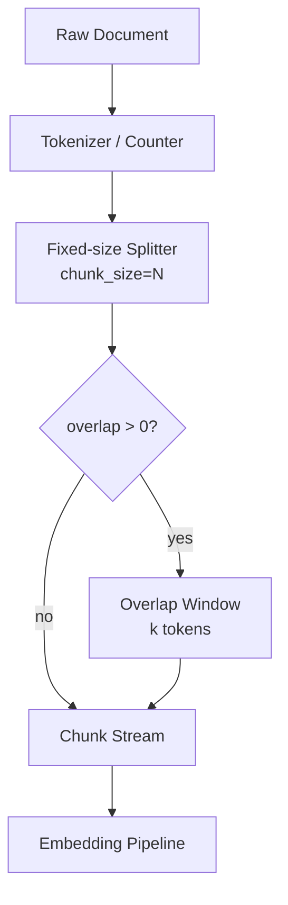

# Chunking Strategy - Fixed-size Chunking

## 핵심 요약

Fixed-size chunking은 원문을 고정된 문자 수 또는 토큰 수(보통 256~1024 토큰)로 일률 분할하는 가장 단순한 청킹 전략이다. 문장·문단 경계나 의미 단위와 무관하게 N토큰마다 잘라낸다. RAG 도입 초기 베이스라인이나 대규모 인덱싱 성능이 요구될 때 표준 출발점으로 사용된다.

- **결정론적·예측 가능**: 청크 개수·인덱싱 시간·저장 비용을 사전에 정확히 추정할 수 있어 SLA 설계가 쉽다.
- **구현이 가장 단순**: LangChain `CharacterTextSplitter`, LlamaIndex `TokenTextSplitter` 등에서 파라미터 하나로 동작.
- **구조 무지(content-agnostic)**: 정의문 가운데, Q&A 쌍 사이, 수식 중간 어디든 자를 수 있어 의미 단절 위험이 높다.
- **Overlap 보강 가능**: 10~20% 겹침(overlap)으로 경계 손실을 완화하지만 근본 한계를 제거하지는 못함.

## 컴포넌트 다이어그램

Tokenizer가 측정 단위(char/token)를 제공하고, Splitter가 N 단위마다 잘라 chunk overlap만큼 다음 chunk의 앞부분과 겹쳐 출력한다.

## 적용 단계

## 핵심 기능 및 서비스

| 기능 | 설명 |
|---|---|
| chunk_size | 청크당 문자 또는 토큰 수. 256·512·1024가 표준 |
| chunk_overlap | 인접 청크 간 겹치는 토큰 수. 10~20% 권장 |
| 단위 선택 | character / token / word 중 선택. 임베딩 모델 토크나이저 기반 token 사용이 일반적 |
| 결정론성 | 동일 입력 → 동일 청크 보장. 캐시·재현성에 유리 |
| 프레임워크 지원 | LangChain `CharacterTextSplitter`, LlamaIndex `TokenTextSplitter`, IBM Granite |

## 유사 기술 비교

| 항목 | Fixed-size | Recursive | Semantic |
|---|---|---|---|
| 분할 기준 | 토큰 수만 | 구분자 우선순위 + 토큰 수 | 임베딩 코사인 거리 |
| 구조 인지 | X | O (문단·문장) | O (의미) |
| 비용 | 최저 | 낮음 | 중간 (임베딩 호출 N회) |
| 결정론성 | 완전 결정론적 | 결정론적 | 모델 의존 |
| 적합 케이스 | 베이스라인·대량 인덱싱 | 일반 텍스트 기본 | 주제 전환이 잦은 장문 |

## 임베딩 모델 호환성

Fixed-size 청킹은 200~500 토큰 수준의 짧고 균일한 청크를 생성하므로, 임베딩 모델의 max_seq보다는 **짧은 청크에 의미를 잘 압축하는 모델**과 **비용 효율**이 결합 적합도를 좌우한다.

### 호환성 좋은 임베딩 모델

| 모델 | 차원 / max tokens | 호환 이유 |
|---|---|---|
| `text-embedding-3-small` | 1536 / 8191 | 300~500 토큰 청크에 비용 효율 최상. baseline RAG 디폴트 결합 |
| `amazon.titan-embed-text-v2` | 1024 / 8192 | Bedrock 권장 청크 200~512 토큰 범위와 정합, 운영 인프라 통합 |
| `bge-m3` | 1024 / 8192 | 다국어 + dense/sparse 병행으로 BM25 hybrid 보완, fixed의 경계 손실 완화 |
| `multilingual-e5-large` | 1024 / 512 | 청크 ≤ 500 토큰이면 max_seq 안에 안전히 수용 |

### 추천되지 않는 임베딩 모델

| 모델 | 차원 / max tokens | 비추천 이유 |
|---|---|---|
| `voyage-3-large` | 1024 / 32K | 32K 컨텍스트 강점이 짧은 청크에서 무용 — 비용·지연 효율 저하 |
| `jina-embeddings-v3` | 1024 / 8192 | Matryoshka·long-context 강점이 fixed에서 활용 불가, 차원 압축 후도 fixed의 의미 손실 보상 어려움 |
| `KURE-v1` / `bge-m3-ko` | 1024 / 8192 | 한국어 형태소·문장 경계를 무시한 fixed 청킹은 한국어 특화 모델의 강점을 깎음 — recursive/semantic과 결합 권장 |

> Fixed-size는 임베딩 max_seq를 거의 활용하지 않으므로 **컨텍스트 길이 강점 모델**보다 **짧은 청크 의미 압축 모델**이 우선이다.

## 실제 사례

### IBM watsonx.ai + Granite RAG 튜토리얼
IBM의 공식 chunking 튜토리얼은 LangChain `CharacterTextSplitter`(고정 크기)를 기본 출발점으로 제시하며, 학습용 RAG 파이프라인의 baseline 단계에서 고정 크기 청킹으로 인덱싱한 뒤 recursive·semantic으로 단계적으로 비교하는 방식을 권장한다.

### Vecta 2026년 2월 벤치마크
50편의 학술 논문 코퍼스에서 512 토큰 고정 크기 분할은 recursive 512와 거의 동일한 인덱싱 시간을 보이면서 단순 구현으로 ~65% end-to-end 정확도를 기록, "고정 크기는 시작점으로 충분하다"는 명제를 뒷받침했다.

## 활용 시나리오

### 시나리오 1: RAG 베이스라인 수립
신규 RAG 프로젝트에서 retrieval 품질의 하한선을 정의할 때, chunk_size=512·overlap=50 고정 크기로 인덱싱 → 답변 정확도 측정 → 이후 recursive·semantic 비교의 기준선으로 삼는다.

### 시나리오 2: 대용량 로그·전사(transcript) 인덱싱
구조가 없는 평문(콜센터 통화 전사, 채팅 로그)은 헤딩이나 마크다운 마커가 없어 document-structured가 불가하고, semantic은 비용이 과도하다. 고정 크기 + 적당한 overlap이 가장 실용적.

### 시나리오 3: 비용·지연 최우선 환경
온디바이스 RAG 또는 임베딩 API 호출 단가가 민감한 환경에서 분할 비용이 0에 수렴하는 고정 크기를 선택한다. 의미 손실은 retrieval top-k를 늘려 보상.

## 장단점 및 트레이드오프

| 항목 | 내용 |
|---|---|
| 장점 | 구현 단순·결정론적·예측 가능한 비용·모든 프레임워크 기본 지원·언어 무관 |
| 단점 | 의미 경계 무시·정의·Q&A·코드 블록 중간 절단 가능·retrieval 품질 한계 |
| 트레이드오프 | "처리량 vs 의미 보존". 고정 크기는 처리량·예측성을 최대화하지만 의미 보존을 포기. retrieval 단계의 top-k 확대나 reranker로 부분 보완 가능 |

## 함정 및 안티패턴

- **안티패턴 1**: overlap=0으로 운영 → 문장·정의가 청크 경계에서 절단되어 retrieval 시 핵심 정보 누락. 대안: chunk_size의 10~20%를 overlap으로 설정.
- **안티패턴 2**: 문자(char) 기준으로 자른 후 token 기반 임베딩 모델 사용 → 한국어·한자에서 chunk가 실제 토큰 수보다 길어져 context window 초과. 대안: 임베딩 모델 토크나이저와 동일한 단위로 측정.
- **안티패턴 3**: 마크다운·코드 문서에도 고정 크기를 일관 적용 → 코드 블록·표 중간 절단. 대안: 문서 유형 감지 후 document-structured로 분기.
- **안티패턴 4**: chunk_size를 임베딩 모델 max context에 맞춰 최대화 → 단일 청크에 다주제 혼재로 retrieval precision 하락. 대안: 256~512 권장.

## 참고 자료

- [Chunking Strategies for RAG: A Complete Guide for 2026](https://atlan.com/know/chunking-strategies-rag/) - 9가지 청킹 전략 비교, fixed-size 특성
- [Best Chunking Strategies for RAG (and LLMs) in 2026 - Firecrawl](https://www.firecrawl.dev/blog/best-chunking-strategies-rag) - fixed-size 베이스라인 권장 근거
- [Chunking strategies for RAG tutorial using Granite - IBM](https://www.ibm.com/think/tutorials/chunking-strategies-for-rag-with-langchain-watsonx-ai) - LangChain CharacterTextSplitter 실습
- [RAG Chunking Strategies: A 2026 Retrieval Playbook - Digital Applied](https://www.digitalapplied.com/blog/rag-chunking-strategies-2026-retrieval-quality-playbook) - 청크 크기·오버랩 표준
- [Evaluating RAG Chunking Strategies in 2026 - Future AGI](https://futureagi.com/blog/evaluating-rag-chunking-strategies-2026/) - 벤치마크 결과
