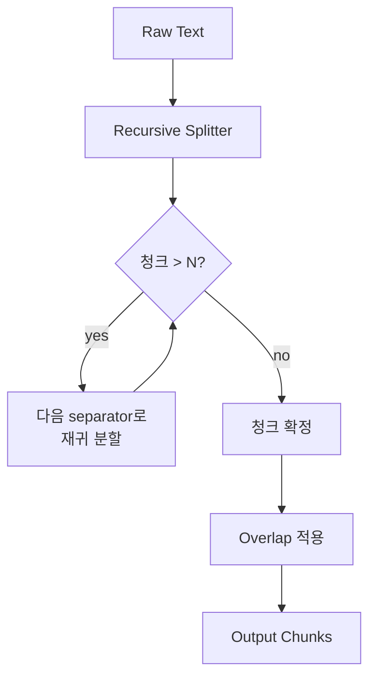
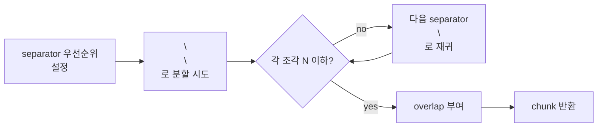

# Chunking Strategy - Recursive Chunking

## 핵심 요약

Recursive chunking은 구분자(separator) 우선순위 목록을 따라 텍스트를 위에서 아래로 분할하며, 각 청크가 목표 크기에 들어맞을 때까지 더 작은 구분자로 재귀 호출하는 전략이다. 기본 구분자는 `["\n\n", "\n", " ", ""]` 순서(문단 → 줄 → 단어 → 문자). LangChain·LlamaIndex의 사실상 표준 디폴트이며, 2026년 2월 Vecta 벤치마크에서 512 토큰 recursive가 69% E2E 정확도로 1위.

- **자연 경계 존중**: 문단·문장 경계를 우선 보존해 fixed-size보다 의미 단절 빈도가 낮음.
- **모델 비의존**: 임베딩 호출 없이 순수 텍스트 연산으로 동작 → semantic 대비 매우 빠름.
- **결정론적**: 동일 입력 → 동일 출력. 재현성·캐싱에 유리.
- **일반 텍스트 베이스라인**: 마크다운·HTML이 아닌 평문 RAG의 "그냥 이걸 쓰세요" 디폴트.

## 컴포넌트 다이어그램

## 적용 단계

## 핵심 기능 및 서비스

| 기능 | 설명 |
|---|---|
| separator 우선순위 | `["\n\n", "\n", " ", ""]` 기본. 사용자가 재정의 가능 |
| chunk_size | 목표 청크 토큰/문자 수. 400~512 권장 |
| chunk_overlap | 10~20% 권장. 경계 손실 완화 |
| length_function | 길이 측정 함수(문자수 / 토큰수). 임베딩 모델 토크나이저 권장 |
| LangChain 구현 | `RecursiveCharacterTextSplitter` (사실상 표준) |
| LlamaIndex 구현 | `SentenceSplitter` (recursive 동작 포함) |

## 유사 기술 비교

| 항목 | Recursive | Fixed-size | Document-structured |
|---|---|---|---|
| 분할 기준 | 구분자 hierarchy + 토큰 수 | 토큰 수만 | 헤딩·태그·함수 등 구조 마커 |
| 의미 보존 | 중간 (문단 단위) | 낮음 | 높음 (구조 단위) |
| 형식 의존성 | 낮음 (평문 OK) | 없음 | 높음 (구조 필요) |
| 비용 | 낮음 | 최저 | 낮음 (파서 의존) |
| 적합 케이스 | 일반 텍스트 디폴트 | 베이스라인·로그 | 마크다운·HTML·코드 |

## 임베딩 모델 호환성

Recursive 청킹은 separator 우선순위(`\n\n` → `\n` → `. `)를 따라 500~1000 토큰의 가변 길이 청크를 만들기 때문에, **자연 경계 청크를 충분히 수용할 max_seq**와 **범용 의미 정확도**가 호환의 핵심이다.

### 호환성 좋은 임베딩 모델

| 모델 | 차원 / max tokens | 호환 이유 |
|---|---|---|
| `text-embedding-3-large` | 3072 / 8191 | 자연 경계 청크와 의미 정확도 정합. 일반 RAG 디폴트 조합 |
| `text-embedding-3-small` | 1536 / 8191 | 비용 우선 환경 디폴트, 청크 길이 충분 수용 |
| `bge-m3` | 1024 / 8192 | 다국어 + sparse 병행으로 hybrid retrieval 강함 |
| `KURE-v1` | 1024 / 8192 | recursive separator hierarchy가 한국어 문단·문장 경계와 잘 정합 |

### 추천되지 않는 임베딩 모델

| 모델 | 차원 / max tokens | 비추천 이유 |
|---|---|---|
| `multilingual-e5-large` | 1024 / 512 | 청크가 600~800 토큰일 때 빈번히 잘림 → boundary noise 누적 |
| `all-MiniLM-L6-v2` | 384 / 256 | max_seq 256으로 recursive 표준 청크에서 절단 다발 |
| `cohere embed-english-v3.0` | 1024 / 512 | 영어 전용 + max_seq 512로 가변 청크에 부족할 때 다수 |

> Recursive 청크 길이 상한은 **임베딩 max_seq의 80%** 이하로 명시 설정 — 잘림 회피의 단일 가장 효과적인 가드.

## 실제 사례

### Vecta 벤치마크 (2026년 2월)
50편의 학술 논문 코퍼스에서 recursive 512 토큰이 end-to-end 정확도 69%로 fixed-size·semantic·hybrid를 모두 상회. 결론: "정교한 기법보다 단순 recursive가 일반 텍스트에서는 더 강한 경우가 많다."

### LangChain 공식 문서
`RecursiveCharacterTextSplitter`는 LangChain 튜토리얼·예제 90% 이상에서 디폴트로 사용되며, RAG quickstart의 표준 선택지로 고정되어 있다.

## 활용 시나리오

### 시나리오 1: 일반 텍스트 RAG 프로젝트의 첫 선택
도메인이 정해지지 않은 신규 RAG 프로젝트라면 fixed-size 베이스라인을 건너뛰고 곧바로 recursive 512 / overlap 50으로 시작 → 평균적으로 가장 좋은 결과/비용 비율.

### 시나리오 2: PDF 추출 평문 처리
PDF에서 추출한 텍스트는 헤딩 마커가 깨져 document-structured 불가, 의미 일관성도 떨어져 semantic 효과 제한적. recursive가 문단·줄바꿈을 최대한 보존해 가장 안정적.

### 시나리오 3: 다국어 혼합 문서
구분자 hierarchy가 언어 독립적(공백·줄바꿈)이므로 한국어·일본어·아랍어 혼합 문서에서도 일관 동작.

## 장단점 및 트레이드오프

| 항목 | 내용 |
|---|---|
| 장점 | 의미 경계 보존·모델 비의존·구현 단순·LangChain/LlamaIndex 기본 지원·언어 무관·결정론적 |
| 단점 | 구분자 hierarchy가 모든 문서에 맞지는 않음·내부 줄바꿈 없는 초장문 문단은 여전히 어색하게 분할·구조화 문서는 document-structured가 더 우수 |
| 트레이드오프 | "단순성 vs 구조 인식". 마크다운·HTML에서는 document-structured가 더 깔끔하지만, 형식 다양성이 큰 코퍼스에서는 recursive 일관 적용이 운영 부담이 더 낮음 |

## 함정 및 안티패턴

- **안티패턴 1**: separator 목록을 임의로 줄여 `[" "]` 만 사용 → 단어 단위로만 끊겨 의미 단절 빈발. 대안: 기본 hierarchy 유지.
- **안티패턴 2**: 코드 파일에 일반 recursive 적용 → 함수 중간 절단. 대안: `Language.PYTHON` 등 언어별 splitter 사용.
- **안티패턴 3**: chunk_size를 토큰이 아닌 문자 기준으로 설정하고 한국어 코퍼스 처리 → 실제 토큰 수가 임베딩 max를 초과. 대안: 임베딩 토크나이저 기반 length_function.
- **안티패턴 4**: 인덱싱 후 chunk_size를 변경하고 부분 재인덱싱 → 같은 문서 내 청크 분포가 inconsistent해져 retrieval 품질 하락. 대안: chunk_size 변경 시 전체 재인덱싱.

## 참고 자료

- [Best Chunking Strategies for RAG (and LLMs) in 2026 - Firecrawl](https://www.firecrawl.dev/blog/best-chunking-strategies-rag) - Vecta 벤치마크 1위 결과 인용
- [Text Chunking Strategies for RAG Applications - Jason Liu](https://jxnl.co/writing/2025/09/11/text-chunking-strategies-for-rag-applications/) - recursive 디폴트 권장 근거
- [How to Implement Recursive Chunking - OneUptime](https://oneuptime.com/blog/post/2026-01-30-rag-recursive-chunking/view) - 구현 절차 상세
- [The Ultimate Guide to Chunking Strategies - Databricks](https://community.databricks.com/t5/technical-blog/the-ultimate-guide-to-chunking-strategies-for-rag-applications/ba-p/113089) - LangChain RecursiveCharacterTextSplitter 가이드
- [LangChain RecursiveCharacterTextSplitter 공식 문서](https://python.langchain.com/docs/how_to/recursive_text_splitter/) - separator hierarchy 기본값
