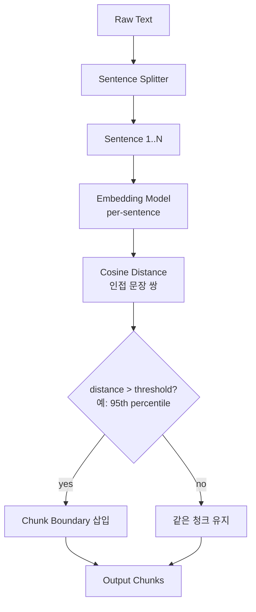

# Chunking Strategy - Semantic Chunking

## 핵심 요약

Semantic chunking은 문장 단위 임베딩의 코사인 거리(또는 유사도)가 임계값을 초과하는 지점을 청크 경계로 사용하는 전략이다. Greg Kamradt가 "Five Levels of Chunking" 강연에서 정형화한 후 LlamaIndex `SemanticSplitterNodeParser`로 구현되어 대중화되었다. 주제 전환을 자동 감지해 의미적으로 응집된 청크를 만든다.

- **임베딩 기반 경계 탐지**: 인접 문장 임베딩 거리가 임계값(예: 95th percentile)을 넘으면 새 청크 시작.
- **모델 의존·비용 발생**: 문장마다 임베딩 호출 필요 → fixed-size·recursive보다 인덱싱 비용·시간 큼.
- **그리디 알고리즘**: Kamradt 원본은 좌→우 순차 결정 → 지역 최적. 후속 ClusterSemanticChunker는 전역 최적 추구.
- **2026년 평가 결과는 혼재**: 일부 코퍼스에서 recursive를 능가하지만, Vecta 학술 논문 벤치마크에서는 recursive 512에 밀림.

## 컴포넌트 다이어그램

## 적용 단계

## 핵심 기능 및 서비스

| 기능 | 설명 |
|---|---|
| buffer_size | 비교 시 인접 문장 묶음 크기. 1이면 문장-문장 비교 |
| breakpoint_percentile | 임계값 백분위수. 95가 일반적, 낮추면 청크 더 많이 생성 |
| embedding_model | 청킹용 임베딩 모델(주로 인덱싱과 동일 모델 사용) |
| LlamaIndex 구현 | `SemanticSplitterNodeParser` |
| LangChain 구현 | `SemanticChunker` (langchain-experimental) |
| 변형 | ClusterSemanticChunker(Chroma Research), Growing-window semantic chunking 등 |

## 유사 기술 비교

| 항목 | Semantic | Recursive | Agentic |
|---|---|---|---|
| 분할 기준 | 임베딩 cosine 거리 | 구분자 hierarchy | LLM 판단 |
| 의미 보존 | 매우 강함 | 중간 | 가장 강함 |
| 비용 | 임베딩 N회 (중간) | 0 (텍스트 연산) | LLM 호출 N회 (높음) |
| 결정론성 | 모델 의존 | 완전 결정론 | 모델·프롬프트 의존 |
| 적합 케이스 | 주제 전환 많은 장문 | 일반 텍스트 디폴트 | 고비용 정확성 환경 |

## 자주 혼동하는 개념

이 노트는 Methodology 매핑으로 작성되었지만, semantic chunking은 자주 다른 기법과 혼동되므로 별도 정리.

| 본 개념 | 혼동 대상 | 핵심 차이 |
|---|---|---|
| Semantic chunking | Sentence-window retrieval | 청킹 단계의 경계 결정 vs retrieval 단계의 컨텍스트 확장 |
| Semantic chunking | Late chunking | 분할 → 임베딩 순서 vs 긴 컨텍스트 임베딩 → 청크별 풀링 |
| Semantic chunking | Agentic chunking | 임베딩 거리 룰 vs LLM의 적극적 판단 |

## 임베딩 모델 호환성

Semantic 청킹은 **임베딩 모델 자체가 청크 경계를 결정**한다. 따라서 청킹용·인덱싱용 임베딩의 **분포 일치(동일 모델 권장)** 와 **의미 분리 정확도**가 결합 적합도를 좌우한다.

### 호환성 좋은 임베딩 모델

| 모델 | 차원 / max tokens | 호환 이유 |
|---|---|---|
| `text-embedding-3-large` | 3072 / 8191 | 의미 분리 정확도 SOTA. 청킹·인덱싱 동일 모델로 분포 일치 |
| `bge-m3` | 1024 / 8192 | dense 의미 분리력 + 다국어. 청킹·인덱싱 통합 운영 적합 |
| `voyage-3-large` | 1024 / 32K | 의미 정확도 + 긴 컨텍스트로 가변 청크 안전 수용 |
| `KURE-v1` | 1024 / 8192 | 한국어 의미 경계 검출 정확도 우위 |

### 추천되지 않는 임베딩 모델

| 모델 | 차원 / max tokens | 비추천 이유 |
|---|---|---|
| `text-embedding-ada-002` | 1536 / 8191 | Kamradt 영상의 시연 모델이지만 의미 정확도가 3-small/large 대비 후행 — 신규 도입 비권장 |
| `all-MiniLM-L6-v2` | 384 / 256 | 의미 임베딩 정확도가 낮아 경계 오탐 다발, 청크 단위 깨짐 |
| `multilingual-e5-base` | 768 / 512 | 한국어 의미 분리 정확도가 e5-large·bge-m3 대비 떨어짐 |

> Semantic chunking은 **청킹용·인덱싱용 임베딩을 동일 모델로 통일**해야 분포 일치가 보장된다. 약한 임베딩은 청킹·인덱싱 모두에 누적 손실을 만든다.

## 실제 사례

### Greg Kamradt - Five Levels of Chunking (영상·LlamaIndex LinkedIn)
LlamaIndex 공식 채널이 Kamradt의 semantic chunking 아이디어를 LlamaPack으로 구현, "고정 chunk size 대신 의미 기반 분할을 시도하라"는 메시지로 RAG 커뮤니티에 확산.

### Chroma Research - ClusterSemanticChunker
Kamradt 방식이 그리디 탐색이어서 지역 최적에 갇히는 한계를 지적, 청크 내 코사인 유사도 합을 최대화하는 전역 최적화 변형을 제안. 실험 환경에서 retrieval recall 향상 보고.

### ScienceDirect 2025 - Growing-window Semantic Chunking
약한 의미 경계 문제를 해결하기 위해 윈도우를 점진적으로 확장하며 경계 신뢰도를 누적 평가하는 변형 발표.

## 활용 시나리오

### 시나리오 1: 주제 전환이 잦은 장문 콘텐츠
정책 보고서·연구 노트·블로그 시리즈처럼 한 문서에 여러 주제가 섞인 경우, fixed/recursive는 주제 경계와 청크 경계가 어긋남. semantic은 주제 전환을 자동으로 감지해 retrieval precision 향상.

### 시나리오 2: 회의록·인터뷰 전사
화자가 토픽을 자유 전환하는 대화록은 문단·문장 마커가 약함. semantic이 토픽 전환 지점을 자동 추출.

### 시나리오 3: 고품질 retrieval이 비용보다 중요한 환경
법률·의료·금융 컴플라이언스 RAG처럼 잘못된 retrieval 비용이 임베딩 호출 비용보다 훨씬 큰 도메인.

## 장단점 및 트레이드오프

| 항목 | 내용 |
|---|---|
| 장점 | 의미 응집도 높은 청크 생성·주제 경계 자동 탐지·결과의 직관적 해석 가능 |
| 단점 | 임베딩 호출 비용·인덱싱 지연·임계값 튜닝 필요·그리디 한계·일부 벤치마크에서 recursive에 패배 |
| 트레이드오프 | "의미 정확성 vs 비용·복잡성". 짧은 평문·잘 구조화된 문서는 recursive로 충분하고 semantic이 비용 대비 향상이 없을 수 있음. 도입 전 A/B 평가 필수 |

## 함정 및 안티패턴

- **안티패턴 1**: 평가 없이 디폴트 임계값(95th percentile) 사용 → 도메인·언어에 따라 청크 크기 분포가 극단적으로 치우침. 대안: 코퍼스 일부로 distance 분포 분석 후 임계값 조정.
- **안티패턴 2**: 청킹용 임베딩 모델과 인덱싱용 임베딩 모델이 다름 → 청크 경계 의미와 retrieval 의미 공간 불일치. 대안: 동일 모델 사용.
- **안티패턴 3**: semantic을 만능으로 보고 모든 코퍼스에 적용 → 비용만 증가하고 품질은 recursive와 동일. 대안: 도입 전 retrieval 평가 셋으로 A/B.
- **안티패턴 4**: 매우 짧은 문서(< 수십 문장)에 적용 → 백분위수 임계값 통계 불안정. 대안: 일정 길이 이상에서만 활성화.

## 참고 자료

- [Five Levels of Chunking Strategies in RAG - Greg Kamradt notes - Medium](https://medium.com/@anuragmishra_27746/five-levels-of-chunking-strategies-in-rag-notes-from-gregs-video-7b735895694d) - Kamradt 원형 아이디어
- [LlamaIndex - SemanticSplitterNodeParser LinkedIn 발표](https://www.linkedin.com/posts/llamaindex_instead-of-using-a-global-fixed-chunk-size-activity-7151253332114702336-QHSn) - LlamaIndex 구현
- [Evaluating Chunking Strategies for Retrieval - Chroma Research](https://research.trychroma.com/evaluating-chunking) - ClusterSemanticChunker
- [Optimising retrieval performance in RAG: growing window semantic chunking - ScienceDirect](https://www.sciencedirect.com/science/article/pii/S0950705125019343) - 학술 변형
- [Late Chunking: Contextual Chunk Embeddings - arXiv 2409.04701](https://arxiv.org/html/2409.04701v3) - 혼동 개념(late chunking) 참고
